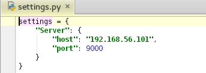
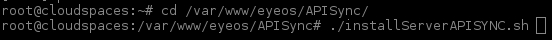
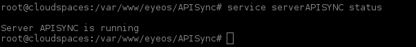

Installation Sync API
================================================================

**Table contents**

- [Introduction](#introduction)
    - [Requirements](#requirements)
    - [Step by step](#step-by-step)

## Introduction

The installation will be done on a Ubuntu 12.04 operating system, you can choose a higher version, but then the requirements might be different.

Sync API can be installed in the same machine than eyeOS or in another independent machine.

If installed in another independent machine the directories /var/www/eyeos/APISync must be copied in that machine.

### Requirements

+    **MongoDb**

    \# sudo apt-key adv --keyserver hkp://keyserver.ubuntu.com:80 --recv 7F0CEB10

    

    \# echo 'deb http://downloads-distro.mongodb.org/repo/ubuntu-upstart dist 10gen' | sudo tee /etc/apt/sources.list.d/mongodb.list

    

    \# apt-get update

    

    \# apt-get install mongodb-org=2.6.0 mongodb-org-server=2.6.0 mongodb-org-shell=2.6.0 mongodb-org-mongos=2.6.0 mongodb-org-tools=2.6.0

    

    \# echo "mongodb-org hold" | sudo dpkg –set-selections
    \# echo "mongodb-org-server hold" | sudo dpkg --set-selections
    \# echo "mongodb-org-shell hold" | sudo dpkg --set-selections
    \# echo "mongodb-org-mongos hold" | sudo dpkg --set-selections
    \# echo "mongodb-org-tools hold" | sudo dpkg –set-selections

    

    \# mongo –version

    

    \# service mongod status

    

+   **PyMongo**

    \# apt-get install build-essential python-dev  

    

    \# apt-get install python-pip  

    

    \# pip install pymongo  

    

### Step by step

It is needed to configure two things in settings.py:
- <b>host</b>: server IP
- <b>port</b>: listening port

Then run, with administrator privileges, the script 'installServerAPISYNC.sh':  

\# ./installServerAPISYNC.sh  

Once the installation is completed, it should be verified that the services are running:  

\# service serverAPISYNC status  

