Tutorial eyeOS 2.5 OpenSource & CloudSpaces
=====================================================================================

**Table contents**

- [eyeOS 2.5 installation on Ubuntu](#eyeos-2.5-installation-on-ubuntu)
    - [Requeriments](#requeriments)
    - [eyeOS installation](#eyeos-installation)
    - [serverU1DB installation](#serverU1DB-installation)
- [Persistence](#persistence)
    - [Storage/recovering documents](#storage/recovering-documents)
    - [Queries](#queries)
    - [Synchronization](#synchronization)
    - [Implementation of U1DB into eyeOS calendar](#implementation-of-u1db-into-eyeos-calendar)
    - [Implementation of Oauth into eyeOS calendar](#implementation-of-oauth-into-eyeos-calendar)
- [Implementation of StackSync API into eyeOS](#implementation-of-stacksync-api-into-eyeos)
- [Collaborative tool between eyeOS and StackSync](#collaborative-tool-between-eyeos-and-stacksync)
- [Implementation of Share API into eyeOS](#implementation-of-share-api-into-eyeos)

## eyeOS 2.5 installation on Ubuntu

### Requeriments

+   **Apache HTTP Server**

    \# apt-get install apache2  
    \# apache2 -version  
    
    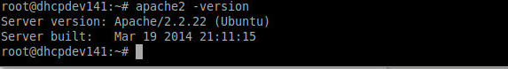
    
    Type in the navegation bar of the browser http://localhost, and you'll see apache2 page (It works!)  
    
    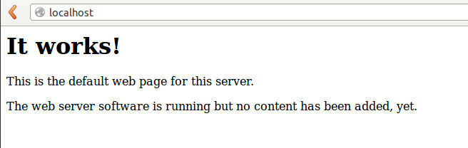
  
  
+   **Mysql**

    \# apt-get install mysql-server mysql-client  
    \# mysql --version  
    
    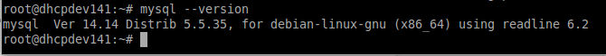
    
    Remember the password of database's administrator ('root'), because it'll be requested during the eyeOS 2.5 installation.
    
+   **Php**

    \# apt-get install php5 php5-mysql libapache2-mod-php5 php5-gd php5-mcrypt php5-sqlite php-db php5-curl php-pear php5-dev  
    \# php5 --version  
    
    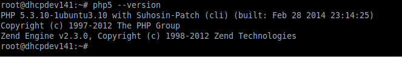
    
    Configure the php.ini.  
  
    \# cd /etc/php5/apache2/  
    \# nano php.ini  
  
    Change the next parameters:  

    +   error_reporting = E_ALL & ~E_NOTICE  
    
        
    
    +   display_errors = Off  
    
        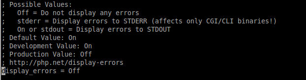
        
    +   max_execution_time = 30  
    
        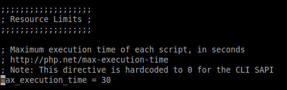
        
    +   max_input_time = 60  
    
        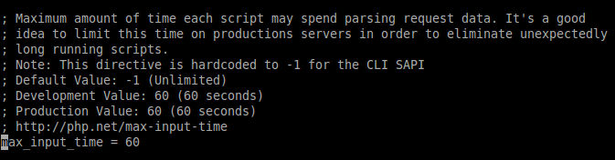
        
    +   memory_limit = 128M  
    
        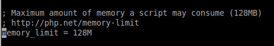
        
    +   post_max_size = 200M  
    
        
    
    +   upload_max_filesize = 100M  
    
        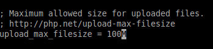
        
    +   allow_url_fopen = On  
        
        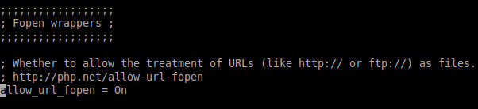
        
    +   disable_functions =  
    
        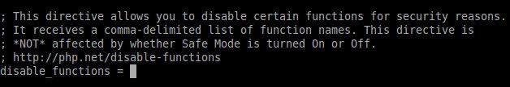
        
    +   safe_mode = Off  
    
        
        
    +   short_open_tag = On  
    
        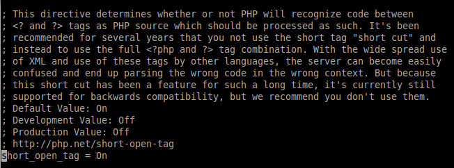
        
    +   magic_quotes_runtime = Off  
    
        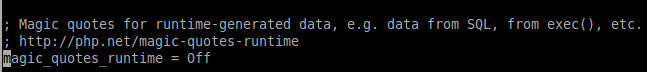
        
    +   file_uploads = On
    
        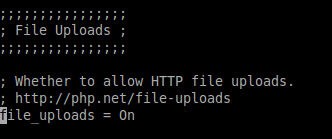
        
+   **Java**

    \# apt-get install python-software-properties  
    \# add-apt-repository ppa:webupd8team/java  
    \# apt-get update  
    \# apt-get install oracle-java7-installer  
    \# update-alternatives --config java  
    \# java -version  
    
    

+   **OpenOffice**

    \# apt-get install openoffice.org  
    
+   **Python**

    \# apt-get install python-support python-simplejson python-uno recoll zip unzip libimage-exiftool-perl  
    \# pip install requests requests_oauthlib  
    
+   **Curl SSL**

    If you don't have SSL certificate get it by typing:  
    \# wget http://curl.haxx.se/ca/cacert.pem  
      
    Open the php.ini and introduce the path where the certificate to make requests to secure url is located.  
    \# cd /etc/php5/apache2/  
    \# nano php.ini  
    ....  
    curl.cainfo='/root/cacert.pem'

+   **Uploadprogress**

    \# apt-get install make  
    \# pecl install uploadprogress  
    
    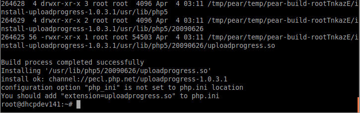
    
    \# nano /etc/php5/apache2/php.ini  (Add the last two lines) .  
    
    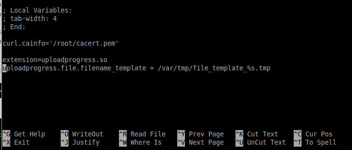

+   **Sendmail**

    \# apt-get install sendmail  
    \# nano /etc/hosts (Add localhost.localdomain to IP 127.0.0.1)  
    
    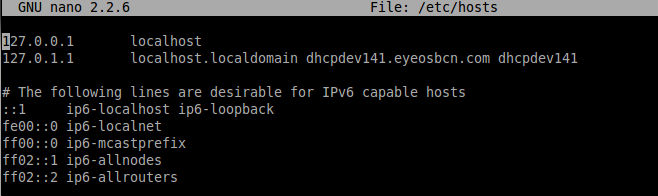
    
    \# sendmailconfig (Confirmar todas las preguntas)  
    
    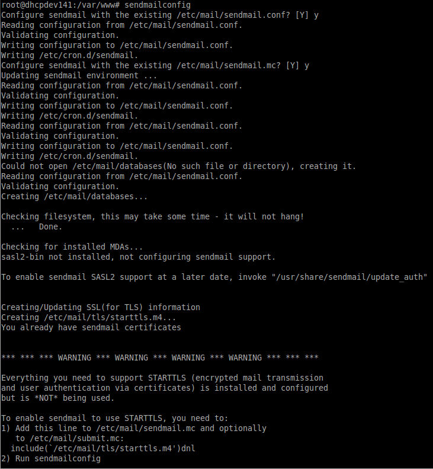
  
+   **Apache**

    Configure mod-rewrite in apache:  
    
    \# a2enmod rewrite  

    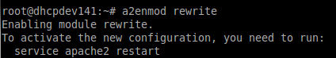

    \# nano /etc/apache2/sites-available/default  

    Change into <Directory /var/www/\> the parameter AllowOverride to All  

    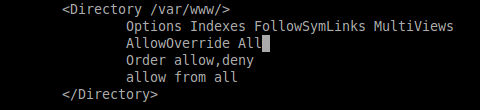

    Restart the apache service  

    \# /etc/init.d/apache2 restart  

    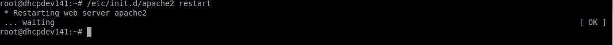

### eyeOS installation

Download the code into /var/www  

\# cd /var/www/  
\# git clone https://github.com/cloudspaces/eyeos-u1db eyeos  

Change the eyeos directory's permissions  

\# chown -R www-data.www-data eyeos  
\# chmod -R 755 eyeos  

Add to DocumentRoot the eyeos directory:  

\# nano /etc/apache2/sites-available/default  

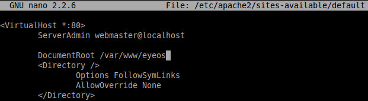

\# service apache2 restart  

Install python-u1db package:  

\# cd eyeos/eyeos/packages/  
\# dpkg -i python-u1db_0.1.4-0ubuntu1_all.deb  

If you have dependency problems during package installation follow the next steps:  

\# apt-get install python-u1db  
\# apt-get -f install  
\# dpkg -i python-u1db_0.1.4-0ubuntu1_all.deb  

Get into mysql and create the schema 'eyeos'. As showed bellow:  

\# mysql -uroot -p&lt;password&gt;  
\> create database eyeos;

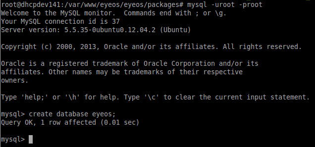

Open into the browser the eyeOS configuration screen (http://localhost/install)  

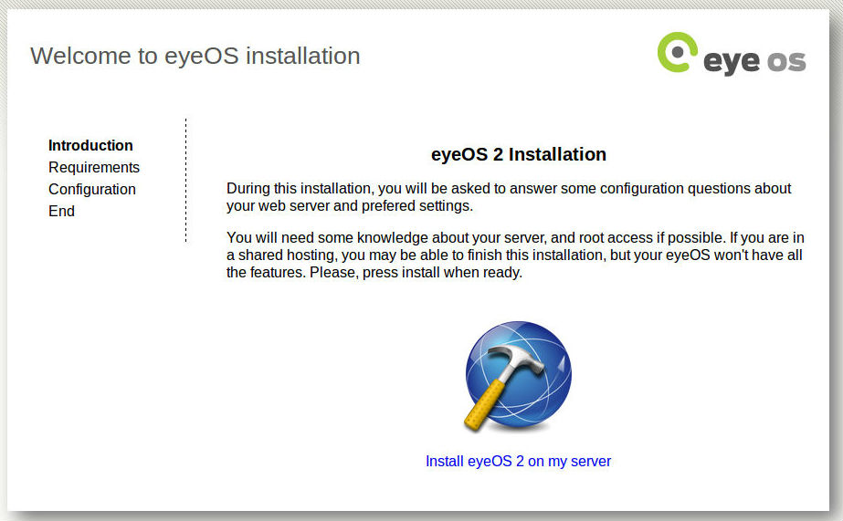

Select 'Install eyeOS 2 on my server'  

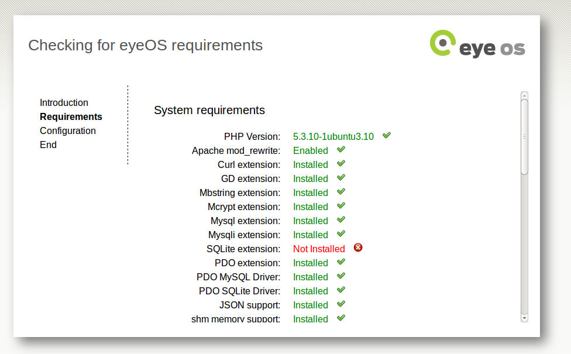

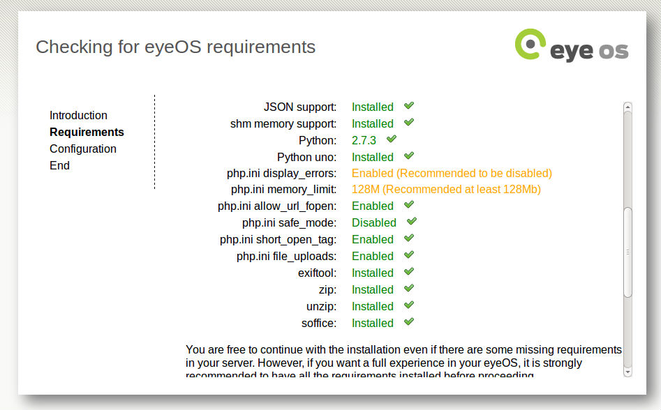

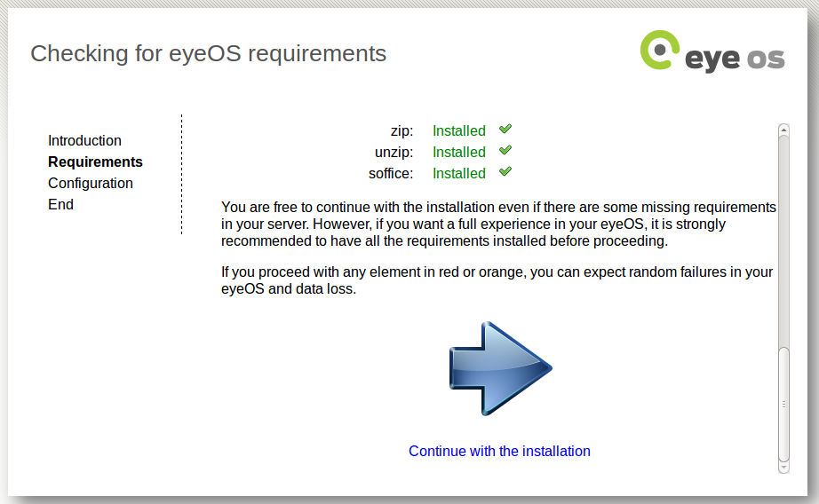

The error "SQLite extension not installed" can be ignored.

Once all requirements are listed, go on with the installation selecting 'Continue with the installation'.

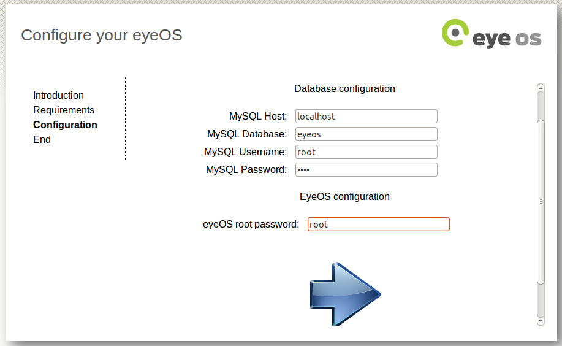

Introduce user and password of mysql database's administrator (root), and in addition, the eyeOS platform root user's password.

Once configured the database and eyeOS user, go on with the installation selecting 'Continue with the installation'.

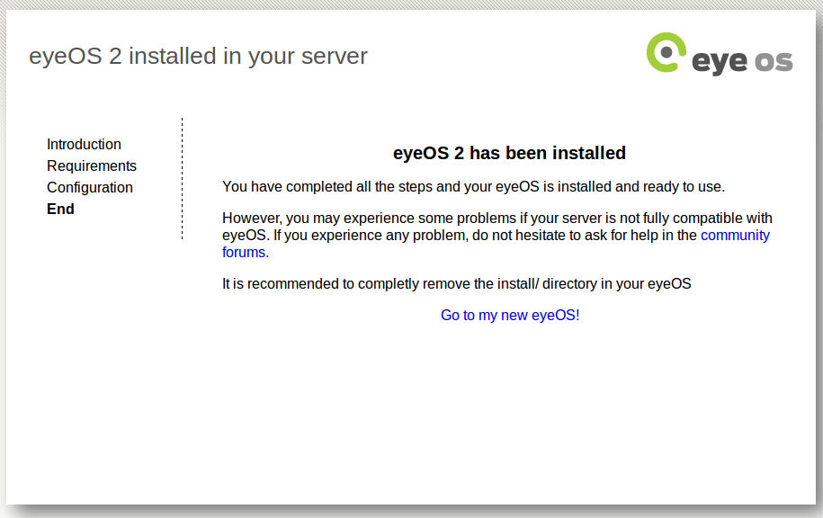

After the installation is finished select 'Go to my new eyeOS' to see the eyeOS 2.5 platform's login screen.

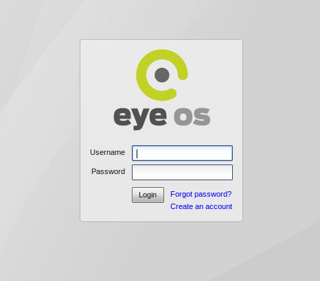

The url of StackSync resources requests can be configured in the file settings.php

\# cd /var/www/eyeos/  
\# nano settings.php

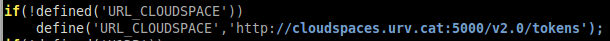

### serverU1DB installation

Follow the steps explained in the Readme.md file, located in /var/www/eyeos/serverU1DB. The serverU1DB can be installed in the same machine than eyeOS or in another independent machine.

If installed in another independent machine the directories /var/www/eyeos/serverU1DB and /var/www/eyeos/eyeos/package must be copied in that machine.

## Persistence

EyeOS calendar saves the events into a U1DB database.

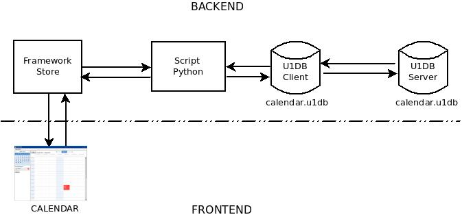

U1DB is an database API to synchronize JSON documents databases created by Canonical. Its allows that applications can storage documents and synchronize then between machines and devices. U1DB is a database design to work in every enviroment, offering a backup of platform's native data. This means that can be use in differents platforms, with differents languages, with backup and synchronization between all of them.

API U1DB has three different parts: storage/recover documents, queries and synchronization. Next are detailed the functions that are used and a short explanation of operation.

### Storage/recovering documents

U1DB storages documents, basically any information that can be expressed in JSON.

**created_doc_from_json(**_json,doc\_id=None_**)**

Creates a document from JSON data.

Alternatively can be especified the document's identifier. The identifier mustn't exist in the database. If database especifies a maximum document size and the document exceeds, the exception DocumentTooBig will be thrown.

    <table border="0" cellpadding="0" cellspacing="0" style="border-collapse:collapse;">
        <tr>
            <td style="background-color:#C0C0C0">Parameters:</td>
            <td>
                <ul>
                    <li><b>json</b> – JSON data</li>
                    <li><b>doc-id</b> – Optional document identificator</li>
                </ul>
            </td>
        </tr>
        <tr>
            <td style="background-color:#C0C0C0">Return:</td>
            <td style="padding-left:30px">Document</td>
        </tr>
    </table>

**put_doc(**_doc_**)**

Document update. If database especifies a maximum document size and the document exceeds, the exception DocumentTooBig will be thrown.

    <table border="0" cellpadding="0" cellspacing="0" style="border-collapse:collapse;">
        <tr>
            <td style="background-color:#C0C0C0">Parameters:</td>
            <td style="padding-left:30px"><b>doc</b> – Document with new content</td>
        </tr>
        <tr>
            <td style="background-color:#C0C0C0">Return:</td>
            <td style="padding-left:30px">Document</td>
        </tr>
    </table>

**set_json(**_json_**)**

Updates document's JSON data.

    <table border="0" cellpadding="0" cellspacing="0" style="border-collapse:collapse;">
        <tr>
            <td style="background-color:#C0C0C0">Parameters:</td>
            <td style="padding-left:30px"><b>json</b> – JSON data</td>
        </tr>
    </table>

**delete_doc(**_doc_**)**

Mark a document as deleted.

    <table border="0" cellpadding="0" cellspacing="0" style="border-collapse:collapse;">
        <tr>
            <td style="background-color:#C0C0C0">Parameters:</td>
            <td style="padding-left:30px"><b>doc</b> – Document to delete</td>
        </tr>
    </table>

### Queries

Quering in U1DB is performed by means of indexes. To recover some documents from the database, based on some criteria, first an index must be created and then get the data using it.

**create_index(**_index\_name,\*index_expressions_**)**

Creates an index that will be used to make queries in the database. The creation of an existing index  will not throw any exception. The creation of an existing index with different index_expressions than the original one will throw an exception.

    <table border="0" cellpadding="0" cellspacing="0" style="border-collapse:collapse;">
        <tr>
            <td style="background-color:#C0C0C0">Parameters:</td>
            <td>
                <ul>
                    <li><b>index_name</b> – Unique index identifier</li>
                    <li><b>index_expressions</b> – Keys used in future queries</li>
                </ul>
                  
                Examples: “nameKey” o “nameKey.nameSubKey”
            </td>
        </tr>
    </table>

**get_from_index(**_index\_name,\*key\_values_**)**

Returns the documents that match the specified keys.  It must be specified the same number of values than keys defined in the index.

    <table border="0" cellpadding="0" cellspacing="0" style="border-collapse:collapse;">
        <tr>
            <td style="background-color:#C0C0C0">Parameters:</td>
            <td>
                <ul>
                    <li><b>index_name</b> – Name of index</li>
                    <li><b>key_values</b> – Values to seek. Ex: if index1 has 3 fields, then get_from_index(index1, val1, val2, val3)</li>
                </ul>
            </td>
        </tr>
        <tr>
            <td style="background-color:#C0C0C0">Return:</td>
            <td style="padding-left:30px">List of documents</td>
        </tr>
    </table>

### Synchronization

U1DB is a synchronized database.  An U1DB database can be used both as client or server, where one or several clients can be synchronized with the server.

The synchronization between server and client provides the update of both, so that they have got the same data. The data are saved into local U1DB no matter if online or offline, and then, the synchronization takes place when it's online.

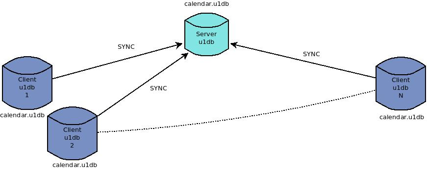

**sync(**_url,creds=None,autocreate=True_**)**

Synchronizes documents with a remote backup by means of an url.

    <table border="0" cellpadding="0" cellspacing="0" style="border-collapse:collapse;">
        <tr>
            <td style="background-color:#C0C0C0">Parameters:</td>
            <td>
                <ul>
                    <li><b>url</b> – url of remote backup the synchronization is going to take place with</li>
                    <li><b>creds</b> – (Optional). Credentials to authorize the operation with the server.  For instance using the credentials to identificate by means of OAuth: 
                    &nbsp;&nbsp;&nbsp;&nbsp;&nbsp;&nbsp;&nbsp;&nbsp;&nbsp;{ ‘consumer_key’: ..., ‘consumer_secret’: ..., 
                    &nbsp;&nbsp;&nbsp;&nbsp;&nbsp;&nbsp;&nbsp;&nbsp;&nbsp;&nbsp;&nbsp;&nbsp;‘token_key’: ..., ‘token_secret’: ... 
                    &nbsp;&nbsp;&nbsp;&nbsp;&nbsp;&nbsp;&nbsp;&nbsp;&nbsp;} 
                    }
                    </li>
                    <li><b>autocreate</b> – If the value is True, is created database if it not exists. If the value is False, the database doesn't exists and it don't synchronize.</li>
                </ul>
            </td>
        </tr>
        <tr>
            <td style="background-color:#C0C0C0">Return:</td>
            <td style="padding-left:30px">local_gen_before_sync – It's a local generation key to control the synchronization. It's useful to use with the function whats_changed, if an aplication wants to know the documents that have changed during synchronization</td>
        </tr>
    </table>

### Implementation of U1DB into eyeOS calendar

EyeOS storages the user's calendars and events into U1DB synchronized database. The database management is performed by means of a Python script called Protocol.py. This script handles the synchronization with the U1DB server and is located in '/var/www/eyeos/eyeos/extern/u1db/', to configure it the “settings.py” file must be modified in the following values:

    <table border="0" cellpadding="0" cellspacing="0" style="border-collapse:collapse;">
        <tr>
            <td width="15%">Server</td>
            <td width="45%" style="padding-left:15px">IP address where the Oauth server is active</td>
        </tr>
        <tr>
            <td>Port</td>
            <td style="padding-left:15px">Port where the Oauth server is active</td>
        </tr>
        <tr>
            <td colspan="2">urls</td>
        </tr>
        <tr>
            <td valign="middle">CALLBACK_URL</td>
            <td style="padding-left:15px">Replace IP and port with the values stablished in the previous parameters (server and port)</td>
        </tr>
        <tr>
            <td colspan="2">consumer</td>
        </tr>
        <tr>
            <td valign="middle">key</td>
            <td style="padding-left:15px">Included when mongodb was configured in the Oauth server installation</td>
        </tr>
        <tr>
            <td valign="middle">secret</td>
            <td style="padding-left:15px">Included when mongodb was configured in the Oauth server installation</td>
        </tr>
    </table>

Next is detailed the APIs contained in the script Protocol.py:

**selectCalendar(**_data_**)**

Get all calendars of the user.

    <table border="0" cellpadding="0" cellspacing="0" style="border-collapse:collapse;">
        <tr>
            <td style="background-color:#C0C0C0">Parameters:</td>
            <td style="padding-left:30px"><b>data</b> – Contains the type and the user. 
                Example: {“type”:”calendar”,”user_eyeos”:”eyeos”}
            </td>
        </tr>
        <tr>
            <td style="background-color:#C0C0C0">Return:</td>
            <td style="padding-left:30px">Array in JSON format 
                Example: 
                [{“type”:”calendar”,”user_eyeos”:”eyeos”,”name”:”personal”,”description”:”personal calendar”,”timezone”: 0,”status”:”NEW”}]
            </td>
        </tr>
    </table>

**insertCalendar(**_lista_**)**

Introduce the new calendar created by the eyeOS user.

    <table border="0" cellpadding="0" cellspacing="0" style="border-collapse:collapse;">
        <tr>
            <td style="background-color:#C0C0C0">Parameters:</td>
            <td style="padding-left:30px"><b>lista</b> – Contains an array of the calendars pending to insert. 
                Example: 
                [{“type”:”calendar”,”user_eyeos”:”eyeos”,”name”:”personal”,”description”:”personal calendar”,”timezone”:0,”status”:”NEW”}]
            </td>
        </tr>
        <tr>
            <td style="background-color:#C0C0C0">Return:</td>
            <td style="padding-left:30px">'true' or exception in case of error</td>
        </tr>
    </table>

**deleteCalendar(**_lista_**)**

Identifies the status of the calendar as deleted (STATUS=”DELETED”) of a particular eyeOS user.

    <table border="0" cellpadding="0" cellspacing="0" style="border-collapse:collapse;">
        <tr>
            <td style="background-color:#C0C0C0">Parameters:</td>
            <td style="padding-left:30px"><b>lista</b> – Contains an array of the calendars identied as deleted. 
                Example: 
                [{“type”:”calendar”,”user_eyeos”:”eyeos”,”name”:”personal”}]
            </td>
        </tr>
        <tr>
            <td style="background-color:#C0C0C0">Return:</td>
            <td style="padding-left:30px">'true' or exception in case of error</td>
        </tr>
    </table>

**selectEvent(**_type,user,calendarId_**)**

    <table border="0" cellpadding="0" cellspacing="0" style="border-collapse:collapse;">
        <tr>
            <td style="background-color:#C0C0C0">Parameters:</td>
            <td>
                <ul>
                    <li><b>type</b> – Fixed value “event”</li>
                    <li><b>user</b> – EyeOS user</li>
                    <li><b>calendarId</b> – Name of the calendar</li>
                </ul>
            </td>
        </tr>
        <tr>
            <td style="background-color:#C0C0C0">Return:</td>
            <td style="padding-left:30px">
                Array in JSON format 
                Example: 
                [{“type”:”event”,”user_eyeos”:”eyeos”,”calendar”:”personal”,”status”:”NEW”, “isallday”: “0”, “timestart”: “201419160000”, “timeend”:”201419170000”, “repetition”: “None”, “finaltype”: “1”, “finalvalue”: “0”, “subject”: “Visita Médico”, “location”: “Barcelona”, “description”: “Llevar justificante”}]
            </td>
        </tr>
    </table>

**insertEvent(**_self,lista_**)**

Introduce a new event into the especified user's calendar.

    <table border="0" cellpadding="0" cellspacing="0" style="border-collapse:collapse;">
        <tr>
            <td style="background-color:#C0C0C0">Parameters:</td>
            <td style="padding-left:30px">
                <b>lista</b> – Contains an array with the news events. 
                Example: 
                [{“type”:”event”,”user_eyeos”:”eyeos”,”calendar”:”personal”,”status”:”NEW”, “isallday”: “0”, “timestart”: “201419160000”, “timeend”:”201419170000”, “repetition”: “None”, “finaltype”: “1”, “finalvalue”: “0”, “subject”: “Visita Médico”, “location”: “Barcelona”, “description”: “Llevar justificante”}]
            </td>
        </tr>
        <tr>
            <td style="background-color:#C0C0C0">Return:</td>
            <td style="padding-left:30px">'true' or exception in case of error</td>
        </tr>
    </table>

**deleteEvent(**_lista_**)**

Identifies the status of the event as deleted (STATUS=”DELETED”) of a particular eyeOS user.

    <table border="0" cellpadding="0" cellspacing="0" style="border-collapse:collapse;">
        <tr>
            <td style="background-color:#C0C0C0">Parameters:</td>
            <td style="padding-left:30px">
                <b>lista</b> – Contains an array with the events identified as deleted. 
                Example: 
                [{“type”:”event”,”user_eyeos”:”eyeos”,”calendar”:”personal”,”status”:”DELETED”, “isallday”: “0”, “timestart”: “201419160000”, “timeend”:”201419170000”, “repetition”: “None”, “finaltype”: “1”, “finalvalue”: “0”, “subject”: “Visita Médico”, “location”: “Barcelona”, “description”: “Llevar justificante”}]
            </td>
        </tr>
        <tr>
            <td style="background-color:#C0C0C0">Return:</td>
            <td style="padding-left:30px">'true' or exception in case of error</td>
        </tr>
    </table>

**updateEvent(**_lista_**)**

Update the data of an event.

    <table border="0" cellpadding="0" cellspacing="0" style="border-collapse:collapse;">
        <tr>
            <td style="background-color:#C0C0C0">Parameters:</td>
            <td style="padding-left:30px">
                <b>lista</b> – Contains an array with the events to update. 
                Example: 
                [{“type”:”event”,”user_eyeos”:”eyeos”,”calendar”:”personal”,”status”:”CHANGED”, “isallday”: “0”, “timestart”: “201419160000”, “timeend”:”201419170000”, “repetition”: “None”, “finaltype”: “1”, “finalvalue”: “0”, “subject”: “Examen”, “location”: “Tarragona”, “description”: “Llevar libro”}]
            </td>
        </tr>
        <tr>
            <td style="background-color:#C0C0C0">Return:</td>
            <td style="padding-left:30px">'true' or exception in case of error</td>
        </tr>
    </table>

To see correctly the calendars into eyeOS platform it must be respected the estructure of the calendars and the events, also its indexes that are the next:  
- calendar: type, user_eyeos, name and status.  
- events: type, user_eyeos, calendar and status.  

To use the Python APIs into eyeOS it has been generated the framework Store, containing some APIs with an uniform structure:

    <table border="0" cellpadding="0" cellspacing="0" style="border-collapse:collapse;">
        <tr>
            <td style="background-color:#C0C0C0">Parameters:</td>
            <td>
                <ul>
                    <li><b>type</b> – Python API name</li>
                    <li><b>lista</b> – Python API parameters</li>
                    <li><b>credentials</b> – Credentials for the identification into synchronization process</li>
                </ul>
            </td>
        </tr>
    </table>

Next these APIs are listed:

**synchronizeCalendars(**_user_**)**

Synchronize all calendars of the user connected in eyeOS platform.

    <table border="0" cellpadding="0" cellspacing="0" style="border-collapse:collapse;">
        <tr>
            <td style="background-color:#C0C0C0">Parameters:</td>
            <td style="padding-left:30px">
                <b>user</b> – Contains the eyeOS user's identifier and name
            </td>
        </tr>
        <tr>
            <td style="background-color:#C0C0C0">Script call:</td>
            <td width="60%" style="padding-left:30px">
                Example: 
                { 
                &nbsp;&nbsp;&nbsp;&nbsp;"type":"selectCalendar" , 
                &nbsp;&nbsp;&nbsp;&nbsp;"lista":[{ 
                &nbsp;&nbsp;&nbsp;&nbsp;&nbsp;&nbsp;&nbsp;&nbsp;&nbsp;&nbsp;&nbsp;&nbsp;&nbsp;&nbsp;&nbsp;&nbsp;&nbsp;&nbsp;&nbsp;"type":"calendar", 
                &nbsp;&nbsp;&nbsp;&nbsp;&nbsp;&nbsp;&nbsp;&nbsp;&nbsp;&nbsp;&nbsp;&nbsp;&nbsp;&nbsp;&nbsp;&nbsp;&nbsp;&nbsp;&nbsp;"user_eyeos": "eyeos" 
                &nbsp;&nbsp;&nbsp;&nbsp;&nbsp;&nbsp;&nbsp;&nbsp;&nbsp;&nbsp;&nbsp;&nbsp;&nbsp;&nbsp;&nbsp;}] 
                &nbsp;&nbsp;&nbsp;&nbsp;"credentials":{ 
                &nbsp;&nbsp;&nbsp;&nbsp;&nbsp;&nbsp;&nbsp;&nbsp;&nbsp;&nbsp;&nbsp;&nbsp;&nbsp;&nbsp;&nbsp;&nbsp;&nbsp;&nbsp;&nbsp;”oauth”:{ 
                &nbsp;&nbsp;&nbsp;&nbsp;&nbsp;&nbsp;&nbsp;&nbsp;&nbsp;&nbsp;&nbsp;&nbsp;&nbsp;&nbsp;&nbsp;&nbsp;&nbsp;&nbsp;&nbsp;&nbsp;&nbsp;&nbsp;&nbsp;&nbsp;&nbsp;&nbsp;&nbsp;&nbsp;&nbsp;&nbsp;&nbsp;&nbsp;&nbsp;&nbsp;&nbsp;&nbsp;“consumer_key”:”eyeos”, 
                &nbsp;&nbsp;&nbsp;&nbsp;&nbsp;&nbsp;&nbsp;&nbsp;&nbsp;&nbsp;&nbsp;&nbsp;&nbsp;&nbsp;&nbsp;&nbsp;&nbsp;&nbsp;&nbsp;&nbsp;&nbsp;&nbsp;&nbsp;&nbsp;&nbsp;&nbsp;&nbsp;&nbsp;&nbsp;&nbsp;&nbsp;&nbsp;&nbsp;&nbsp;&nbsp;&nbsp;“consumer_secret”:”eyeosABC”, 
                &nbsp;&nbsp;&nbsp;&nbsp;&nbsp;&nbsp;&nbsp;&nbsp;&nbsp;&nbsp;&nbsp;&nbsp;&nbsp;&nbsp;&nbsp;&nbsp;&nbsp;&nbsp;&nbsp;&nbsp;&nbsp;&nbsp;&nbsp;&nbsp;&nbsp;&nbsp;&nbsp;&nbsp;&nbsp;&nbsp;&nbsp;&nbsp;&nbsp;&nbsp;&nbsp;&nbsp;“token_key”:”eyeostoken”, 
                &nbsp;&nbsp;&nbsp;&nbsp;&nbsp;&nbsp;&nbsp;&nbsp;&nbsp;&nbsp;&nbsp;&nbsp;&nbsp;&nbsp;&nbsp;&nbsp;&nbsp;&nbsp;&nbsp;&nbsp;&nbsp;&nbsp;&nbsp;&nbsp;&nbsp;&nbsp;&nbsp;&nbsp;&nbsp;&nbsp;&nbsp;&nbsp;&nbsp;&nbsp;&nbsp;&nbsp;“token_secret”:”eyeosDEF” 
                &nbsp;&nbsp;&nbsp;&nbsp;&nbsp;&nbsp;&nbsp;&nbsp;&nbsp;&nbsp;&nbsp;&nbsp;&nbsp;&nbsp;&nbsp;&nbsp;&nbsp;&nbsp;&nbsp;&nbsp;&nbsp;&nbsp;&nbsp;&nbsp;&nbsp;&nbsp;&nbsp;&nbsp;&nbsp;&nbsp;&nbsp;&nbsp;&nbsp;} 
                &nbsp;&nbsp;&nbsp;&nbsp;&nbsp;&nbsp;&nbsp;&nbsp;&nbsp;&nbsp;&nbsp;&nbsp;&nbsp;&nbsp;&nbsp;&nbsp;&nbsp;&nbsp;&nbsp;&nbsp;&nbsp;&nbsp;&nbsp;&nbsp;&nbsp;&nbsp;&nbsp;} 
                } 
            </td>
        </tr>
        <tr>
            <td style="background-color:#C0C0C0">Return:</td>
            <td style="padding-left:30px">List of calendars</td>
        </tr>
    </table>

**insertCalendars(**_user,calendar_**)**

Create a new calendar.

    <table border="0" cellpadding="0" cellspacing="0" style="border-collapse:collapse;">
        <tr>
            <td style="background-color:#C0C0C0">Parameters:</td>
            <td style="padding-left:30px">
                <ul>
                    <li><b>user</b> – User name</li>
                    <li><b>calendar</b> – It's an object that contains name, description and timezone</li>
                </ul>
            </td>
        </tr>
        <tr>
            <td style="background-color:#C0C0C0">Script call:</td>
            <td width="60%" style="padding-left:30px">
                Example: 
                { 
                &nbsp;&nbsp;&nbsp;&nbsp;"type":"insertCalendar" , 
                &nbsp;&nbsp;&nbsp;&nbsp;"lista":[{ 
                &nbsp;&nbsp;&nbsp;&nbsp;&nbsp;&nbsp;&nbsp;&nbsp;&nbsp;&nbsp;&nbsp;&nbsp;&nbsp;&nbsp;&nbsp;&nbsp;&nbsp;&nbsp;&nbsp;"type":"calendar", 
                &nbsp;&nbsp;&nbsp;&nbsp;&nbsp;&nbsp;&nbsp;&nbsp;&nbsp;&nbsp;&nbsp;&nbsp;&nbsp;&nbsp;&nbsp;&nbsp;&nbsp;&nbsp;&nbsp;"user_eyeos": "eyeos" 
                &nbsp;&nbsp;&nbsp;&nbsp;&nbsp;&nbsp;&nbsp;&nbsp;&nbsp;&nbsp;&nbsp;&nbsp;&nbsp;&nbsp;&nbsp;&nbsp;&nbsp;&nbsp;&nbsp;"name": "personal" 
                &nbsp;&nbsp;&nbsp;&nbsp;&nbsp;&nbsp;&nbsp;&nbsp;&nbsp;&nbsp;&nbsp;&nbsp;&nbsp;&nbsp;&nbsp;&nbsp;&nbsp;&nbsp;&nbsp;"status": "NEW" 
                &nbsp;&nbsp;&nbsp;&nbsp;&nbsp;&nbsp;&nbsp;&nbsp;&nbsp;&nbsp;&nbsp;&nbsp;&nbsp;&nbsp;&nbsp;&nbsp;&nbsp;&nbsp;&nbsp;"description": "personal calendar" 
                &nbsp;&nbsp;&nbsp;&nbsp;&nbsp;&nbsp;&nbsp;&nbsp;&nbsp;&nbsp;&nbsp;&nbsp;&nbsp;&nbsp;&nbsp;&nbsp;&nbsp;&nbsp;&nbsp;"timezone": 0 
                &nbsp;&nbsp;&nbsp;&nbsp;&nbsp;&nbsp;&nbsp;&nbsp;&nbsp;&nbsp;&nbsp;&nbsp;&nbsp;&nbsp;&nbsp;}] 
                &nbsp;&nbsp;&nbsp;&nbsp;"credentials":{ 
                &nbsp;&nbsp;&nbsp;&nbsp;&nbsp;&nbsp;&nbsp;&nbsp;&nbsp;&nbsp;&nbsp;&nbsp;&nbsp;&nbsp;&nbsp;&nbsp;&nbsp;&nbsp;&nbsp;”oauth”:{ 
                &nbsp;&nbsp;&nbsp;&nbsp;&nbsp;&nbsp;&nbsp;&nbsp;&nbsp;&nbsp;&nbsp;&nbsp;&nbsp;&nbsp;&nbsp;&nbsp;&nbsp;&nbsp;&nbsp;&nbsp;&nbsp;&nbsp;&nbsp;&nbsp;&nbsp;&nbsp;&nbsp;&nbsp;&nbsp;&nbsp;&nbsp;&nbsp;&nbsp;&nbsp;&nbsp;&nbsp;“consumer_key”:”eyeos”, 
                &nbsp;&nbsp;&nbsp;&nbsp;&nbsp;&nbsp;&nbsp;&nbsp;&nbsp;&nbsp;&nbsp;&nbsp;&nbsp;&nbsp;&nbsp;&nbsp;&nbsp;&nbsp;&nbsp;&nbsp;&nbsp;&nbsp;&nbsp;&nbsp;&nbsp;&nbsp;&nbsp;&nbsp;&nbsp;&nbsp;&nbsp;&nbsp;&nbsp;&nbsp;&nbsp;&nbsp;“consumer_secret”:”eyeosABC”, 
                &nbsp;&nbsp;&nbsp;&nbsp;&nbsp;&nbsp;&nbsp;&nbsp;&nbsp;&nbsp;&nbsp;&nbsp;&nbsp;&nbsp;&nbsp;&nbsp;&nbsp;&nbsp;&nbsp;&nbsp;&nbsp;&nbsp;&nbsp;&nbsp;&nbsp;&nbsp;&nbsp;&nbsp;&nbsp;&nbsp;&nbsp;&nbsp;&nbsp;&nbsp;&nbsp;&nbsp;“token_key”:”eyeostoken”, 
                &nbsp;&nbsp;&nbsp;&nbsp;&nbsp;&nbsp;&nbsp;&nbsp;&nbsp;&nbsp;&nbsp;&nbsp;&nbsp;&nbsp;&nbsp;&nbsp;&nbsp;&nbsp;&nbsp;&nbsp;&nbsp;&nbsp;&nbsp;&nbsp;&nbsp;&nbsp;&nbsp;&nbsp;&nbsp;&nbsp;&nbsp;&nbsp;&nbsp;&nbsp;&nbsp;&nbsp;“token_secret”:”eyeosDEF” 
                &nbsp;&nbsp;&nbsp;&nbsp;&nbsp;&nbsp;&nbsp;&nbsp;&nbsp;&nbsp;&nbsp;&nbsp;&nbsp;&nbsp;&nbsp;&nbsp;&nbsp;&nbsp;&nbsp;&nbsp;&nbsp;&nbsp;&nbsp;&nbsp;&nbsp;&nbsp;&nbsp;&nbsp;&nbsp;&nbsp;&nbsp;&nbsp;&nbsp;} 
                &nbsp;&nbsp;&nbsp;&nbsp;&nbsp;&nbsp;&nbsp;&nbsp;&nbsp;&nbsp;&nbsp;&nbsp;&nbsp;&nbsp;&nbsp;&nbsp;&nbsp;&nbsp;&nbsp;&nbsp;&nbsp;&nbsp;&nbsp;&nbsp;&nbsp;&nbsp;&nbsp;} 
                } 
            </td>
        </tr>
        <tr>
            <td style="background-color:#C0C0C0">Return:</td>
            <td style="padding-left:30px">True or in case of error null</td>
        </tr>
    </table>

**deleteCalendars(**_user,calendar_**)**

Delete an existing calendar.

    <table border="0" cellpadding="0" cellspacing="0" style="border-collapse:collapse;">
        <tr>
            <td style="background-color:#C0C0C0">Parameters:</td>
            <td style="padding-left:30px">
                <ul>
                    <li><b>user</b> – User name</li>
                    <li><b>calendar</b> – Calendar name</li>
                </ul>
            </td>
        </tr>
        <tr>
            <td style="background-color:#C0C0C0">Script call:</td>
            <td width="60%" style="padding-left:30px">
                Example: 
                { 
                &nbsp;&nbsp;&nbsp;&nbsp;"type":"deleteCalendar" , 
                &nbsp;&nbsp;&nbsp;&nbsp;"lista":[{ 
                &nbsp;&nbsp;&nbsp;&nbsp;&nbsp;&nbsp;&nbsp;&nbsp;&nbsp;&nbsp;&nbsp;&nbsp;&nbsp;&nbsp;&nbsp;&nbsp;&nbsp;&nbsp;&nbsp;"type":"calendar", 
                &nbsp;&nbsp;&nbsp;&nbsp;&nbsp;&nbsp;&nbsp;&nbsp;&nbsp;&nbsp;&nbsp;&nbsp;&nbsp;&nbsp;&nbsp;&nbsp;&nbsp;&nbsp;&nbsp;"user_eyeos": "eyeos" 
                &nbsp;&nbsp;&nbsp;&nbsp;&nbsp;&nbsp;&nbsp;&nbsp;&nbsp;&nbsp;&nbsp;&nbsp;&nbsp;&nbsp;&nbsp;&nbsp;&nbsp;&nbsp;&nbsp;"name": "personal" 
                &nbsp;&nbsp;&nbsp;&nbsp;&nbsp;&nbsp;&nbsp;&nbsp;&nbsp;&nbsp;&nbsp;&nbsp;&nbsp;&nbsp;&nbsp;}] 
                &nbsp;&nbsp;&nbsp;&nbsp;"credentials":{ 
                &nbsp;&nbsp;&nbsp;&nbsp;&nbsp;&nbsp;&nbsp;&nbsp;&nbsp;&nbsp;&nbsp;&nbsp;&nbsp;&nbsp;&nbsp;&nbsp;&nbsp;&nbsp;&nbsp;”oauth”:{ 
                &nbsp;&nbsp;&nbsp;&nbsp;&nbsp;&nbsp;&nbsp;&nbsp;&nbsp;&nbsp;&nbsp;&nbsp;&nbsp;&nbsp;&nbsp;&nbsp;&nbsp;&nbsp;&nbsp;&nbsp;&nbsp;&nbsp;&nbsp;&nbsp;&nbsp;&nbsp;&nbsp;&nbsp;&nbsp;&nbsp;&nbsp;&nbsp;&nbsp;&nbsp;&nbsp;&nbsp;“consumer_key”:”eyeos”, 
                &nbsp;&nbsp;&nbsp;&nbsp;&nbsp;&nbsp;&nbsp;&nbsp;&nbsp;&nbsp;&nbsp;&nbsp;&nbsp;&nbsp;&nbsp;&nbsp;&nbsp;&nbsp;&nbsp;&nbsp;&nbsp;&nbsp;&nbsp;&nbsp;&nbsp;&nbsp;&nbsp;&nbsp;&nbsp;&nbsp;&nbsp;&nbsp;&nbsp;&nbsp;&nbsp;&nbsp;“consumer_secret”:”eyeosABC”, 
                &nbsp;&nbsp;&nbsp;&nbsp;&nbsp;&nbsp;&nbsp;&nbsp;&nbsp;&nbsp;&nbsp;&nbsp;&nbsp;&nbsp;&nbsp;&nbsp;&nbsp;&nbsp;&nbsp;&nbsp;&nbsp;&nbsp;&nbsp;&nbsp;&nbsp;&nbsp;&nbsp;&nbsp;&nbsp;&nbsp;&nbsp;&nbsp;&nbsp;&nbsp;&nbsp;&nbsp;“token_key”:”eyeostoken”, 
                &nbsp;&nbsp;&nbsp;&nbsp;&nbsp;&nbsp;&nbsp;&nbsp;&nbsp;&nbsp;&nbsp;&nbsp;&nbsp;&nbsp;&nbsp;&nbsp;&nbsp;&nbsp;&nbsp;&nbsp;&nbsp;&nbsp;&nbsp;&nbsp;&nbsp;&nbsp;&nbsp;&nbsp;&nbsp;&nbsp;&nbsp;&nbsp;&nbsp;&nbsp;&nbsp;&nbsp;“token_secret”:”eyeosDEF” 
                &nbsp;&nbsp;&nbsp;&nbsp;&nbsp;&nbsp;&nbsp;&nbsp;&nbsp;&nbsp;&nbsp;&nbsp;&nbsp;&nbsp;&nbsp;&nbsp;&nbsp;&nbsp;&nbsp;&nbsp;&nbsp;&nbsp;&nbsp;&nbsp;&nbsp;&nbsp;&nbsp;&nbsp;&nbsp;&nbsp;&nbsp;&nbsp;&nbsp;} 
                &nbsp;&nbsp;&nbsp;&nbsp;&nbsp;&nbsp;&nbsp;&nbsp;&nbsp;&nbsp;&nbsp;&nbsp;&nbsp;&nbsp;&nbsp;&nbsp;&nbsp;&nbsp;&nbsp;&nbsp;&nbsp;&nbsp;&nbsp;&nbsp;&nbsp;&nbsp;&nbsp;} 
                } 
            </td>
        </tr>
        <tr>
            <td style="background-color:#C0C0C0">Return:</td>
            <td style="padding-left:30px">True or in case of error null</td>
        </tr>
    </table>

**synchronizeCalendar(**_calendarId,user_**)**

Synchronize all the events of the especified calendar of the user connected in eyeOS platform.

    <table border="0" cellpadding="0" cellspacing="0" style="border-collapse:collapse;">
        <tr>
            <td style="background-color:#C0C0C0">Parameters:</td>
            <td style="padding-left:30px">
                <ul>
                    <li><b>calendarId</b> – Calendar identifier in eyeOS</li>
                    <li><b>user</b> – User name</li>
                </ul>
            </td>
        </tr>
        <tr>
            <td style="background-color:#C0C0C0">Script call:</td>
            <td width="60%" style="padding-left:30px">
                Example: 
                { 
                &nbsp;&nbsp;&nbsp;&nbsp;"type":"selectEvent" , 
                &nbsp;&nbsp;&nbsp;&nbsp;"lista":[{ 
                &nbsp;&nbsp;&nbsp;&nbsp;&nbsp;&nbsp;&nbsp;&nbsp;&nbsp;&nbsp;&nbsp;&nbsp;&nbsp;&nbsp;&nbsp;&nbsp;&nbsp;&nbsp;&nbsp;"type":"event", 
                &nbsp;&nbsp;&nbsp;&nbsp;&nbsp;&nbsp;&nbsp;&nbsp;&nbsp;&nbsp;&nbsp;&nbsp;&nbsp;&nbsp;&nbsp;&nbsp;&nbsp;&nbsp;&nbsp;"user_eyeos": "eyeos" 
                &nbsp;&nbsp;&nbsp;&nbsp;&nbsp;&nbsp;&nbsp;&nbsp;&nbsp;&nbsp;&nbsp;&nbsp;&nbsp;&nbsp;&nbsp;&nbsp;&nbsp;&nbsp;&nbsp;"name": "personal" 
                &nbsp;&nbsp;&nbsp;&nbsp;&nbsp;&nbsp;&nbsp;&nbsp;&nbsp;&nbsp;&nbsp;&nbsp;&nbsp;&nbsp;&nbsp;}] 
                &nbsp;&nbsp;&nbsp;&nbsp;"credentials":{ 
                &nbsp;&nbsp;&nbsp;&nbsp;&nbsp;&nbsp;&nbsp;&nbsp;&nbsp;&nbsp;&nbsp;&nbsp;&nbsp;&nbsp;&nbsp;&nbsp;&nbsp;&nbsp;&nbsp;”oauth”:{ 
                &nbsp;&nbsp;&nbsp;&nbsp;&nbsp;&nbsp;&nbsp;&nbsp;&nbsp;&nbsp;&nbsp;&nbsp;&nbsp;&nbsp;&nbsp;&nbsp;&nbsp;&nbsp;&nbsp;&nbsp;&nbsp;&nbsp;&nbsp;&nbsp;&nbsp;&nbsp;&nbsp;&nbsp;&nbsp;&nbsp;&nbsp;&nbsp;&nbsp;&nbsp;&nbsp;&nbsp;“consumer_key”:”eyeos”, 
                &nbsp;&nbsp;&nbsp;&nbsp;&nbsp;&nbsp;&nbsp;&nbsp;&nbsp;&nbsp;&nbsp;&nbsp;&nbsp;&nbsp;&nbsp;&nbsp;&nbsp;&nbsp;&nbsp;&nbsp;&nbsp;&nbsp;&nbsp;&nbsp;&nbsp;&nbsp;&nbsp;&nbsp;&nbsp;&nbsp;&nbsp;&nbsp;&nbsp;&nbsp;&nbsp;&nbsp;“consumer_secret”:”eyeosABC”, 
                &nbsp;&nbsp;&nbsp;&nbsp;&nbsp;&nbsp;&nbsp;&nbsp;&nbsp;&nbsp;&nbsp;&nbsp;&nbsp;&nbsp;&nbsp;&nbsp;&nbsp;&nbsp;&nbsp;&nbsp;&nbsp;&nbsp;&nbsp;&nbsp;&nbsp;&nbsp;&nbsp;&nbsp;&nbsp;&nbsp;&nbsp;&nbsp;&nbsp;&nbsp;&nbsp;&nbsp;“token_key”:”eyeostoken”, 
                &nbsp;&nbsp;&nbsp;&nbsp;&nbsp;&nbsp;&nbsp;&nbsp;&nbsp;&nbsp;&nbsp;&nbsp;&nbsp;&nbsp;&nbsp;&nbsp;&nbsp;&nbsp;&nbsp;&nbsp;&nbsp;&nbsp;&nbsp;&nbsp;&nbsp;&nbsp;&nbsp;&nbsp;&nbsp;&nbsp;&nbsp;&nbsp;&nbsp;&nbsp;&nbsp;&nbsp;“token_secret”:”eyeosDEF” 
                &nbsp;&nbsp;&nbsp;&nbsp;&nbsp;&nbsp;&nbsp;&nbsp;&nbsp;&nbsp;&nbsp;&nbsp;&nbsp;&nbsp;&nbsp;&nbsp;&nbsp;&nbsp;&nbsp;&nbsp;&nbsp;&nbsp;&nbsp;&nbsp;&nbsp;&nbsp;&nbsp;&nbsp;&nbsp;&nbsp;&nbsp;&nbsp;&nbsp;} 
                &nbsp;&nbsp;&nbsp;&nbsp;&nbsp;&nbsp;&nbsp;&nbsp;&nbsp;&nbsp;&nbsp;&nbsp;&nbsp;&nbsp;&nbsp;&nbsp;&nbsp;&nbsp;&nbsp;&nbsp;&nbsp;&nbsp;&nbsp;&nbsp;&nbsp;&nbsp;&nbsp;} 
                } 
            </td>
        </tr>
        <tr>
            <td style="background-color:#C0C0C0">Return:</td>
            <td style="padding-left:30px">List of events</td>
        </tr>
    </table>

**createEvent(**_event_**)**

Create a new event

    <table border="0" cellpadding="0" cellspacing="0" style="border-collapse:collapse;">
        <tr>
            <td style="background-color:#C0C0C0">Parameters:</td>
            <td style="padding-left:30px">
                <b>event</b> – Contains the event's U1DB estructure
            </td>
        </tr>
        <tr>
            <td style="background-color:#C0C0C0">Script call:</td>
            <td width="60%" style="padding-left:30px">
                Example: 
                { 
                &nbsp;&nbsp;&nbsp;&nbsp;"type":"insertEvent" , 
                &nbsp;&nbsp;&nbsp;&nbsp;"lista":[{ 
                &nbsp;&nbsp;&nbsp;&nbsp;&nbsp;&nbsp;&nbsp;&nbsp;&nbsp;&nbsp;&nbsp;&nbsp;&nbsp;&nbsp;&nbsp;&nbsp;&nbsp;&nbsp;&nbsp;"type":"event", 
                &nbsp;&nbsp;&nbsp;&nbsp;&nbsp;&nbsp;&nbsp;&nbsp;&nbsp;&nbsp;&nbsp;&nbsp;&nbsp;&nbsp;&nbsp;&nbsp;&nbsp;&nbsp;&nbsp;"user_eyeos": "eyeos" 
                &nbsp;&nbsp;&nbsp;&nbsp;&nbsp;&nbsp;&nbsp;&nbsp;&nbsp;&nbsp;&nbsp;&nbsp;&nbsp;&nbsp;&nbsp;&nbsp;&nbsp;&nbsp;&nbsp;"name": "personal" 
                &nbsp;&nbsp;&nbsp;&nbsp;&nbsp;&nbsp;&nbsp;&nbsp;&nbsp;&nbsp;&nbsp;&nbsp;&nbsp;&nbsp;&nbsp;&nbsp;&nbsp;&nbsp;&nbsp;"status": "NEW" 
                &nbsp;&nbsp;&nbsp;&nbsp;&nbsp;&nbsp;&nbsp;&nbsp;&nbsp;&nbsp;&nbsp;&nbsp;&nbsp;&nbsp;&nbsp;&nbsp;&nbsp;&nbsp;&nbsp;"isallday": "0" 
                &nbsp;&nbsp;&nbsp;&nbsp;&nbsp;&nbsp;&nbsp;&nbsp;&nbsp;&nbsp;&nbsp;&nbsp;&nbsp;&nbsp;&nbsp;&nbsp;&nbsp;&nbsp;&nbsp;"timestart": "201419160000" 
                &nbsp;&nbsp;&nbsp;&nbsp;&nbsp;&nbsp;&nbsp;&nbsp;&nbsp;&nbsp;&nbsp;&nbsp;&nbsp;&nbsp;&nbsp;&nbsp;&nbsp;&nbsp;&nbsp;"timeend": "201419170000" 
                &nbsp;&nbsp;&nbsp;&nbsp;&nbsp;&nbsp;&nbsp;&nbsp;&nbsp;&nbsp;&nbsp;&nbsp;&nbsp;&nbsp;&nbsp;&nbsp;&nbsp;&nbsp;&nbsp;"repetition": "None" 
                &nbsp;&nbsp;&nbsp;&nbsp;&nbsp;&nbsp;&nbsp;&nbsp;&nbsp;&nbsp;&nbsp;&nbsp;&nbsp;&nbsp;&nbsp;&nbsp;&nbsp;&nbsp;&nbsp;"finaltype": "1" 
                &nbsp;&nbsp;&nbsp;&nbsp;&nbsp;&nbsp;&nbsp;&nbsp;&nbsp;&nbsp;&nbsp;&nbsp;&nbsp;&nbsp;&nbsp;&nbsp;&nbsp;&nbsp;&nbsp;"finalvalue": "0" 
                &nbsp;&nbsp;&nbsp;&nbsp;&nbsp;&nbsp;&nbsp;&nbsp;&nbsp;&nbsp;&nbsp;&nbsp;&nbsp;&nbsp;&nbsp;&nbsp;&nbsp;&nbsp;&nbsp;"subject": "Visita Médico" 
                &nbsp;&nbsp;&nbsp;&nbsp;&nbsp;&nbsp;&nbsp;&nbsp;&nbsp;&nbsp;&nbsp;&nbsp;&nbsp;&nbsp;&nbsp;&nbsp;&nbsp;&nbsp;&nbsp;"location": "Barcelona" 
                &nbsp;&nbsp;&nbsp;&nbsp;&nbsp;&nbsp;&nbsp;&nbsp;&nbsp;&nbsp;&nbsp;&nbsp;&nbsp;&nbsp;&nbsp;&nbsp;&nbsp;&nbsp;&nbsp;"description": "Llevar justificante" 
                &nbsp;&nbsp;&nbsp;&nbsp;&nbsp;&nbsp;&nbsp;&nbsp;&nbsp;&nbsp;&nbsp;&nbsp;&nbsp;&nbsp;&nbsp;}] 
                &nbsp;&nbsp;&nbsp;&nbsp;"credentials":{ 
                &nbsp;&nbsp;&nbsp;&nbsp;&nbsp;&nbsp;&nbsp;&nbsp;&nbsp;&nbsp;&nbsp;&nbsp;&nbsp;&nbsp;&nbsp;&nbsp;&nbsp;&nbsp;&nbsp;”oauth”:{ 
                &nbsp;&nbsp;&nbsp;&nbsp;&nbsp;&nbsp;&nbsp;&nbsp;&nbsp;&nbsp;&nbsp;&nbsp;&nbsp;&nbsp;&nbsp;&nbsp;&nbsp;&nbsp;&nbsp;&nbsp;&nbsp;&nbsp;&nbsp;&nbsp;&nbsp;&nbsp;&nbsp;&nbsp;&nbsp;&nbsp;&nbsp;&nbsp;&nbsp;&nbsp;&nbsp;&nbsp;“consumer_key”:”eyeos”, 
                &nbsp;&nbsp;&nbsp;&nbsp;&nbsp;&nbsp;&nbsp;&nbsp;&nbsp;&nbsp;&nbsp;&nbsp;&nbsp;&nbsp;&nbsp;&nbsp;&nbsp;&nbsp;&nbsp;&nbsp;&nbsp;&nbsp;&nbsp;&nbsp;&nbsp;&nbsp;&nbsp;&nbsp;&nbsp;&nbsp;&nbsp;&nbsp;&nbsp;&nbsp;&nbsp;&nbsp;“consumer_secret”:”eyeosABC”, 
                &nbsp;&nbsp;&nbsp;&nbsp;&nbsp;&nbsp;&nbsp;&nbsp;&nbsp;&nbsp;&nbsp;&nbsp;&nbsp;&nbsp;&nbsp;&nbsp;&nbsp;&nbsp;&nbsp;&nbsp;&nbsp;&nbsp;&nbsp;&nbsp;&nbsp;&nbsp;&nbsp;&nbsp;&nbsp;&nbsp;&nbsp;&nbsp;&nbsp;&nbsp;&nbsp;&nbsp;“token_key”:”eyeostoken”, 
                &nbsp;&nbsp;&nbsp;&nbsp;&nbsp;&nbsp;&nbsp;&nbsp;&nbsp;&nbsp;&nbsp;&nbsp;&nbsp;&nbsp;&nbsp;&nbsp;&nbsp;&nbsp;&nbsp;&nbsp;&nbsp;&nbsp;&nbsp;&nbsp;&nbsp;&nbsp;&nbsp;&nbsp;&nbsp;&nbsp;&nbsp;&nbsp;&nbsp;&nbsp;&nbsp;&nbsp;“token_secret”:”eyeosDEF” 
                &nbsp;&nbsp;&nbsp;&nbsp;&nbsp;&nbsp;&nbsp;&nbsp;&nbsp;&nbsp;&nbsp;&nbsp;&nbsp;&nbsp;&nbsp;&nbsp;&nbsp;&nbsp;&nbsp;&nbsp;&nbsp;&nbsp;&nbsp;&nbsp;&nbsp;&nbsp;&nbsp;&nbsp;&nbsp;&nbsp;&nbsp;&nbsp;&nbsp;} 
                &nbsp;&nbsp;&nbsp;&nbsp;&nbsp;&nbsp;&nbsp;&nbsp;&nbsp;&nbsp;&nbsp;&nbsp;&nbsp;&nbsp;&nbsp;&nbsp;&nbsp;&nbsp;&nbsp;&nbsp;&nbsp;&nbsp;&nbsp;&nbsp;&nbsp;&nbsp;&nbsp;} 
                } 
            </td>
        </tr>
        <tr>
            <td style="background-color:#C0C0C0">Return:</td>
            <td style="padding-left:30px">True or in case of error null</td>
        </tr>
    </table>

**deleteEvent(**_event_**)**

Delete an existing event.

    <table border="0" cellpadding="0" cellspacing="0" style="border-collapse:collapse;">
        <tr>
            <td style="background-color:#C0C0C0">Parameters:</td>
            <td style="padding-left:30px">
                <b>event</b> – Contains the event's U1DB structure
            </td>
        </tr>
        <tr>
            <td style="background-color:#C0C0C0">Script call:</td>
            <td width="60%" style="padding-left:30px">
                Example: 
                { 
                &nbsp;&nbsp;&nbsp;&nbsp;"type":"deleteEvent" , 
                &nbsp;&nbsp;&nbsp;&nbsp;"lista":[{ 
                &nbsp;&nbsp;&nbsp;&nbsp;&nbsp;&nbsp;&nbsp;&nbsp;&nbsp;&nbsp;&nbsp;&nbsp;&nbsp;&nbsp;&nbsp;&nbsp;&nbsp;&nbsp;&nbsp;"type":"event", 
                &nbsp;&nbsp;&nbsp;&nbsp;&nbsp;&nbsp;&nbsp;&nbsp;&nbsp;&nbsp;&nbsp;&nbsp;&nbsp;&nbsp;&nbsp;&nbsp;&nbsp;&nbsp;&nbsp;"user_eyeos": "eyeos" 
                &nbsp;&nbsp;&nbsp;&nbsp;&nbsp;&nbsp;&nbsp;&nbsp;&nbsp;&nbsp;&nbsp;&nbsp;&nbsp;&nbsp;&nbsp;&nbsp;&nbsp;&nbsp;&nbsp;"name": "personal" 
                &nbsp;&nbsp;&nbsp;&nbsp;&nbsp;&nbsp;&nbsp;&nbsp;&nbsp;&nbsp;&nbsp;&nbsp;&nbsp;&nbsp;&nbsp;&nbsp;&nbsp;&nbsp;&nbsp;"status": "DELETED" 
                &nbsp;&nbsp;&nbsp;&nbsp;&nbsp;&nbsp;&nbsp;&nbsp;&nbsp;&nbsp;&nbsp;&nbsp;&nbsp;&nbsp;&nbsp;&nbsp;&nbsp;&nbsp;&nbsp;"isallday": "0" 
                &nbsp;&nbsp;&nbsp;&nbsp;&nbsp;&nbsp;&nbsp;&nbsp;&nbsp;&nbsp;&nbsp;&nbsp;&nbsp;&nbsp;&nbsp;&nbsp;&nbsp;&nbsp;&nbsp;"timestart": "201419160000" 
                &nbsp;&nbsp;&nbsp;&nbsp;&nbsp;&nbsp;&nbsp;&nbsp;&nbsp;&nbsp;&nbsp;&nbsp;&nbsp;&nbsp;&nbsp;&nbsp;&nbsp;&nbsp;&nbsp;"timeend": "201419170000" 
                &nbsp;&nbsp;&nbsp;&nbsp;&nbsp;&nbsp;&nbsp;&nbsp;&nbsp;&nbsp;&nbsp;&nbsp;&nbsp;&nbsp;&nbsp;&nbsp;&nbsp;&nbsp;&nbsp;"repetition": "None" 
                &nbsp;&nbsp;&nbsp;&nbsp;&nbsp;&nbsp;&nbsp;&nbsp;&nbsp;&nbsp;&nbsp;&nbsp;&nbsp;&nbsp;&nbsp;&nbsp;&nbsp;&nbsp;&nbsp;"finaltype": "1" 
                &nbsp;&nbsp;&nbsp;&nbsp;&nbsp;&nbsp;&nbsp;&nbsp;&nbsp;&nbsp;&nbsp;&nbsp;&nbsp;&nbsp;&nbsp;&nbsp;&nbsp;&nbsp;&nbsp;"finalvalue": "0" 
                &nbsp;&nbsp;&nbsp;&nbsp;&nbsp;&nbsp;&nbsp;&nbsp;&nbsp;&nbsp;&nbsp;&nbsp;&nbsp;&nbsp;&nbsp;&nbsp;&nbsp;&nbsp;&nbsp;"subject": "Visita Médico" 
                &nbsp;&nbsp;&nbsp;&nbsp;&nbsp;&nbsp;&nbsp;&nbsp;&nbsp;&nbsp;&nbsp;&nbsp;&nbsp;&nbsp;&nbsp;&nbsp;&nbsp;&nbsp;&nbsp;"location": "Barcelona" 
                &nbsp;&nbsp;&nbsp;&nbsp;&nbsp;&nbsp;&nbsp;&nbsp;&nbsp;&nbsp;&nbsp;&nbsp;&nbsp;&nbsp;&nbsp;&nbsp;&nbsp;&nbsp;&nbsp;"description": "Llevar justificante" 
                &nbsp;&nbsp;&nbsp;&nbsp;&nbsp;&nbsp;&nbsp;&nbsp;&nbsp;&nbsp;&nbsp;&nbsp;&nbsp;&nbsp;&nbsp;}] 
                &nbsp;&nbsp;&nbsp;&nbsp;"credentials":{ 
                &nbsp;&nbsp;&nbsp;&nbsp;&nbsp;&nbsp;&nbsp;&nbsp;&nbsp;&nbsp;&nbsp;&nbsp;&nbsp;&nbsp;&nbsp;&nbsp;&nbsp;&nbsp;&nbsp;”oauth”:{ 
                &nbsp;&nbsp;&nbsp;&nbsp;&nbsp;&nbsp;&nbsp;&nbsp;&nbsp;&nbsp;&nbsp;&nbsp;&nbsp;&nbsp;&nbsp;&nbsp;&nbsp;&nbsp;&nbsp;&nbsp;&nbsp;&nbsp;&nbsp;&nbsp;&nbsp;&nbsp;&nbsp;&nbsp;&nbsp;&nbsp;&nbsp;&nbsp;&nbsp;&nbsp;&nbsp;&nbsp;“consumer_key”:”eyeos”, 
                &nbsp;&nbsp;&nbsp;&nbsp;&nbsp;&nbsp;&nbsp;&nbsp;&nbsp;&nbsp;&nbsp;&nbsp;&nbsp;&nbsp;&nbsp;&nbsp;&nbsp;&nbsp;&nbsp;&nbsp;&nbsp;&nbsp;&nbsp;&nbsp;&nbsp;&nbsp;&nbsp;&nbsp;&nbsp;&nbsp;&nbsp;&nbsp;&nbsp;&nbsp;&nbsp;&nbsp;“consumer_secret”:”eyeosABC”, 
                &nbsp;&nbsp;&nbsp;&nbsp;&nbsp;&nbsp;&nbsp;&nbsp;&nbsp;&nbsp;&nbsp;&nbsp;&nbsp;&nbsp;&nbsp;&nbsp;&nbsp;&nbsp;&nbsp;&nbsp;&nbsp;&nbsp;&nbsp;&nbsp;&nbsp;&nbsp;&nbsp;&nbsp;&nbsp;&nbsp;&nbsp;&nbsp;&nbsp;&nbsp;&nbsp;&nbsp;“token_key”:”eyeostoken”, 
                &nbsp;&nbsp;&nbsp;&nbsp;&nbsp;&nbsp;&nbsp;&nbsp;&nbsp;&nbsp;&nbsp;&nbsp;&nbsp;&nbsp;&nbsp;&nbsp;&nbsp;&nbsp;&nbsp;&nbsp;&nbsp;&nbsp;&nbsp;&nbsp;&nbsp;&nbsp;&nbsp;&nbsp;&nbsp;&nbsp;&nbsp;&nbsp;&nbsp;&nbsp;&nbsp;&nbsp;“token_secret”:”eyeosDEF” 
                &nbsp;&nbsp;&nbsp;&nbsp;&nbsp;&nbsp;&nbsp;&nbsp;&nbsp;&nbsp;&nbsp;&nbsp;&nbsp;&nbsp;&nbsp;&nbsp;&nbsp;&nbsp;&nbsp;&nbsp;&nbsp;&nbsp;&nbsp;&nbsp;&nbsp;&nbsp;&nbsp;&nbsp;&nbsp;&nbsp;&nbsp;&nbsp;&nbsp;} 
                &nbsp;&nbsp;&nbsp;&nbsp;&nbsp;&nbsp;&nbsp;&nbsp;&nbsp;&nbsp;&nbsp;&nbsp;&nbsp;&nbsp;&nbsp;&nbsp;&nbsp;&nbsp;&nbsp;&nbsp;&nbsp;&nbsp;&nbsp;&nbsp;&nbsp;&nbsp;&nbsp;} 
                } 
            </td>
        </tr>
        <tr>
            <td style="background-color:#C0C0C0">Return:</td>
            <td style="padding-left:30px">True or in case of error null</td>
        </tr>
    </table>

**updateEvent(**_event_**)**

Update an existing event.

    <table border="0" cellpadding="0" cellspacing="0" style="border-collapse:collapse;">
        <tr>
            <td style="background-color:#C0C0C0">Parameters:</td>
            <td style="padding-left:30px">
                <b>event</b> – Contains the event's U1DB structure
            </td>
        </tr>
        <tr>
            <td style="background-color:#C0C0C0">Script call:</td>
            <td width="60%" style="padding-left:30px">
                Example: 
                { 
                &nbsp;&nbsp;&nbsp;&nbsp;"type":"updateEvent" , 
                &nbsp;&nbsp;&nbsp;&nbsp;"lista":[{ 
                &nbsp;&nbsp;&nbsp;&nbsp;&nbsp;&nbsp;&nbsp;&nbsp;&nbsp;&nbsp;&nbsp;&nbsp;&nbsp;&nbsp;&nbsp;&nbsp;&nbsp;&nbsp;&nbsp;"type":"event", 
                &nbsp;&nbsp;&nbsp;&nbsp;&nbsp;&nbsp;&nbsp;&nbsp;&nbsp;&nbsp;&nbsp;&nbsp;&nbsp;&nbsp;&nbsp;&nbsp;&nbsp;&nbsp;&nbsp;"user_eyeos": "eyeos" 
                &nbsp;&nbsp;&nbsp;&nbsp;&nbsp;&nbsp;&nbsp;&nbsp;&nbsp;&nbsp;&nbsp;&nbsp;&nbsp;&nbsp;&nbsp;&nbsp;&nbsp;&nbsp;&nbsp;"name": "personal" 
                &nbsp;&nbsp;&nbsp;&nbsp;&nbsp;&nbsp;&nbsp;&nbsp;&nbsp;&nbsp;&nbsp;&nbsp;&nbsp;&nbsp;&nbsp;&nbsp;&nbsp;&nbsp;&nbsp;"status": "CHANGED" 
                &nbsp;&nbsp;&nbsp;&nbsp;&nbsp;&nbsp;&nbsp;&nbsp;&nbsp;&nbsp;&nbsp;&nbsp;&nbsp;&nbsp;&nbsp;&nbsp;&nbsp;&nbsp;&nbsp;"isallday": "0" 
                &nbsp;&nbsp;&nbsp;&nbsp;&nbsp;&nbsp;&nbsp;&nbsp;&nbsp;&nbsp;&nbsp;&nbsp;&nbsp;&nbsp;&nbsp;&nbsp;&nbsp;&nbsp;&nbsp;"timestart": "201419160000" 
                &nbsp;&nbsp;&nbsp;&nbsp;&nbsp;&nbsp;&nbsp;&nbsp;&nbsp;&nbsp;&nbsp;&nbsp;&nbsp;&nbsp;&nbsp;&nbsp;&nbsp;&nbsp;&nbsp;"timeend": "201419170000" 
                &nbsp;&nbsp;&nbsp;&nbsp;&nbsp;&nbsp;&nbsp;&nbsp;&nbsp;&nbsp;&nbsp;&nbsp;&nbsp;&nbsp;&nbsp;&nbsp;&nbsp;&nbsp;&nbsp;"repetition": "None" 
                &nbsp;&nbsp;&nbsp;&nbsp;&nbsp;&nbsp;&nbsp;&nbsp;&nbsp;&nbsp;&nbsp;&nbsp;&nbsp;&nbsp;&nbsp;&nbsp;&nbsp;&nbsp;&nbsp;"finaltype": "1" 
                &nbsp;&nbsp;&nbsp;&nbsp;&nbsp;&nbsp;&nbsp;&nbsp;&nbsp;&nbsp;&nbsp;&nbsp;&nbsp;&nbsp;&nbsp;&nbsp;&nbsp;&nbsp;&nbsp;"finalvalue": "0" 
                &nbsp;&nbsp;&nbsp;&nbsp;&nbsp;&nbsp;&nbsp;&nbsp;&nbsp;&nbsp;&nbsp;&nbsp;&nbsp;&nbsp;&nbsp;&nbsp;&nbsp;&nbsp;&nbsp;"subject": "Visita Médico" 
                &nbsp;&nbsp;&nbsp;&nbsp;&nbsp;&nbsp;&nbsp;&nbsp;&nbsp;&nbsp;&nbsp;&nbsp;&nbsp;&nbsp;&nbsp;&nbsp;&nbsp;&nbsp;&nbsp;"location": "Barcelona" 
                &nbsp;&nbsp;&nbsp;&nbsp;&nbsp;&nbsp;&nbsp;&nbsp;&nbsp;&nbsp;&nbsp;&nbsp;&nbsp;&nbsp;&nbsp;&nbsp;&nbsp;&nbsp;&nbsp;"description": "Llevar justificante" 
                &nbsp;&nbsp;&nbsp;&nbsp;&nbsp;&nbsp;&nbsp;&nbsp;&nbsp;&nbsp;&nbsp;&nbsp;&nbsp;&nbsp;&nbsp;}] 
                &nbsp;&nbsp;&nbsp;&nbsp;"credentials":{ 
                &nbsp;&nbsp;&nbsp;&nbsp;&nbsp;&nbsp;&nbsp;&nbsp;&nbsp;&nbsp;&nbsp;&nbsp;&nbsp;&nbsp;&nbsp;&nbsp;&nbsp;&nbsp;&nbsp;”oauth”:{ 
                &nbsp;&nbsp;&nbsp;&nbsp;&nbsp;&nbsp;&nbsp;&nbsp;&nbsp;&nbsp;&nbsp;&nbsp;&nbsp;&nbsp;&nbsp;&nbsp;&nbsp;&nbsp;&nbsp;&nbsp;&nbsp;&nbsp;&nbsp;&nbsp;&nbsp;&nbsp;&nbsp;&nbsp;&nbsp;&nbsp;&nbsp;&nbsp;&nbsp;&nbsp;&nbsp;&nbsp;“consumer_key”:”eyeos”, 
                &nbsp;&nbsp;&nbsp;&nbsp;&nbsp;&nbsp;&nbsp;&nbsp;&nbsp;&nbsp;&nbsp;&nbsp;&nbsp;&nbsp;&nbsp;&nbsp;&nbsp;&nbsp;&nbsp;&nbsp;&nbsp;&nbsp;&nbsp;&nbsp;&nbsp;&nbsp;&nbsp;&nbsp;&nbsp;&nbsp;&nbsp;&nbsp;&nbsp;&nbsp;&nbsp;&nbsp;“consumer_secret”:”eyeosABC”, 
                &nbsp;&nbsp;&nbsp;&nbsp;&nbsp;&nbsp;&nbsp;&nbsp;&nbsp;&nbsp;&nbsp;&nbsp;&nbsp;&nbsp;&nbsp;&nbsp;&nbsp;&nbsp;&nbsp;&nbsp;&nbsp;&nbsp;&nbsp;&nbsp;&nbsp;&nbsp;&nbsp;&nbsp;&nbsp;&nbsp;&nbsp;&nbsp;&nbsp;&nbsp;&nbsp;&nbsp;“token_key”:”eyeostoken”, 
                &nbsp;&nbsp;&nbsp;&nbsp;&nbsp;&nbsp;&nbsp;&nbsp;&nbsp;&nbsp;&nbsp;&nbsp;&nbsp;&nbsp;&nbsp;&nbsp;&nbsp;&nbsp;&nbsp;&nbsp;&nbsp;&nbsp;&nbsp;&nbsp;&nbsp;&nbsp;&nbsp;&nbsp;&nbsp;&nbsp;&nbsp;&nbsp;&nbsp;&nbsp;&nbsp;&nbsp;“token_secret”:”eyeosDEF” 
                &nbsp;&nbsp;&nbsp;&nbsp;&nbsp;&nbsp;&nbsp;&nbsp;&nbsp;&nbsp;&nbsp;&nbsp;&nbsp;&nbsp;&nbsp;&nbsp;&nbsp;&nbsp;&nbsp;&nbsp;&nbsp;&nbsp;&nbsp;&nbsp;&nbsp;&nbsp;&nbsp;&nbsp;&nbsp;&nbsp;&nbsp;&nbsp;&nbsp;} 
                &nbsp;&nbsp;&nbsp;&nbsp;&nbsp;&nbsp;&nbsp;&nbsp;&nbsp;&nbsp;&nbsp;&nbsp;&nbsp;&nbsp;&nbsp;&nbsp;&nbsp;&nbsp;&nbsp;&nbsp;&nbsp;&nbsp;&nbsp;&nbsp;&nbsp;&nbsp;&nbsp;} 
                } 
            </td>
        </tr>
        <tr>
            <td style="background-color:#C0C0C0">Return:</td>
            <td style="padding-left:30px">True or in case of error null</td>
        </tr>
    </table>

When the eyeOS calendar application starts the calendar and events synchronization processes are executed.

The calendar sinchronization is performed every 20 seconds, if changes are detected the calendar list is refreshed and the wait time starts again.

The event sinchronization is performed every 10 seconds, if changes are detected the events of the period showed on the screen is refreshed and the wait time starts again.

### Implementation of Oauth into eyeOS calendar

To synchronize eyeOS calendars and  events is needed authentication with the server using the Oauth protocol.

The Oauth server permits access to only one protected resource, that is the U1DB server.

The eyeOS platform implements the Credentials.py and Protocol.py scripts that contain the necessary APIs to comunicate with the Oauth server.

Next is shown the communication dialog:

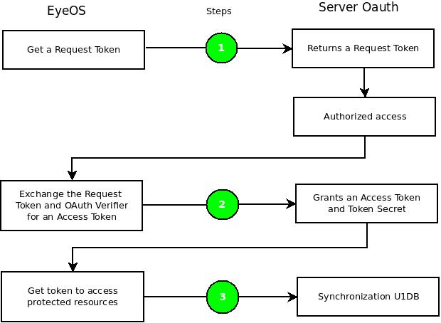

Step 1:

API getRequestToken() get the consumer key and consumer secret from the settings file. Performs the call to the Oauth server by means of the “request_token” url.

The Oauth server get the consumer key from mongodb database, an compares it with the consumer received from getRequestToken(). If it isn't correct, return an error and otherwise, performs a new search in mongodb, with the consumer key to get the request token.

The Oauth server answers to the eyeOS call providing the request token and the access verification to ask for the access token.

The eyeOS platform storage the request token and the verifier in the session variables in order not to repeat the process previously explained.

Step 2:

API getAccessToken(token,verifier) performs the Oauth server call by means of “access_token” url.

The Oauth server get the consumer and the request token from mongodb database, an compares it with the data received from getAccessToken(). If it isn't correct, returns an error and otherwise, performs a new search, with consumer key and request token key in mongodb to get the access token. If no data are adquired or the adquired data are expired, a new access token must be generated and stored it in mongodb, that  will invalidate any previous token.

The Oauth server ask for the eyeOS call providing the access token.

Step 3:

API protocol(params) performs the Oauth server call by means of the U1DB synchonization API.

The Oauth server get the access token from mongodb database using the consumer and token received. If they aren't correct returns an error and otherwise proceed to perform the synchronization with the U1DB server.

The step 1 is only applied in case that a request token hasn't been requested during the eyeOS user session.

## Implementation of StackSync API into eyeOS

EyeOS accesses the private document storage of a cloudspace user using StackSync API's from the application “File Manager”.

The StackSync API calls are made via a Python script called OAuthCredentials.py. This script can be configured from the file “settings.py” located at '/var/www/eyeos/eyeos/extern/u1db/'. Next are shown the values to modify:

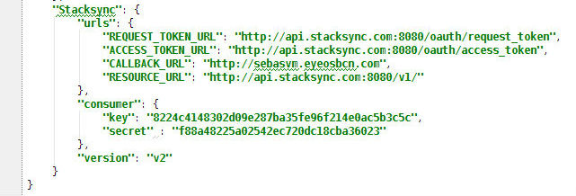

    <table border="0" cellpadding="0" cellspacing="0" style="border-collapse:collapse;">
        <tr>
            <td colspan="2">Urls</td>
        </tr>
        <tr>
            <td valign="middle">CALLBACK_URL</td>
            <td style="padding-left:15px">Callback url when the user has been validated in StackSync</td>
        </tr>
        <tr>
            <td colspan="2">consumer</td>
        </tr>
        <tr>
            <td valign="middle" width="10%">key</td>
            <td style="padding-left:15px">Key provided by StackSync</td>
        </tr>
        <tr>
            <td valign="middle">secret</td>
            <td style="padding-left:15px">Secret provided by StackSync</td>
        </tr>
    </table>

Next are detailed the APIs contained in the script OAuthCredentials.py:

**getRequestToken(**_oauth_**)**

Ask for the consumer eyeos's request token.

    <table border="0" cellpadding="0" cellspacing="0" style="border-collapse:collapse;">
        <tr>
            <td style="background-color:#C0C0C0">Url:</td>
            <td style="padding-left:30px">
                Use REQUEST_TOKEN_URL from the configuration file.
            </td>
        </tr>
        <tr>
            <td style="background-color:#C0C0C0">Method:</td>
            <td style="padding-left:30px">
                GET
            </td>
        </tr>
        <tr>
            <td style="background-color:#C0C0C0">Signature:</td>
            <td style="padding-left:30px">
                Plaintext
            </td>
        </tr>
        <tr>
            <td style="background-color:#C0C0C0">Parameters:</td>
            <td style="padding-left:30px">
                <b>oauth</b> – Object OauthRequest. Contains the values key, secret and CALLBACK_URL from the configuration file
            </td>
        </tr>
        <tr>
            <td style="background-color:#C0C0C0">Return:</td>
            <td style="padding-left:30px">
            Key and secret of the request token or in case of error returns an error structure: 
            - error: Error number 
            - description: Error description 
            Example: 
            {"oauth_token":"token1234","oauth_token_secret":"secret1234"} 
            {"error":401, "description": "Authorization required."}
            </td>
        </tr>
    </table>

**getAccessToken(**_oauth_**)**

Ask for the consumer eyeos's access token from the storaged request token.

    <table border="0" cellpadding="0" cellspacing="0" style="border-collapse:collapse;">
        <tr>
            <td style="background-color:#C0C0C0">Url:</td>
            <td style="padding-left:30px">
                Use ACCESS_TOKEN_URL from the configuration file.
            </td>
        </tr>
        <tr>
            <td style="background-color:#C0C0C0">Method:</td>
            <td style="padding-left:30px">
                GET
            </td>
        </tr>
        <tr>
            <td style="background-color:#C0C0C0">Signature:</td>
            <td style="padding-left:30px">
                Plaintext
            </td>
        </tr>
        <tr>
            <td style="background-color:#C0C0C0">Parameters:</td>
            <td style="padding-left:30px">
                <b>oauth</b> – Object OauthRequest. Contains the values key and secret from the configuration file. Also the request token and verifier.
            </td>
        </tr>
        <tr>
            <td style="background-color:#C0C0C0">Return:</td>
            <td style="padding-left:30px">
            Key and secret of the access token or in case of error returns an error structure: 
            - error: Error number 
            - description: Error description 
            Example: 
            {"oauth_token":"token1234","oauth_token_secret":"secret1234"} 
            {"error":401, "description": "Authorization required."}
            </td>
        </tr>
    </table>

**getMetadata(**_oauth,file,id,contents_**)**

Get the metadata of a directory and/or files.

    <table border="0" cellpadding="0" cellspacing="0" style="border-collapse:collapse;">
        <tr>
            <td style="background-color:#C0C0C0">Url:</td>
            <td style="padding-left:30px">
                Use RESOURCE_URL from the configuration file.
            </td>
        </tr>
        <tr>
            <td style="background-color:#C0C0C0">Method:</td>
            <td style="padding-left:30px">
                GET
            </td>
        </tr>
        <tr>
            <td style="background-color:#C0C0C0">Signature:</td>
            <td style="padding-left:30px">
                HMAC-SHA1
            </td>
        </tr>
        <tr>
            <td style="background-color:#C0C0C0">Parameters:</td>
            <td style="padding-left:30px">
                <b>oauth</b> – Object OauthRequest. Contains the values key and secret from the configuration file. Also the access token 
                <b>file</b> – True, if it is a file or False, is it a directory 
                <b>Id</b> – Element identifier number (directory or file) 
                <b>contents</b> – True, to list the metadatas depending on the id or None, to inactive the list. Used when 'Id' is a directory. (Optional)
            </td>
        </tr>
        <tr>
            <td style="background-color:#C0C0C0">Return:</td>
            <td style="padding-left:30px">
            Metadata/s of the element or in case of error returns an error structure: 
            - error: Error number 
            - description: Error description 
            Example: 
            {"filename":"clients", 
            &nbsp;"id":9873615, 
            &nbsp;"status":"NEW", 
            &nbsp;"version":1, 
            &nbsp;"parent_id":”null”, 
            &nbsp;"user":"eyeos", 
            &nbsp;"client_modified":"2013-03-08 10:36:41.997", 
            &nbsp;"server_modified":"2013-03-08 10:36:41.997", 
            &nbsp;“is_root”: false, 
            &nbsp;"is_folder":true, 
            &nbsp;"contents":[{ 
            &nbsp;&nbsp;&nbsp;&nbsp;&nbsp;&nbsp;&nbsp;&nbsp;&nbsp;&nbsp;&nbsp;&nbsp;&nbsp;&nbsp;&nbsp;&nbsp;&nbsp;&nbsp;&nbsp;&nbsp;&nbsp;&nbsp;&nbsp;&nbsp;&nbsp;&nbsp;"filename":"Client1.pdf", 
            &nbsp;&nbsp;&nbsp;&nbsp;&nbsp;&nbsp;&nbsp;&nbsp;&nbsp;&nbsp;&nbsp;&nbsp;&nbsp;&nbsp;&nbsp;&nbsp;&nbsp;&nbsp;&nbsp;&nbsp;&nbsp;&nbsp;&nbsp;&nbsp;&nbsp;&nbsp;"id":32565632156, 
            &nbsp;&nbsp;&nbsp;&nbsp;&nbsp;&nbsp;&nbsp;&nbsp;&nbsp;&nbsp;&nbsp;&nbsp;&nbsp;&nbsp;&nbsp;&nbsp;&nbsp;&nbsp;&nbsp;&nbsp;&nbsp;&nbsp;&nbsp;&nbsp;&nbsp;&nbsp;"size":775412, 
            &nbsp;&nbsp;&nbsp;&nbsp;&nbsp;&nbsp;&nbsp;&nbsp;&nbsp;&nbsp;&nbsp;&nbsp;&nbsp;&nbsp;&nbsp;&nbsp;&nbsp;&nbsp;&nbsp;&nbsp;&nbsp;&nbsp;&nbsp;&nbsp;&nbsp;&nbsp;"mimetype":"application/pdf", 
            &nbsp;&nbsp;&nbsp;&nbsp;&nbsp;&nbsp;&nbsp;&nbsp;&nbsp;&nbsp;&nbsp;&nbsp;&nbsp;&nbsp;&nbsp;&nbsp;&nbsp;&nbsp;&nbsp;&nbsp;&nbsp;&nbsp;&nbsp;&nbsp;&nbsp;&nbsp;"status":"NEW", 
            &nbsp;&nbsp;&nbsp;&nbsp;&nbsp;&nbsp;&nbsp;&nbsp;&nbsp;&nbsp;&nbsp;&nbsp;&nbsp;&nbsp;&nbsp;&nbsp;&nbsp;&nbsp;&nbsp;&nbsp;&nbsp;&nbsp;&nbsp;&nbsp;&nbsp;&nbsp;"version":1, 
            &nbsp;&nbsp;&nbsp;&nbsp;&nbsp;&nbsp;&nbsp;&nbsp;&nbsp;&nbsp;&nbsp;&nbsp;&nbsp;&nbsp;&nbsp;&nbsp;&nbsp;&nbsp;&nbsp;&nbsp;&nbsp;&nbsp;&nbsp;&nbsp;&nbsp;&nbsp;"parent_id":-348534824681, 
            &nbsp;&nbsp;&nbsp;&nbsp;&nbsp;&nbsp;&nbsp;&nbsp;&nbsp;&nbsp;&nbsp;&nbsp;&nbsp;&nbsp;&nbsp;&nbsp;&nbsp;&nbsp;&nbsp;&nbsp;&nbsp;&nbsp;&nbsp;&nbsp;&nbsp;&nbsp;"user":"eyeos", 
            &nbsp;&nbsp;&nbsp;&nbsp;&nbsp;&nbsp;&nbsp;&nbsp;&nbsp;&nbsp;&nbsp;&nbsp;&nbsp;&nbsp;&nbsp;&nbsp;&nbsp;&nbsp;&nbsp;&nbsp;&nbsp;&nbsp;&nbsp;&nbsp;&nbsp;&nbsp;"client_modified":"2013-03-08 10:36:41.997", 
            &nbsp;&nbsp;&nbsp;&nbsp;&nbsp;&nbsp;&nbsp;&nbsp;&nbsp;&nbsp;&nbsp;&nbsp;&nbsp;&nbsp;&nbsp;&nbsp;&nbsp;&nbsp;&nbsp;&nbsp;&nbsp;&nbsp;&nbsp;&nbsp;&nbsp;&nbsp;"server_modified":"2013-03-08 10:36:41.997", 
            &nbsp;&nbsp;&nbsp;&nbsp;&nbsp;&nbsp;&nbsp;&nbsp;&nbsp;&nbsp;&nbsp;&nbsp;&nbsp;&nbsp;&nbsp;&nbsp;&nbsp;&nbsp;&nbsp;&nbsp;&nbsp;&nbsp;&nbsp;&nbsp;&nbsp;&nbsp;"is_root":false, 
            &nbsp;&nbsp;&nbsp;&nbsp;&nbsp;&nbsp;&nbsp;&nbsp;&nbsp;&nbsp;&nbsp;&nbsp;&nbsp;&nbsp;&nbsp;&nbsp;&nbsp;&nbsp;&nbsp;&nbsp;&nbsp;&nbsp;&nbsp;&nbsp;&nbsp;&nbsp;"is_folder":false 
            &nbsp;&nbsp;&nbsp;&nbsp;&nbsp;&nbsp;&nbsp;&nbsp;&nbsp;&nbsp;&nbsp;&nbsp;&nbsp;&nbsp;&nbsp;&nbsp;&nbsp;&nbsp;&nbsp;&nbsp;&nbsp;&nbsp;&nbsp;}] 
            } 
            {"error":403, "description": "Forbidden ."}
            </td>
        </tr>
    </table>

**updateMetadata(**_oauth,file,id,name,parent_**)**

Update the metadata of the element in the actions rename and move.

    <table border="0" cellpadding="0" cellspacing="0" style="border-collapse:collapse;">
        <tr>
            <td style="background-color:#C0C0C0">Url:</td>
            <td style="padding-left:30px">
                Use RESOURCE_URL from the configuration file.
            </td>
        </tr>
        <tr>
            <td style="background-color:#C0C0C0">Method:</td>
            <td style="padding-left:30px">
                PUT
            </td>
        </tr>
        <tr>
            <td style="background-color:#C0C0C0">Signature:</td>
            <td style="padding-left:30px">
                HMAC-SHA1
            </td>
        </tr>
        <tr>
            <td style="background-color:#C0C0C0">Parameters:</td>
            <td style="padding-left:30px">
                <b>oauth</b> – Object OauthRequest. Contains the values key and secret from the configuration file. Also the access token 
                <b>file</b> – True, if it is a file or False, is it a directory 
                <b>Id</b> – Element identifier number (directory or file) 
                <b>name</b> – Element name 
                <b>parent</b> – Id of the destination directory (Optional)               
            </td>
        </tr>
        <tr>
            <td style="background-color:#C0C0C0">Return:</td>
            <td style="padding-left:30px">
            Metadata of the element or in case of error returns an error structure: 
            - error: Error number 
            - description: Error description 
            Example: 
            {"status": "CHANGED", 
            &nbsp;"is_folder": false, 
            &nbsp;"user": "eyeos", 
            &nbsp;"server_modified": "2013-03-08 10:36:41.997", 
            &nbsp;"id": 32565632156,  
            &nbsp;"size": 775412, 
            &nbsp;"mimetype": "application/pdf", 
            &nbsp;"client_modified": "2013-03-08 10:36:41.997", 
            &nbsp;"filename": "Client1.pdf", 
            &nbsp;"parent_id": 789456, 
            &nbsp;“is_root”: false, 
            &nbsp;"version": 3} 
            {"error":403, "description": "Forbidden ."}
            </td>
        </tr>
    </table>

**createMetadata(**_oauth,file,name,parent,path_**)**

Create a new element (file or directory)

    <table border="0" cellpadding="0" cellspacing="0" style="border-collapse:collapse;">
        <tr>
            <td style="background-color:#C0C0C0">Url:</td>
            <td style="padding-left:30px">
                Use RESOURCE_URL from the configuration file.
            </td>
        </tr>
        <tr>
            <td style="background-color:#C0C0C0">Method:</td>
            <td style="padding-left:30px">
                POST
            </td>
        </tr>
        <tr>
            <td style="background-color:#C0C0C0">Signature:</td>
            <td style="padding-left:30px">
                HMAC-SHA1
            </td>
        </tr>
        <tr>
            <td style="background-color:#C0C0C0">Parameters:</td>
            <td style="padding-left:30px">
                <b>oauth</b> – Object OAuthRequest. Contains the values key and secret from the configuration file. Also the access token. 
                <b>file</b> – True, if it is a file or False, is it a directory 
                <b>name</b> – Element name 
                <b>parent</b> – Id of the destination directory (Optional) 
                <b>path</b> – Absolute file path (Optional)
            </td>
        </tr>
        <tr>
            <td style="background-color:#C0C0C0">Return:</td>
            <td style="padding-left:30px">
            Metadata of the element or in case of error returns an error structure: 
            - error: Error number 
            - description: Error description 
            Example: 
            {"status": "NEW", 
            &nbsp;"is_folder": false, 
            &nbsp;"user": "eyeos", 
            &nbsp;"server_modified": "2013-03-08 10:36:41.997", 
            &nbsp;"id": 32565632155,  
            &nbsp;"size": 775412, 
            &nbsp;"mimetype": "application/pdf", 
            &nbsp;"client_modified": "2013-03-08 10:36:41.997", 
            &nbsp;"filename": "Client.pdf", 
            &nbsp;"parent_id": 789456, 
            &nbsp;“is_root”: false, 
            &nbsp;"version": 1} 
            {"error":403, "description": "Forbidden ."}
            </td>
        </tr>
    </table>

**uploadFile(**_oauth,id,path_**)**

Upload the contents of an existing file.

    <table border="0" cellpadding="0" cellspacing="0" style="border-collapse:collapse;">
        <tr>
            <td style="background-color:#C0C0C0">Url:</td>
            <td style="padding-left:30px">
                Use RESOURCE_URL from the configuration file.
            </td>
        </tr>
        <tr>
            <td style="background-color:#C0C0C0">Method:</td>
            <td style="padding-left:30px">
                PUT
            </td>
        </tr>
        <tr>
            <td style="background-color:#C0C0C0">Signature:</td>
            <td style="padding-left:30px">
                HMAC-SHA1
            </td>
        </tr>
        <tr>
            <td style="background-color:#C0C0C0">Parameters:</td>
            <td style="padding-left:30px">
                <b>oauth</b> – Object OauthRequest. Contains the values key and secret from the configuration file 
                <b>id</b> – File identifier number 
                <b>path</b> – Absolute file path (Optional)
            </td>
        </tr>
        <tr>
            <td style="background-color:#C0C0C0">Return:</td>
            <td style="padding-left:30px">
            Metadata of the element or in case of error returns an error structure: 
            - error: Error number 
            - description: Error description 
            Example: 
            {"error":403, "description": "Forbidden ."}
            </td>
        </tr>
    </table>

**downloadFile(**_oauth,id,path_**)**

Download the contents of an existing file.

    <table border="0" cellpadding="0" cellspacing="0" style="border-collapse:collapse;">
        <tr>
            <td style="background-color:#C0C0C0">Url:</td>
            <td style="padding-left:30px">
                Use RESOURCE_URL from the configuration file.
            </td>
        </tr>
        <tr>
            <td style="background-color:#C0C0C0">Method:</td>
            <td style="padding-left:30px">
                GET
            </td>
        </tr>
        <tr>
            <td style="background-color:#C0C0C0">Signature:</td>
            <td style="padding-left:30px">
                HMAC-SHA1
            </td>
        </tr>
        <tr>
            <td style="background-color:#C0C0C0">Parameters:</td>
            <td style="padding-left:30px">
                <b>oauth</b> – Object OauthRequest. Contains the values key and secret from the configuration file. Also the access token 
                <b>id</b> – File identifier number 
                <b>path</b> – Absolute file path
            </td>
        </tr>
        <tr>
            <td style="background-color:#C0C0C0">Return:</td>
            <td style="padding-left:30px">
            True or in case of error returns an error structure: 
            - error: Error number 
            - description: Error description 
            Example: 
            {"error":403, "description": "Forbidden ."}
            </td>
        </tr>
    </table>

**deleteMetadata(**_oauth,file,id_**)**

Delete an element (file or directory)

    <table border="0" cellpadding="0" cellspacing="0" style="border-collapse:collapse;">
        <tr>
            <td style="background-color:#C0C0C0">Url:</td>
            <td style="padding-left:30px">
                Use RESOURCE_URL from the configuration file.
            </td>
        </tr>
        <tr>
            <td style="background-color:#C0C0C0">Method:</td>
            <td style="padding-left:30px">
                DELETE
            </td>
        </tr>
        <tr>
            <td style="background-color:#C0C0C0">Signature:</td>
            <td style="padding-left:30px">
                HMAC-SHA1
            </td>
        </tr>
        <tr>
            <td style="background-color:#C0C0C0">Parameters:</td>
            <td style="padding-left:30px">
                <b>oauth</b> – Object OauthRequest. Contains the values key and secret from the configuration file. Also the access token. 
                <b>file</b> – True, if it is a file or False, is it a directory 
                <b>Id</b> – Element identifier number (directory or file)
            </td>
        </tr>
        <tr>
            <td style="background-color:#C0C0C0">Return:</td>
            <td style="padding-left:30px">
            Metadata of the element or in case of error returns an error structure: 
            - error: Error number 
            - description: Error description 
            Example: 
            {"status": "DELETED", 
            &nbsp;"is_folder": false, 
            &nbsp;"user": "eyeos", 
            &nbsp;"server_modified": "2013-03-08 10:36:41.997", 
            &nbsp;"id": 32565632156,  
            &nbsp;"size": 775412, 
            &nbsp;"mimetype": "application/pdf", 
            &nbsp;"client_modified": "2013-03-08 10:36:41.997", 
            &nbsp;"filename": "Client1.pdf", 
            &nbsp;"parent_id": 789456, 
            &nbsp;“is_root”: false, 
            &nbsp;"version": 3} 
            {"error":403, "description": "Forbidden ."}
            </td>
        </tr>
    </table>

**getFileVersions(**_oauth,id_**)**

Get the list of versions of a specific file.

    <table border="0" cellpadding="0" cellspacing="0" style="border-collapse:collapse;">
        <tr>
            <td style="background-color:#C0C0C0">Url:</td>
            <td style="padding-left:30px">
                Use RESOURCE_URL from the configuration file.
            </td>
        </tr>
        <tr>
            <td style="background-color:#C0C0C0">Method:</td>
            <td style="padding-left:30px">
                GET
            </td>
        </tr>
        <tr>
            <td style="background-color:#C0C0C0">Signature:</td>
            <td style="padding-left:30px">
                HMAC-SHA1
            </td>
        </tr>
        <tr>
            <td style="background-color:#C0C0C0">Parameters:</td>
            <td style="padding-left:30px">
                <b>oauth</b> – Object OauthRequest. Contains the values key and secret from the configuration file. Also the access token. 
                <b>Id</b> – File identifier number
            </td>
        </tr>
        <tr>
            <td style="background-color:#C0C0C0">Return:</td>
            <td style="padding-left:30px">
            Metadata of the element or in case of error returns an error structure: 
            - error: Error number 
            - description: Error description 
            Example: 
            {"status": "CHANGED", 
            &nbsp;"is_folder": false, 
            &nbsp;"chunks": [], 
            &nbsp;"id": "155",             
            &nbsp;"mimetype": "text/plain", 
            &nbsp;"versions": [ 
&nbsp;&nbsp;&nbsp;&nbsp;&nbsp;&nbsp;&nbsp;&nbsp;&nbsp;&nbsp;&nbsp;&nbsp;&nbsp;&nbsp;&nbsp;&nbsp;&nbsp;&nbsp;&nbsp;&nbsp;&nbsp;&nbsp;&nbsp;&nbsp;&nbsp;&nbsp;{"status":"CHANGED", 
&nbsp;&nbsp;&nbsp;&nbsp;&nbsp;&nbsp;&nbsp;&nbsp;&nbsp;&nbsp;&nbsp;&nbsp;&nbsp;&nbsp;&nbsp;&nbsp;&nbsp;&nbsp;&nbsp;&nbsp;&nbsp;&nbsp;&nbsp;&nbsp;&nbsp;&nbsp;"is_folder": false, 
&nbsp;&nbsp;&nbsp;&nbsp;&nbsp;&nbsp;&nbsp;&nbsp;&nbsp;&nbsp;&nbsp;&nbsp;&nbsp;&nbsp;&nbsp;&nbsp;&nbsp;&nbsp;&nbsp;&nbsp;&nbsp;&nbsp;&nbsp;&nbsp;&nbsp;&nbsp;"chunks": [], 
&nbsp;&nbsp;&nbsp;&nbsp;&nbsp;&nbsp;&nbsp;&nbsp;&nbsp;&nbsp;&nbsp;&nbsp;&nbsp;&nbsp;&nbsp;&nbsp;&nbsp;&nbsp;&nbsp;&nbsp;&nbsp;&nbsp;&nbsp;&nbsp;&nbsp;&nbsp;"id": "155", 
&nbsp;&nbsp;&nbsp;&nbsp;&nbsp;&nbsp;&nbsp;&nbsp;&nbsp;&nbsp;&nbsp;&nbsp;&nbsp;&nbsp;&nbsp;&nbsp;&nbsp;&nbsp;&nbsp;&nbsp;&nbsp;&nbsp;&nbsp;&nbsp;&nbsp;&nbsp;"size": 61, 
&nbsp;&nbsp;&nbsp;&nbsp;&nbsp;&nbsp;&nbsp;&nbsp;&nbsp;&nbsp;&nbsp;&nbsp;&nbsp;&nbsp;&nbsp;&nbsp;&nbsp;&nbsp;&nbsp;&nbsp;&nbsp;&nbsp;&nbsp;&nbsp;&nbsp;&nbsp;"mimetype": "text/plain", 
&nbsp;&nbsp;&nbsp;&nbsp;&nbsp;&nbsp;&nbsp;&nbsp;&nbsp;&nbsp;&nbsp;&nbsp;&nbsp;&nbsp;&nbsp;&nbsp;&nbsp;&nbsp;&nbsp;&nbsp;&nbsp;&nbsp;&nbsp;&nbsp;&nbsp;&nbsp;"checksum": 2499810342, 
&nbsp;&nbsp;&nbsp;&nbsp;&nbsp;&nbsp;&nbsp;&nbsp;&nbsp;&nbsp;&nbsp;&nbsp;&nbsp;&nbsp;&nbsp;&nbsp;&nbsp;&nbsp;&nbsp;&nbsp;&nbsp;&nbsp;&nbsp;&nbsp;&nbsp;&nbsp;"modified_at": "2014-06-20 10:11:11.031", 
&nbsp;&nbsp;&nbsp;&nbsp;&nbsp;&nbsp;&nbsp;&nbsp;&nbsp;&nbsp;&nbsp;&nbsp;&nbsp;&nbsp;&nbsp;&nbsp;&nbsp;&nbsp;&nbsp;&nbsp;&nbsp;&nbsp;&nbsp;&nbsp;&nbsp;&nbsp;"filename":"welcome.txt", 
&nbsp;&nbsp;&nbsp;&nbsp;&nbsp;&nbsp;&nbsp;&nbsp;&nbsp;&nbsp;&nbsp;&nbsp;&nbsp;&nbsp;&nbsp;&nbsp;&nbsp;&nbsp;&nbsp;&nbsp;&nbsp;&nbsp;&nbsp;&nbsp;&nbsp;&nbsp;"parent_id":"null", 
&nbsp;&nbsp;&nbsp;&nbsp;&nbsp;&nbsp;&nbsp;&nbsp;&nbsp;&nbsp;&nbsp;&nbsp;&nbsp;&nbsp;&nbsp;&nbsp;&nbsp;&nbsp;&nbsp;&nbsp;&nbsp;&nbsp;&nbsp;&nbsp;&nbsp;&nbsp;"version":"2"}, 
&nbsp;&nbsp;&nbsp;&nbsp;&nbsp;&nbsp;&nbsp;&nbsp;&nbsp;&nbsp;&nbsp;&nbsp;&nbsp;&nbsp;&nbsp;&nbsp;&nbsp;&nbsp;&nbsp;&nbsp;&nbsp;&nbsp;&nbsp;&nbsp;&nbsp;&nbsp;{"status":"NEW", 
&nbsp;&nbsp;&nbsp;&nbsp;&nbsp;&nbsp;&nbsp;&nbsp;&nbsp;&nbsp;&nbsp;&nbsp;&nbsp;&nbsp;&nbsp;&nbsp;&nbsp;&nbsp;&nbsp;&nbsp;&nbsp;&nbsp;&nbsp;&nbsp;&nbsp;&nbsp;"is_folder": false, 
&nbsp;&nbsp;&nbsp;&nbsp;&nbsp;&nbsp;&nbsp;&nbsp;&nbsp;&nbsp;&nbsp;&nbsp;&nbsp;&nbsp;&nbsp;&nbsp;&nbsp;&nbsp;&nbsp;&nbsp;&nbsp;&nbsp;&nbsp;&nbsp;&nbsp;&nbsp;"chunks": [], 
&nbsp;&nbsp;&nbsp;&nbsp;&nbsp;&nbsp;&nbsp;&nbsp;&nbsp;&nbsp;&nbsp;&nbsp;&nbsp;&nbsp;&nbsp;&nbsp;&nbsp;&nbsp;&nbsp;&nbsp;&nbsp;&nbsp;&nbsp;&nbsp;&nbsp;&nbsp;"id": "155", 
&nbsp;&nbsp;&nbsp;&nbsp;&nbsp;&nbsp;&nbsp;&nbsp;&nbsp;&nbsp;&nbsp;&nbsp;&nbsp;&nbsp;&nbsp;&nbsp;&nbsp;&nbsp;&nbsp;&nbsp;&nbsp;&nbsp;&nbsp;&nbsp;&nbsp;&nbsp;"size": 59, 
&nbsp;&nbsp;&nbsp;&nbsp;&nbsp;&nbsp;&nbsp;&nbsp;&nbsp;&nbsp;&nbsp;&nbsp;&nbsp;&nbsp;&nbsp;&nbsp;&nbsp;&nbsp;&nbsp;&nbsp;&nbsp;&nbsp;&nbsp;&nbsp;&nbsp;&nbsp;"mimetype": "text/plain", 
&nbsp;&nbsp;&nbsp;&nbsp;&nbsp;&nbsp;&nbsp;&nbsp;&nbsp;&nbsp;&nbsp;&nbsp;&nbsp;&nbsp;&nbsp;&nbsp;&nbsp;&nbsp;&nbsp;&nbsp;&nbsp;&nbsp;&nbsp;&nbsp;&nbsp;&nbsp;"checksum": 2499810342, 
&nbsp;&nbsp;&nbsp;&nbsp;&nbsp;&nbsp;&nbsp;&nbsp;&nbsp;&nbsp;&nbsp;&nbsp;&nbsp;&nbsp;&nbsp;&nbsp;&nbsp;&nbsp;&nbsp;&nbsp;&nbsp;&nbsp;&nbsp;&nbsp;&nbsp;&nbsp;"modified_at": "2014-06-20 10:11:11.031", 
&nbsp;&nbsp;&nbsp;&nbsp;&nbsp;&nbsp;&nbsp;&nbsp;&nbsp;&nbsp;&nbsp;&nbsp;&nbsp;&nbsp;&nbsp;&nbsp;&nbsp;&nbsp;&nbsp;&nbsp;&nbsp;&nbsp;&nbsp;&nbsp;&nbsp;&nbsp;"filename":"welcome.txt", 
&nbsp;&nbsp;&nbsp;&nbsp;&nbsp;&nbsp;&nbsp;&nbsp;&nbsp;&nbsp;&nbsp;&nbsp;&nbsp;&nbsp;&nbsp;&nbsp;&nbsp;&nbsp;&nbsp;&nbsp;&nbsp;&nbsp;&nbsp;&nbsp;&nbsp;&nbsp;"parent_id":"null", 
&nbsp;&nbsp;&nbsp;&nbsp;&nbsp;&nbsp;&nbsp;&nbsp;&nbsp;&nbsp;&nbsp;&nbsp;&nbsp;&nbsp;&nbsp;&nbsp;&nbsp;&nbsp;&nbsp;&nbsp;&nbsp;&nbsp;&nbsp;&nbsp;&nbsp;&nbsp;"version":"1"}], 
            &nbsp;"checksum": 2499810342, 
            &nbsp;"modified_at": "2014-06-20 10:11:11.031", 
            &nbsp;"filename": "welcome.txt", 
            &nbsp;"parent_id": "null", 
            &nbsp;"version":2} 
            {"error":403, "description": "Forbidden ."}
            </td>
        </tr>
    </table>

**getFileVersionData(**_oauth,id,version,path_**)**

Download the contents of a specific version of an existing file.

    <table border="0" cellpadding="0" cellspacing="0" style="border-collapse:collapse;">
        <tr>
            <td style="background-color:#C0C0C0">Url:</td>
            <td style="padding-left:30px">
                Use RESOURCE_URL from the configuration file.
            </td>
        </tr>
        <tr>
            <td style="background-color:#C0C0C0">Method:</td>
            <td style="padding-left:30px">
                GET
            </td>
        </tr>
        <tr>
            <td style="background-color:#C0C0C0">Signature:</td>
            <td style="padding-left:30px">
                HMAC-SHA1
            </td>
        </tr>
        <tr>
            <td style="background-color:#C0C0C0">Parameters:</td>
            <td style="padding-left:30px">
                <b>oauth</b> – Object OauthRequest. Contains the values key and secret from the configuration file. Also the access token. 
                <b>id</b> – File identifier number 
                <b>version</b> – Version pending to download 
                <b>path</b> – Absolute file path
            </td>
        </tr>
        <tr>
            <td style="background-color:#C0C0C0">Return:</td>
            <td style="padding-left:30px">
            True or in case of error returns an error structure: 
            - error: Error number 
            - description: Error description 
            Example: 
            {"error":403, "description": "Forbidden ."}
            </td>
        </tr>
    </table>

Next are listed the APIs contained in the framework Store, which comunicate with the Python APIs previously explained:

**getRequestToken()**

Ask for the consumer eyeos's request token.

    <table border="0" cellpadding="0" cellspacing="0" style="border-collapse:collapse;">
        <tr>
            <td style="background-color:#C0C0C0">Script call:</td>
            <td style="padding-left:30px">
                No parameters
            </td>
        </tr>
        <tr>
            <td style="background-color:#C0C0C0">Return:</td>
            <td style="padding-left:30px">
            Object token or in case of error null 
            Example: 
            { 
            &nbsp;"key": "token1234", 
            &nbsp;"secret": "secret1234" 
            }
            </td>
        </tr>
    </table>

**getAccessToken(**_token_**)**

Ask for the consumer eyeos's access token from the request token.

    <table border="0" cellpadding="0" cellspacing="0" style="border-collapse:collapse;">
        <tr>
            <td style="background-color:#C0C0C0">Parameters:</td>
            <td style="padding-left:30px">
                <b>token</b> – Contains the request token and user verification
            </td>
        </tr>
        <tr>
            <td style="background-color:#C0C0C0">Script call:</td>
            <td style="padding-left:30px">
                Example: 
                { 
                &nbsp;"token":{ 
                &nbsp;&nbsp;&nbsp;&nbsp;&nbsp;&nbsp;&nbsp;&nbsp;&nbsp;&nbsp;&nbsp;&nbsp;&nbsp;&nbsp;&nbsp;&nbsp;&nbsp;&nbsp;&nbsp;"key":"token1234", 
                &nbsp;&nbsp;&nbsp;&nbsp;&nbsp;&nbsp;&nbsp;&nbsp;&nbsp;&nbsp;&nbsp;&nbsp;&nbsp;&nbsp;&nbsp;&nbsp;&nbsp;&nbsp;&nbsp;"secret":"secret1234", 
                &nbsp;&nbsp;&nbsp;&nbsp;&nbsp;&nbsp;&nbsp;&nbsp;&nbsp;&nbsp;&nbsp;&nbsp;&nbsp;&nbsp;&nbsp;&nbsp;&nbsp;}, 
                &nbsp;"verifier":"userVerifier" 
                }
            </td>
        </tr>
        <tr>
            <td style="background-color:#C0C0C0">Return:</td>
            <td style="padding-left:30px">
            Object token or in case of error null 
            Example: 
            { 
            &nbsp;"key": "access1234", 
            &nbsp;"secret": "access1234" 
            }
            </td>
        </tr>
    </table>

**getMetadata(**_token,id,path,user_**)**

Get the metadatas of the current element. Generate its file and/or directory structure in eyeOS.

    <table border="0" cellpadding="0" cellspacing="0" style="border-collapse:collapse;">
        <tr>
            <td style="background-color:#C0C0C0">Parameters:</td>
            <td style="padding-left:30px">
                <b>token</b> – Contains the access token's key and secret 
                <b>id</b> – Element identifier number in StackSync 
                <b>path</b> – eyeOS path 
                <b>user</b> – User identifier in eyeOS                
            </td>
        </tr>
        <tr>
            <td style="background-color:#C0C0C0">Script call:</td>
            <td style="padding-left:30px">
                Example: 
                { 
                &nbsp;"token":{ 
                &nbsp;&nbsp;&nbsp;&nbsp;&nbsp;&nbsp;&nbsp;&nbsp;&nbsp;&nbsp;&nbsp;&nbsp;&nbsp;&nbsp;&nbsp;&nbsp;&nbsp;&nbsp;&nbsp;"key":"token1234", 
                &nbsp;&nbsp;&nbsp;&nbsp;&nbsp;&nbsp;&nbsp;&nbsp;&nbsp;&nbsp;&nbsp;&nbsp;&nbsp;&nbsp;&nbsp;&nbsp;&nbsp;&nbsp;&nbsp;"secret":"secret1234", 
                &nbsp;&nbsp;&nbsp;&nbsp;&nbsp;&nbsp;&nbsp;&nbsp;&nbsp;&nbsp;&nbsp;&nbsp;&nbsp;&nbsp;&nbsp;&nbsp;&nbsp;}, 
                &nbsp;"metadata":{ 
                &nbsp;&nbsp;&nbsp;&nbsp;&nbsp;&nbsp;&nbsp;&nbsp;&nbsp;&nbsp;&nbsp;&nbsp;&nbsp;&nbsp;&nbsp;&nbsp;&nbsp;&nbsp;&nbsp;&nbsp;&nbsp;&nbsp;&nbsp;&nbsp;&nbsp;&nbsp;"type":"get",  
                &nbsp;&nbsp;&nbsp;&nbsp;&nbsp;&nbsp;&nbsp;&nbsp;&nbsp;&nbsp;&nbsp;&nbsp;&nbsp;&nbsp;&nbsp;&nbsp;&nbsp;&nbsp;&nbsp;&nbsp;&nbsp;&nbsp;&nbsp;&nbsp;&nbsp;&nbsp;"file":false, 
                &nbsp;&nbsp;&nbsp;&nbsp;&nbsp;&nbsp;&nbsp;&nbsp;&nbsp;&nbsp;&nbsp;&nbsp;&nbsp;&nbsp;&nbsp;&nbsp;&nbsp;&nbsp;&nbsp;&nbsp;&nbsp;&nbsp;&nbsp;&nbsp;&nbsp;&nbsp;"id":155241412, 
                &nbsp;&nbsp;&nbsp;&nbsp;&nbsp;&nbsp;&nbsp;&nbsp;&nbsp;&nbsp;&nbsp;&nbsp;&nbsp;&nbsp;&nbsp;&nbsp;&nbsp;&nbsp;&nbsp;&nbsp;&nbsp;&nbsp;&nbsp;&nbsp;&nbsp;&nbsp;"contents":true 
                &nbsp;&nbsp;&nbsp;&nbsp;&nbsp;&nbsp;&nbsp;&nbsp;&nbsp;&nbsp;&nbsp;&nbsp;&nbsp;&nbsp;&nbsp;&nbsp;&nbsp;&nbsp;&nbsp;&nbsp;&nbsp;&nbsp;&nbsp;&nbsp;&nbsp;} 
                }
            </td>
        </tr>
        <tr>
            <td style="background-color:#C0C0C0">Return:</td>
            <td style="padding-left:30px">
            Metadata or in case of error returns an error structure: 
            - error: Error number 
            Example: 
            {"filename":"clients", 
            &nbsp;"id":155241412, 
            &nbsp;"status":"NEW", 
            &nbsp;"version":1, 
            &nbsp;"parent_id":”null”, 
            &nbsp;"user":"eyeos", 
            &nbsp;"client_modified":"2013-03-08 10:36:41.997", 
            &nbsp;"server_modified":"2013-03-08 10:36:41.997", 
            &nbsp;“is_root”: false, 
            &nbsp;"is_folder":true, 
            &nbsp;"contents":[{ 
            &nbsp;&nbsp;&nbsp;&nbsp;&nbsp;&nbsp;&nbsp;&nbsp;&nbsp;&nbsp;&nbsp;&nbsp;&nbsp;&nbsp;&nbsp;&nbsp;&nbsp;&nbsp;&nbsp;&nbsp;&nbsp;&nbsp;&nbsp;&nbsp;&nbsp;&nbsp;"filename":"Client1.pdf", 
            &nbsp;&nbsp;&nbsp;&nbsp;&nbsp;&nbsp;&nbsp;&nbsp;&nbsp;&nbsp;&nbsp;&nbsp;&nbsp;&nbsp;&nbsp;&nbsp;&nbsp;&nbsp;&nbsp;&nbsp;&nbsp;&nbsp;&nbsp;&nbsp;&nbsp;&nbsp;"id":32565632156, 
            &nbsp;&nbsp;&nbsp;&nbsp;&nbsp;&nbsp;&nbsp;&nbsp;&nbsp;&nbsp;&nbsp;&nbsp;&nbsp;&nbsp;&nbsp;&nbsp;&nbsp;&nbsp;&nbsp;&nbsp;&nbsp;&nbsp;&nbsp;&nbsp;&nbsp;&nbsp;"size":775412, 
            &nbsp;&nbsp;&nbsp;&nbsp;&nbsp;&nbsp;&nbsp;&nbsp;&nbsp;&nbsp;&nbsp;&nbsp;&nbsp;&nbsp;&nbsp;&nbsp;&nbsp;&nbsp;&nbsp;&nbsp;&nbsp;&nbsp;&nbsp;&nbsp;&nbsp;&nbsp;"mimetype":"application/pdf", 
            &nbsp;&nbsp;&nbsp;&nbsp;&nbsp;&nbsp;&nbsp;&nbsp;&nbsp;&nbsp;&nbsp;&nbsp;&nbsp;&nbsp;&nbsp;&nbsp;&nbsp;&nbsp;&nbsp;&nbsp;&nbsp;&nbsp;&nbsp;&nbsp;&nbsp;&nbsp;"status":"NEW", 
            &nbsp;&nbsp;&nbsp;&nbsp;&nbsp;&nbsp;&nbsp;&nbsp;&nbsp;&nbsp;&nbsp;&nbsp;&nbsp;&nbsp;&nbsp;&nbsp;&nbsp;&nbsp;&nbsp;&nbsp;&nbsp;&nbsp;&nbsp;&nbsp;&nbsp;&nbsp;"version":1, 
            &nbsp;&nbsp;&nbsp;&nbsp;&nbsp;&nbsp;&nbsp;&nbsp;&nbsp;&nbsp;&nbsp;&nbsp;&nbsp;&nbsp;&nbsp;&nbsp;&nbsp;&nbsp;&nbsp;&nbsp;&nbsp;&nbsp;&nbsp;&nbsp;&nbsp;&nbsp;"parent_id":155241412, 
            &nbsp;&nbsp;&nbsp;&nbsp;&nbsp;&nbsp;&nbsp;&nbsp;&nbsp;&nbsp;&nbsp;&nbsp;&nbsp;&nbsp;&nbsp;&nbsp;&nbsp;&nbsp;&nbsp;&nbsp;&nbsp;&nbsp;&nbsp;&nbsp;&nbsp;&nbsp;"user":"eyeos", 
            &nbsp;&nbsp;&nbsp;&nbsp;&nbsp;&nbsp;&nbsp;&nbsp;&nbsp;&nbsp;&nbsp;&nbsp;&nbsp;&nbsp;&nbsp;&nbsp;&nbsp;&nbsp;&nbsp;&nbsp;&nbsp;&nbsp;&nbsp;&nbsp;&nbsp;&nbsp;"client_modified":"2013-03-08 10:36:41.997", 
            &nbsp;&nbsp;&nbsp;&nbsp;&nbsp;&nbsp;&nbsp;&nbsp;&nbsp;&nbsp;&nbsp;&nbsp;&nbsp;&nbsp;&nbsp;&nbsp;&nbsp;&nbsp;&nbsp;&nbsp;&nbsp;&nbsp;&nbsp;&nbsp;&nbsp;&nbsp;"server_modified":"2013-03-08 10:36:41.997", 
            &nbsp;&nbsp;&nbsp;&nbsp;&nbsp;&nbsp;&nbsp;&nbsp;&nbsp;&nbsp;&nbsp;&nbsp;&nbsp;&nbsp;&nbsp;&nbsp;&nbsp;&nbsp;&nbsp;&nbsp;&nbsp;&nbsp;&nbsp;&nbsp;&nbsp;&nbsp;"is_root":false, 
            &nbsp;&nbsp;&nbsp;&nbsp;&nbsp;&nbsp;&nbsp;&nbsp;&nbsp;&nbsp;&nbsp;&nbsp;&nbsp;&nbsp;&nbsp;&nbsp;&nbsp;&nbsp;&nbsp;&nbsp;&nbsp;&nbsp;&nbsp;&nbsp;&nbsp;&nbsp;"is_folder":false 
            &nbsp;&nbsp;&nbsp;&nbsp;&nbsp;&nbsp;&nbsp;&nbsp;&nbsp;&nbsp;&nbsp;&nbsp;&nbsp;&nbsp;&nbsp;&nbsp;&nbsp;&nbsp;&nbsp;&nbsp;&nbsp;&nbsp;&nbsp;}] 
            } 
            {"error":401}
            </td>
        </tr>
    </table>

**getSkel(**_token,file,id,metadatas,path,pathAbsolute_**)**

Get recursively the metadatas depending of the current element. Used in the copy and move action in eyeOS.

    <table border="0" cellpadding="0" cellspacing="0" style="border-collapse:collapse;">
        <tr>
            <td style="background-color:#C0C0C0">Parameters:</td>
            <td style="padding-left:30px">
                <b>token</b> – Contains the access token's key and secret 
                <b>file</b> – True, if it is a file or False, if it is a directory                 
                <b>id</b> – Element identifier number in StackSync 
                <b>metadatas</b> – Metadats accumulative array                 
                <b>path</b> – Current element's relative path 
                <b>pathAbsolute</b> – eyeOS path               
            </td>
        </tr>
        <tr>
            <td style="background-color:#C0C0C0">Script call:</td>
            <td style="padding-left:30px">
                Example: 
                { 
                &nbsp;"token":{ 
                &nbsp;&nbsp;&nbsp;&nbsp;&nbsp;&nbsp;&nbsp;&nbsp;&nbsp;&nbsp;&nbsp;&nbsp;&nbsp;&nbsp;&nbsp;&nbsp;&nbsp;&nbsp;&nbsp;"key":"token1234", 
                &nbsp;&nbsp;&nbsp;&nbsp;&nbsp;&nbsp;&nbsp;&nbsp;&nbsp;&nbsp;&nbsp;&nbsp;&nbsp;&nbsp;&nbsp;&nbsp;&nbsp;&nbsp;&nbsp;"secret":"secret1234", 
                &nbsp;&nbsp;&nbsp;&nbsp;&nbsp;&nbsp;&nbsp;&nbsp;&nbsp;&nbsp;&nbsp;&nbsp;&nbsp;&nbsp;&nbsp;&nbsp;&nbsp;}, 
                &nbsp;"metadata":{ 
                &nbsp;&nbsp;&nbsp;&nbsp;&nbsp;&nbsp;&nbsp;&nbsp;&nbsp;&nbsp;&nbsp;&nbsp;&nbsp;&nbsp;&nbsp;&nbsp;&nbsp;&nbsp;&nbsp;&nbsp;&nbsp;&nbsp;&nbsp;&nbsp;&nbsp;&nbsp;"type":"get",  
                &nbsp;&nbsp;&nbsp;&nbsp;&nbsp;&nbsp;&nbsp;&nbsp;&nbsp;&nbsp;&nbsp;&nbsp;&nbsp;&nbsp;&nbsp;&nbsp;&nbsp;&nbsp;&nbsp;&nbsp;&nbsp;&nbsp;&nbsp;&nbsp;&nbsp;&nbsp;"file":false, 
                &nbsp;&nbsp;&nbsp;&nbsp;&nbsp;&nbsp;&nbsp;&nbsp;&nbsp;&nbsp;&nbsp;&nbsp;&nbsp;&nbsp;&nbsp;&nbsp;&nbsp;&nbsp;&nbsp;&nbsp;&nbsp;&nbsp;&nbsp;&nbsp;&nbsp;&nbsp;"id":155241412, 
                &nbsp;&nbsp;&nbsp;&nbsp;&nbsp;&nbsp;&nbsp;&nbsp;&nbsp;&nbsp;&nbsp;&nbsp;&nbsp;&nbsp;&nbsp;&nbsp;&nbsp;&nbsp;&nbsp;&nbsp;&nbsp;&nbsp;&nbsp;&nbsp;&nbsp;&nbsp;"contents":true 
                &nbsp;&nbsp;&nbsp;&nbsp;&nbsp;&nbsp;&nbsp;&nbsp;&nbsp;&nbsp;&nbsp;&nbsp;&nbsp;&nbsp;&nbsp;&nbsp;&nbsp;&nbsp;&nbsp;&nbsp;&nbsp;&nbsp;&nbsp;&nbsp;&nbsp;} 
                }
            </td>
        </tr>
        <tr>
            <td style="background-color:#C0C0C0">Return:</td>
            <td style="padding-left:30px">
            Metadatas array or in case of error returns an error structure: 
            - error: Error number 
            Example: 
            [{"filename":"Client1.pdf", 
            &nbsp;&nbsp;"id":32565632156, 
            &nbsp;&nbsp;"size":775412,             
            &nbsp;&nbsp;"mimetype":"application/pdf", 
            &nbsp;&nbsp;"status":"NEW", 
            &nbsp;&nbsp;"version":1, 
            &nbsp;&nbsp;"parent_id":155241412, 
            &nbsp;&nbsp;"user":"eyeos", 
            &nbsp;&nbsp;“client_modified”: "2013-03-08 10:36:41.997", 
            &nbsp;&nbsp;“server_modified”: "2013-03-08 10:36:41.997", 
            &nbsp;&nbsp;"is_root":false,             
            &nbsp;&nbsp;"is_folder":false}, 
            &nbsp;{"filename":"clients", 
            &nbsp;&nbsp;"id":155241412, 
            &nbsp;&nbsp;"status":"NEW", 
            &nbsp;&nbsp;"version":1, 
            &nbsp;&nbsp;"parent_id":"null", 
            &nbsp;&nbsp;"user":"eyeos", 
            &nbsp;&nbsp;“client_modified”: "2013-03-08 10:36:41.997", 
            &nbsp;&nbsp;“server_modified”: "2013-03-08 10:36:41.997", 
            &nbsp;&nbsp;"is_root":false, 
            &nbsp;&nbsp;"is_folder":true}] 
            {"error":401}
            </td>
        </tr>
    </table>

**createMetadata(**_token,user,file,name,parent_id,path,pathAbsolute_**)**

Create a new file or directory.

    <table border="0" cellpadding="0" cellspacing="0" style="border-collapse:collapse;">
        <tr>
            <td style="background-color:#C0C0C0">Parameters:</td>
            <td style="padding-left:30px">
                <b>token</b> – Contains the access token's key and secret 
                <b>user</b> – User identifier in eyeOS 
                <b>file</b> – True, if it is a file or False, if it is a directory 
                <b>name</b> – Element name 
                <b>parent_id</b> – Id of the destination directory 
                <b>path</b> – Current element's relative path 
                <b>pathAbsolute</b> – Absolute path. Mandatory when the element is a file
            </td>
        </tr>
        <tr>
            <td style="background-color:#C0C0C0">Script call:</td>
            <td style="padding-left:30px">
                Example: 
                { 
                &nbsp;"token":{ 
                &nbsp;&nbsp;&nbsp;&nbsp;&nbsp;&nbsp;&nbsp;&nbsp;&nbsp;&nbsp;&nbsp;&nbsp;&nbsp;&nbsp;&nbsp;&nbsp;&nbsp;&nbsp;&nbsp;"key":"token1234", 
                &nbsp;&nbsp;&nbsp;&nbsp;&nbsp;&nbsp;&nbsp;&nbsp;&nbsp;&nbsp;&nbsp;&nbsp;&nbsp;&nbsp;&nbsp;&nbsp;&nbsp;&nbsp;&nbsp;"secret":"secret1234", 
                &nbsp;&nbsp;&nbsp;&nbsp;&nbsp;&nbsp;&nbsp;&nbsp;&nbsp;&nbsp;&nbsp;&nbsp;&nbsp;&nbsp;&nbsp;&nbsp;&nbsp;}, 
                &nbsp;"metadata":{ 
                &nbsp;&nbsp;&nbsp;&nbsp;&nbsp;&nbsp;&nbsp;&nbsp;&nbsp;&nbsp;&nbsp;&nbsp;&nbsp;&nbsp;&nbsp;&nbsp;&nbsp;&nbsp;&nbsp;&nbsp;&nbsp;&nbsp;&nbsp;&nbsp;&nbsp;&nbsp;"type":"create",  
                &nbsp;&nbsp;&nbsp;&nbsp;&nbsp;&nbsp;&nbsp;&nbsp;&nbsp;&nbsp;&nbsp;&nbsp;&nbsp;&nbsp;&nbsp;&nbsp;&nbsp;&nbsp;&nbsp;&nbsp;&nbsp;&nbsp;&nbsp;&nbsp;&nbsp;&nbsp;"file":true, 
                &nbsp;&nbsp;&nbsp;&nbsp;&nbsp;&nbsp;&nbsp;&nbsp;&nbsp;&nbsp;&nbsp;&nbsp;&nbsp;&nbsp;&nbsp;&nbsp;&nbsp;&nbsp;&nbsp;&nbsp;&nbsp;&nbsp;&nbsp;&nbsp;&nbsp;&nbsp;"filename":"Client.pdf", 
                &nbsp;&nbsp;&nbsp;&nbsp;&nbsp;&nbsp;&nbsp;&nbsp;&nbsp;&nbsp;&nbsp;&nbsp;&nbsp;&nbsp;&nbsp;&nbsp;&nbsp;&nbsp;&nbsp;&nbsp;&nbsp;&nbsp;&nbsp;&nbsp;&nbsp;&nbsp;"parent_id":254885, 
                &nbsp;&nbsp;&nbsp;&nbsp;&nbsp;&nbsp;&nbsp;&nbsp;&nbsp;&nbsp;&nbsp;&nbsp;&nbsp;&nbsp;&nbsp;&nbsp;&nbsp;&nbsp;&nbsp;&nbsp;&nbsp;&nbsp;&nbsp;&nbsp;&nbsp;&nbsp;"path":"/home/eyeos/Documents/Client.pdf"                 
                &nbsp;&nbsp;&nbsp;&nbsp;&nbsp;&nbsp;&nbsp;&nbsp;&nbsp;&nbsp;&nbsp;&nbsp;&nbsp;&nbsp;&nbsp;&nbsp;&nbsp;&nbsp;&nbsp;&nbsp;&nbsp;&nbsp;&nbsp;&nbsp;&nbsp;} 
                }
            </td>
        </tr>
        <tr>
            <td style="background-color:#C0C0C0">Return:</td>
            <td style="padding-left:30px">
            Metadata or in case of error returns an error structure: 
            - error: Error number 
            Example: 
            {"filename":"Client.pdf", 
            &nbsp;&nbsp;"id":32565632111, 
            &nbsp;&nbsp;"size":775412,             
            &nbsp;&nbsp;"mimetype":"application/pdf", 
            &nbsp;&nbsp;"status":"NEW", 
            &nbsp;&nbsp;"version":1, 
            &nbsp;&nbsp;"parent_id":254885, 
            &nbsp;&nbsp;"user":"eyeos", 
            &nbsp;&nbsp;“client_modified”: "2013-03-08 10:36:41.997", 
            &nbsp;&nbsp;“server_modified”: "2013-03-08 10:36:41.997", 
            &nbsp;&nbsp;"is_root":false,             
            &nbsp;&nbsp;"is_folder":false} 
            {"error":401}
            </td>
        </tr>
    </table>

**downloadMetadata(**_token,id,path_**)**

Download the contents of a file.

    <table border="0" cellpadding="0" cellspacing="0" style="border-collapse:collapse;">
        <tr>
            <td style="background-color:#C0C0C0">Parameters:</td>
            <td style="padding-left:30px">
                <b>token</b> – Contains the access token's key and secret 
                <b>id</b> – File identifier number in Stacksync 
                <b>path</b> – Absolute path
            </td>
        </tr>
        <tr>
            <td style="background-color:#C0C0C0">Script call:</td>
            <td style="padding-left:30px">
                Example: 
                { 
                &nbsp;"token":{ 
                &nbsp;&nbsp;&nbsp;&nbsp;&nbsp;&nbsp;&nbsp;&nbsp;&nbsp;&nbsp;&nbsp;&nbsp;&nbsp;&nbsp;&nbsp;&nbsp;&nbsp;&nbsp;&nbsp;"key":"token1234", 
                &nbsp;&nbsp;&nbsp;&nbsp;&nbsp;&nbsp;&nbsp;&nbsp;&nbsp;&nbsp;&nbsp;&nbsp;&nbsp;&nbsp;&nbsp;&nbsp;&nbsp;&nbsp;&nbsp;"secret":"secret1234", 
                &nbsp;&nbsp;&nbsp;&nbsp;&nbsp;&nbsp;&nbsp;&nbsp;&nbsp;&nbsp;&nbsp;&nbsp;&nbsp;&nbsp;&nbsp;&nbsp;&nbsp;}, 
                &nbsp;"metadata":{ 
                &nbsp;&nbsp;&nbsp;&nbsp;&nbsp;&nbsp;&nbsp;&nbsp;&nbsp;&nbsp;&nbsp;&nbsp;&nbsp;&nbsp;&nbsp;&nbsp;&nbsp;&nbsp;&nbsp;&nbsp;&nbsp;&nbsp;&nbsp;&nbsp;&nbsp;&nbsp;"type":"download",  
                &nbsp;&nbsp;&nbsp;&nbsp;&nbsp;&nbsp;&nbsp;&nbsp;&nbsp;&nbsp;&nbsp;&nbsp;&nbsp;&nbsp;&nbsp;&nbsp;&nbsp;&nbsp;&nbsp;&nbsp;&nbsp;&nbsp;&nbsp;&nbsp;&nbsp;&nbsp;"id":32565632111, 
                &nbsp;&nbsp;&nbsp;&nbsp;&nbsp;&nbsp;&nbsp;&nbsp;&nbsp;&nbsp;&nbsp;&nbsp;&nbsp;&nbsp;&nbsp;&nbsp;&nbsp;&nbsp;&nbsp;&nbsp;&nbsp;&nbsp;&nbsp;&nbsp;&nbsp;&nbsp;"path":"/home/eyeos/Documents/Client.pdf"                 
                &nbsp;&nbsp;&nbsp;&nbsp;&nbsp;&nbsp;&nbsp;&nbsp;&nbsp;&nbsp;&nbsp;&nbsp;&nbsp;&nbsp;&nbsp;&nbsp;&nbsp;&nbsp;&nbsp;&nbsp;&nbsp;&nbsp;&nbsp;&nbsp;&nbsp;} 
                }
            </td>
        </tr>
        <tr>
            <td style="background-color:#C0C0C0">Return:</td>
            <td style="padding-left:30px">
            Result structure: 
            - status: 'OK' correct case or 'KO' error case 
            - error: Error number. Only exists in case of error 
            Example: 
            {"status":"OK"} 
            {"status":"KO","error":-1}
            </td>
        </tr>
    </table>

**deleteMetadata(**_token,file,id,user_**)**

Delete an existing file or directory.

    <table border="0" cellpadding="0" cellspacing="0" style="border-collapse:collapse;">
        <tr>
            <td style="background-color:#C0C0C0">Parameters:</td>
            <td style="padding-left:30px">
                <b>token</b> – Contains the access token's key and secret 
                <b>file</b> – True, if it is a file or False, if it is a directory 
                <b>id</b> – Element identifier number in Stacksync 
                <b>user</b> – User identifier in eyeOS
            </td>
        </tr>
        <tr>
            <td style="background-color:#C0C0C0">Script call:</td>
            <td style="padding-left:30px">
                Example: 
                { 
                &nbsp;"token":{ 
                &nbsp;&nbsp;&nbsp;&nbsp;&nbsp;&nbsp;&nbsp;&nbsp;&nbsp;&nbsp;&nbsp;&nbsp;&nbsp;&nbsp;&nbsp;&nbsp;&nbsp;&nbsp;&nbsp;"key":"token1234", 
                &nbsp;&nbsp;&nbsp;&nbsp;&nbsp;&nbsp;&nbsp;&nbsp;&nbsp;&nbsp;&nbsp;&nbsp;&nbsp;&nbsp;&nbsp;&nbsp;&nbsp;&nbsp;&nbsp;"secret":"secret1234", 
                &nbsp;&nbsp;&nbsp;&nbsp;&nbsp;&nbsp;&nbsp;&nbsp;&nbsp;&nbsp;&nbsp;&nbsp;&nbsp;&nbsp;&nbsp;&nbsp;&nbsp;}, 
                &nbsp;"metadata":{ 
                &nbsp;&nbsp;&nbsp;&nbsp;&nbsp;&nbsp;&nbsp;&nbsp;&nbsp;&nbsp;&nbsp;&nbsp;&nbsp;&nbsp;&nbsp;&nbsp;&nbsp;&nbsp;&nbsp;&nbsp;&nbsp;&nbsp;&nbsp;&nbsp;&nbsp;&nbsp;"type":"delete",  
                &nbsp;&nbsp;&nbsp;&nbsp;&nbsp;&nbsp;&nbsp;&nbsp;&nbsp;&nbsp;&nbsp;&nbsp;&nbsp;&nbsp;&nbsp;&nbsp;&nbsp;&nbsp;&nbsp;&nbsp;&nbsp;&nbsp;&nbsp;&nbsp;&nbsp;&nbsp;"file":true, 
                &nbsp;&nbsp;&nbsp;&nbsp;&nbsp;&nbsp;&nbsp;&nbsp;&nbsp;&nbsp;&nbsp;&nbsp;&nbsp;&nbsp;&nbsp;&nbsp;&nbsp;&nbsp;&nbsp;&nbsp;&nbsp;&nbsp;&nbsp;&nbsp;&nbsp;&nbsp;"id":32565632111                 
                &nbsp;&nbsp;&nbsp;&nbsp;&nbsp;&nbsp;&nbsp;&nbsp;&nbsp;&nbsp;&nbsp;&nbsp;&nbsp;&nbsp;&nbsp;&nbsp;&nbsp;&nbsp;&nbsp;&nbsp;&nbsp;&nbsp;&nbsp;&nbsp;&nbsp;} 
                }
            </td>
        </tr>
        <tr>
            <td style="background-color:#C0C0C0">Return:</td>
            <td style="padding-left:30px">
            Result structure: 
            - status: 'OK' correct case or 'KO' error case 
            - error: Error number. Only exists in case of error 
            Example: 
            {"status":"OK"} 
            {"status":"KO","error":-1}
            </td>
        </tr>
    </table>

**renameMetadata(**_token,file,id,name,path,user,parent_**)**

Rename a file or directory.

    <table border="0" cellpadding="0" cellspacing="0" style="border-collapse:collapse;">
        <tr>
            <td style="background-color:#C0C0C0">Parameters:</td>
            <td style="padding-left:30px">
                <b>token</b> – Contains the access token's key and secret 
                <b>file</b> – True, if it is a file or False, if it is a directory 
                <b>id</b> – Element identifier number in Stacksync 
                <b>name</b> – Element new name 
                <b>path</b> – Current element's relative path 
                <b>user</b> – User identifier in eyeOS 
                <b>parent</b> – Id of the destination directory (Optional)
            </td>
        </tr>
        <tr>
            <td style="background-color:#C0C0C0">Script call:</td>
            <td style="padding-left:30px">
                Example: 
                { 
                &nbsp;"token":{ 
                &nbsp;&nbsp;&nbsp;&nbsp;&nbsp;&nbsp;&nbsp;&nbsp;&nbsp;&nbsp;&nbsp;&nbsp;&nbsp;&nbsp;&nbsp;&nbsp;&nbsp;&nbsp;&nbsp;"key":"token1234", 
                &nbsp;&nbsp;&nbsp;&nbsp;&nbsp;&nbsp;&nbsp;&nbsp;&nbsp;&nbsp;&nbsp;&nbsp;&nbsp;&nbsp;&nbsp;&nbsp;&nbsp;&nbsp;&nbsp;"secret":"secret1234", 
                &nbsp;&nbsp;&nbsp;&nbsp;&nbsp;&nbsp;&nbsp;&nbsp;&nbsp;&nbsp;&nbsp;&nbsp;&nbsp;&nbsp;&nbsp;&nbsp;&nbsp;}, 
                &nbsp;"metadata":{ 
                &nbsp;&nbsp;&nbsp;&nbsp;&nbsp;&nbsp;&nbsp;&nbsp;&nbsp;&nbsp;&nbsp;&nbsp;&nbsp;&nbsp;&nbsp;&nbsp;&nbsp;&nbsp;&nbsp;&nbsp;&nbsp;&nbsp;&nbsp;&nbsp;&nbsp;&nbsp;"type":"update",  
                &nbsp;&nbsp;&nbsp;&nbsp;&nbsp;&nbsp;&nbsp;&nbsp;&nbsp;&nbsp;&nbsp;&nbsp;&nbsp;&nbsp;&nbsp;&nbsp;&nbsp;&nbsp;&nbsp;&nbsp;&nbsp;&nbsp;&nbsp;&nbsp;&nbsp;&nbsp;"file":true, 
                &nbsp;&nbsp;&nbsp;&nbsp;&nbsp;&nbsp;&nbsp;&nbsp;&nbsp;&nbsp;&nbsp;&nbsp;&nbsp;&nbsp;&nbsp;&nbsp;&nbsp;&nbsp;&nbsp;&nbsp;&nbsp;&nbsp;&nbsp;&nbsp;&nbsp;&nbsp;"id":32565632156, 
                &nbsp;&nbsp;&nbsp;&nbsp;&nbsp;&nbsp;&nbsp;&nbsp;&nbsp;&nbsp;&nbsp;&nbsp;&nbsp;&nbsp;&nbsp;&nbsp;&nbsp;&nbsp;&nbsp;&nbsp;&nbsp;&nbsp;&nbsp;&nbsp;&nbsp;&nbsp;"filename":"Client2.pdf", 
                &nbsp;&nbsp;&nbsp;&nbsp;&nbsp;&nbsp;&nbsp;&nbsp;&nbsp;&nbsp;&nbsp;&nbsp;&nbsp;&nbsp;&nbsp;&nbsp;&nbsp;&nbsp;&nbsp;&nbsp;&nbsp;&nbsp;&nbsp;&nbsp;&nbsp;&nbsp;"parent_id":155241412              
                &nbsp;&nbsp;&nbsp;&nbsp;&nbsp;&nbsp;&nbsp;&nbsp;&nbsp;&nbsp;&nbsp;&nbsp;&nbsp;&nbsp;&nbsp;&nbsp;&nbsp;&nbsp;&nbsp;&nbsp;&nbsp;&nbsp;&nbsp;&nbsp;&nbsp;} 
                }
            </td>
        </tr>
        <tr>
            <td style="background-color:#C0C0C0">Return:</td>
            <td style="padding-left:30px">
            Result structure: 
            - status: 'OK' correct case or 'KO' error case 
            - error: Error number. Only exists in case of error 
            Example: 
            {"status":"OK"} 
            {"status":"KO","error":-1}
            </td>
        </tr>
    </table>

**moveMetadata(**_token,file,id,pathOrig,pathDest,user,parent,filenameOld,filenameNew_**)**

Move a file or directory.

    <table border="0" cellpadding="0" cellspacing="0" style="border-collapse:collapse;">
        <tr>
            <td style="background-color:#C0C0C0">Parameters:</td>
            <td style="padding-left:30px">
                <b>token</b> – Contains the access token's key and secret 
                <b>file</b> – True, if it is a file or False, if it is a directory 
                <b>id</b> – Element identifier number in Stacksync 
                <b>pathOrig</b> – EyeOS path in source 
                <b>pathDest</b> – EyeOS path in destination 
                <b>user</b> – User identifier in eyeOS 
                <b>parent</b> – Id of the destination directory 
                <b>filenameOld</b> – Element name in the source path                 
                <b>filenameNew</b> – Element name in the destination path if destination is different to source (Optional)
            </td>
        </tr>
        <tr>
            <td style="background-color:#C0C0C0">Script call:</td>
            <td style="padding-left:30px">
                Example: 
                { 
                &nbsp;"token":{ 
                &nbsp;&nbsp;&nbsp;&nbsp;&nbsp;&nbsp;&nbsp;&nbsp;&nbsp;&nbsp;&nbsp;&nbsp;&nbsp;&nbsp;&nbsp;&nbsp;&nbsp;&nbsp;&nbsp;"key":"token1234", 
                &nbsp;&nbsp;&nbsp;&nbsp;&nbsp;&nbsp;&nbsp;&nbsp;&nbsp;&nbsp;&nbsp;&nbsp;&nbsp;&nbsp;&nbsp;&nbsp;&nbsp;&nbsp;&nbsp;"secret":"secret1234", 
                &nbsp;&nbsp;&nbsp;&nbsp;&nbsp;&nbsp;&nbsp;&nbsp;&nbsp;&nbsp;&nbsp;&nbsp;&nbsp;&nbsp;&nbsp;&nbsp;&nbsp;}, 
                &nbsp;"metadata":{ 
                &nbsp;&nbsp;&nbsp;&nbsp;&nbsp;&nbsp;&nbsp;&nbsp;&nbsp;&nbsp;&nbsp;&nbsp;&nbsp;&nbsp;&nbsp;&nbsp;&nbsp;&nbsp;&nbsp;&nbsp;&nbsp;&nbsp;&nbsp;&nbsp;&nbsp;&nbsp;"type":"update",  
                &nbsp;&nbsp;&nbsp;&nbsp;&nbsp;&nbsp;&nbsp;&nbsp;&nbsp;&nbsp;&nbsp;&nbsp;&nbsp;&nbsp;&nbsp;&nbsp;&nbsp;&nbsp;&nbsp;&nbsp;&nbsp;&nbsp;&nbsp;&nbsp;&nbsp;&nbsp;"file":true, 
                &nbsp;&nbsp;&nbsp;&nbsp;&nbsp;&nbsp;&nbsp;&nbsp;&nbsp;&nbsp;&nbsp;&nbsp;&nbsp;&nbsp;&nbsp;&nbsp;&nbsp;&nbsp;&nbsp;&nbsp;&nbsp;&nbsp;&nbsp;&nbsp;&nbsp;&nbsp;"id":32565632156, 
                &nbsp;&nbsp;&nbsp;&nbsp;&nbsp;&nbsp;&nbsp;&nbsp;&nbsp;&nbsp;&nbsp;&nbsp;&nbsp;&nbsp;&nbsp;&nbsp;&nbsp;&nbsp;&nbsp;&nbsp;&nbsp;&nbsp;&nbsp;&nbsp;&nbsp;&nbsp;"filename":"Client2.pdf", 
                &nbsp;&nbsp;&nbsp;&nbsp;&nbsp;&nbsp;&nbsp;&nbsp;&nbsp;&nbsp;&nbsp;&nbsp;&nbsp;&nbsp;&nbsp;&nbsp;&nbsp;&nbsp;&nbsp;&nbsp;&nbsp;&nbsp;&nbsp;&nbsp;&nbsp;&nbsp;"parent_id":0              
                &nbsp;&nbsp;&nbsp;&nbsp;&nbsp;&nbsp;&nbsp;&nbsp;&nbsp;&nbsp;&nbsp;&nbsp;&nbsp;&nbsp;&nbsp;&nbsp;&nbsp;&nbsp;&nbsp;&nbsp;&nbsp;&nbsp;&nbsp;&nbsp;&nbsp;} 
                }
            </td>
        </tr>
        <tr>
            <td style="background-color:#C0C0C0">Return:</td>
            <td style="padding-left:30px">
            Result structure: 
            - status: 'OK' correct case or 'KO' error case 
            - error: Error number. Only exists in case of error 
            Example: 
            {"status":"OK"} 
            {"status":"KO","error":-1}
            </td>
        </tr>
    </table>

**listVersions(**_token,id_**)**

Get the list of versions of a specific file.

    <table border="0" cellpadding="0" cellspacing="0" style="border-collapse:collapse;">
        <tr>
            <td style="background-color:#C0C0C0">Parameters:</td>
            <td style="padding-left:30px">
                <b>token</b> – Contains the access token's key and secret 
                <b>id</b> – File identifier number in Stacksync
            </td>
        </tr>
        <tr>
            <td style="background-color:#C0C0C0">Script call:</td>
            <td style="padding-left:30px">
                Example: 
                { 
                &nbsp;"token":{ 
                &nbsp;&nbsp;&nbsp;&nbsp;&nbsp;&nbsp;&nbsp;&nbsp;&nbsp;&nbsp;&nbsp;&nbsp;&nbsp;&nbsp;&nbsp;&nbsp;&nbsp;&nbsp;&nbsp;"key":"token1234", 
                &nbsp;&nbsp;&nbsp;&nbsp;&nbsp;&nbsp;&nbsp;&nbsp;&nbsp;&nbsp;&nbsp;&nbsp;&nbsp;&nbsp;&nbsp;&nbsp;&nbsp;&nbsp;&nbsp;"secret":"secret1234", 
                &nbsp;&nbsp;&nbsp;&nbsp;&nbsp;&nbsp;&nbsp;&nbsp;&nbsp;&nbsp;&nbsp;&nbsp;&nbsp;&nbsp;&nbsp;&nbsp;&nbsp;}, 
                &nbsp;"metadata":{ 
                &nbsp;&nbsp;&nbsp;&nbsp;&nbsp;&nbsp;&nbsp;&nbsp;&nbsp;&nbsp;&nbsp;&nbsp;&nbsp;&nbsp;&nbsp;&nbsp;&nbsp;&nbsp;&nbsp;&nbsp;&nbsp;&nbsp;&nbsp;&nbsp;&nbsp;&nbsp;"type":"listVersions",  
                &nbsp;&nbsp;&nbsp;&nbsp;&nbsp;&nbsp;&nbsp;&nbsp;&nbsp;&nbsp;&nbsp;&nbsp;&nbsp;&nbsp;&nbsp;&nbsp;&nbsp;&nbsp;&nbsp;&nbsp;&nbsp;&nbsp;&nbsp;&nbsp;&nbsp;&nbsp;"id":32565632156, 
                &nbsp;&nbsp;&nbsp;&nbsp;&nbsp;&nbsp;&nbsp;&nbsp;&nbsp;&nbsp;&nbsp;&nbsp;&nbsp;&nbsp;&nbsp;&nbsp;&nbsp;&nbsp;&nbsp;&nbsp;&nbsp;&nbsp;&nbsp;&nbsp;&nbsp;} 
                }
            </td>
        </tr>
        <tr>
            <td style="background-color:#C0C0C0">Return:</td>
            <td style="padding-left:30px">
            Metadatas array or in case of error returns an error structure: 
            - error: Error number 
            Example: 
            [{"name":"Winter2015.jpg", 
            &nbsp;&nbsp;"path":"\/documents\/clients\/Winter2015.jpg", 
            &nbsp;&nbsp;"id":32565632156,             
            &nbsp;&nbsp;"size":775412, 
            &nbsp;&nbsp;"mimetype":"image\/jpg", 
            &nbsp;&nbsp;"status":RENAMED, 
            &nbsp;&nbsp;"version":3, 
            &nbsp;&nbsp;"parent_id":12386548974, 
            &nbsp;&nbsp;“user”: "Adrian", 
            &nbsp;&nbsp;“client_modified”: "2013-03-08 10:36:41.997", 
            &nbsp;&nbsp;“server_modified”: "2013-03-08 10:36:41.997", 
            &nbsp;&nbsp;"enabled":true},             
            &nbsp;{"name":"Winter2015.jpg", 
            &nbsp;&nbsp;"path":"\/documents\/clients\/Winter2015.jpg", 
            &nbsp;&nbsp;"id":32565632156,             
            &nbsp;&nbsp;"size":7482, 
            &nbsp;&nbsp;"mimetype":"image\/jpg", 
            &nbsp;&nbsp;"status":CHANGED, 
            &nbsp;&nbsp;"version":2, 
            &nbsp;&nbsp;"parent_id":12386548974, 
            &nbsp;&nbsp;“user”: "Cristian", 
            &nbsp;&nbsp;“client_modified”: "2013-03-08 10:36:41.997", 
            &nbsp;&nbsp;“server_modified”: "2013-03-08 10:36:41.997"}, 
            &nbsp;{"name":"Winter2015.jpg", 
            &nbsp;&nbsp;"path":"\/documents\/clients\/Winter2015.jpg", 
            &nbsp;&nbsp;"id":32565632156,             
            &nbsp;&nbsp;"size":775412, 
            &nbsp;&nbsp;"mimetype":"image\/jpg", 
            &nbsp;&nbsp;"status":NEW, 
            &nbsp;&nbsp;"version":1, 
            &nbsp;&nbsp;"parent_id":12386548974, 
            &nbsp;&nbsp;“user”: "Adrian", 
            &nbsp;&nbsp;“client_modified”: "2013-03-08 10:36:41.997", 
            &nbsp;&nbsp;“server_modified”: "2013-03-08 10:36:41.997"}] 
            {"status":"KO","error":-1}
            </td>
        </tr>
    </table>

**getFileVersionData(**_token,id,version,path_**)**

Download the contents of a specific version of an existing file.

    <table border="0" cellpadding="0" cellspacing="0" style="border-collapse:collapse;">
        <tr>
            <td style="background-color:#C0C0C0">Parameters:</td>
            <td style="padding-left:30px">
                <b>token</b> – Contains the access token's key and secret 
                <b>id</b> – Element identifier number in Stacksync 
                <b>version</b> – Version pending to download 
                <b>path</b> – Absolute file path
            </td>
        </tr>
        <tr>
            <td style="background-color:#C0C0C0">Script call:</td>
            <td style="padding-left:30px">
                Example: 
                { 
                &nbsp;"token":{ 
                &nbsp;&nbsp;&nbsp;&nbsp;&nbsp;&nbsp;&nbsp;&nbsp;&nbsp;&nbsp;&nbsp;&nbsp;&nbsp;&nbsp;&nbsp;&nbsp;&nbsp;&nbsp;&nbsp;"key":"token1234", 
                &nbsp;&nbsp;&nbsp;&nbsp;&nbsp;&nbsp;&nbsp;&nbsp;&nbsp;&nbsp;&nbsp;&nbsp;&nbsp;&nbsp;&nbsp;&nbsp;&nbsp;&nbsp;&nbsp;"secret":"secret1234", 
                &nbsp;&nbsp;&nbsp;&nbsp;&nbsp;&nbsp;&nbsp;&nbsp;&nbsp;&nbsp;&nbsp;&nbsp;&nbsp;&nbsp;&nbsp;&nbsp;&nbsp;}, 
                &nbsp;"metadata":{ 
                &nbsp;&nbsp;&nbsp;&nbsp;&nbsp;&nbsp;&nbsp;&nbsp;&nbsp;&nbsp;&nbsp;&nbsp;&nbsp;&nbsp;&nbsp;&nbsp;&nbsp;&nbsp;&nbsp;&nbsp;&nbsp;&nbsp;&nbsp;&nbsp;&nbsp;&nbsp;"type":"getFileVersion",  
                &nbsp;&nbsp;&nbsp;&nbsp;&nbsp;&nbsp;&nbsp;&nbsp;&nbsp;&nbsp;&nbsp;&nbsp;&nbsp;&nbsp;&nbsp;&nbsp;&nbsp;&nbsp;&nbsp;&nbsp;&nbsp;&nbsp;&nbsp;&nbsp;&nbsp;&nbsp;"id":32565632156, 
                &nbsp;&nbsp;&nbsp;&nbsp;&nbsp;&nbsp;&nbsp;&nbsp;&nbsp;&nbsp;&nbsp;&nbsp;&nbsp;&nbsp;&nbsp;&nbsp;&nbsp;&nbsp;&nbsp;&nbsp;&nbsp;&nbsp;&nbsp;&nbsp;&nbsp;&nbsp;"version":2, 
                &nbsp;&nbsp;&nbsp;&nbsp;&nbsp;&nbsp;&nbsp;&nbsp;&nbsp;&nbsp;&nbsp;&nbsp;&nbsp;&nbsp;&nbsp;&nbsp;&nbsp;&nbsp;&nbsp;&nbsp;&nbsp;&nbsp;&nbsp;&nbsp;&nbsp;&nbsp;"path":"\/documents\/clients\/Winter2012.jpg", 
                &nbsp;&nbsp;&nbsp;&nbsp;&nbsp;&nbsp;&nbsp;&nbsp;&nbsp;&nbsp;&nbsp;&nbsp;&nbsp;&nbsp;&nbsp;&nbsp;&nbsp;&nbsp;&nbsp;&nbsp;&nbsp;&nbsp;&nbsp;&nbsp;&nbsp;} 
                }
            </td>
        </tr>
        <tr>
            <td style="background-color:#C0C0C0">Return:</td>
            <td style="padding-left:30px">
            Result structure: 
            - status: 'OK' correct case or 'KO' error case 
            - error: Error number. Only exists in case of error 
            Example: 
            {"status":"OK"} 
            {"status":"KO","error":-1}
            </td>
        </tr>
    </table>

The user uses the application “File Manager”, to manage his storaged files in StackSync via the previously explained APIs, as shown in the next point:

+ If the eyeOS user doesn't have the StackSync's access token the next screen will be shown.  

    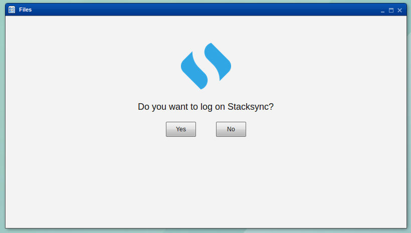

+ If the user selects the option 'No', it will be shown the files structure without access to StackSync.  

    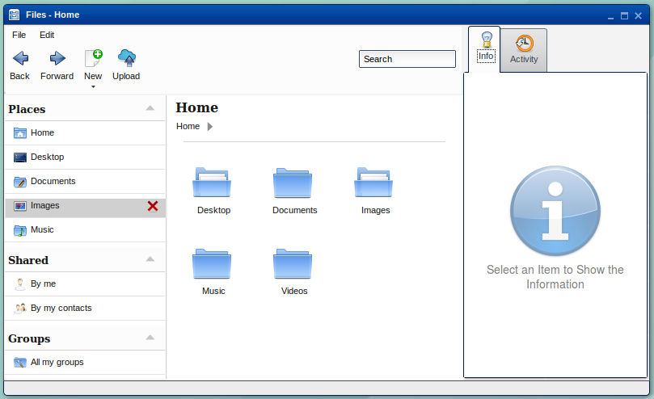

+ Otherwise, when 'Yes' it selected the connection to StackSync is started to get the access token.  

    

+ A new window in the browser is opened, where the user is asked to login in StackSync.

    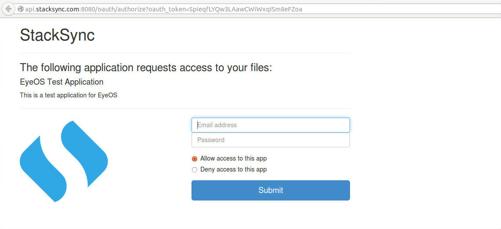

+ Once the user is logged correctly it is shown the redirect screen to eyeOS platform  

    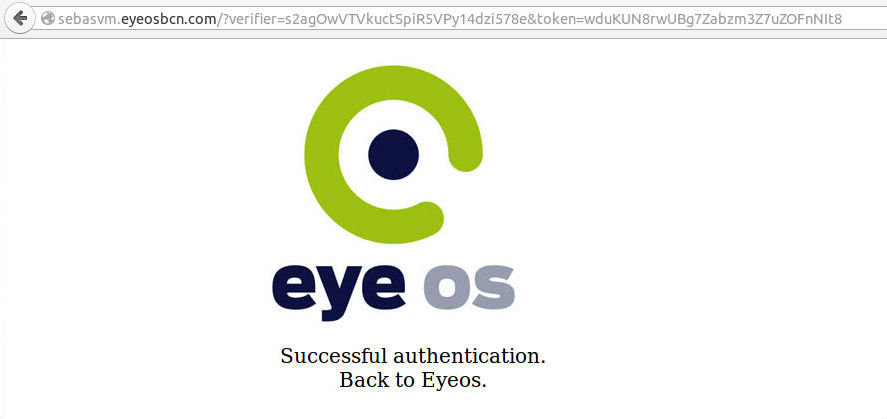

+ The access token is saved attaching it to the current user. From now the user has access to StackSync's files structure.  

    

During the previous process some exceptions could be thrown, which are listed bellow:  

+ Communication error.

    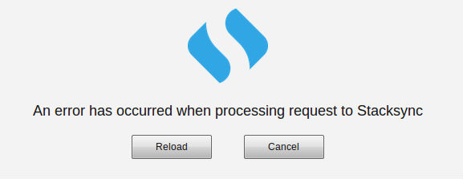

+ Timeout to login the StackSync exhausted. This timeout is configurated to 1 minute.  

    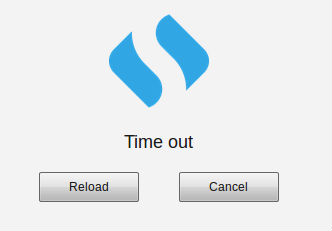

The access token is permanently stored in eyeOS and has no expiration. If the user wants to delete the link, must do it from his StackSync intranet, after that, once it is done the first call to StackSync API a 403 error will be received, that indicates access denied.  
  

## Collaborative tool between eyeOS and StackSync

EyeOS allows from the application “File Manager” the next actions: list, insert and delete comments of a specific element, file or directory are located in the personal cloudspace of the user.

EyeOS storages the comments into U1DB synchronized database. The database management is performed by means of a Python script called Commnents.py. This script handles the synchronization with the U1DB server and is located in '/var/www/eyeos/eyeos/extern/u1db/', to configure it the “settings.py” file must be modified in the following values:

    <table border="0" cellpadding="0" cellspacing="0" style="border-collapse:collapse;">
        <tr>
            <td width="15%">Server</td>
            <td width="45%" style="padding-left:15px">IP address where the Oauth server is active</td>
        </tr>
        <tr>
            <td>Port</td>
            <td style="padding-left:15px">Port where the Oauth server is active</td>
        </tr>
        <tr>
            <td colspan="2">urls</td>
        </tr>
        <tr>
            <td valign="middle">CALLBACK_URL</td>
            <td style="padding-left:15px">Replace IP and port with the values stablished in the previous parameters (server and port)</td>
        </tr>
        <tr>
            <td colspan="2">consumer</td>
        </tr>
        <tr>
            <td valign="middle">key</td>
            <td style="padding-left:15px">Included when mongodb was configured in the Oauth server installation</td>
        </tr>
        <tr>
            <td valign="middle">secret</td>
            <td style="padding-left:15px">Included when mongodb was configured in the Oauth server installation</td>
        </tr>
    </table>

Next is detailed the APIs contained in the script Comments.py:

**getComments(**_id_**)**

Get all the comments of a specific element of StackSync.

    <table border="0" cellpadding="0" cellspacing="0" style="border-collapse:collapse;">
        <tr>
            <td style="background-color:#C0C0C0">Parameters:</td>
            <td style="padding-left:30px"><b>id</b> – Element identifier number in Stacksync</td>
        </tr>
        <tr>
            <td style="background-color:#C0C0C0">Return:</td>
            <td style="padding-left:30px">Array in JSON format or in case of error returns an error structure: 
                - error: Error number 
                Example: 
                [{“id”:”1245789”,”user”:”eyeos”,”time_created”:”20140702124055”,”status”:”NEW”,”text”: ”Comment 1”}] 
                [{“error”:-1,”description”:”Error getComments”}]
            </td>
        </tr>
    </table>

**createComments(**_id,user,text,time_created_**)**

Create a new comment  associated with an specific element of StackSync.

    <table border="0" cellpadding="0" cellspacing="0" style="border-collapse:collapse;">
        <tr>
            <td style="background-color:#C0C0C0">Parameters:</td>
            <td style="padding-left:30px">
                <b>id</b> – Element identifier number in Stacksync 
                <b>user</b> – Username that inserts the comment 
                <b>text</b> – Text of comment 
                <b>time_created</b> – Date and hour when is created  the comment. Format  YYYYmmddHHMMSS.(Optional)                
            </td>
        </tr>
        <tr>
            <td style="background-color:#C0C0C0">Return:</td>
            <td style="padding-left:30px">Metadata in JSON format or in case of error returns an error structure: 
                - error: Error number 
                Example: 
                {“id”:”1245789”,”user”:”eyeos”,”time_created”:”20140702124055”,”status”:”NEW”,”text”: ”Comment 1”} 
                {“error”:-1,”description”:”Error create comment”}
            </td>
        </tr>
    </table>

**deleteComments(**_id,user,time_created_**)**

Delete a comment associated a un specific element of StackSync.

    <table border="0" cellpadding="0" cellspacing="0" style="border-collapse:collapse;">
        <tr>
            <td style="background-color:#C0C0C0">Parameters:</td>
            <td style="padding-left:30px">
                <b>id</b> – Element identifier number in Stacksync 
                <b>user</b> – Username that inserts the comment 
                <b>time_created</b> – Date and hour when is created  the comment. Format  YYYYmmddHHMMSS.
            </td>
        </tr>
        <tr>
            <td style="background-color:#C0C0C0">Return:</td>
            <td style="padding-left:30px">Result structure: 
                - status:  'OK' correct case or 'KO' error case 
                - error: Error number. Only exists in case of error 
                Example: 
                {“status”: “OK”} 
                { 
                &nbsp;&nbsp;&nbsp;&nbsp;&nbsp;&nbsp;&nbsp;“status”: “KO”, 
                &nbsp;&nbsp;&nbsp;&nbsp;&nbsp;&nbsp;&nbsp;“error”: -1 
                }
            </td>
        </tr>
    </table>

To use the Python APIs into eyeOS it has been generated the framework Store, containing some APIs with an uniform structure:

    <table border="0" cellpadding="0" cellspacing="0" style="border-collapse:collapse;">
        <tr>
            <td style="background-color:#C0C0C0">Parameters:</td>
            <td>
                <ul>
                    <li><b>type</b> – Python API name</li>
                    <li><b>metadata</b> – Python API parameters</li>
                    <li><b>credentials</b> – Credentials for the identification into synchronization process</li>
                </ul>
            </td>
        </tr>
    </table>

Next these APIs are listed:

**getComments(**_id_**)**

Ask for all the comments of a specific element of StackSync.

    <table border="0" cellpadding="0" cellspacing="0" style="border-collapse:collapse;">
        <tr>
            <td style="background-color:#C0C0C0">Parameters:</td>
            <td style="padding-left:30px">
                <b>id</b> – Element identifier number in Stacksync
            </td>
        </tr>
        <tr>
            <td style="background-color:#C0C0C0">Script call:</td>
            <td width="60%" style="padding-left:30px">
                Example: 
                { 
                &nbsp;&nbsp;&nbsp;&nbsp;"type":"get" , 
                &nbsp;&nbsp;&nbsp;&nbsp;"metadata":[{ 
                &nbsp;&nbsp;&nbsp;&nbsp;&nbsp;&nbsp;&nbsp;&nbsp;&nbsp;&nbsp;&nbsp;&nbsp;&nbsp;&nbsp;&nbsp;&nbsp;&nbsp;&nbsp;&nbsp;"id":"124578", 
                &nbsp;&nbsp;&nbsp;&nbsp;&nbsp;&nbsp;&nbsp;&nbsp;&nbsp;&nbsp;&nbsp;&nbsp;&nbsp;&nbsp;&nbsp;}] 
                &nbsp;&nbsp;&nbsp;&nbsp;"credentials":{ 
                &nbsp;&nbsp;&nbsp;&nbsp;&nbsp;&nbsp;&nbsp;&nbsp;&nbsp;&nbsp;&nbsp;&nbsp;&nbsp;&nbsp;&nbsp;&nbsp;&nbsp;&nbsp;&nbsp;”oauth”:{ 
                &nbsp;&nbsp;&nbsp;&nbsp;&nbsp;&nbsp;&nbsp;&nbsp;&nbsp;&nbsp;&nbsp;&nbsp;&nbsp;&nbsp;&nbsp;&nbsp;&nbsp;&nbsp;&nbsp;&nbsp;&nbsp;&nbsp;&nbsp;&nbsp;&nbsp;&nbsp;&nbsp;&nbsp;&nbsp;&nbsp;&nbsp;&nbsp;&nbsp;&nbsp;&nbsp;&nbsp;“consumer_key”:”eyeos”, 
                &nbsp;&nbsp;&nbsp;&nbsp;&nbsp;&nbsp;&nbsp;&nbsp;&nbsp;&nbsp;&nbsp;&nbsp;&nbsp;&nbsp;&nbsp;&nbsp;&nbsp;&nbsp;&nbsp;&nbsp;&nbsp;&nbsp;&nbsp;&nbsp;&nbsp;&nbsp;&nbsp;&nbsp;&nbsp;&nbsp;&nbsp;&nbsp;&nbsp;&nbsp;&nbsp;&nbsp;“consumer_secret”:”eyeosABC”, 
                &nbsp;&nbsp;&nbsp;&nbsp;&nbsp;&nbsp;&nbsp;&nbsp;&nbsp;&nbsp;&nbsp;&nbsp;&nbsp;&nbsp;&nbsp;&nbsp;&nbsp;&nbsp;&nbsp;&nbsp;&nbsp;&nbsp;&nbsp;&nbsp;&nbsp;&nbsp;&nbsp;&nbsp;&nbsp;&nbsp;&nbsp;&nbsp;&nbsp;&nbsp;&nbsp;&nbsp;“token_key”:”eyeostoken”, 
                &nbsp;&nbsp;&nbsp;&nbsp;&nbsp;&nbsp;&nbsp;&nbsp;&nbsp;&nbsp;&nbsp;&nbsp;&nbsp;&nbsp;&nbsp;&nbsp;&nbsp;&nbsp;&nbsp;&nbsp;&nbsp;&nbsp;&nbsp;&nbsp;&nbsp;&nbsp;&nbsp;&nbsp;&nbsp;&nbsp;&nbsp;&nbsp;&nbsp;&nbsp;&nbsp;&nbsp;“token_secret”:”eyeosDEF” 
                &nbsp;&nbsp;&nbsp;&nbsp;&nbsp;&nbsp;&nbsp;&nbsp;&nbsp;&nbsp;&nbsp;&nbsp;&nbsp;&nbsp;&nbsp;&nbsp;&nbsp;&nbsp;&nbsp;&nbsp;&nbsp;&nbsp;&nbsp;&nbsp;&nbsp;&nbsp;&nbsp;&nbsp;&nbsp;&nbsp;&nbsp;&nbsp;&nbsp;} 
                &nbsp;&nbsp;&nbsp;&nbsp;&nbsp;&nbsp;&nbsp;&nbsp;&nbsp;&nbsp;&nbsp;&nbsp;&nbsp;&nbsp;&nbsp;&nbsp;&nbsp;&nbsp;&nbsp;&nbsp;&nbsp;&nbsp;&nbsp;&nbsp;&nbsp;&nbsp;&nbsp;} 
                } 
            </td>
        </tr>
        <tr>
            <td style="background-color:#C0C0C0">Return:</td>
            <td style="padding-left:30px">
                Array in JSON format or in case of error returns an error structure: 
                - error: Error number 
                Example: 
                [{“id”:”124578”,”user”:”eyeos”,”time_created”:”20140702124055”,”status”:”NEW”,”text”: ”Comment 1”}] 
                [{“error”:-1,”description”:”Error getComments”}]
            </td>
        </tr>
    </table>

**createComments(**_id,user,text_**)**

Create a new comment  associated with an specific element of StackSync.

    <table border="0" cellpadding="0" cellspacing="0" style="border-collapse:collapse;">
        <tr>
            <td style="background-color:#C0C0C0">Parameters:</td>
            <td style="padding-left:30px">
                <b>id</b> – Element identifier number in Stacksync 
                <b>user</b> – Username that inserts the comment 
                <b>text</b> – Text of comment
            </td>
        </tr>
        <tr>
            <td style="background-color:#C0C0C0">Script call:</td>
            <td width="60%" style="padding-left:30px">
                Example: 
                { 
                &nbsp;&nbsp;&nbsp;&nbsp;"type":"create" , 
                &nbsp;&nbsp;&nbsp;&nbsp;"metadata":[{ 
                &nbsp;&nbsp;&nbsp;&nbsp;&nbsp;&nbsp;&nbsp;&nbsp;&nbsp;&nbsp;&nbsp;&nbsp;&nbsp;&nbsp;&nbsp;&nbsp;&nbsp;&nbsp;&nbsp;"id":"124578", 
                &nbsp;&nbsp;&nbsp;&nbsp;&nbsp;&nbsp;&nbsp;&nbsp;&nbsp;&nbsp;&nbsp;&nbsp;&nbsp;&nbsp;&nbsp;&nbsp;&nbsp;&nbsp;&nbsp;"user":"eyeos", 
                &nbsp;&nbsp;&nbsp;&nbsp;&nbsp;&nbsp;&nbsp;&nbsp;&nbsp;&nbsp;&nbsp;&nbsp;&nbsp;&nbsp;&nbsp;&nbsp;&nbsp;&nbsp;&nbsp;"text":"Comment 1",                 
                &nbsp;&nbsp;&nbsp;&nbsp;&nbsp;&nbsp;&nbsp;&nbsp;&nbsp;&nbsp;&nbsp;&nbsp;&nbsp;&nbsp;&nbsp;}] 
                &nbsp;&nbsp;&nbsp;&nbsp;"credentials":{ 
                &nbsp;&nbsp;&nbsp;&nbsp;&nbsp;&nbsp;&nbsp;&nbsp;&nbsp;&nbsp;&nbsp;&nbsp;&nbsp;&nbsp;&nbsp;&nbsp;&nbsp;&nbsp;&nbsp;”oauth”:{ 
                &nbsp;&nbsp;&nbsp;&nbsp;&nbsp;&nbsp;&nbsp;&nbsp;&nbsp;&nbsp;&nbsp;&nbsp;&nbsp;&nbsp;&nbsp;&nbsp;&nbsp;&nbsp;&nbsp;&nbsp;&nbsp;&nbsp;&nbsp;&nbsp;&nbsp;&nbsp;&nbsp;&nbsp;&nbsp;&nbsp;&nbsp;&nbsp;&nbsp;&nbsp;&nbsp;&nbsp;“consumer_key”:”eyeos”, 
                &nbsp;&nbsp;&nbsp;&nbsp;&nbsp;&nbsp;&nbsp;&nbsp;&nbsp;&nbsp;&nbsp;&nbsp;&nbsp;&nbsp;&nbsp;&nbsp;&nbsp;&nbsp;&nbsp;&nbsp;&nbsp;&nbsp;&nbsp;&nbsp;&nbsp;&nbsp;&nbsp;&nbsp;&nbsp;&nbsp;&nbsp;&nbsp;&nbsp;&nbsp;&nbsp;&nbsp;“consumer_secret”:”eyeosABC”, 
                &nbsp;&nbsp;&nbsp;&nbsp;&nbsp;&nbsp;&nbsp;&nbsp;&nbsp;&nbsp;&nbsp;&nbsp;&nbsp;&nbsp;&nbsp;&nbsp;&nbsp;&nbsp;&nbsp;&nbsp;&nbsp;&nbsp;&nbsp;&nbsp;&nbsp;&nbsp;&nbsp;&nbsp;&nbsp;&nbsp;&nbsp;&nbsp;&nbsp;&nbsp;&nbsp;&nbsp;“token_key”:”eyeostoken”, 
                &nbsp;&nbsp;&nbsp;&nbsp;&nbsp;&nbsp;&nbsp;&nbsp;&nbsp;&nbsp;&nbsp;&nbsp;&nbsp;&nbsp;&nbsp;&nbsp;&nbsp;&nbsp;&nbsp;&nbsp;&nbsp;&nbsp;&nbsp;&nbsp;&nbsp;&nbsp;&nbsp;&nbsp;&nbsp;&nbsp;&nbsp;&nbsp;&nbsp;&nbsp;&nbsp;&nbsp;“token_secret”:”eyeosDEF” 
                &nbsp;&nbsp;&nbsp;&nbsp;&nbsp;&nbsp;&nbsp;&nbsp;&nbsp;&nbsp;&nbsp;&nbsp;&nbsp;&nbsp;&nbsp;&nbsp;&nbsp;&nbsp;&nbsp;&nbsp;&nbsp;&nbsp;&nbsp;&nbsp;&nbsp;&nbsp;&nbsp;&nbsp;&nbsp;&nbsp;&nbsp;&nbsp;&nbsp;} 
                &nbsp;&nbsp;&nbsp;&nbsp;&nbsp;&nbsp;&nbsp;&nbsp;&nbsp;&nbsp;&nbsp;&nbsp;&nbsp;&nbsp;&nbsp;&nbsp;&nbsp;&nbsp;&nbsp;&nbsp;&nbsp;&nbsp;&nbsp;&nbsp;&nbsp;&nbsp;&nbsp;} 
                } 
            </td>
        </tr>
        <tr>
            <td style="background-color:#C0C0C0">Return:</td>
            <td style="padding-left:30px">
                Metadata in JSON format or in case of error returns an error structure: 
                - error: Error number 
                Example: 
                {“id”:”124578”,”user”:”eyeos”,”time_created”:”20140702124055”,”status”:”NEW”,”text”: ”Comment 1”} 
                {“error”:-1,”description”:”Error create comment”}
            </td>
        </tr>
    </table>

**deleteComments(**_id,user,time_created_**)**

Delete a comment associated a un specific element of StackSync.

    <table border="0" cellpadding="0" cellspacing="0" style="border-collapse:collapse;">
        <tr>
            <td style="background-color:#C0C0C0">Parameters:</td>
            <td style="padding-left:30px">
                <b>id</b> – Element identifier number in Stacksync 
                <b>user</b> – Username that inserts the comment 
                <b>time_created</b> – Date and hour when is created  the comment. Format  YYYYmmddHHMMSS
            </td>
        </tr>
        <tr>
            <td style="background-color:#C0C0C0">Script call:</td>
            <td width="60%" style="padding-left:30px">
                Example: 
                { 
                &nbsp;&nbsp;&nbsp;&nbsp;"type":"delete" , 
                &nbsp;&nbsp;&nbsp;&nbsp;"metadata":[{ 
                &nbsp;&nbsp;&nbsp;&nbsp;&nbsp;&nbsp;&nbsp;&nbsp;&nbsp;&nbsp;&nbsp;&nbsp;&nbsp;&nbsp;&nbsp;&nbsp;&nbsp;&nbsp;&nbsp;"id":"124578", 
                &nbsp;&nbsp;&nbsp;&nbsp;&nbsp;&nbsp;&nbsp;&nbsp;&nbsp;&nbsp;&nbsp;&nbsp;&nbsp;&nbsp;&nbsp;&nbsp;&nbsp;&nbsp;&nbsp;"user":"eyeos", 
                &nbsp;&nbsp;&nbsp;&nbsp;&nbsp;&nbsp;&nbsp;&nbsp;&nbsp;&nbsp;&nbsp;&nbsp;&nbsp;&nbsp;&nbsp;&nbsp;&nbsp;&nbsp;&nbsp;"time_created":"20140702124944",                 
                &nbsp;&nbsp;&nbsp;&nbsp;&nbsp;&nbsp;&nbsp;&nbsp;&nbsp;&nbsp;&nbsp;&nbsp;&nbsp;&nbsp;&nbsp;}] 
                &nbsp;&nbsp;&nbsp;&nbsp;"credentials":{ 
                &nbsp;&nbsp;&nbsp;&nbsp;&nbsp;&nbsp;&nbsp;&nbsp;&nbsp;&nbsp;&nbsp;&nbsp;&nbsp;&nbsp;&nbsp;&nbsp;&nbsp;&nbsp;&nbsp;”oauth”:{ 
                &nbsp;&nbsp;&nbsp;&nbsp;&nbsp;&nbsp;&nbsp;&nbsp;&nbsp;&nbsp;&nbsp;&nbsp;&nbsp;&nbsp;&nbsp;&nbsp;&nbsp;&nbsp;&nbsp;&nbsp;&nbsp;&nbsp;&nbsp;&nbsp;&nbsp;&nbsp;&nbsp;&nbsp;&nbsp;&nbsp;&nbsp;&nbsp;&nbsp;&nbsp;&nbsp;&nbsp;“consumer_key”:”eyeos”, 
                &nbsp;&nbsp;&nbsp;&nbsp;&nbsp;&nbsp;&nbsp;&nbsp;&nbsp;&nbsp;&nbsp;&nbsp;&nbsp;&nbsp;&nbsp;&nbsp;&nbsp;&nbsp;&nbsp;&nbsp;&nbsp;&nbsp;&nbsp;&nbsp;&nbsp;&nbsp;&nbsp;&nbsp;&nbsp;&nbsp;&nbsp;&nbsp;&nbsp;&nbsp;&nbsp;&nbsp;“consumer_secret”:”eyeosABC”, 
                &nbsp;&nbsp;&nbsp;&nbsp;&nbsp;&nbsp;&nbsp;&nbsp;&nbsp;&nbsp;&nbsp;&nbsp;&nbsp;&nbsp;&nbsp;&nbsp;&nbsp;&nbsp;&nbsp;&nbsp;&nbsp;&nbsp;&nbsp;&nbsp;&nbsp;&nbsp;&nbsp;&nbsp;&nbsp;&nbsp;&nbsp;&nbsp;&nbsp;&nbsp;&nbsp;&nbsp;“token_key”:”eyeostoken”, 
                &nbsp;&nbsp;&nbsp;&nbsp;&nbsp;&nbsp;&nbsp;&nbsp;&nbsp;&nbsp;&nbsp;&nbsp;&nbsp;&nbsp;&nbsp;&nbsp;&nbsp;&nbsp;&nbsp;&nbsp;&nbsp;&nbsp;&nbsp;&nbsp;&nbsp;&nbsp;&nbsp;&nbsp;&nbsp;&nbsp;&nbsp;&nbsp;&nbsp;&nbsp;&nbsp;&nbsp;“token_secret”:”eyeosDEF” 
                &nbsp;&nbsp;&nbsp;&nbsp;&nbsp;&nbsp;&nbsp;&nbsp;&nbsp;&nbsp;&nbsp;&nbsp;&nbsp;&nbsp;&nbsp;&nbsp;&nbsp;&nbsp;&nbsp;&nbsp;&nbsp;&nbsp;&nbsp;&nbsp;&nbsp;&nbsp;&nbsp;&nbsp;&nbsp;&nbsp;&nbsp;&nbsp;&nbsp;} 
                &nbsp;&nbsp;&nbsp;&nbsp;&nbsp;&nbsp;&nbsp;&nbsp;&nbsp;&nbsp;&nbsp;&nbsp;&nbsp;&nbsp;&nbsp;&nbsp;&nbsp;&nbsp;&nbsp;&nbsp;&nbsp;&nbsp;&nbsp;&nbsp;&nbsp;&nbsp;&nbsp;} 
                } 
            </td>
        </tr>
        <tr>
            <td style="background-color:#C0C0C0">Return:</td>
            <td style="padding-left:30px">
                Result structure: 
                - status:  'OK' correct case or 'KO' error case 
                - error: Error number. Only exists in case of error 
                Example: 
                {“status”: “OK”} 
                { 
                 &nbsp;&nbsp;&nbsp;&nbsp;&nbsp;&nbsp;&nbsp;“status”: “KO”, 
                 &nbsp;&nbsp;&nbsp;&nbsp;&nbsp;&nbsp;&nbsp;“error”: -1 
                }
            </td>
        </tr>
    </table>

  
  
## Implementation of Share API into eyeOS

To share folders and their contents among users of the same or different Personal Clouds, the Share tool is implemented in the file manager.  

The user can access the tool by selecting a Personal Cloud directory and then clicking the “Activity” tab in the right toolbar (social bar).  

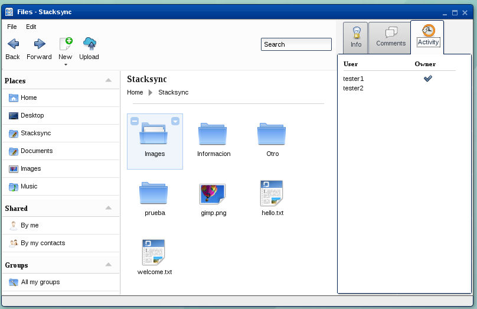

This tab lists all users that can access and manage the active directory. Furthermore it indicates who is the owner of the directory.  

Where the directory is not shared, only the directory owner is displayed.   

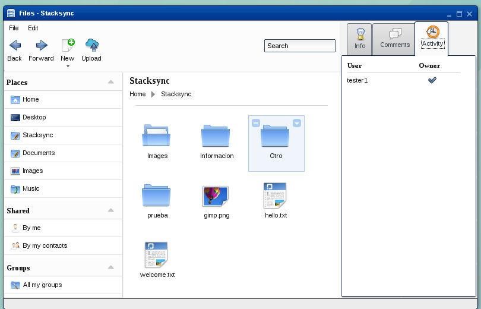

If the user wants to share or add more users to the sharing list, they must right click on the directory to open a contextual menu and then select the “Share” option. When they select this option, a form appears in which they need to enter the email addresses of the people with whom they want to share the directory. Once the form has been completed, the data is sent to StackSync. If the operation is done successfully, the form closes. When the user accesses the “Activity” tab of the directory again, they will see the new users added to the list.  

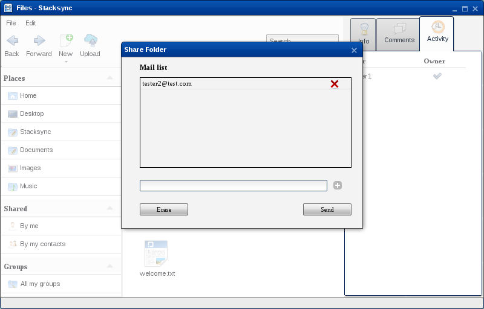  

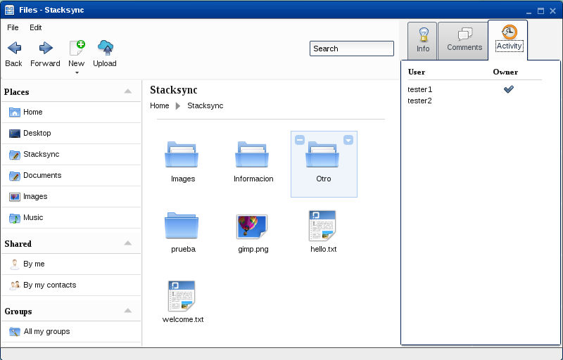

The list of users sharing the directory is not refreshed, as there is no background process that enables new users to be displayed automatically.  

Directory sharing is implemented in eyeOS according to the diagram below:

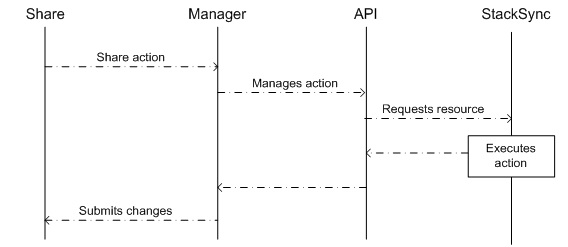

The user performs an action in the file manager, such as lists the users who have access to the directory. The Manager using the getListUsersShare function retrieves the user’s access token and the id of the directory in StackSync. These values are sent to the API, which is responsible for requesting the resource from StackSync using the getListUsersShare function. It receives the list of users and then it notifies the Manager, which will update the eyeOS interface.  

The getListUsersShare of the Share Manager and the Share API, as well as the other actions performed by the Share tool. Now are described in more detail, respectively:

- **_Share Manager_**

**getListUsersShare(**_token,id_**)**

Gets all users with access to a StackSync directory.

    <table border="0" cellpadding="0" cellspacing="0" style="border-collapse:collapse;">
        <tr>
            <td style="background-color:#C0C0C0">Parameters:</td>
            <td style="padding-left:30px">
                <b>token</b> – Includes key and secret of the access token 
                <b>id</b> – Id of the StackSync element
            </td>
        </tr>
        <tr>
            <td style="background-color:#C0C0C0">Script call:</td>
            <td style="padding-left:30px">
                Example: 
                { 
                &nbsp;&nbsp;&nbsp;&nbsp;"token":{ 
                &nbsp;&nbsp;&nbsp;&nbsp;&nbsp;&nbsp;&nbsp;&nbsp;&nbsp;&nbsp;&nbsp;&nbsp;&nbsp;&nbsp;&nbsp;&nbsp;&nbsp;&nbsp;&nbsp;&nbsp;&nbsp;"key":"token1234", 
                &nbsp;&nbsp;&nbsp;&nbsp;&nbsp;&nbsp;&nbsp;&nbsp;&nbsp;&nbsp;&nbsp;&nbsp;&nbsp;&nbsp;&nbsp;&nbsp;&nbsp;&nbsp;&nbsp;&nbsp;&nbsp;"secret":"secret1234", 
                &nbsp;&nbsp;&nbsp;&nbsp;&nbsp;&nbsp;&nbsp;&nbsp;&nbsp;&nbsp;&nbsp;&nbsp;&nbsp;&nbsp;&nbsp;&nbsp;&nbsp;&nbsp;} 
                &nbsp;&nbsp;&nbsp;&nbsp;"metadata":{ 
                &nbsp;&nbsp;&nbsp;&nbsp;&nbsp;&nbsp;&nbsp;&nbsp;&nbsp;&nbsp;&nbsp;&nbsp;&nbsp;&nbsp;&nbsp;&nbsp;&nbsp;&nbsp;&nbsp;&nbsp;&nbsp;&nbsp;&nbsp;&nbsp;&nbsp;&nbsp;&nbsp;&nbsp;"type":"listUsersShare", 
                &nbsp;&nbsp;&nbsp;&nbsp;&nbsp;&nbsp;&nbsp;&nbsp;&nbsp;&nbsp;&nbsp;&nbsp;&nbsp;&nbsp;&nbsp;&nbsp;&nbsp;&nbsp;&nbsp;&nbsp;&nbsp;&nbsp;&nbsp;&nbsp;&nbsp;&nbsp;&nbsp;&nbsp;"id":32565632156, 
                &nbsp;&nbsp;&nbsp;&nbsp;&nbsp;&nbsp;&nbsp;&nbsp;&nbsp;&nbsp;&nbsp;&nbsp;&nbsp;&nbsp;&nbsp;&nbsp;&nbsp;&nbsp;&nbsp;&nbsp;&nbsp;&nbsp;&nbsp;&nbsp;} 
                } 
            </td>
        </tr>
        <tr>
            <td style="background-color:#C0C0C0">Return:</td>
            <td style="padding-left:30px">
                List of users or, in the event of error, returns an error structure: 
                - error: Error number 
                - description: Error description 
                Example: 
                [ 
		&nbsp;&nbsp;&nbsp;{“name”:”tester1”, 
		&nbsp;&nbsp;&nbsp;”email”:”tester1@test.com”, 
		&nbsp;&nbsp;&nbsp;”modified_at”:”2014-04-11 10:02:33.432”, 
		&nbsp;&nbsp;&nbsp;”is_owner”:true}, 
		&nbsp;&nbsp;&nbsp;{“name”:”tester2”, 
		&nbsp;&nbsp;&nbsp;”email”:”tester2@test.com”, 
		&nbsp;&nbsp;&nbsp;”modified_at”:”2014-05-30 19:39:21.044”, 
		&nbsp;&nbsp;&nbsp;”is_owner”:false}, 
		&nbsp;&nbsp;&nbsp;{“name”:”tester3”, 
		&nbsp;&nbsp;&nbsp;”email”:”tester3@test.com”, 
		&nbsp;&nbsp;&nbsp;”modified_at”:”2014-06-06 15:42:41.852”, 
		&nbsp;&nbsp;&nbsp;”is_owner”:false}, 
		] 
                {“error”:401,”description”:”Error list members”}
            </td>
        </tr>
    </table>

  
  
  
**shareFolder(**_token,id,list_**)**

Shares a directory with another user.

    <table border="0" cellpadding="0" cellspacing="0" style="border-collapse:collapse;">
        <tr>
            <td style="background-color:#C0C0C0">Parameters:</td>
            <td style="padding-left:30px">
                <b>token</b> – Includes key and secret of the access token 
                <b>id</b> – Id of the StackSync element 
                <b>list</b> – Users’ email addresses
            </td>
        </tr>
        <tr>
            <td style="background-color:#C0C0C0">Script call:</td>
            <td style="padding-left:30px">
                Example: 
                { 
                &nbsp;&nbsp;&nbsp;&nbsp;"token":{ 
                &nbsp;&nbsp;&nbsp;&nbsp;&nbsp;&nbsp;&nbsp;&nbsp;&nbsp;&nbsp;&nbsp;&nbsp;&nbsp;&nbsp;&nbsp;&nbsp;&nbsp;&nbsp;&nbsp;&nbsp;&nbsp;"key":"token1234", 
                &nbsp;&nbsp;&nbsp;&nbsp;&nbsp;&nbsp;&nbsp;&nbsp;&nbsp;&nbsp;&nbsp;&nbsp;&nbsp;&nbsp;&nbsp;&nbsp;&nbsp;&nbsp;&nbsp;&nbsp;&nbsp;"secret":"secret1234", 
                &nbsp;&nbsp;&nbsp;&nbsp;&nbsp;&nbsp;&nbsp;&nbsp;&nbsp;&nbsp;&nbsp;&nbsp;&nbsp;&nbsp;&nbsp;&nbsp;&nbsp;&nbsp;} 
                &nbsp;&nbsp;&nbsp;&nbsp;"metadata":{ 
                &nbsp;&nbsp;&nbsp;&nbsp;&nbsp;&nbsp;&nbsp;&nbsp;&nbsp;&nbsp;&nbsp;&nbsp;&nbsp;&nbsp;&nbsp;&nbsp;&nbsp;&nbsp;&nbsp;&nbsp;&nbsp;&nbsp;&nbsp;&nbsp;&nbsp;&nbsp;&nbsp;&nbsp;"type":"shareFolder", 
                &nbsp;&nbsp;&nbsp;&nbsp;&nbsp;&nbsp;&nbsp;&nbsp;&nbsp;&nbsp;&nbsp;&nbsp;&nbsp;&nbsp;&nbsp;&nbsp;&nbsp;&nbsp;&nbsp;&nbsp;&nbsp;&nbsp;&nbsp;&nbsp;&nbsp;&nbsp;&nbsp;&nbsp;"id":32565632156, 
                &nbsp;&nbsp;&nbsp;&nbsp;&nbsp;&nbsp;&nbsp;&nbsp;&nbsp;&nbsp;&nbsp;&nbsp;&nbsp;&nbsp;&nbsp;&nbsp;&nbsp;&nbsp;&nbsp;&nbsp;&nbsp;&nbsp;&nbsp;&nbsp;&nbsp;&nbsp;&nbsp;&nbsp;"list":[ 
                &nbsp;&nbsp;&nbsp;&nbsp;&nbsp;&nbsp;&nbsp;&nbsp;&nbsp;&nbsp;&nbsp;&nbsp;&nbsp;&nbsp;&nbsp;&nbsp;&nbsp;&nbsp;&nbsp;&nbsp;&nbsp;&nbsp;&nbsp;&nbsp;&nbsp;&nbsp;&nbsp;&nbsp;&nbsp;&nbsp;&nbsp;&nbsp;&nbsp;&nbsp;&nbsp;&nbsp;&nbsp;&nbsp;&nbsp;&nbsp;"tester1@test.com", 
                &nbsp;&nbsp;&nbsp;&nbsp;&nbsp;&nbsp;&nbsp;&nbsp;&nbsp;&nbsp;&nbsp;&nbsp;&nbsp;&nbsp;&nbsp;&nbsp;&nbsp;&nbsp;&nbsp;&nbsp;&nbsp;&nbsp;&nbsp;&nbsp;&nbsp;&nbsp;&nbsp;&nbsp;&nbsp;&nbsp;&nbsp;&nbsp;&nbsp;&nbsp;&nbsp;&nbsp;&nbsp;&nbsp;&nbsp;&nbsp;"tester2@test.com", 
                &nbsp;&nbsp;&nbsp;&nbsp;&nbsp;&nbsp;&nbsp;&nbsp;&nbsp;&nbsp;&nbsp;&nbsp;&nbsp;&nbsp;&nbsp;&nbsp;&nbsp;&nbsp;&nbsp;&nbsp;&nbsp;&nbsp;&nbsp;&nbsp;&nbsp;&nbsp;&nbsp;&nbsp;&nbsp;&nbsp;&nbsp;&nbsp;&nbsp;&nbsp;&nbsp;&nbsp;&nbsp;&nbsp;&nbsp;&nbsp;"tester3@test.com" 
                &nbsp;&nbsp;&nbsp;&nbsp;&nbsp;&nbsp;&nbsp;&nbsp;&nbsp;&nbsp;&nbsp;&nbsp;&nbsp;&nbsp;&nbsp;&nbsp;&nbsp;&nbsp;&nbsp;&nbsp;&nbsp;&nbsp;&nbsp;&nbsp;&nbsp;&nbsp;&nbsp;&nbsp;&nbsp;&nbsp;&nbsp;&nbsp;&nbsp;&nbsp;&nbsp;&nbsp;&nbsp;] 
                &nbsp;&nbsp;&nbsp;&nbsp;&nbsp;&nbsp;&nbsp;&nbsp;&nbsp;&nbsp;&nbsp;&nbsp;&nbsp;&nbsp;&nbsp;&nbsp;&nbsp;&nbsp;&nbsp;&nbsp;&nbsp;&nbsp;&nbsp;&nbsp;} 
                } 
            </td>
        </tr>
        <tr>
            <td style="background-color:#C0C0C0">Return:</td>
            <td style="padding-left:30px">
                Result structure: 
                - status: ‘OK’ if correct or ‘KO’ in the event of error 
                - error: Error number. Only exists in the event of error 
                Example: 
                {“status”:”OK” } 
		{“status”:”KO”, “error”: -1}
            </td>
        </tr>
    </table>

  
  
  
- **_Share API_**

The configuration file of Share API is found at “/var/www/eyeos/eyeos/extern/u1db/” and is called “settings.py”.

**getListUsersShare(**_oauth,id_**)** 

Gets all users with access to a StackSync directory.  

    <table border="0" cellpadding="0" cellspacing="0" style="border-collapse:collapse;">
        <tr>
            <td style="background-color:#C0C0C0">Url:</td>
            <td style="padding-left:30px">
                Use RESOURCE_URL of the configuration file.
            </td>
        </tr>
        <tr>
            <td style="background-color:#C0C0C0">Method:</td>
            <td style="padding-left:30px">
                GET
            </td>
        </tr>
        <tr>
            <td style="background-color:#C0C0C0">Signature:</td>
            <td style="padding-left:30px">
                HMAC-SHA1
            </td>
        </tr>
        <tr>
            <td style="background-color:#C0C0C0">Parameters:</td>
            <td style="padding-left:30px">
		<ul>
		   <li><b>oauth</b> – OauthRequest object. Includes the values of the consumer key and secret of the configuration file. And also the access token</li>
		   <li><b>id</b> – Id of the StackSync element</li>
		</ul>
	    </td>
        </tr>
        <tr>
            <td style="background-color:#C0C0C0">Return:</td>
            <td style="padding-left:30px">
            List of users or, in the event of error, returns an error structure: 
            - error: Error number 
            - description: Error description 
            Example: 
            [ 
	    &nbsp;&nbsp;&nbsp;{“name”:”tester1”, 
	    &nbsp;&nbsp;&nbsp;”email”:”tester1@test.com”, 
	    &nbsp;&nbsp;&nbsp;”modified_at”:”2014-04-11 10:02:33.432”, 
	    &nbsp;&nbsp;&nbsp;”is_owner”:true}, 
	    &nbsp;&nbsp;&nbsp;{“name”:”tester2”, 
	    &nbsp;&nbsp;&nbsp;”email”:”tester2@test.com”, 
	    &nbsp;&nbsp;&nbsp;”modified_at”:”2014-05-30 19:39:21.044”, 
	    &nbsp;&nbsp;&nbsp;”is_owner”:false}, 
	    &nbsp;&nbsp;&nbsp;{“name”:”tester3”, 
	    &nbsp;&nbsp;&nbsp;”email”:”tester3@test.com”, 
	    &nbsp;&nbsp;&nbsp;”modified_at”:”2014-06-06 15:42:41.852”, 
	    &nbsp;&nbsp;&nbsp;”is_owner”:false}, 
	    ] 
            {“error”:401,”description”:”Error list members”}
            </td>
        </tr>
    </table>

  
  
   
**shareFolder(**_oauth,id,list_**)** 

Shares a directory with another user.

    <table border="0" cellpadding="0" cellspacing="0" style="border-collapse:collapse;">
        <tr>
            <td style="background-color:#C0C0C0">Url:</td>
            <td style="padding-left:30px">
                Use RESOURCE_URL of the configuration file.
            </td>
        </tr>
        <tr>
            <td style="background-color:#C0C0C0">Method:</td>
            <td style="padding-left:30px">
                POST
            </td>
        </tr>
        <tr>
            <td style="background-color:#C0C0C0">Signature:</td>
            <td style="padding-left:30px">
                HMAC-SHA1
            </td>
        </tr>
        <tr>
            <td style="background-color:#C0C0C0">Parameters:</td>
            <td style="padding-left:30px">
		<ul>
		   <li><b>oauth</b> – OauthRequest object. Includes the values of the consumer key and secret of the configuration file. And also the access token</li>
		   <li><b>id</b> – Id of the StackSync element</li>
		   <li><b>list</b> – List of users</li>
		</ul>
	    </td>
        </tr>
        <tr>
            <td style="background-color:#C0C0C0">Return:</td>
            <td style="padding-left:30px">
            True or, in the event of error, returns an error structure: 
            - error: Error number 
            - description: Error description 
            Example: 
            {"error":403, "description": "Forbidden ."}
            </td>
        </tr>
    </table>

   
