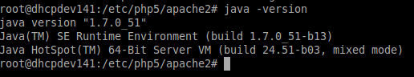
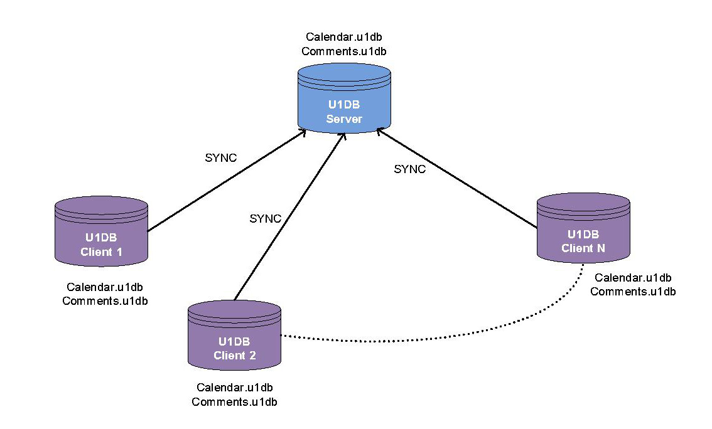
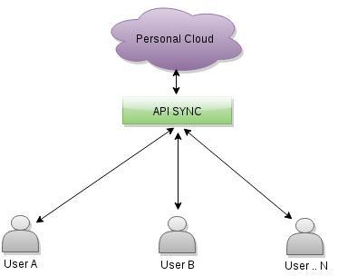
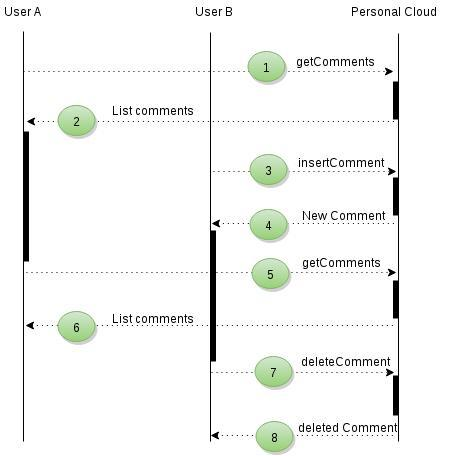
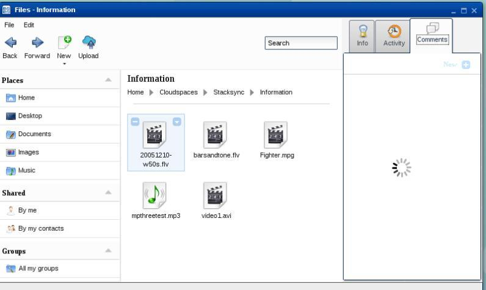
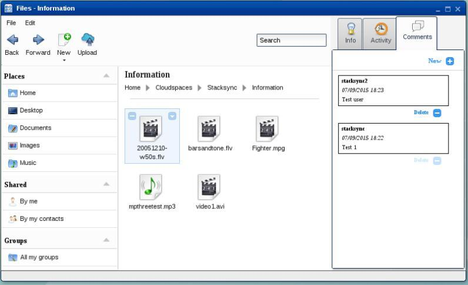
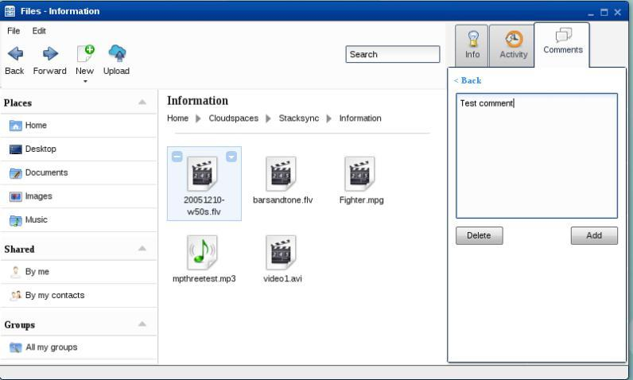
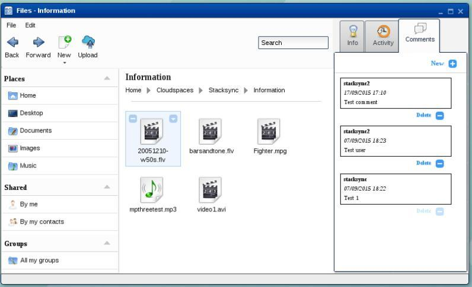

Tutorial eyeOS 2.5 OpenSource & CloudSpaces
=====================================================================================

**Table contents**

- [eyeOS Open Source installation on Ubuntu](#eyeos-open-source-installation-on-ubuntu)
    - [Requeriments](#requeriments)
    - [eyeOS installation](#eyeos-installation)
- [eyeOS Platform](#eyeos-platform)
    - [Introduction](#introduction)
    - [eyeOS integration with Personal Clouds](#eyeos-integration-with-personal-clouds)
      - [Integration](#integration)
      - [Authorization and authentication ](#authorization-and-authentication)
      - [Storage API](#storage-api)
    - [Personal Clouds and eyeOS interoperability](#personal-clouds-and-eyeos-interoperability)
      - [Implementation interoperability ](#implementation-interoperability)
      - [Examples](#examples)
    - [Collaborative editing tool](#collaborative-editing-tool)
    - [Replacement U1DB to API](#replacement-u1db-to-api)
      - [Implementation](#implementation)
      - [Comments](#comments)
      - [Calendar](#calendar)
    - [ANNEXES](#annexes)
      - [ANNEX 1 Configuration file](#annex-1-configuration-file)
      - [ANNEX 2 Oauth Manager](#annex-2-oauth-manager)
      - [ANNEX 3 Oauth API](#annex-3-oauth-api)
      - [ANNEX 4 Storage Manager](#annex-4-storage-manager)
      - [ANNEX 5 Storage API](#annex-5-storage-api)

## eyeOS Open Source installation on Ubuntu

### Requeriments

+   **Apache HTTP Server**

    \# apt-get install apache2  
    \# apache2 -version  

    

    Type in the navegation bar of the browser http://localhost, and you'll see apache2 page (It works!)  

    

+   **Mysql**

    \# apt-get install mysql-server mysql-client  
    \# mysql --version  

    

    Remember the password of database's administrator ('root'), because it'll be requested during the eyeOS 2.5 installation.

+   **Php**

    \# apt-get install php5 php5-mysql libapache2-mod-php5 php5-gd php5-mcrypt php5-sqlite php-db php5-curl php-pear php5-dev  
    \# php5 --version  

    

    Configure the php.ini.  

    \# cd /etc/php5/apache2/  
    \# nano php.ini  

    Change the next parameters:  

    +   error_reporting = E_ALL & ~E_NOTICE  

        

    +   display_errors = Off  

        

    +   max_execution_time = 30  

        

    +   max_input_time = 60  

        

    +   memory_limit = 128M  

        

    +   post_max_size = 200M  

        

    +   upload_max_filesize = 100M  

        

    +   allow_url_fopen = On  

        

    +   disable_functions =  

        

    +   safe_mode = Off  

        

    +   short_open_tag = On  

        

    +   magic_quotes_runtime = Off  

        

    +   file_uploads = On

        

+   **Java**

    \# apt-get install python-software-properties  
    \# add-apt-repository ppa:webupd8team/java  
    \# apt-get update  
    \# apt-get install oracle-java7-installer  
    \# update-alternatives --config java  
    \# java -version  

    

+   **OpenOffice**

    \# apt-get install openoffice.org  

+   **Python**

    \# apt-get install python-support python-simplejson python-uno recoll zip unzip libimage-exiftool-perl  
    \# pip install requests requests_oauthlib  

+   **Curl SSL**

    If you don't have SSL certificate get it by typing:  
    \# wget http://curl.haxx.se/ca/cacert.pem  

    Open the php.ini and introduce the path where the certificate to make requests to secure url is located.  
    \# cd /etc/php5/apache2/  
    \# nano php.ini  
    ....  
    curl.cainfo='/root/cacert.pem'

+   **Uploadprogress**

    \# apt-get install make  
    \# pecl install uploadprogress  

    

    \# nano /etc/php5/apache2/php.ini  (Add the last two lines) .  

    

+   **Sendmail**

    \# apt-get install sendmail  
    \# nano /etc/hosts (Add localhost.localdomain to IP 127.0.0.1)  

    

    \# sendmailconfig (Confirmar todas las preguntas)  

    

+   **Apache**

    Configure mod-rewrite in apache:  

    \# a2enmod rewrite  

    

    \# nano /etc/apache2/sites-available/default  

    Change into <Directory /var/www/\> the parameter AllowOverride to All  

    

    Restart the apache service  

    \# /etc/init.d/apache2 restart  

    

### eyeOS installation

Download the code into /var/www  

\# cd /var/www/  
\# git clone https://github.com/cloudspaces/eyeos-u1db eyeos  

Change the eyeos directory's permissions  

\# chown -R www-data.www-data eyeos  
\# chmod -R 755 eyeos  

Add to DocumentRoot the eyeos directory:  

\# nano /etc/apache2/sites-available/default  

\# service apache2 restart  

Install python-u1db package:  

\# cd eyeos/eyeos/packages/  
\# dpkg -i python-u1db_0.1.4-0ubuntu1_all.deb  

If you have dependency problems during package installation follow the next steps:  

\# apt-get install python-u1db  
\# apt-get -f install  
\# dpkg -i python-u1db_0.1.4-0ubuntu1_all.deb  

Get into mysql and create the schema 'eyeos'. As showed bellow:  

\# mysql -uroot -p&lt;password&gt;  
\> create database eyeos;

Open into the browser the eyeOS configuration screen (http://localhost/install)  

Select 'Install eyeOS 2 on my server'  

The error "SQLite extension not installed" can be ignored.

Once all requirements are listed, go on with the installation selecting 'Continue with the installation'.

Introduce user and password of mysql database's administrator (root), and in addition, the eyeOS platform root user's password.

Once configured the database and eyeOS user, go on with the installation selecting 'Continue with the installation'.

After the installation is finished select 'Go to my new eyeOS' to see the eyeOS 2.5 platform's login screen.

## eyeOS Platform

### Introduction

eyeOS is a web platform that provides a remote virtual desktop for the end user.

The overall user experience is strongly influenced by the classic desktop design, widely
known thanks to the most popular operating system on the market. eyeOS Personal
Web Desktop includes several features such as: file manager, contacts, groups and
other collaborative capabilities. eyeOS Personal Web Desktop is a disruptive
technology that fits in perfectly with the CloudSpaces Open Personal Cloud paradigm.

One of the key values that eyeOS provides is the possibility to work directly with files in
the cloud. eyeOS does not require users to manually download any files onto their
computer nor is it necessary to install anything locally, so the experience is totally
transparent: users just log into a website and start working with their files normally.

Furthermore, eyeOS lets you add additional services and applications within the web
desktop, so that all the company or organization‟s web resources are available within a
single controlled environment that can be accessed using single sign-on.

By combining eyeOS‟ web file management capabilities with Personal Cloud, users can
access their Personal Cloud contents via web, with a user experience very similar to
local desktop environments.

eyeOS allows users to quickly and safely access private data stored in their Personal
Cloud and use them remotely. They are able to access the information from multiple
devices. Desktop PC, laptop, tablet, smartphone, anywhere and any time.

In a constantly changing environment such as today‟s, being able to access data
regardless of the device used, and share said data with other users who only need an
Internet connection and a browser, constitutes an important advantage.

Within the eyeOS platform, one of its key features is file management. It provides an
interface that allows the user to access the files stored in their Personal Cloud directly
from the browser, with an experience similar to the file manager of any desktop
operating system, such as Microsoft WindowsTM or GNU/Linux. For example users can
see any saves documents they have saved online on Stacksync and NEC, create
directories, move files, share documents, etc.

In order for eyeOS to provide these services to the user, it needs to communicate with
the Personal Cloud to obtain all the user information it needs. This communication is
made using the Storage API and it provides all the resources necessary that allows the
user to manage their files efficiently.

User can share their information with other users, regardless of the Personal Cloud that
they use (interoperability). For example, a Stacksync user can share files with another
Stacksync user of with another NEC user. eyeOS provides an interface that helps the
user at all times to decide whether the carpet should continue to be shared and which
users may access it.

A main feature of the eyeOS platform is to establish collaborative environments so that
users can exchange information in real time. It provides the eyeDocs application, a
word processor that allows users to edit files previously shared between them in a
collaborative environment.

eyeOS users also have tools to add comments to files and manage their calendars
within their Personal Cloud. An API Sync has been developed which allows all of these
functions to be developed, replacing the U1DB synchornisation API previously used for
this purpose.

### eyeOS integration with Personal Clouds

#### Integration

The eyeOS platform integrates the services of the Personal Cloud in the file manager,
which allows users to go online and see files they have saved in the Personal Cloud,
create directories, move files, share documents, etc.

This dile manager is developed in JavaScript, HTML, and CSS, allowing users to
directly view their files in the browser. The interface is similar to any file manager in any
operative system. Users can carry out different operations on files in a very intuitive
manner.

Once the user is in Cloudspaces they can access their protected data by selecting a
specific and existing cloud in the clouds configuration of eyeOS (see annex 1) which is
listed in the “Clouds” tab to configure access.

#### Authorization and authentication

The eyeOS platform integrates the OAuth authorization to interact with the user‟s
protected data stored in the Personal Cloud. OAuth is an authorization protocol which
allows the user (owner of certain resources) to authorize eyeOS to access said
resources in their name but without having to at any time give their authentication
credentials; that is, without giving their name and password.

The first time that access is requested to the resources of a specific user of a Personal
Cloud, authentication is used to obtain a securitytoken for that same cloud, which
allows for interaction with the user's data. The keys are stored in the “token” table of
the DBMS database based in MySQL. These keys are linked to the cloud and user who
started the session in the platform, so the system can determine the access token for a
specific user trying to use the services at any stage.

Below the communication dialog box is shown:

<b>Step 1:</b>

Request the key and secret token from Stacksync that identifies eyeOS as a resource
user of CloudSpaces. This communication was carried out via email.

<b>Step 2:</b>

Request the token and provide Stacksync with the forwarding url to eyeOS once the
user has given authorization.

Stacksync responds to the aforementioned request with a valid token and authorization
url.

<b>Step 3:</b>

Redirect the user to the authorization url where the user gives eyeOS access to their
private area.

Once Stacksync verifies the user, the user is redirected to the eyeOS url provided in
the previous step.

<b>Step 4:</b>

Request the access token and secret token from Stacksync, which will be used to
identify eyeOS when it accesses the private area of the user in CloudSpaces.

The implementation of the authentication in eyeOS is detailed in the following diagram:

The Oauth Manager and Oauth API functions are detailed in annexes 2 and 3 respectively.

Below is a visual representation of the authorization process for allowing eyeOS access to the user's private area in a private or public cloud. This process is only
carried out once, when the platform does not have the security token of the active user:
  - Access the “Cloudspaces” directory from *Home* and    select the cloud for which
access is going to be authorized to eyeOS, for example, Stacksync, from the
“Clouds” tab located on the bar on the right (social bar).
  - The user is asked whether they provide their credentials to allow eyeOS to
access their protected data.

  

  - 
If the user selects “No”, the eyeOS file structure is shown without displaying the
directory of the “Stacksync” cloud.

    

  - 
If the user selects “Yes” in the first screen of the process, communication with
StackSync begins to obtain the *accesstoken*.

  

  - 
A new window is opened in the browser, which redirects the user to the
authorization url received from StackSync, where the user gives eyeOS access to
their private area.

  

  - 
Once access to StackSync has been given, the user is redirected to the url
provided by eyeOS to obtain the *requesttoken*. The page informs the user that
the process has been successfully completed and they can return to the eyeOS
desktop.

  

  - 
The *accesstoken* is saved for the current user of eyeOS. From that moment the
user can access their protected data from the Stacksync directory without having
to log in again.

  

If the cloud appears active in the list and its folder is present in “Cloudspaces”, access
can be removed by selecting the name again from the list in the “Clouds” tab. The de-authorization process is started on the following screens:

  - Access the “Cloudspaces” directory from *Home* and select the cloud for which
eyeOS access is to be removed, for example NEC, from the “Clouds” tab located on the right bar (social bar).

  

  - 
The user is asked whether they want to close access with NEC.

  

  - 
If the user selects “No”, the file structure of eyeOS is shown with the “NEC” cloud
directory.

  

  - 
If the user selects “Yes” in the initial screen of the process, the process of
deleting the data related to the specific user and cloud begins.

  

  - 
The *accesstoken* of the current eyeOS user is deleted. From that moment the
user cannot access their protected data from the NEC directory without starting
the authentication process.

  

#### Storage API

Once access to the cloud has been established, the private data can be accessed from
eyeOS by sending queries to the Storage API. This returns metadata with all the
structural information regarding directories and files, which uses eyeOS to generate a
local replica.

The directories and files are created without content. Once an element is selected an
any operation is carried out, such as opening, moving, or copying, the content is then
downloaded from it. This process manages not to overload the system, recovering
information that the user is not going to use at that moment. If a file or directory has
been open before and no change has been made, it will not be updated.

The content of the current directory is synchronized with the Personal Cloud directory
through a process carried out in the background, which sends queries every 10
seconds to check whether any changes have been made. If there are changes the
current structure is updated.

The API Storage of the Personal Cloud is essential in the file manager, because is
provides different services which allow the user to carry out operations with their files.

The importance of the API Storage will be better understood with the following
example, where the user accesses the *Comments* folder in Stacksync and creates the
folder *New Folder*.

  - A call is made with the GET method using a token that is valid in Stacksync to
check the content of the *Comments* folder (id: 2053).

  <b>URL parameters</b>: { “<b>id</b>”: “2053” }

  <b>URL</b>: http://api.stacksync.com:8080/v1/folder/<b>:id</b>/contents

  - It returns metadata with the files in the *Comments* folder.

  {"status": "RENAMED", "mimetype": "inode/directory", "checksum": 0,
"modified_at": "2015-06-12 09:53:55.312", "filename": "Comments", "is_root":
false, "parent_id": "null", "version": 2, "is_folder": true, "id": 2053, "contents":
[{"status": "CHANGED", "mimetype": "text/plain", "checksum": 296026785,
"modified_at": "2015-06-15 12:59:57.414", "filename": "New File.txt", "parent_id":
2053, "version": 2, "is_folder": false, "chunks": [], "id": 2059, "size": 10}], "size": 0}

  

  - A call is made with the POST method to the Storage API to create the folder *New
Folder* within the *Comments* folder (id: 2053).

  <b>URL:</b> http://api.stacksync.com:8080/v1/folder

  <b>POST:</b> { “name”: New Folder,”parent”:2053 }

  - The following metadata confirms that the folder has been created correctly:

  {"status": "RENAMED", "mimetype": "inode/directory", "checksum": 0,
"modified_at": "2015-06-12 09:53:55.312", "filename": "Comments", "is_root":
false, "parent_id": "null", "version": 2, "is_folder": true, "id": 2053, "contents":
[{"status": "CHANGED", "mimetype": "text/plain", "checksum": 296026785,
"modified_at": "2015-06-15 12:59:57.414", "filename": "New File.txt", "parent_id":2053, "version": 2, "is_folder": false, "chunks": [], "id": 2059, "size": 10},
<b>{"status": "NEW", "mimetype": "inode/directory", "checksum": 0,
"modified_at": "2015-09-05 12:13:55.107", "filename": "New Folder",
"is_root": false, "parent_id": 2053, "version": 1, "is_folder": true, "id": 2062,
"size": 0}</b>], "size": 0}

    

Annexes 4 and 5 detail the queries made by the file manager to the Storage API to
allow the user to carry out different actions in their files.

### Personal Clouds and eyeOS interoperability

#### Implementation interoperability

The eyeOS platform provides access to multiple clouds as well as interoperability
between them, both in a private and public environment.

A possible definition of interoperability would be: “It is the capacity of information
systems and the procedures which they support to share data and enable the
exchange of information and knowledge between them”.

Interoperability is the condition which allows different systems or products to relate to
each other to exchange data. The aim is to be able to share information with any user
regardless of the system that they use.

The implementation of interoperability is detailed in the following diagram, with *the
exchange of information between two Clouds (Personal Cloud A and Personal Cloud
B)* and the eyeOS platform:

<b>Step 1:</b>

The user makes a request to Personal Cloud A with the URL and a valid ACCESS
TOKEN from Personal Cloud A, to list all of the directories and files that a directory
identified with a specific ID contains

<b>Step 2:</b>

Personal Cloud A returns a structure of directories and files. In this structure it is
possible to find directories shared with Personal Cloud B. The feature which identifies
these directories is a URL and a valid ACCESS TOKEN from Personal Cloud B.

<b>Step 3:</b>

To list the content of this directory, the user makes a request to the API of Personal
Cloud B with the URL, directory ID, and ACCESS TOKEN received in Step 2.

<b>Step 4:</b>

Personal Cloud B returns a structure of directories and files corresponding to the
directory specified in the URL. From this point, all requests implemented in the Storage
API which are carried out in this directory will use the URL and the ACCESS TOKEN of
Personal Cloud B.

#### Examples

The following example details how a Stacksync user creates a folder called *New Folder*
in the folder *interop1* shared by another NEC user:

  - A call is made with the GET method using a valid Stacksync token to check the
content of the Stacksync root folder:

  <b>URL parameters:</b> { “<b>id</b>”: “0” }

  <b>URL:</b> http://api.stacksync.com:8080/v1/folder/<b>id</b>/contents

  - It returns metadata with the files in the Stacksync root folder. Within this metadata
there are new tags: resource_url, access_token_key and access_token_secret.
These tags show us that the folder is shared with another NEC user and it
provides the connection URL and a token to be able to make calls to the Storage
API of NEC:

  {"status": "null", "mimetype": "null", "checksum": "null", "filename": "root",
"is_root": true, "parent_id": "null", "version": "null", "is_folder": true, "id": "null",
"contents": [{"status": "NEW", "mimetype": "application/pdf", "checksum":
2230714779,
"modified_at":
"2015-03-27
16:46:33.243",
"filename":
"chicken.pdf", "parent_id": "null", "version": 1, "is_folder": false, "chunks": [], "id":
1587, "size": 51500},{"status": "RENAMED", "mimetype": "inode/directory",
"checksum": 0, "modified_at": "2015-04-23 12:11:09.351", "filename": "interop1",
"is_root": false, "parent_id": "null", "version": 2, "is_folder": true, "id": 1972, "size":
0, ,<b>”resource_url”: ”http://csdev.neccloudhub.com:1080/api/cloudspaces/”,
“access_token_key”:
“e7e2b8e-14bc-4a75-942b-d757fe7035da”,
“access_token_secret”: “30c60a55-0b50-4262-9720-c50e0e3489f0”</b>}], "size":
"null"}

  - A call is made with the GET method using the URL and token of NEC recovered
in the previous query to find out the content of the folder *interop1* (id: 1972):

  <b>URL parameters:</b> { “<b>id</b>”: “1972” }

  <b>URL:</b> http://csdev.neccloudhub.com:1080/api/cloudspaces/folder/<b>:id</b>/contents

  - It returns metadata with the files contained in the folder *interop1* of NEC:

  {"status": "RENAMED", "mimetype": "inode/directory", "checksum": 0,
"modified_at": "2015-06-12 09:53:55.312", "filename": "interop1", "is_root": false,
"parent_id": "null", "version": 2, "is_folder": true, "id": 2053, "contents": [], "size":
0}

  

  - 
A call is made using the POST method with the token obtained from the first
query to create the folder *New Folder* within the folder *interop1* (id: 1972).

  <b>URL:</b> http://csdev.neccloudhub.com:1080/api/cloudspaces/folder

  <b>POST:</b> {“name”: New Folder,”parent”:1972}

  The following metadata confirms that the folder has been created correctly:

  {"status": "RENAMED", "mimetype": "inode/directory", "checksum": 0,
"modified_at": "2015-04-23 12:11:09.351", "filename": "interop1", "is_root": false,
"parent_id": "null", "version": 2, "is_folder": true, "id": 1972, "contents": [{"status":
"NEW", "mimetype": "inode/directory", "checksum": 0, "modified_at": "2015-09-06
13:04:03.15", "filename": "New Folder", "is_root": false, "parent_id": 1972,
"version": 1, "is_folder": true, "id": 2063, "size": 0}], "size": 0}

  

The user can also share or stop sharing any directory with users from the same or
different Personal Clouds. Using the options of the context menu and the activity tab of
the Social Bar, the user can manage the directories that they share, deciding at each
moment which users can or cannot have access to them.

The following example details the process of how the eyeos user shares the folder
*share* with the user *tester1* from the same Personal Cloud as them (Stacksync):

  - A call is made with the GET method using a valid Stacksync token to obtain
information of the users who share the folder *share* (id: 1973):

  <b>URL parameters:</b> { “<b>id</b>”: “1973” }

  <b>URL:</b> http://api.stacksync.com:8080/v1/folder/<b>:id</b>/members

  - It returns metadata with the users who share that folder, in this case since it is
not shared, it only returns the owner user:

  [{"joined_at": "2015-03-27", "is_owner": true, "name":
  "eyeos", "email":"eyeos@test.com"}]

  

  - 
The share option is selected from the context menu to share the folder *share* with
the user *tester1*:

  

  - 
The email of the user *tester1* is added so that Stacksync can share this folder
with this user:

  

  - 
In a POST call the list of emails is sent of the users with whom the folder is going
to be shared:

  <b>URL parameters:</b> { “<b>id</b>”: “1973” }

  <b>URL</b>: http://api.stacksync.com:8080/v1/folder/<b>:id</b>/share

  <b>POST:</b> { [ “tester1@test.com” ] }

  - When doing another GET call to check which users share the folder, it can be
seen that it has been shared with the user *tester1* in the tab Activity of the Social
Bar:

  <b>URL parameters:</b> { “<b>id</b>”: “1973” }

  <b>URL:</b> http://api.stacksync.com:8080/v1/folder/<b>:id</b>/members

  [{"joined_at": "2015-03-27", "is_owner": true, "name": "eyeos", "email": "eyeos@test.com"},[{"joined_at": "2015-03-27", "is_owner": false, "name": "tester1", "email": “tester1@test.com”}]

  

  
The shared directories are identified in the Files Manager with the icon 

  - The unShare option is selected from the contect menu to stop sharing the folder
share with the user *tester1*:

  

  - 
Once “unShare” has been selected, a form is displayed to select the users with
whom the directory is no longer going to be shared. The directory cannot be
unshared with the owner of said directory, so they are not shown on the list.

  

  - 
In a POST call the list of emails is sent of the users with whom the folder is going
to be unshared:

  <b>URL parameters:</b> { “<b>id</b>”: “1973” }

  <b>URL</b>: http://api.stacksync.com:8080/v1/folder/<b>:id</b>/unshare

  <b>POST:</b> { [ “tester1@test.com” ] }

  If all of the users are removed from the list, the directory will no longer be
available for those users and the “unshare” option in the context menu will
disappear.

### Collaborative editing tool

The eyeOS platform offers the native eyeDocs app, a word processor which allows
users to create and edit documents in the eyeOS format. Since it is a Cloud
application, text editing with eyeDocs can be done from any computer without pre-installed local programs. Like other Cloud-based text editors, it does not guarantee that
the formatting of documents with sophisticated borders and tables will be preserved.
Therefore, far from competing with applications such as Microsoft Word, eyeDocs is
optimized to load quickly and be a comfortable tool to create documents and take
notes.

It is a tool made for collaborating with functions that allows different users to edit or see
the content of a document at the same time. These functions are only available for
users of eyeOS who share a single document in the cloud.

The collaboration between users is achieved by linking the data of the editing user to
the file, in a server synchronized with other eyeOS platforms. When a user opens a file,
a query is sent to a Sync API which collects information from the server to indicate its
current state.

The implementation of the collaboration between users to edit a document is detailed in
the following diagram:

<b>Step 1:</b>

The user *stacksync (User A)* opens the document *eyeos2.edoc* (id: 1980) located in the
folder *Comments of Stacksync*. Two checks are made:

  - The document is not being used by any user.
  - The document is being used by another user, but the date and time of the last
update is greater in minutes than the time specified in settings.php in the root of the
project.

In both cases it is blocked by the current user.

To configure the maximum blocking time of the file, the constant <b>TIME_LIMIT_BLOCK</b>
in settings.php should be modified. In the following example it is set at 10 minutes:

If (!defined('TIME_LIMIT_BLOCK') define(<b>'TIME_LIMIT_BLOCK',10</b>);

To block the file the user *stacksync (User A)* makes a call with the POST method using
a valid Stacksync token to the Sync API:

<b>URL:</b>http://api.stacksync.com:8080/v1/lockFile

<b>POST:</b> {"id":"1980", "cloud": "Stacksync", "user": "stacksync", "ipserver": "192.68.56.101, "datetime": "2015-05-12 10:50:00", "timelimit":10}

<b>Step 2:</b>

The user *stacksync (User A)* gets permission to edit the requested document.

{"lockFile":true}

<b>Step 3:</b>

The user *stacksync2 (User B)* opens the same document that the user *stacksync (User
A)* is editing. It is confirmed that the user does not have permission to edit the
document.

The same call is made as in Step 1:

<b>URL:</b>http://api.stacksync.com:8080/v1/lockFile

<b>POST:</b> {"id":"1980", "cloud": "Stacksync", "user": "stacksync2", ,"ipserver":
"192.68.56.101, "datetime": "2015-05-12 10:55:00", "timelimit":10}

<b>Step 4:</b>

The user *stacksync2 (User B)* is informed that they do not have permission to edit the
document:

{"lockFile":false}

In the eyeDocs application this document will be identified with the label "(Read Only)"
in the title bar and the Menu, Toolbar, and document container will be blocked.

<b>Step 5:</b>

The user *stacksync (User A)* updates the content of the document. Each content
update causes the time and date of the last document update to change to current
values.

The user *stacksync (User A)* makes a call using the PUT method to the Sync API to
update the time and date of the document:

<b>URL:</b> http://api.stacksync.com:8080/v1/updateTime

<b>PUT:</b> {"id":"1980", "cloud": "Stacksync" ,"user": "stacksync", "ipserver":
"192.68.56.101", "datetime":"2015-05-12 10:57:00"}

It returns metadata showing that the update has been made:

{"updateFile":true}

<b>Step 6:</b>

The user *stacksync (User A)* still has permission to edit the document.

<b>Step 7:</b>

Every 10 seconds the user *stacksync2 (User B)* checks if the document is still being
blocked by the user *stacksync (User A)*. As it continues to be blocked the user makes a
request for the content of the document.

<b>Step 8:</b>

The content is updated in the eyeDocs document of the user *stacksync2 (User B).*

<b>Step 9:</b>

The user *stacksync (User A)* closes the document and frees the editing permissions.

A PUT call is made to the Sync API to remove the document block.

<b>URL:</b> http://api.stacksync.com:8080/v1/unLockFile

<b>PUT:</b> {"id":"1980", "cloud": "Stacksync", "user": "stacksync", "ipserver": "192.68.56.101", "datetime":"2015-05-12 10:59:00"}

It returns metadata that states that the file has been freed:

{"unLockFile":true}

<b>Step 10:</b>

User B checks if the document is still being blocked by User A. Since it has been freed,
User B unblocks it and makes a request to recover the content of the document.

<b>Step 11:</b>

The same procedure is carried out as in Step 8 and the following message appears:

User B closes the document and frees the editing permissions.

The functions used to block and unblock files are detailed in annexes 4 and 5.

### Replacement U1DB to API

#### Implementation

Previously, the comments and calendars used U1DB, which is an API to synchronize
JSON document databases created by Canonical. It allows applications to store
documents and synchronize them between machines and devices. U1DB is a database
designed to work everywhere, offering storage backup for the data that is native to the
platform. This means that it can be used on different platforms, with different
languages, with support and synchronization between all of them.

Currently, the use of the U1DB database has been removed, implementing a new Sync
API which stores the comments and calendars of the user on their Personal Cloud.

The following image details how the new Sync API is implemented:

#### Comments

The eyeOS platform implements a tool that allows users to manage comments on files
shared in the Personal Cloud. Comments can be created or deleted, and comments
made by other users can also be seen.

In the settings file (See annex 1), there is the key “comments”, which indicates whether
comments can be visualized or inserted in the files in the cloud. If it is deactivated(value set at false), the “Comments” tab will be shown but no comments will be listed,
and new ones will not be able to be made.

The following diagram establishes a framework for detailing the process involved in
checking, creating, and deleting comments based on the collaboration between two
users:

<b>Step 1:</b>

When selecting a file shared with other users from the same or different cloud, when
clicking on the “Comments” tab of the file *2005 12 10-w50s.flv* (id:1950) located in the
folder *Information*, the user *stacksync* will make a GET request using the valid
Stacksync token to obtain the comments related to the file:

<b>URL parameters:</b> { “<b>id</b>”: “1950, “<b>cloud</b>”: “Stacksync”}

<b>URL:</b> http://api.stacksync.com:8080/v1/comment/<b>:id</b>/<b>:cloud</b>

<b>Step 2:</b>

It returns metadata with the list of comments associated to the file:

[ { “id”: “1950”, “user”: “stacksync”,”cloud”: “Stacksync”, ”text”: “Test 1”, ”time_created”:
“201509071822”, “status”: “NEW” }, { “id”: “1950”, ”user”: “stacksync”, ”cloud”:
”Stacksync”, ”text”: ”Test user”, ”time_created”: “201509071823”, “status”: “NEW”}]

The comments are shown in a list which shows the most current comments first.

<b>Step 3:</b>

Clicking on the New button will bring up a form which will allow the user *stacksync2* to
insert a comment associated to the shared file.

A POST call is made to the Sync API to add the comment of the user *stacksync2* to the
file on Stacksync:

<b>URL:</b> http://api.stacksync.com:8080/v1/comment

<b>POST:</b> { “id”: “1950”, “user”: “stacksync2”, “cloud”: “Stacksync”, “text”: “Test comment” }

<b>Step 4:</b>

It returns metadata with the data of the new comment.

{ “id”: “1950”, “user”:“stacksync2”, “cloud”:“Stacksync”, “text”: “Test comment”,
“time_created”: “201509071827”, “status”: “NEW” }

<b>Step 5:</b>

The user *stacksync* makes a query as in Step 1.

<b>Step 6:</b>

It returns metadata with the comment introduced by the user *stacksync2*:

[{ “id”: “1950”, “user”: “stacksync2”,”cloud”: “Stacksync”, ”text”: “Test comment”,
”time_created”: “201509171710”, “status”: “NEW” }, { “id”: “1950”, “user”:
“stacksync”,”cloud”: “Stacksync”, ”text”: “Test 1”, ”time_created”: “201509071822”,
“status”: “NEW” }, { “id”: “1950”, ”user”: “stacksync”, ”cloud”: ”Stacksync”, ”text”: ”Test
user”, ”time_created”: “201509071823”,”status”: “NEW”}]

It is possible to witness one of the more important restrictions of this tool, which is to
not allow for comments made previously by another user to be deleted. In the previous
image the current user (*stacksync2*), who lists the comments, is not able to delete
comments made by other users, such as the comment made by *stacksync.*

If at any time the file changes its state (it stops being shared with other users), the list
of comments will still be shown to the owner, but the actions of inserting and deleting
them will be disabled.

The change of state is reversible, so if the file is shared again, options for inserting and
deleting comments will automatically be enabled again.

<b>Step 7:</b>

A call is made using the DELETE method to the Sync API to delete the comment made
previously by the user *stacksync2*:

<b>URL parameters:</b> { “<b>id</b>”: “1950”, “<b>user</b>”: “stacksync2”, “<b>cloud</b>”: “Stacksync”,
”<b>time_created</b>”: “201509071827” }

<b>URL:</b> http://api.stacksync.com:8080/v1/comment/<b>:id</b>/<b>:user</b>/<b>:cloud</b>/<b>:time_created</b>

<b>Step 8:</b>

It returns metadata with the data of the deleted comment.

{ “id”: “1950”, “user”:“stacksync2”, “cloud”:“Stacksync”, “text”: “Test comment”,
“time_created”: “201509071827”, “status”: “DELETED” }

For more detailed information of the functions regarding comments implemented by the
Sync API, refer to annexes 4 and 5.

#### Calendar

Another function which has been affected by the new Sync API is the management of
calendars and events. Previously the U1DB database was used in the same way as for
comments. This is no longer available, to allow the user a comprehensive management
of all of their calendars and events by associating them to a cloud.

With this API the user can carry out the different actions (create/update/delete), both
with their calendars and with their events, regardless of the platform used.

When opening the calendar, a list of options is displayed:

<ol>
  <li>
      Names of the different clouds able to manage calendars and registered with an
      access_token from the current user
  </li>
  <li>
    
Local calendar of the eyeOS platform.
    

  </li>
</ol>

To identify a cloud with calendar and event management privileges in the eyeOS
platform, the settings file needs to be accessed (see annex 1), where the “calendar”
key can be set at true (active) and false (not active).

When selecting a specific cloud, the user can manage their calendars and events, and
see the changes applied in real time through other platforms.

The synchronization of calendars is detailed in the following diagram:

<b>Step 1:</b>

The user *stacksync (User A)*, logged into eyeOS, makes a request to the cloud to
obtain a list with all their calendars.

A GET call is made to the Sync API using a valid Stacksync token:

<b>URL parameters:</b> { “<b>user</b>”: “stacksync”, “<b>cloud</b>”: “Stacksync”}

<b>URL:</b> http://api.stacksync.com:8080/v1/calendar/<b>:user</b>/<b>:cloud</b>

<b>Step 2:</b>

It returns metadata with the list of calendars:

[{"status": "NEW", "description": "Test Calendar", "user": "stacksync", "timezone": 0,
"type": "calendar", "cloud": "Stacksync", "name": "Calendar 1"}]

The calendar application adds these calendars to the list on the left side of the screen.

Every 20 seconds it checks whether the user has created a new calendar on another
platform. If the answer is affirmative, the new calendar is added to the list.

<b>Step 3:</b>

The user *stacksync (User A)* creates a new calendar using the New calendar button
and specifying the name that they want it to have on the cloud:

A POST call is made to the Sync API to create the calendar entered by the user
*stacksync*:

<b>URL:</b> http://api.stacksync.com:8080/v1/calendar

<b>POST:</b> {"user": "stacksync", "name" : ”Calendar 2, "cloud": "Stacksync", "description":
"Test Calendar2","timezone":0}

<b>Step 4:</b>

It returns metadata with the data of the new calendar.

{"status": "NEW", "description": "Test calendar2", "user": "stacksync", "timezone": 0,
"type": "calendar", "cloud": "Stacksync", "name": "Calendar 2"}

The list of calendars is updated with the data of the new calendar.

<b>Step 5:</b>

The user *stacksync (User A)*, logged in on another platform, makes a request to obtain
the list of calendars. The calendar introduced previously on eyeOS is included on this
list.

<b>Step 6:</b>

The platform will update the calendars of the user, with the data obtained in the
response to the request.

<b>Step 7:</b>

The user *stacksync (User A)* creates a new calendar on this platform, identifying with a
name on the cloud.

<b>Step 8:</b>

The platform refreshes the list of calendars including the new calendar.

<b>Step 9:</b>

The calendar application checks every 20 seconds to see if a change has been made
in the user's calendar. When a request is made to obtain the list of calendars, it checks
if a new calendar has been created from another platform.

<b>Step 10:</b>

The list of calendars is updated, adding the calendar created from another platform.

<b>Step 11:</b>

The user *stacksync (User A)* deletes a calendar form the context menu:

When using this option a DELETE call is made to the Sync API to delete the calendar:

<b>URL parameters:</b> {“<b>user</b>”: “stacksync”, “<b>name</b>”: “Calendar 2”, “<b>cloud</b>”: “Stacksync”}

<b>URL:</b> http://api.stacksync.com:8080/v1/calendar/<b>:user</b>/<b>:name</b>/<b>:cloud</b>

It returns metadata with the data of the deleted calendar.

{"type":"calendar" ,"user": "stacksync" , "name": "Calendar 2", "cloud": "Stacksync",
"description": "Test calendar 2, "timezone": 0,"status": "DELETED"}

<b>Step 12:</b>

The list of calendars is updated, deleting the selected calendar.

<b>Step 13:</b>

The user *stacksync (User A)* makes a request on the other platform to obtain a list of
their calendars. They check whether any change has been made to the calendars from
another platform.

<b>Step 14:</b>

The platform deletes the calendar deleted with eyeOS from the list.

The user can synchronize their events with other platforms, selected the calendars
from the list. When a calendar is selected, events can be created/updated/delted in the
cloud.

The synchronization of events is detailed in the following diagram:

<b>Step 1:</b>

The user *stacksync (User A)*, logged into eyeOS, selects the calendars they wish to
view and makes a request to obtain all of the events associated to the calendar which
are stored in the Personal Cloud.

A GET call is made to the Sync API using a valid Stacksync token:

<b>URL parameter:</b> {“<b>user</b>”: “stacksync”, “<b>calendar</b>”: “Calendar 1”, “<b>cloud</b>”: “Stacksync”}

<b>URL:</b> http://api.stacksync.com:8080/v1/event/<b>:user</b>/<b>:calendar</b>/<b>:cloud</b>

<b>Step 2:</b>

It returns metadata with the events associated to *Calendar 1*:

[{"status": "NEW", "description": "Test", "location": "Barcelona", "finalvalue": "0",
"timeend": "20150828110000", "finaltype": "1", "timestart": "20150828100000",
"isallday": 0, "user": "eyeos", "repeattype": "n", "calendar": "personal", "repetition":
"None", "type": "event", "cloud": "Stacksync", "subject": "Test"}]

The calendar application shows the events according to the type of calendar selected
by the user. Events can be viewed by day, week, or month.

 In this case, the user has selected the option to view events by week.

<b>Step 3:</b>

When clicking on a cell in the calendar, a dialog box is shown which allows users to
insert an event and associate it with a particular calendar:

A POST call is made to the Sync API to introduce an event in *Calendar 1*:

<b>URL:</b> http://api.stacksync.com:8080/v1/event

<b>POST:</b> {"user": "stacksync", "calendar": "Calendar 1", "cloud": "Stacksync", "isallday": 0,
"timestart": "20150828120000", "timeend": "20150828130000", "repetition": "None",
"finaltype": "1", "finalvalue": "0", "subject" :"Test", "location": "Barcelona", "description":
"Test", "repeattype":"n"}

<b>Step 4:</b>

It returns metadata with the data of the event introduced in the calendar.

{"type": "event", "user": "stacksync", "calendar": "Calendar 1", "cloud": "Stacksync",
"isallday": 0, "timestart": "20150828120000", "timeend": "20150828130000",
"repetition": "None", "finaltype":"1", "finalvalue":"0", "subject":"Test", "location":
"Barcelona", "description":"Test", "repeattype":"n","status":"NEW"}

Calendar introduces the details of the new events in the calendar cells.

It checks every 10 seconds if any change has been made in the events from another
platform. If they have, the calendar cells are refreshed with the updated events.

<b>Step 5:</b>

From a different platform, the user *stacksync (User A)* makes a query to obtain a list of
events associated to the selected calendar. This list includes the event created
previously from the eyeOS platform.

<b>Step 6:</b>

The platform updates its list of events and displays them on the screen.

<b>Step 7:</b>

The user *stacksync (User A)* can edit all the information related to the event. If the
platform used is eyeOS, they need to click on a previously entered event. The following
dialog box is displayed:

A PUT call is made to the Sync API to update the description of the event.

<b>URL:</b> http://api.stacksync.com:8080/v1/event

<b>POST:</b> {"user": "stacksync", "calendar": "Calendar 1", "cloud": "Stacksync", "isallday": 0,
"timestart": "20150828120000", "timeend": "20150828130000", "repetition": "None",
"finaltype": "1", "finalvalue": "0", "subject" :"Test", "location": "Barcelona",
<b>"description": "Detail Test"</b>, "repeattype":"n"}

<b>Step 8:</b>

It returns metadata with the data of the updated calendar.

{"type": "event", "user": "stacksync", "calendar": "Calendar 1", "cloud": "Stacksync",
"isallday": 0, "timestart": "20150828120000", "timeend": "20150828130000",
"repetition": "None", "finaltype":"1", "finalvalue":"0", "subject":"Test", "location":
"Barcelona", <b>"description":"Detail Test"</b>, "repeattype":"n","status":"NEW"}

The platform updates the event with the data received from the cloud.

<b>Step 9:</b>

The calendar application checks every 10 seconds whether changes have been made
to the events associated to the calendar. In this case, it finds that there are updates to
an event made from a different platform.

<b>Step 10:</b>

The event is updated locally with the data received from the cloud.

<b>Step 11:</b>

The user *stacksync (User A)* can delete an event by clicking on the event and selecting
delete from the dialog box to edit the event.

A DELETE call is made to the Sync API to delete the selected event:

<b>URL parameter:</b> { “<b>user</b>”: “stacksync”, “<b>calendar</b>”: “Calendar 1”, “<b>timestart</b>”:
“20150828120000”, “<b>timeend</b>”:” 20150828130000”, “<b>isallday</b>”: 0}

<b>URL:</b>http://api.stacksync.com:8080/v1/event/<b>:user</b>/<b>:calendar</b>/<b>:cloud</b>/<b>:timestart</b>/
<b>:timeend</b>/<b>:isallday</b>

<b>Step 12:</b>

The event is deleted from the calendar cell.

<b>Step 13:</b>

The platform makes a query to check if any of the events have been changed. In this
case it is seen that an event has been deleted.

<b>Step 14:</b>

The platform deletes the event previously deleted from eyeOS from its calendar.

For more detailed information on the reference functions of the calendars and events
that the Sync API implements, refer to annexes 4 and 5.

The synchronization of comments and calendars are associated to a specific cloud,
with which the configuration of the Sync API is linked to the configuration of that cloud
(annex 1). In the event that synchronization in the cloud is not implemented, an
external Rest API can be used, following the same defined contract in our Sync API,
which can be configured in settings.php, identifying the url where our API should
connect. The constant is *API_SYNC*.

[Installation Sync API](APISync/Readme.md)

### ANNEXES

#### ANNEX 1 Configuration file

The cloud configuration file is found at the
address “/var/www/eyeos/eyeos/extern/u1db/” and is called “settings.py”.

Below is a list of components that make up the configuration of a specific cloud, in our
case “Stacksync” or “NEC”:

<table width="100%" style="margin: 0px auto;">
  <tr>
    <td>version</td>
    <td>Version of the Oauth API (v2)</td>
  </tr>
  <tr>
    <td>controlVersion</td>
    <td>Activates or deactivates the option to recover        file versions</td>
  </tr>
  <tr>
    <td>comments</td>
    <td>Activates or deactivates the option to share comments between the users of a file</td>
  </tr>
  <tr>
    <td>calendar</td>
    <td>Activates or deactivates the option to synchronize calendars.</td>
  </tr>
  <tr>
    <td colspan="2" bgcolor="#C0C0C0">Urls</td>
  </tr>
  <tr>
    <td>REQUEST_TOKEN_URL</td>
    <td>Oauth API where the request token is requested.</td>
  </tr>
  <tr>
    <td>ACCES_TOKEN_URL</td>
    <td>Oauth API to request the Access token</td>
  </tr>
  <tr>
    <td>CALLBACK_URL</td>
    <td>Redirection to eyeOS once the user authorizes access to their private area.</td>
  </tr>
  <tr>
    <td>RESOURCE_URL</td>
    <td>Oauth API to access the user's protected resources</td>
  </tr>
  <tr>
    <td>OAUTH_URL</td>
    <td>Oauth API to request user verification</td>
  </tr>
  <tr>
    <td colspan="2" bgcolor="#C0C0C0">Consumer</td>
  </tr>
  <tr>
    <td>key</td>
    <td>Provided by the cloud to identify eyeOS</td>
  </tr>
  <tr>
    <td>secret</td>
    <td>Provided by the cloud to identify eyeOS</td>
  </tr>
</table>

#### ANNEX 2 Oauth Manager

<b>getRequestToken</b>(cloud)

Request the request token from a specific cloud for the eyeOS consumer.

<table width="100%" style="margin: 0px auto;border-collapse:collapse;">
  <tr>
    <td bgcolor="#C0C0C0">Parameters:</td>
    <td><b>cloud</b> - Contains the name of the cloud</td>
  </tr>
  <tr>
    <td bgcolor="#C0C0C0">Script call:</td>
    <td>
      Example 
      { 
      &nbsp;&nbsp;&nbsp;&nbsp;“config”: { 
      &nbsp;&nbsp;&nbsp;&nbsp;&nbsp;&nbsp;&nbsp;&nbsp;&nbsp;&nbsp;&nbsp;&nbsp;&nbsp;&nbsp;&nbsp;&nbsp;&nbsp;&nbsp;&nbsp;&nbsp;&nbsp;&nbsp;&nbsp;&nbsp;“cloud”: “Stacksync” 
      &nbsp;&nbsp;&nbsp;&nbsp;&nbsp;&nbsp;&nbsp;&nbsp;&nbsp;&nbsp;&nbsp;&nbsp;&nbsp;&nbsp;&nbsp;&nbsp;&nbsp;&nbsp;&nbsp;&nbsp;} 
      }
    </td>
  </tr>
  <tr>
    <td bgcolor="#C0C0C0">Return:</td>
    <td>
      Token object or null in case of error. 
      Example: 
      { 
      &nbsp;&nbsp;&nbsp;&nbsp;“key” : “token1234”, 
      &nbsp;&nbsp;&nbsp;&nbsp;“secret”: “secret1234” 
      }
    </td>
  </tr>
</table>

<b>getAccessToken</b>(cloud, token, verifier)

Request the Access token from a specific cloud for the eyeOS consumer from a
request token.

<table width="100%" style="margin: 0px auto;border-collapse:collapse;">
  <tr>
    <td bgcolor="#C0C0C0">Parameters:</td>
    <td>
      <ul style="margin-left: 20px;padding: 0px;">
        <li><b>cloud</b> - Contains the name of the cloud
        <li><b>token</b> - Contains the request token and user authorization
        <li><b>verifier</b> - Contains the authorization given by the user for the eyeOS consumer
      </ul>
    </td>
  </tr>
  <tr>
    <td bgcolor="#C0C0C0">Script call:</td>
    <td>
      Example 
      { 
      &nbsp;&nbsp;&nbsp;&nbsp;“token” : {  
      &nbsp;&nbsp;&nbsp;&nbsp;&nbsp;&nbsp;&nbsp;&nbsp;&nbsp;&nbsp;&nbsp;&nbsp;&nbsp;&nbsp;&nbsp;&nbsp;&nbsp;&nbsp;&nbsp;&nbsp;&nbsp;&nbsp;&nbsp;&nbsp;“key”: “token1234”, 
      &nbsp;&nbsp;&nbsp;&nbsp;&nbsp;&nbsp;&nbsp;&nbsp;&nbsp;&nbsp;&nbsp;&nbsp;&nbsp;&nbsp;&nbsp;&nbsp;&nbsp;&nbsp;&nbsp;&nbsp;&nbsp;&nbsp;&nbsp;&nbsp;“secret”: “secret1234” 
      &nbsp;&nbsp;&nbsp;&nbsp;&nbsp;&nbsp;&nbsp;&nbsp;&nbsp;&nbsp;&nbsp;&nbsp;&nbsp;&nbsp;&nbsp;&nbsp;&nbsp;&nbsp;&nbsp;&nbsp;}, 
      &nbsp;&nbsp;&nbsp;&nbsp;“verifier”: “userVerified” 
      }
    </td>
  </tr>
  <tr>
    <td bgcolor="#C0C0C0">Return:</td>
    <td>
      Token object or null in case of error. 
      Example: 
      { 
      &nbsp;&nbsp;&nbsp;&nbsp;“key” : “access1234”, 
      &nbsp;&nbsp;&nbsp;&nbsp;“secret”: “access1234” 
      }
    </td>
  </tr>
</table>

#### ANNEX 3 Oauth API

The configuration file of the Oauth API is detailed in Annex 1.

<b>getRequestToken</b>(oauth)

Request the request token of the eyeOS consumer.

<table width="100%" style="margin: 0px auto;border-collapse:collapse;">
  <tr>
    <td bgcolor="#C0C0C0">Url:</td>
    <td>Use REQUEST_TOKEN_URL of the configuration file</td>
  </tr>
  <tr>
    <td bgcolor="#C0C0C0">Method:</td>
    <td>GET</td>
  </tr>
  <tr>
    <td bgcolor="#C0C0C0">Signature:</td>
    <td>Plaintext</td>
  </tr>
  <tr>
    <td bgcolor="#C0C0C0">Parameters:</td>
    <td><b>oauth</b> - OauthRequest object. Contains the values of the consumer key, consumer secret, and CALLBACK_url of the configuration file.</td>
  </tr>
  <tr>
    <td bgcolor="#C0C0C0">Return:</td>
    <td>
      Key and secret of the request token or in case of an error it returns an error structure: 
      &nbsp;&nbsp;&nbsp;&nbsp;&nbsp;&nbsp;&nbsp;&nbsp;- error: Error number 
      &nbsp;&nbsp;&nbsp;&nbsp;&nbsp;&nbsp;&nbsp;&nbsp;- description: Error description.  
      Example 
      { 
      &nbsp;&nbsp;&nbsp;&nbsp;“oauth_token” : “token1234”, 
      &nbsp;&nbsp;&nbsp;&nbsp;“oauth_token_secret” : “secret1234”, 
      } 
      { 
      &nbsp;&nbsp;&nbsp;&nbsp;“error” : “401”, 
      &nbsp;&nbsp;&nbsp;&nbsp;“description” : “Authorization required” 
      }
    </td>
  </tr>
</table>

<b>getAccessToken</b>(oauth)

Request the Access token of the eyeOS consumer from the saved request token.

<table width="100%" style="margin: 0px auto;border-collapse:collapse;">
  <tr>
    <td bgcolor="#C0C0C0">Url:</td>
    <td>Use ACCESS_TOKEN_URL of the configuration file file</td>
  </tr>
  <tr>
    <td bgcolor="#C0C0C0">Method:</td>
    <td>GET</td>
  </tr>
  <tr>
    <td bgcolor="#C0C0C0">Signature:</td>
    <td>Plaintext</td>
  </tr>
  <tr>
    <td bgcolor="#C0C0C0">Parameters:</td>
    <td><b>oauth</b> - OauthRequest object. Contains the values of the consumer key and consumer secret of the configuration file. In addition to the request token and verifier received from StackSync.</td>
  </tr>
  <tr>
    <td bgcolor="#C0C0C0">Return:</td>
    <td>
      Key and secret of the access token or in case of an error it returns an error structure: 
      &nbsp;&nbsp;&nbsp;&nbsp;&nbsp;&nbsp;&nbsp;&nbsp;- error: Error number 
      &nbsp;&nbsp;&nbsp;&nbsp;&nbsp;&nbsp;&nbsp;&nbsp;- description: Error description.  
      Example 
      { 
      &nbsp;&nbsp;&nbsp;&nbsp;“oauth_token” : “token1234”, 
      &nbsp;&nbsp;&nbsp;&nbsp;“oauth_token_secret” : “secret1234”, 
      } 
      { 
      &nbsp;&nbsp;&nbsp;&nbsp;“error” : “401”, 
      &nbsp;&nbsp;&nbsp;&nbsp;“description” : “Authorization required” 
      }
    </td>
  </tr>
</table>

#### ANNEX 4 Storage Manager

<b>getMetadata</b>(cloud, token, id, path, user, resourceUrl)

Obtain the metadata of the current element. Generate its structure from files and/or
directories in eyeOS.

<table width="100%" style="margin: 0px auto;border-collapse:collapse;">
  <tr>
    <td bgcolor="#C0C0C0">Parameters:</td>
    <td>
      <ul style="margin-left: 20px;padding: 0px;">
        <li><b>cloud</b> - Contains the name of the cloud
        <li><b>token</b> - Contains the key and secret of the access token
        <li><b>id</b> - Identifying number of the element in the specific cloud
        <li><b>path</b> - eyeOS route
        <li><b>user</b> - Identifier of the eyeOS user
        <li><b>resourceUrl:</b> -  API to access the user's protected resources from the external cloud (Optional)
      </ul>
    </td>
  </tr>
  <tr>
    <td bgcolor="#C0C0C0">Script call:</td>
    <td>
      Example 
      { 
      &nbsp;&nbsp;&nbsp;&nbsp;“config”: {  
      &nbsp;&nbsp;&nbsp;&nbsp;&nbsp;&nbsp;&nbsp;&nbsp;&nbsp;&nbsp;&nbsp;&nbsp;&nbsp;&nbsp;&nbsp;&nbsp;&nbsp;&nbsp;&nbsp;&nbsp;“cloud”: “Stacksync”, 
      &nbsp;&nbsp;&nbsp;&nbsp;&nbsp;&nbsp;&nbsp;&nbsp;&nbsp;&nbsp;&nbsp;&nbsp;&nbsp;&nbsp;&nbsp;&nbsp;&nbsp;&nbsp;&nbsp;&nbsp;”resource_url”:”http<bikubj>://ast3-deim.urv.cat/v1/” 
      &nbsp;&nbsp;&nbsp;&nbsp;&nbsp;&nbsp;&nbsp;&nbsp;&nbsp;&nbsp;&nbsp;&nbsp;&nbsp;&nbsp;&nbsp;&nbsp;&nbsp;&nbsp;&nbsp;&nbsp;}, 
      &nbsp;&nbsp;&nbsp;&nbsp;“token”: { 
      &nbsp;&nbsp;&nbsp;&nbsp;&nbsp;&nbsp;&nbsp;&nbsp;&nbsp;&nbsp;&nbsp;&nbsp;&nbsp;&nbsp;&nbsp;&nbsp;&nbsp;&nbsp;&nbsp;&nbsp;“key”: “token1234”, 
      &nbsp;&nbsp;&nbsp;&nbsp;&nbsp;&nbsp;&nbsp;&nbsp;&nbsp;&nbsp;&nbsp;&nbsp;&nbsp;&nbsp;&nbsp;&nbsp;&nbsp;&nbsp;&nbsp;&nbsp;“secret”: “secret1234” 
      &nbsp;&nbsp;&nbsp;&nbsp;&nbsp;&nbsp;&nbsp;&nbsp;&nbsp;&nbsp;&nbsp;&nbsp;&nbsp;&nbsp;&nbsp;&nbsp;&nbsp;&nbsp;&nbsp;}, 
      &nbsp;&nbsp;&nbsp;&nbsp;“metadata”: { 
      &nbsp;&nbsp;&nbsp;&nbsp;&nbsp;&nbsp;&nbsp;&nbsp;&nbsp;&nbsp;&nbsp;&nbsp;&nbsp;&nbsp;&nbsp;&nbsp;&nbsp;&nbsp;&nbsp;&nbsp;&nbsp;&nbsp;&nbsp;&nbsp;&nbsp;&nbsp;&nbsp;“type”: “get”, 
      &nbsp;&nbsp;&nbsp;&nbsp;&nbsp;&nbsp;&nbsp;&nbsp;&nbsp;&nbsp;&nbsp;&nbsp;&nbsp;&nbsp;&nbsp;&nbsp;&nbsp;&nbsp;&nbsp;&nbsp;&nbsp;&nbsp;&nbsp;&nbsp;&nbsp;&nbsp;&nbsp;“file”: false, 
      &nbsp;&nbsp;&nbsp;&nbsp;&nbsp;&nbsp;&nbsp;&nbsp;&nbsp;&nbsp;&nbsp;&nbsp;&nbsp;&nbsp;&nbsp;&nbsp;&nbsp;&nbsp;&nbsp;&nbsp;&nbsp;&nbsp;&nbsp;&nbsp;&nbsp;&nbsp;&nbsp;“id”: “1653”, 
      &nbsp;&nbsp;&nbsp;&nbsp;&nbsp;&nbsp;&nbsp;&nbsp;&nbsp;&nbsp;&nbsp;&nbsp;&nbsp;&nbsp;&nbsp;&nbsp;&nbsp;&nbsp;&nbsp;&nbsp;&nbsp;&nbsp;&nbsp;&nbsp;&nbsp;&nbsp;&nbsp;“contents”: true 
      &nbsp;&nbsp;&nbsp;&nbsp;&nbsp;&nbsp;&nbsp;&nbsp;&nbsp;&nbsp;&nbsp;&nbsp;&nbsp;&nbsp;&nbsp;&nbsp;&nbsp;&nbsp;&nbsp;&nbsp;&nbsp;&nbsp;&nbsp;&nbsp;&nbsp;&nbsp;} 
      }
    </td>
  </tr>
  <tr>
    <td bgcolor="#C0C0C0">Return:</td>
    <td>
      Metadata or in case of an error it returns an error structure. 
      &nbsp;&nbsp;&nbsp;&nbsp;&nbsp;&nbsp;&nbsp;&nbsp;- error. Error number.  
      Example: 
      { 
      &nbsp;&nbsp;&nbsp;&nbsp;“status”: “NEW”, 
      &nbsp;&nbsp;&nbsp;&nbsp;“mimetype”: “index/directory”, 
      &nbsp;&nbsp;&nbsp;&nbsp;“checknum”: 0, 
      &nbsp;&nbsp;&nbsp;&nbsp;“modified_at”: “2015-04-07 16:08:52.449”, 
      &nbsp;&nbsp;&nbsp;&nbsp;"filename": "Test_B1", 
      &nbsp;&nbsp;&nbsp;&nbsp;"is_root”: false, 
      &nbsp;&nbsp;&nbsp;&nbsp;“parent_id”: “null”, 
      &nbsp;&nbsp;&nbsp;&nbsp;“version”: 1, 
      &nbsp;&nbsp;&nbsp;&nbsp;“is_folder”: true, 
      &nbsp;&nbsp;&nbsp;&nbsp;"id": 1653, 
      &nbsp;&nbsp;&nbsp;&nbsp;“size”: 0, 
      &nbsp;&nbsp;&nbsp;&nbsp;"contents":[{ 
      &nbsp;&nbsp;&nbsp;&nbsp;&nbsp;&nbsp;&nbsp;&nbsp;&nbsp;&nbsp;&nbsp;&nbsp;&nbsp;&nbsp;&nbsp;&nbsp;&nbsp;&nbsp;&nbsp;&nbsp;&nbsp;&nbsp;&nbsp;&nbsp;"status": "NEW", 
      &nbsp;&nbsp;&nbsp;&nbsp;&nbsp;&nbsp;&nbsp;&nbsp;&nbsp;&nbsp;&nbsp;&nbsp;&nbsp;&nbsp;&nbsp;&nbsp;&nbsp;&nbsp;&nbsp;&nbsp;&nbsp;&nbsp;&nbsp;&nbsp;“mimetype”: “inode/directory”, 
      &nbsp;&nbsp;&nbsp;&nbsp;&nbsp;&nbsp;&nbsp;&nbsp;&nbsp;&nbsp;&nbsp;&nbsp;&nbsp;&nbsp;&nbsp;&nbsp;&nbsp;&nbsp;&nbsp;&nbsp;&nbsp;&nbsp;&nbsp;&nbsp;“checksum”: 0, 
      &nbsp;&nbsp;&nbsp;&nbsp;&nbsp;&nbsp;&nbsp;&nbsp;&nbsp;&nbsp;&nbsp;&nbsp;&nbsp;&nbsp;&nbsp;&nbsp;&nbsp;&nbsp;&nbsp;&nbsp;&nbsp;&nbsp;&nbsp;&nbsp;“modified_at”: “2015-04-07 16:08:53.397”, 
      &nbsp;&nbsp;&nbsp;&nbsp;&nbsp;&nbsp;&nbsp;&nbsp;&nbsp;&nbsp;&nbsp;&nbsp;&nbsp;&nbsp;&nbsp;&nbsp;&nbsp;&nbsp;&nbsp;&nbsp;&nbsp;&nbsp;&nbsp;&nbsp;“filename”: “AAA”, 
      &nbsp;&nbsp;&nbsp;&nbsp;&nbsp;&nbsp;&nbsp;&nbsp;&nbsp;&nbsp;&nbsp;&nbsp;&nbsp;&nbsp;&nbsp;&nbsp;&nbsp;&nbsp;&nbsp;&nbsp;&nbsp;&nbsp;&nbsp;&nbsp;“is_root”: false, 
      &nbsp;&nbsp;&nbsp;&nbsp;&nbsp;&nbsp;&nbsp;&nbsp;&nbsp;&nbsp;&nbsp;&nbsp;&nbsp;&nbsp;&nbsp;&nbsp;&nbsp;&nbsp;&nbsp;&nbsp;&nbsp;&nbsp;&nbsp;&nbsp;"parent_id": 1653, 
      &nbsp;&nbsp;&nbsp;&nbsp;&nbsp;&nbsp;&nbsp;&nbsp;&nbsp;&nbsp;&nbsp;&nbsp;&nbsp;&nbsp;&nbsp;&nbsp;&nbsp;&nbsp;&nbsp;&nbsp;&nbsp;&nbsp;&nbsp;&nbsp;"version": 1, 
      &nbsp;&nbsp;&nbsp;&nbsp;&nbsp;&nbsp;&nbsp;&nbsp;&nbsp;&nbsp;&nbsp;&nbsp;&nbsp;&nbsp;&nbsp;&nbsp;&nbsp;&nbsp;&nbsp;&nbsp;&nbsp;&nbsp;&nbsp;&nbsp;"is_folder": true, 
      &nbsp;&nbsp;&nbsp;&nbsp;&nbsp;&nbsp;&nbsp;&nbsp;&nbsp;&nbsp;&nbsp;&nbsp;&nbsp;&nbsp;&nbsp;&nbsp;&nbsp;&nbsp;&nbsp;&nbsp;&nbsp;&nbsp;&nbsp;&nbsp;"id": 1654, 
      &nbsp;&nbsp;&nbsp;&nbsp;&nbsp;&nbsp;&nbsp;&nbsp;&nbsp;&nbsp;&nbsp;&nbsp;&nbsp;&nbsp;&nbsp;&nbsp;&nbsp;&nbsp;&nbsp;&nbsp;&nbsp;&nbsp;&nbsp;&nbsp;"size":0 
      &nbsp;&nbsp;&nbsp;&nbsp;&nbsp;&nbsp;&nbsp;&nbsp;&nbsp;&nbsp;&nbsp;&nbsp;&nbsp;&nbsp;&nbsp;&nbsp;&nbsp;&nbsp;&nbsp;&nbsp;&nbsp;&nbsp;}] 
      }  
      {“error”: 401}
    </td>
  </tr>
</table>

<b>getSkel</b>(cloud, token, file, id, metadatas, path, pathAbsolute, pathEyeos, resourceUrl)

Recursively obtain the metadata that depends on the current element. Used in the
action of copying and moving in eyeOS.

<table width="100%" style="margin: 0px auto;border-collapse:collapse;">
  <tr>
    <td bgcolor="#C0C0C0">Parameters:</td>
    <td>
      <ul style="margin-left: 20px;padding: 0px;">
        <li><b>cloud</b> - Contains the name of the cloud.
        <li><b>token</b> - Contains the key and secret of the access token.
        <li><b>file</b> - True if it is a file, or False if it is a directory.
        <li><b>id</b> - Identifying number of the element in the specific cloud.
        <li><b>metadatas</b> - Metadata accumulating vector.
        <li><b>path</b> - Path of the current element.
        <li><b>pathAbsolute</b> - eyeOS path
        <li><b>pathEyeos</b> - eyeOS path, only used when the destination of the action is outside the Personal Cloud.
        <li><b>resourceUrl</b> -  API to access the user's protected resources from the external cloud (Optional)
      </ul>
    </td>
  </tr>
  <tr>
    <td bgcolor="#C0C0C0">Script call:</td>
    <td>
      Example 
      { 
      &nbsp;&nbsp;&nbsp;&nbsp;“config”: {  
      &nbsp;&nbsp;&nbsp;&nbsp;&nbsp;&nbsp;&nbsp;&nbsp;&nbsp;&nbsp;&nbsp;&nbsp;&nbsp;&nbsp;&nbsp;&nbsp;&nbsp;&nbsp;&nbsp;&nbsp;“cloud”: “Stacksync”, 
      &nbsp;&nbsp;&nbsp;&nbsp;&nbsp;&nbsp;&nbsp;&nbsp;&nbsp;&nbsp;&nbsp;&nbsp;&nbsp;&nbsp;&nbsp;&nbsp;&nbsp;&nbsp;&nbsp;&nbsp;”resource_url”:”http<bikubj>://ast3-deim.urv.cat/v1/” 
      &nbsp;&nbsp;&nbsp;&nbsp;&nbsp;&nbsp;&nbsp;&nbsp;&nbsp;&nbsp;&nbsp;&nbsp;&nbsp;&nbsp;&nbsp;&nbsp;&nbsp;&nbsp;&nbsp;&nbsp;}, 
      &nbsp;&nbsp;&nbsp;&nbsp;“token”: { 
      &nbsp;&nbsp;&nbsp;&nbsp;&nbsp;&nbsp;&nbsp;&nbsp;&nbsp;&nbsp;&nbsp;&nbsp;&nbsp;&nbsp;&nbsp;&nbsp;&nbsp;&nbsp;&nbsp;&nbsp;“key”: “token1234”, 
      &nbsp;&nbsp;&nbsp;&nbsp;&nbsp;&nbsp;&nbsp;&nbsp;&nbsp;&nbsp;&nbsp;&nbsp;&nbsp;&nbsp;&nbsp;&nbsp;&nbsp;&nbsp;&nbsp;&nbsp;“secret”: “secret1234” 
      &nbsp;&nbsp;&nbsp;&nbsp;&nbsp;&nbsp;&nbsp;&nbsp;&nbsp;&nbsp;&nbsp;&nbsp;&nbsp;&nbsp;&nbsp;&nbsp;&nbsp;&nbsp;&nbsp;}, 
      &nbsp;&nbsp;&nbsp;&nbsp;&nbsp;“metadata”: { 
      &nbsp;&nbsp;&nbsp;&nbsp;&nbsp;&nbsp;&nbsp;&nbsp;&nbsp;&nbsp;&nbsp;&nbsp;&nbsp;&nbsp;&nbsp;&nbsp;&nbsp;&nbsp;&nbsp;&nbsp;&nbsp;&nbsp;&nbsp;&nbsp;&nbsp;&nbsp;&nbsp;&nbsp;“type”: “get”, 
      &nbsp;&nbsp;&nbsp;&nbsp;&nbsp;&nbsp;&nbsp;&nbsp;&nbsp;&nbsp;&nbsp;&nbsp;&nbsp;&nbsp;&nbsp;&nbsp;&nbsp;&nbsp;&nbsp;&nbsp;&nbsp;&nbsp;&nbsp;&nbsp;&nbsp;&nbsp;&nbsp;&nbsp;“file”: false, 
      &nbsp;&nbsp;&nbsp;&nbsp;&nbsp;&nbsp;&nbsp;&nbsp;&nbsp;&nbsp;&nbsp;&nbsp;&nbsp;&nbsp;&nbsp;&nbsp;&nbsp;&nbsp;&nbsp;&nbsp;&nbsp;&nbsp;&nbsp;&nbsp;&nbsp;&nbsp;&nbsp;&nbsp;“id”: “1653”, 
      &nbsp;&nbsp;&nbsp;&nbsp;&nbsp;&nbsp;&nbsp;&nbsp;&nbsp;&nbsp;&nbsp;&nbsp;&nbsp;&nbsp;&nbsp;&nbsp;&nbsp;&nbsp;&nbsp;&nbsp;&nbsp;&nbsp;&nbsp;&nbsp;&nbsp;&nbsp;&nbsp;&nbsp;“contents”: true 
      &nbsp;&nbsp;&nbsp;&nbsp;&nbsp;&nbsp;&nbsp;&nbsp;&nbsp;&nbsp;&nbsp;&nbsp;&nbsp;&nbsp;&nbsp;&nbsp;&nbsp;&nbsp;&nbsp;&nbsp;&nbsp;&nbsp;&nbsp;&nbsp;&nbsp;&nbsp;&nbsp;} 
      }
    </td>
  </tr>
  <tr>
    <td bgcolor="#C0C0C0">Return:</td>
    <td>
      Metadata vector or in case of an error it returns an error structure. 
      &nbsp;&nbsp;&nbsp;&nbsp;&nbsp;&nbsp;&nbsp;&nbsp;- error. Error number.  
      Example: 
      [{ 
      &nbsp;&nbsp;&nbsp;&nbsp;"status": "NEW", 
      &nbsp;&nbsp;&nbsp;&nbsp;“mimetype”: “inode/pdf”, 
      &nbsp;&nbsp;&nbsp;&nbsp;“checksum”: 2230714779, 
      &nbsp;&nbsp;&nbsp;&nbsp;“modified_at”: “2015-03-27 16:46:33.243” 
      &nbsp;&nbsp;&nbsp;&nbsp;“filename”: “chicken.pdf”, 
      &nbsp;&nbsp;&nbsp;&nbsp;"parent_id": 1653, 
      &nbsp;&nbsp;&nbsp;&nbsp;"version": 1, 
      &nbsp;&nbsp;&nbsp;&nbsp;"is_folder": false, 
      &nbsp;&nbsp;&nbsp;&nbsp;“chunks”: [], 
      &nbsp;&nbsp;&nbsp;&nbsp;"id": 1654, 
      &nbsp;&nbsp;&nbsp;&nbsp;"size": 51500, 
      &nbsp;&nbsp;&nbsp;&nbsp;“pathAbsolute”:
“/var/www/eyeos/Stacksync/Test_B1/chicken.pdf”, 
      &nbsp;&nbsp;&nbsp;&nbsp;“path”: “/Test_B1/”, 
      &nbsp;&nbsp;&nbsp;&nbsp;“pathEyeos”: “home://~/Stacksync/Test_B1/chicken.pdf” 
      }, 
      { 
      &nbsp;&nbsp;&nbsp;&nbsp;“status”: “NEW”, 
      &nbsp;&nbsp;&nbsp;&nbsp;“mimetype”: “index/directory”, 
      &nbsp;&nbsp;&nbsp;&nbsp;“checknum”: 0, 
      &nbsp;&nbsp;&nbsp;&nbsp;“modified_at”: “2015-04-07 16:08:52.449”, 
      &nbsp;&nbsp;&nbsp;&nbsp;"filename": "Test_B1", 
      &nbsp;&nbsp;&nbsp;&nbsp;“is_root”: false, 
      &nbsp;&nbsp;&nbsp;&nbsp;“parent_id”: “null”, 
      &nbsp;&nbsp;&nbsp;&nbsp;“version”: 1, 
      &nbsp;&nbsp;&nbsp;&nbsp;“is_folder”: true, 
      &nbsp;&nbsp;&nbsp;&nbsp;"id": 1653, 
      &nbsp;&nbsp;&nbsp;&nbsp;“size”: 0, 
      &nbsp;&nbsp;&nbsp;&nbsp;“pathAbsolute”:
“/var/www/eyeos/a/Cloudspaces/Stacksync/Test_B1”, 
    &nbsp;&nbsp;&nbsp;&nbsp;“path”: “/”, 
    &nbsp;&nbsp;&nbsp;&nbsp;“pathEyeos”: “home://~/Cloudspaces/Stacksync/Test_B1” 
    }]  
    {“error”: 401}
    </td>
  </tr>
</table>

<b>createMetadata</b>(cloud, token, user, file, name, parent_id, path, pathAbsolute,
resourceUrl)

Create a new file or directory.

<table width="100%" style="margin: 0px auto;border-collapse:collapse;">
  <tr>
    <td bgcolor="#C0C0C0">Parameters:</td>
    <td>
      <ul style="margin-left: 20px;padding: 0px;">
        <li><b>cloud</b> - Contains the name of the cloud.
        <li><b>token</b> - Contains the key and secret of the access token.
        <li><b>user</b> - Identifier of the eyeOS user.
        <li><b>file</b> - True if it is a file, or False if it is a directory.
        <li><b>name</b> - Name of the element.
        <li><b>parent_id</b> - Id of the destination directory.
        <li><b>path</b> -  Path of the current element.
        <li><b>pathAbsolute</b> -  Absolute path. Mandatory if the element is a file.
        <li><b>resourceUrl</b> - API to access the user's protected resources from the external cloud (Optional)
      </ul>
    </td>
  </tr>
  <tr>
    <td bgcolor="#C0C0C0">Script call:</td>
    <td>
      Example 
      { 
      &nbsp;&nbsp;&nbsp;&nbsp;“config”: {  
      &nbsp;&nbsp;&nbsp;&nbsp;&nbsp;&nbsp;&nbsp;&nbsp;&nbsp;&nbsp;&nbsp;&nbsp;&nbsp;&nbsp;&nbsp;&nbsp;&nbsp;&nbsp;&nbsp;&nbsp;“cloud”: “Stacksync”, 
      &nbsp;&nbsp;&nbsp;&nbsp;&nbsp;&nbsp;&nbsp;&nbsp;&nbsp;&nbsp;&nbsp;&nbsp;&nbsp;&nbsp;&nbsp;&nbsp;&nbsp;&nbsp;&nbsp;&nbsp;”resource_url”:”http<bikubj>://ast3-deim.urv.cat/v1/” 
      &nbsp;&nbsp;&nbsp;&nbsp;&nbsp;&nbsp;&nbsp;&nbsp;&nbsp;&nbsp;&nbsp;&nbsp;&nbsp;&nbsp;&nbsp;&nbsp;&nbsp;&nbsp;&nbsp;&nbsp;}, 
      &nbsp;&nbsp;&nbsp;&nbsp;“token”: { 
      &nbsp;&nbsp;&nbsp;&nbsp;&nbsp;&nbsp;&nbsp;&nbsp;&nbsp;&nbsp;&nbsp;&nbsp;&nbsp;&nbsp;&nbsp;&nbsp;&nbsp;&nbsp;&nbsp;&nbsp;“key”: “token1234”, 
      &nbsp;&nbsp;&nbsp;&nbsp;&nbsp;&nbsp;&nbsp;&nbsp;&nbsp;&nbsp;&nbsp;&nbsp;&nbsp;&nbsp;&nbsp;&nbsp;&nbsp;&nbsp;&nbsp;&nbsp;“secret”: “secret1234” 
      &nbsp;&nbsp;&nbsp;&nbsp;&nbsp;&nbsp;&nbsp;&nbsp;&nbsp;&nbsp;&nbsp;&nbsp;&nbsp;&nbsp;&nbsp;&nbsp;&nbsp;&nbsp;&nbsp;}, 
      &nbsp;&nbsp;&nbsp;&nbsp;“metadata”: { 
      &nbsp;&nbsp;&nbsp;&nbsp;&nbsp;&nbsp;&nbsp;&nbsp;&nbsp;&nbsp;&nbsp;&nbsp;&nbsp;&nbsp;&nbsp;&nbsp;&nbsp;&nbsp;&nbsp;&nbsp;&nbsp;&nbsp;&nbsp;&nbsp;&nbsp;&nbsp;&nbsp;&nbsp;“type”: “create”, 
      &nbsp;&nbsp;&nbsp;&nbsp;&nbsp;&nbsp;&nbsp;&nbsp;&nbsp;&nbsp;&nbsp;&nbsp;&nbsp;&nbsp;&nbsp;&nbsp;&nbsp;&nbsp;&nbsp;&nbsp;&nbsp;&nbsp;&nbsp;&nbsp;&nbsp;&nbsp;&nbsp;&nbsp;“file”: true, 
      &nbsp;&nbsp;&nbsp;&nbsp;&nbsp;&nbsp;&nbsp;&nbsp;&nbsp;&nbsp;&nbsp;&nbsp;&nbsp;&nbsp;&nbsp;&nbsp;&nbsp;&nbsp;&nbsp;&nbsp;&nbsp;&nbsp;&nbsp;&nbsp;&nbsp;&nbsp;&nbsp;&nbsp;“filename”: “File_1.txt”, 
      &nbsp;&nbsp;&nbsp;&nbsp;&nbsp;&nbsp;&nbsp;&nbsp;&nbsp;&nbsp;&nbsp;&nbsp;&nbsp;&nbsp;&nbsp;&nbsp;&nbsp;&nbsp;&nbsp;&nbsp;&nbsp;&nbsp;&nbsp;&nbsp;&nbsp;&nbsp;&nbsp;&nbsp;“parent_id”: “1653”, 
      &nbsp;&nbsp;&nbsp;&nbsp;&nbsp;&nbsp;&nbsp;&nbsp;&nbsp;&nbsp;&nbsp;&nbsp;&nbsp;&nbsp;&nbsp;&nbsp;&nbsp;&nbsp;&nbsp;&nbsp;&nbsp;&nbsp;&nbsp;&nbsp;&nbsp;&nbsp;&nbsp;&nbsp;“path”:
”/var/www/eyeos/../Stacksync/Test_B1/File_1.txt” 
      &nbsp;&nbsp;&nbsp;&nbsp;&nbsp;&nbsp;&nbsp;&nbsp;&nbsp;&nbsp;&nbsp;&nbsp;&nbsp;&nbsp;&nbsp;&nbsp;&nbsp;&nbsp;&nbsp;&nbsp;&nbsp;&nbsp;&nbsp;&nbsp;&nbsp;&nbsp;} 
      }
    </td>
  </tr>
  <tr>
    <td bgcolor="#C0C0C0">Return:</td>
    <td>
      Structure of the result: 
      &nbsp;&nbsp;&nbsp;&nbsp;&nbsp;&nbsp;&nbsp;&nbsp;- status. "OK" if correct "KO" in case of an error. 
      &nbsp;&nbsp;&nbsp;&nbsp;&nbsp;&nbsp;&nbsp;&nbsp;- error: Error number. Only exists in case of an error.  
      Example: 
      {"status": "OK" } 
      { “status”: “KO”, “error”: 401}
    </td>
  </tr>
</table>

<b>downloadMetadata</b>(token, id, path, user, isTmp, cloud, resourceUrl)

Download the content of a file.

<table width="100%" style="margin: 0px auto;border-collapse:collapse;">
  <tr>
    <td bgcolor="#C0C0C0">Parameters:</td>
    <td>
      <ul style="margin-left: 20px;padding: 0px;">
        <li><b>token</b> - Contains the key and secret of the access token.
        <li><b>id</b> - Identifying number of the element in the specific cloud.
        <li><b>path</b> - Absolute path.
        <li><b>user</b> - Identifier of the eyeOS user.
        <li><b>isTmp</b> - False, updates the version table of the files. True, no update is carried out.
        <li><b>cloud</b> - Name of the cloud
        <li><b>resourceUrl</b> - API to access the user's protected resources from the external cloud (Optional)
      </ul>
    </td>
  </tr>
  <tr>
    <td bgcolor="#C0C0C0">Script call:</td>
    <td>
      Example 
      { 
      &nbsp;&nbsp;&nbsp;&nbsp;“config”: {  
      &nbsp;&nbsp;&nbsp;&nbsp;&nbsp;&nbsp;&nbsp;&nbsp;&nbsp;&nbsp;&nbsp;&nbsp;&nbsp;&nbsp;&nbsp;&nbsp;&nbsp;&nbsp;&nbsp;&nbsp;“cloud”: “Stacksync”, 
      &nbsp;&nbsp;&nbsp;&nbsp;&nbsp;&nbsp;&nbsp;&nbsp;&nbsp;&nbsp;&nbsp;&nbsp;&nbsp;&nbsp;&nbsp;&nbsp;&nbsp;&nbsp;&nbsp;&nbsp;”resource_url”:”http<bikubj>://ast3-deim.urv.cat/v1/” 
      &nbsp;&nbsp;&nbsp;&nbsp;&nbsp;&nbsp;&nbsp;&nbsp;&nbsp;&nbsp;&nbsp;&nbsp;&nbsp;&nbsp;&nbsp;&nbsp;&nbsp;&nbsp;&nbsp;&nbsp;}, 
      &nbsp;&nbsp;&nbsp;&nbsp;“token”: { 
      &nbsp;&nbsp;&nbsp;&nbsp;&nbsp;&nbsp;&nbsp;&nbsp;&nbsp;&nbsp;&nbsp;&nbsp;&nbsp;&nbsp;&nbsp;&nbsp;&nbsp;&nbsp;&nbsp;&nbsp;“key”: “token1234”, 
      &nbsp;&nbsp;&nbsp;&nbsp;&nbsp;&nbsp;&nbsp;&nbsp;&nbsp;&nbsp;&nbsp;&nbsp;&nbsp;&nbsp;&nbsp;&nbsp;&nbsp;&nbsp;&nbsp;&nbsp;“secret”: “secret1234” 
      &nbsp;&nbsp;&nbsp;&nbsp;&nbsp;&nbsp;&nbsp;&nbsp;&nbsp;&nbsp;&nbsp;&nbsp;&nbsp;&nbsp;&nbsp;&nbsp;&nbsp;&nbsp;&nbsp;}, 
      &nbsp;&nbsp;&nbsp;&nbsp;“metadata”: { 
      &nbsp;&nbsp;&nbsp;&nbsp;&nbsp;&nbsp;&nbsp;&nbsp;&nbsp;&nbsp;&nbsp;&nbsp;&nbsp;&nbsp;&nbsp;&nbsp;&nbsp;&nbsp;&nbsp;&nbsp;&nbsp;&nbsp;&nbsp;&nbsp;&nbsp;&nbsp;&nbsp;&nbsp;“type”: “download”, 
      &nbsp;&nbsp;&nbsp;&nbsp;&nbsp;&nbsp;&nbsp;&nbsp;&nbsp;&nbsp;&nbsp;&nbsp;&nbsp;&nbsp;&nbsp;&nbsp;&nbsp;&nbsp;&nbsp;&nbsp;&nbsp;&nbsp;&nbsp;&nbsp;&nbsp;&nbsp;&nbsp;&nbsp;“id”: 32565632111, 
      &nbsp;&nbsp;&nbsp;&nbsp;&nbsp;&nbsp;&nbsp;&nbsp;&nbsp;&nbsp;&nbsp;&nbsp;&nbsp;&nbsp;&nbsp;&nbsp;&nbsp;&nbsp;&nbsp;&nbsp;&nbsp;&nbsp;&nbsp;&nbsp;&nbsp;&nbsp;&nbsp;&nbsp;“path”: “/home/eyeos/Documents/Client.pdf” 
      &nbsp;&nbsp;&nbsp;&nbsp;&nbsp;&nbsp;&nbsp;&nbsp;&nbsp;&nbsp;&nbsp;&nbsp;&nbsp;&nbsp;&nbsp;&nbsp;&nbsp;&nbsp;&nbsp;&nbsp;&nbsp;&nbsp;&nbsp;&nbsp;&nbsp;&nbsp;} 
      }
    </td>
  </tr>
  <tr>
    <td bgcolor="#C0C0C0">Return:</td>
    <td>
      Structure of the result: 
      &nbsp;&nbsp;&nbsp;&nbsp;&nbsp;&nbsp;&nbsp;&nbsp;- status. "OK" if correct "KO" in case of an error. 
      &nbsp;&nbsp;&nbsp;&nbsp;&nbsp;&nbsp;&nbsp;&nbsp;- error: Error number. Only exists in case of an error.  
      Example: 
      {"status": "OK" } 
      { “status”: “KO”, “error”: -1}
    </td>
  </tr>
</table>

<b>deleteMetadata</b>(cloud, token, file, id, user, path, resourceUrl)

Delete an existing file or directory.

<table width="100%" style="margin: 0px auto;border-collapse:collapse;">
  <tr>
    <td bgcolor="#C0C0C0">Parameters:</td>
    <td>
      <ul style="margin-left: 20px;padding: 0px;">
        <li><b>cloud</b> - Contains the name of the cloud.
        <li><b>token</b> - Contains the key and secret of the access token.
        <li><b>file</b> - True if it is a file, or False if it is a directory.
        <li><b>id</b> - Identifying number of the element in the specific cloud.
        <li><b>user</b> - Identifier of the eyeOS user.
        <li><b>path</b> - Absolute path.
        <li><b>resourceUrl</b> - API to access the user's protected resources from the external cloud (Optional)
      </ul>
    </td>
  </tr>
  <tr>
    <td bgcolor="#C0C0C0">Script call:</td>
    <td>
      Example 
      { 
      &nbsp;&nbsp;&nbsp;&nbsp;“config”: {  
      &nbsp;&nbsp;&nbsp;&nbsp;&nbsp;&nbsp;&nbsp;&nbsp;&nbsp;&nbsp;&nbsp;&nbsp;&nbsp;&nbsp;&nbsp;&nbsp;&nbsp;&nbsp;&nbsp;&nbsp;“cloud”: “Stacksync”, 
      &nbsp;&nbsp;&nbsp;&nbsp;&nbsp;&nbsp;&nbsp;&nbsp;&nbsp;&nbsp;&nbsp;&nbsp;&nbsp;&nbsp;&nbsp;&nbsp;&nbsp;&nbsp;&nbsp;&nbsp;”resource_url”:”http<bikubj>://ast3-deim.urv.cat/v1/” 
      &nbsp;&nbsp;&nbsp;&nbsp;&nbsp;&nbsp;&nbsp;&nbsp;&nbsp;&nbsp;&nbsp;&nbsp;&nbsp;&nbsp;&nbsp;&nbsp;&nbsp;&nbsp;&nbsp;&nbsp;}, 
      &nbsp;&nbsp;&nbsp;&nbsp;“token”: { 
      &nbsp;&nbsp;&nbsp;&nbsp;&nbsp;&nbsp;&nbsp;&nbsp;&nbsp;&nbsp;&nbsp;&nbsp;&nbsp;&nbsp;&nbsp;&nbsp;&nbsp;&nbsp;&nbsp;&nbsp;“key”: “token1234”, 
      &nbsp;&nbsp;&nbsp;&nbsp;&nbsp;&nbsp;&nbsp;&nbsp;&nbsp;&nbsp;&nbsp;&nbsp;&nbsp;&nbsp;&nbsp;&nbsp;&nbsp;&nbsp;&nbsp;&nbsp;“secret”: “secret1234” 
      &nbsp;&nbsp;&nbsp;&nbsp;&nbsp;&nbsp;&nbsp;&nbsp;&nbsp;&nbsp;&nbsp;&nbsp;&nbsp;&nbsp;&nbsp;&nbsp;&nbsp;&nbsp;&nbsp;&nbsp;}, 
      &nbsp;&nbsp;&nbsp;&nbsp;“metadata”: { 
      &nbsp;&nbsp;&nbsp;&nbsp;&nbsp;&nbsp;&nbsp;&nbsp;&nbsp;&nbsp;&nbsp;&nbsp;&nbsp;&nbsp;&nbsp;&nbsp;&nbsp;&nbsp;&nbsp;&nbsp;&nbsp;&nbsp;&nbsp;&nbsp;&nbsp;&nbsp;&nbsp;&nbsp;“type”: “delete”, 
      &nbsp;&nbsp;&nbsp;&nbsp;&nbsp;&nbsp;&nbsp;&nbsp;&nbsp;&nbsp;&nbsp;&nbsp;&nbsp;&nbsp;&nbsp;&nbsp;&nbsp;&nbsp;&nbsp;&nbsp;&nbsp;&nbsp;&nbsp;&nbsp;&nbsp;&nbsp;&nbsp;&nbsp;“file”: true, 
      &nbsp;&nbsp;&nbsp;&nbsp;&nbsp;&nbsp;&nbsp;&nbsp;&nbsp;&nbsp;&nbsp;&nbsp;&nbsp;&nbsp;&nbsp;&nbsp;&nbsp;&nbsp;&nbsp;&nbsp;&nbsp;&nbsp;&nbsp;&nbsp;&nbsp;&nbsp;&nbsp;&nbsp;“id”: 32565632111 
      &nbsp;&nbsp;&nbsp;&nbsp;&nbsp;&nbsp;&nbsp;&nbsp;&nbsp;&nbsp;&nbsp;&nbsp;&nbsp;&nbsp;&nbsp;&nbsp;&nbsp;&nbsp;&nbsp;&nbsp;&nbsp;&nbsp;&nbsp;&nbsp;&nbsp;&nbsp;} 
      }
    </td>
  </tr>
  <tr>
    <td bgcolor="#C0C0C0">Return:</td>
    <td>
      Structure of the result: 
      &nbsp;&nbsp;&nbsp;&nbsp;&nbsp;&nbsp;&nbsp;&nbsp;- status. "OK" if correct "KO" in case of an error. 
      &nbsp;&nbsp;&nbsp;&nbsp;&nbsp;&nbsp;&nbsp;&nbsp;- error: Error number. Only exists in case of an error.  
      Example: 
      {"status": "OK" } 
      { “status”: “KO”, “error”: -1}
    </td>
  </tr>
</table>

<b>renameMetadata</b>(cloud, token, file, id, name, path, user, parent, resourceUrl)

Rename a file or directory.

<table width="100%" style="margin: 0px auto;border-collapse:collapse;">
  <tr>
    <td bgcolor="#C0C0C0">Parameters:</td>
    <td>
      <ul style="margin-left: 20px;padding: 0px;">
        <li><b>cloud</b> - Contains the name of the cloud.
        <li><b>token</b> - Contains the key and secret of the access token.
        <li><b>file</b> - True if it is a file, or False if it is a directory.
        <li><b>id</b> - Identifying number of the element in the specific cloud.
        <li><b>name</b> - New name of the element.
        <li><b>path</b> - Path of the current element.
        <li><b>user</b> - Identifier of the eyeOS user.
        <li><b>parent</b> - Id of the destination directory. (Optional)
        <li><b>resourceUrl</b> - API to access the user's protected resources from the external cloud (Optional)
      </ul>
    </td>
  </tr>
  <tr>
    <td bgcolor="#C0C0C0">Script call:</td>
    <td>
      Example 
      { 
      &nbsp;&nbsp;&nbsp;&nbsp;“config”: {  
      &nbsp;&nbsp;&nbsp;&nbsp;&nbsp;&nbsp;&nbsp;&nbsp;&nbsp;&nbsp;&nbsp;&nbsp;&nbsp;&nbsp;&nbsp;&nbsp;&nbsp;&nbsp;&nbsp;&nbsp;“cloud”: “Stacksync”, 
      &nbsp;&nbsp;&nbsp;&nbsp;&nbsp;&nbsp;&nbsp;&nbsp;&nbsp;&nbsp;&nbsp;&nbsp;&nbsp;&nbsp;&nbsp;&nbsp;&nbsp;&nbsp;&nbsp;&nbsp;”resource_url”:”http<bikubj>://ast3-deim.urv.cat/v1/” 
      &nbsp;&nbsp;&nbsp;&nbsp;&nbsp;&nbsp;&nbsp;&nbsp;&nbsp;&nbsp;&nbsp;&nbsp;&nbsp;&nbsp;&nbsp;&nbsp;&nbsp;&nbsp;&nbsp;&nbsp;}, 
      &nbsp;&nbsp;&nbsp;&nbsp;“token”: { 
      &nbsp;&nbsp;&nbsp;&nbsp;&nbsp;&nbsp;&nbsp;&nbsp;&nbsp;&nbsp;&nbsp;&nbsp;&nbsp;&nbsp;&nbsp;&nbsp;&nbsp;&nbsp;&nbsp;&nbsp;“key”: “token1234”, 
      &nbsp;&nbsp;&nbsp;&nbsp;&nbsp;&nbsp;&nbsp;&nbsp;&nbsp;&nbsp;&nbsp;&nbsp;&nbsp;&nbsp;&nbsp;&nbsp;&nbsp;&nbsp;&nbsp;&nbsp;“secret”: “secret1234” 
      }, 
      &nbsp;&nbsp;&nbsp;&nbsp;“metadata”: { 
      &nbsp;&nbsp;&nbsp;&nbsp;&nbsp;&nbsp;&nbsp;&nbsp;&nbsp;&nbsp;&nbsp;&nbsp;&nbsp;&nbsp;&nbsp;&nbsp;&nbsp;&nbsp;&nbsp;&nbsp;&nbsp;&nbsp;&nbsp;&nbsp;&nbsp;&nbsp;&nbsp;&nbsp;“type”: “update”, 
      &nbsp;&nbsp;&nbsp;&nbsp;&nbsp;&nbsp;&nbsp;&nbsp;&nbsp;&nbsp;&nbsp;&nbsp;&nbsp;&nbsp;&nbsp;&nbsp;&nbsp;&nbsp;&nbsp;&nbsp;&nbsp;&nbsp;&nbsp;&nbsp;&nbsp;&nbsp;&nbsp;&nbsp;“file”: true, 
      &nbsp;&nbsp;&nbsp;&nbsp;&nbsp;&nbsp;&nbsp;&nbsp;&nbsp;&nbsp;&nbsp;&nbsp;&nbsp;&nbsp;&nbsp;&nbsp;&nbsp;&nbsp;&nbsp;&nbsp;&nbsp;&nbsp;&nbsp;&nbsp;&nbsp;&nbsp;&nbsp;&nbsp;“id”: 32565632156, 
      &nbsp;&nbsp;&nbsp;&nbsp;&nbsp;&nbsp;&nbsp;&nbsp;&nbsp;&nbsp;&nbsp;&nbsp;&nbsp;&nbsp;&nbsp;&nbsp;&nbsp;&nbsp;&nbsp;&nbsp;&nbsp;&nbsp;&nbsp;&nbsp;&nbsp;&nbsp;&nbsp;&nbsp;“filename”: “Client2.pdf”, 
      &nbsp;&nbsp;&nbsp;&nbsp;&nbsp;&nbsp;&nbsp;&nbsp;&nbsp;&nbsp;&nbsp;&nbsp;&nbsp;&nbsp;&nbsp;&nbsp;&nbsp;&nbsp;&nbsp;&nbsp;&nbsp;&nbsp;&nbsp;&nbsp;&nbsp;&nbsp;&nbsp;&nbsp;“parent_id”: 155241412 
      &nbsp;&nbsp;&nbsp;&nbsp;&nbsp;&nbsp;&nbsp;&nbsp;&nbsp;&nbsp;&nbsp;&nbsp;&nbsp;&nbsp;&nbsp;&nbsp;&nbsp;&nbsp;&nbsp;&nbsp;&nbsp;&nbsp;&nbsp;&nbsp;&nbsp;&nbsp;} 
      }
    </td>
  </tr>
  <tr>
    <td bgcolor="#C0C0C0">Return:</td>
    <td>
      Structure of the result: 
      &nbsp;&nbsp;&nbsp;&nbsp;- status. "OK" if correct "KO" in case of an error. 
      &nbsp;&nbsp;&nbsp;&nbsp;- error: Error number. Only exists in case of an error.  
      Example: 
      {"status": "OK" } 
      { “status”: “KO”, “error”: -1}
    </td>
  </tr>
</table>

<b>moveMetadata</b>(cloud, token, file, id, pathOrig, pathDest, user, parent, filenameOld,
filenameNew, resourceUrl)

Move a file or directory.

<table width="100%" style="margin: 0px auto;border-collapse:collapse;">
  <tr>
    <td bgcolor="#C0C0C0">Parameters:</td>
    <td>
      <ul style="margin-left: 20px;padding: 0px;">
        <li><b>cloud</b> - Contains the name of the cloud.
        <li><b>token</b> - Contains the key and secret of the access token.
        <li><b>file</b> - True if it is a file, or False if it is a directory.
        <li><b>id</b> - Identifying number of the element in the specific cloud.
        <li><b>pathOrig</b> - eyeOS path at origin.
        <li><b>pathDest</b> - eyeOS path at destination.
        <li><b>user</b> - Identifier of the eyeOS user.
        <li><b>parent</b> - Id of the destination directory.
        <li><b>filenameOld</b> - Name of the element in the origin path.
        <li><b>filenameNew</b> - Name of the element in the destination path if different from the origin. (Optional).
        <li><b>resourceUrl</b> - API to access the user's protected resources from the external cloud (Optional)
      </ul>
    </td>
  </tr>
  <tr>
    <td bgcolor="#C0C0C0">Script call:</td>
    <td>
      Example 
      { 
      &nbsp;&nbsp;&nbsp;&nbsp;“config”: {  
      &nbsp;&nbsp;&nbsp;&nbsp;&nbsp;&nbsp;&nbsp;&nbsp;&nbsp;&nbsp;&nbsp;&nbsp;&nbsp;&nbsp;&nbsp;&nbsp;&nbsp;&nbsp;&nbsp;&nbsp;“cloud”: “Stacksync”, 
      &nbsp;&nbsp;&nbsp;&nbsp;&nbsp;&nbsp;&nbsp;&nbsp;&nbsp;&nbsp;&nbsp;&nbsp;&nbsp;&nbsp;&nbsp;&nbsp;&nbsp;&nbsp;&nbsp;&nbsp;”resource_url”:”http<bikubj>://ast3-deim.urv.cat/v1/” 
      &nbsp;&nbsp;&nbsp;&nbsp;&nbsp;&nbsp;&nbsp;&nbsp;&nbsp;&nbsp;&nbsp;&nbsp;&nbsp;&nbsp;&nbsp;&nbsp;&nbsp;&nbsp;&nbsp;&nbsp;}, 
      &nbsp;&nbsp;&nbsp;&nbsp;“token”: { 
      &nbsp;&nbsp;&nbsp;&nbsp;&nbsp;&nbsp;&nbsp;&nbsp;&nbsp;&nbsp;&nbsp;&nbsp;&nbsp;&nbsp;&nbsp;&nbsp;&nbsp;&nbsp;&nbsp;&nbsp;“key”: “token1234”, 
      &nbsp;&nbsp;&nbsp;&nbsp;&nbsp;&nbsp;&nbsp;&nbsp;&nbsp;&nbsp;&nbsp;&nbsp;&nbsp;&nbsp;&nbsp;&nbsp;&nbsp;&nbsp;&nbsp;&nbsp;“secret”: “secret1234” 
      &nbsp;&nbsp;&nbsp;&nbsp;&nbsp;&nbsp;&nbsp;&nbsp;&nbsp;&nbsp;&nbsp;&nbsp;&nbsp;&nbsp;&nbsp;&nbsp;&nbsp;&nbsp;&nbsp;&nbsp;}, 
      &nbsp;&nbsp;&nbsp;&nbsp;“metadata”: { 
      &nbsp;&nbsp;&nbsp;&nbsp;&nbsp;&nbsp;&nbsp;&nbsp;&nbsp;&nbsp;&nbsp;&nbsp;&nbsp;&nbsp;&nbsp;&nbsp;&nbsp;&nbsp;&nbsp;&nbsp;&nbsp;&nbsp;&nbsp;&nbsp;&nbsp;&nbsp;&nbsp;&nbsp;“type”: “update”, 
      &nbsp;&nbsp;&nbsp;&nbsp;&nbsp;&nbsp;&nbsp;&nbsp;&nbsp;&nbsp;&nbsp;&nbsp;&nbsp;&nbsp;&nbsp;&nbsp;&nbsp;&nbsp;&nbsp;&nbsp;&nbsp;&nbsp;&nbsp;&nbsp;&nbsp;&nbsp;&nbsp;&nbsp;“file”: true, 
      &nbsp;&nbsp;&nbsp;&nbsp;&nbsp;&nbsp;&nbsp;&nbsp;&nbsp;&nbsp;&nbsp;&nbsp;&nbsp;&nbsp;&nbsp;&nbsp;&nbsp;&nbsp;&nbsp;&nbsp;&nbsp;&nbsp;&nbsp;&nbsp;&nbsp;&nbsp;&nbsp;&nbsp;“id”: 32565632156, 
      &nbsp;&nbsp;&nbsp;&nbsp;&nbsp;&nbsp;&nbsp;&nbsp;&nbsp;&nbsp;&nbsp;&nbsp;&nbsp;&nbsp;&nbsp;&nbsp;&nbsp;&nbsp;&nbsp;&nbsp;&nbsp;&nbsp;&nbsp;&nbsp;&nbsp;&nbsp;&nbsp;&nbsp;“filename”: “Client2.pdf”, 
      &nbsp;&nbsp;&nbsp;&nbsp;&nbsp;&nbsp;&nbsp;&nbsp;&nbsp;&nbsp;&nbsp;&nbsp;&nbsp;&nbsp;&nbsp;&nbsp;&nbsp;&nbsp;&nbsp;&nbsp;&nbsp;&nbsp;&nbsp;&nbsp;&nbsp;&nbsp;&nbsp;&nbsp;“parent_id”: “null” 
      &nbsp;&nbsp;&nbsp;&nbsp;&nbsp;&nbsp;&nbsp;&nbsp;&nbsp;&nbsp;&nbsp;&nbsp;&nbsp;&nbsp;&nbsp;&nbsp;&nbsp;&nbsp;&nbsp;&nbsp;&nbsp;&nbsp;&nbsp;&nbsp;&nbsp;&nbsp;} 
      }
    </td>
  </tr>
  <tr>
    <td bgcolor="#C0C0C0">Return:</td>
    <td>
      Structure of the result: 
      &nbsp;&nbsp;&nbsp;&nbsp;&nbsp;&nbsp;&nbsp;&nbsp;- status. "OK" if correct "KO" in case of an error. 
      &nbsp;&nbsp;&nbsp;&nbsp;&nbsp;&nbsp;&nbsp;&nbsp;- error: Error number. Only exists in case of an error.  
      Example: 
      {"status": "OK" } 
      { “status”: “KO”, “error”: -1}
    </td>
  </tr>
</table>

<b>listVersions</b>(cloud, token, id, user, resourceUrl)

Obtain the list of versions of a specific file.

<table width="100%" style="margin: 0px auto;border-collapse:collapse;">
  <tr>
    <td bgcolor="#C0C0C0">Parameters:</td>
    <td>
      <ul style="margin-left: 20px;padding: 0px;">
        <li><b>cloud</b> - Contains the name of the cloud.
        <li><b>token</b> - Contains the key and secret of the access token.
        <li><b>id</b> - Identifying number of the element in the specific cloud.
        <li><b>user</b> - Identifier of the eyeOS user.
        <li><b>resourceUrl</b> - API to access the user's protected resources from the external cloud (Optional)
      </ul>
    </td>
  </tr>
  <tr>
    <td bgcolor="#C0C0C0">Script call:</td>
    <td>
      Example 
      { 
      &nbsp;&nbsp;&nbsp;&nbsp;“config”: {  
      &nbsp;&nbsp;&nbsp;&nbsp;&nbsp;&nbsp;&nbsp;&nbsp;&nbsp;&nbsp;&nbsp;&nbsp;&nbsp;&nbsp;&nbsp;&nbsp;&nbsp;&nbsp;&nbsp;&nbsp;“cloud”: “Stacksync”, 
      &nbsp;&nbsp;&nbsp;&nbsp;&nbsp;&nbsp;&nbsp;&nbsp;&nbsp;&nbsp;&nbsp;&nbsp;&nbsp;&nbsp;&nbsp;&nbsp;&nbsp;&nbsp;&nbsp;&nbsp;”resource_url”:”http<bikubj>://ast3-deim.urv.cat/v1/” 
      &nbsp;&nbsp;&nbsp;&nbsp;&nbsp;&nbsp;&nbsp;&nbsp;&nbsp;&nbsp;&nbsp;&nbsp;&nbsp;&nbsp;&nbsp;&nbsp;&nbsp;&nbsp;&nbsp;&nbsp;}, 
      &nbsp;&nbsp;&nbsp;&nbsp;“token”: { 
      &nbsp;&nbsp;&nbsp;&nbsp;&nbsp;&nbsp;&nbsp;&nbsp;&nbsp;&nbsp;&nbsp;&nbsp;&nbsp;&nbsp;&nbsp;&nbsp;&nbsp;&nbsp;&nbsp;&nbsp;“key”: “token1234”, 
      &nbsp;&nbsp;&nbsp;&nbsp;&nbsp;&nbsp;&nbsp;&nbsp;&nbsp;&nbsp;&nbsp;&nbsp;&nbsp;&nbsp;&nbsp;&nbsp;&nbsp;&nbsp;&nbsp;&nbsp;“secret”: “secret1234” 
      <span">&nbsp;&nbsp;&nbsp;&nbsp;&nbsp;&nbsp;&nbsp;&nbsp;&nbsp;&nbsp;&nbsp;&nbsp;&nbsp;&nbsp;&nbsp;&nbsp;&nbsp;&nbsp;&nbsp;&nbsp;}, 
      <span">&nbsp;&nbsp;&nbsp;&nbsp;“metadata”: { 
      &nbsp;&nbsp;&nbsp;&nbsp;&nbsp;&nbsp;&nbsp;&nbsp;&nbsp;&nbsp;&nbsp;&nbsp;&nbsp;&nbsp;&nbsp;&nbsp;&nbsp;&nbsp;&nbsp;&nbsp;&nbsp;&nbsp;&nbsp;&nbsp;&nbsp;&nbsp;&nbsp;&nbsp;“type”: “listVersions”, 
      &nbsp;&nbsp;&nbsp;&nbsp;&nbsp;&nbsp;&nbsp;&nbsp;&nbsp;&nbsp;&nbsp;&nbsp;&nbsp;&nbsp;&nbsp;&nbsp;&nbsp;&nbsp;&nbsp;&nbsp;&nbsp;&nbsp;&nbsp;&nbsp;&nbsp;&nbsp;&nbsp;&nbsp;“id”: 32565632156 
      &nbsp;&nbsp;&nbsp;&nbsp;&nbsp;&nbsp;&nbsp;&nbsp;&nbsp;&nbsp;&nbsp;&nbsp;&nbsp;&nbsp;&nbsp;&nbsp;&nbsp;&nbsp;&nbsp;&nbsp;&nbsp;&nbsp;&nbsp;&nbsp;&nbsp;&nbsp;} 
      }
    </td>
  </tr>
  <tr>
    <td bgcolor="#C0C0C0">Return:</td>
    <td>
      Metadata or in case of an error it returns an error structure. 
      &nbsp;&nbsp;&nbsp;&nbsp;&nbsp;&nbsp;&nbsp;&nbsp;- error. Error number.  
      Examples: 
      {"status": "CHANGED", "mimetype": "text/plain", "versions": [{"status":
"CHANGED", "mimetype": "text/plain", "checksum": 2499810342,
"modified_at": "2014-06-20 10:11:11.031", "filename": "welcome.txt",
"parent_id": null, "version": 4, "is_folder": false, "chunks": [], "id": 155,
"size": 61}, {"status": "RENAMED", "mimetype": "text/plain", "checksum":
1825838054, "modified_at": "2014-06-20 10:11:11.031", "filename":
"welcome.txt", "parent_id": null, "version": 3, "is_folder": false, "chunks": [],
"id": 155, "size": 59}, {"status": "RENAMED", "mimetype": "text/plain",
"checksum": 1825838054, "modified_at": "2014-06-20 10:11:11.031",
"filename": "welcome.txt", "parent_id": null, "version": 2, "is_folder": false,
"chunks": [], "id": 155, "size": 59}, {"status": "NEW", "mimetype":
"text/plain", "checksum": 1825838054, "modified_at": "2014-06-20
10:11:11.031", "filename": "welcome.txt", "parent_id": null, "version": 1,
"is_folder": false, "chunks": [], "id": 155, "size": 59}], "checksum":
2499810342, "modified_at": "2014-06-20 10:11:11.031", "filename":
"welcome.txt", "parent_id": "null", "version": 4, "is_folder": false, "chunks":
[], "id": 155, "size": 61}  
    {“error”: 401}
    </td>
  </tr>
</table>

<b>getFileVersionData</b>(cloud, token, id, version, path, user, resourceUrl)

Download the content of a specific version of an existing file.

<table width="100%" style="margin: 0px auto;border-collapse:collapse;">
  <tr>
    <td bgcolor="#C0C0C0">Parameters:</td>
    <td>
      <ul style="margin-left: 20px;padding: 0px;">
        <li><b>cloud</b> - Contains the name of the cloud.
        <li><b>token</b> - Contains the key and secret of the access token.
        <li><b>id</b> - Identifying number of the element in the specific cloud.
        <li><b>version</b> - Version pending download.
        <li><b>path</b> - Absolute path.
        <li><b>user</b> - Identifier of the eyeOS user.
        <li><b>resourceUrl</b> - API to access the user's protected resources from the external cloud (Optional)
      </ul>
    </td>
  </tr>
  <tr>
    <td bgcolor="#C0C0C0">Script call:</td>
    <td>
      Example 
      { 
      &nbsp;&nbsp;&nbsp;&nbsp;“config”: {  
      &nbsp;&nbsp;&nbsp;&nbsp;&nbsp;&nbsp;&nbsp;&nbsp;&nbsp;&nbsp;&nbsp;&nbsp;&nbsp;&nbsp;&nbsp;&nbsp;&nbsp;&nbsp;&nbsp;&nbsp;“cloud”: “Stacksync”, 
      &nbsp;&nbsp;&nbsp;&nbsp;&nbsp;&nbsp;&nbsp;&nbsp;&nbsp;&nbsp;&nbsp;&nbsp;&nbsp;&nbsp;&nbsp;&nbsp;&nbsp;&nbsp;&nbsp;&nbsp;”resource_url”:”http<bikubj>://ast3-deim.urv.cat/v1/” 
      &nbsp;&nbsp;&nbsp;&nbsp;&nbsp;&nbsp;&nbsp;&nbsp;&nbsp;&nbsp;&nbsp;&nbsp;&nbsp;&nbsp;&nbsp;&nbsp;&nbsp;&nbsp;&nbsp;&nbsp;}, 
      &nbsp;&nbsp;&nbsp;&nbsp;“token”: { 
      &nbsp;&nbsp;&nbsp;&nbsp;&nbsp;&nbsp;&nbsp;&nbsp;&nbsp;&nbsp;&nbsp;&nbsp;&nbsp;&nbsp;&nbsp;&nbsp;&nbsp;&nbsp;&nbsp;&nbsp;“key”: “token1234”, 
      &nbsp;&nbsp;&nbsp;&nbsp;&nbsp;&nbsp;&nbsp;&nbsp;&nbsp;&nbsp;&nbsp;&nbsp;&nbsp;&nbsp;&nbsp;&nbsp;&nbsp;&nbsp;&nbsp;&nbsp;“secret”: “secret1234” 
      &nbsp;&nbsp;&nbsp;&nbsp;&nbsp;&nbsp;&nbsp;&nbsp;&nbsp;&nbsp;&nbsp;&nbsp;&nbsp;&nbsp;&nbsp;&nbsp;&nbsp;&nbsp;&nbsp;&nbsp;}, 
      &nbsp;&nbsp;&nbsp;&nbsp;“metadata”: { 
      &nbsp;&nbsp;&nbsp;&nbsp;&nbsp;&nbsp;&nbsp;&nbsp;&nbsp;&nbsp;&nbsp;&nbsp;&nbsp;&nbsp;&nbsp;&nbsp;&nbsp;&nbsp;&nbsp;&nbsp;&nbsp;&nbsp;&nbsp;&nbsp;&nbsp;&nbsp;&nbsp;&nbsp;“type”: “getFileVersion”, 
      &nbsp;&nbsp;&nbsp;&nbsp;&nbsp;&nbsp;&nbsp;&nbsp;&nbsp;&nbsp;&nbsp;&nbsp;&nbsp;&nbsp;&nbsp;&nbsp;&nbsp;&nbsp;&nbsp;&nbsp;&nbsp;&nbsp;&nbsp;&nbsp;&nbsp;&nbsp;&nbsp;&nbsp;“id”: 32565632156, 
      &nbsp;&nbsp;&nbsp;&nbsp;&nbsp;&nbsp;&nbsp;&nbsp;&nbsp;&nbsp;&nbsp;&nbsp;&nbsp;&nbsp;&nbsp;&nbsp;&nbsp;&nbsp;&nbsp;&nbsp;&nbsp;&nbsp;&nbsp;&nbsp;&nbsp;&nbsp;&nbsp;&nbsp;“version”: 2, 
      &nbsp;&nbsp;&nbsp;&nbsp;&nbsp;&nbsp;&nbsp;&nbsp;&nbsp;&nbsp;&nbsp;&nbsp;&nbsp;&nbsp;&nbsp;&nbsp;&nbsp;&nbsp;&nbsp;&nbsp;&nbsp;&nbsp;&nbsp;&nbsp;&nbsp;&nbsp;&nbsp;&nbsp;“path”: “/home/eyeos/welcome.pdf” 
      &nbsp;&nbsp;&nbsp;&nbsp;&nbsp;&nbsp;&nbsp;&nbsp;&nbsp;&nbsp;&nbsp;&nbsp;&nbsp;&nbsp;&nbsp;&nbsp;&nbsp;&nbsp;&nbsp;&nbsp;&nbsp;&nbsp;&nbsp;&nbsp;&nbsp;&nbsp;} 
      }
    </td>
  </tr>
  <tr>
    <td bgcolor="#C0C0C0">Return:</td>
    <td>
      Structure of the result. 
      &nbsp;&nbsp;&nbsp;&nbsp;&nbsp;&nbsp;&nbsp;&nbsp;- status. "OK" if correct "KO" in case of an error. 
      &nbsp;&nbsp;&nbsp;&nbsp;&nbsp;&nbsp;&nbsp;&nbsp;- error: Error number. Only exists in case of an error.  
      Example: 
      { “status”: “OK”} 
      { “status”: “KO”, “error”: -1}
    </td>
  </tr>
</table>

<b>getListUsersShare</b>(cloud, token, id, resourceUrl)

Obtain the list of users who share the directory.

<table width="100%" style="margin: 0px auto;border-collapse:collapse;">
  <tr>
    <td bgcolor="#C0C0C0">Parameters:</td>
    <td>
      <ul style="margin-left: 20px;padding: 0px;">
        <li><b>cloud</b> - Contains the name of the cloud.
        <li><b>token</b> - Contains the key and secret of the access token.
        <li><b>id</b> - Identifying number of the element in the specific cloud.
        <li><b>resourceUrl</b> - API to access the user's protected resources from the external cloud (Optional)
      </ul>
    </td>
  </tr>
  <tr>
    <td bgcolor="#C0C0C0">Script call:</td>
    <td>
      Example 
      { 
      &nbsp;&nbsp;&nbsp;&nbsp;“config”: {  
      &nbsp;&nbsp;&nbsp;&nbsp;&nbsp;&nbsp;&nbsp;&nbsp;&nbsp;&nbsp;&nbsp;&nbsp;&nbsp;&nbsp;&nbsp;&nbsp;&nbsp;&nbsp;&nbsp;&nbsp;“cloud”: “Stacksync”, 
      &nbsp;&nbsp;&nbsp;&nbsp;&nbsp;&nbsp;&nbsp;&nbsp;&nbsp;&nbsp;&nbsp;&nbsp;&nbsp;&nbsp;&nbsp;&nbsp;&nbsp;&nbsp;&nbsp;&nbsp;”resource_url”:”http<bikubj>://ast3-deim.urv.cat/v1/” 
      &nbsp;&nbsp;&nbsp;&nbsp;&nbsp;&nbsp;&nbsp;&nbsp;&nbsp;&nbsp;&nbsp;&nbsp;&nbsp;&nbsp;&nbsp;&nbsp;&nbsp;&nbsp;&nbsp;&nbsp;}, 
      &nbsp;&nbsp;&nbsp;&nbsp;“token”: { 
      &nbsp;&nbsp;&nbsp;&nbsp;&nbsp;&nbsp;&nbsp;&nbsp;&nbsp;&nbsp;&nbsp;&nbsp;&nbsp;&nbsp;&nbsp;&nbsp;&nbsp;&nbsp;&nbsp;&nbsp;“key”: “token1234”, 
      &nbsp;&nbsp;&nbsp;&nbsp;&nbsp;&nbsp;&nbsp;&nbsp;&nbsp;&nbsp;&nbsp;&nbsp;&nbsp;&nbsp;&nbsp;&nbsp;&nbsp;&nbsp;&nbsp;&nbsp;“secret”: “secret1234” 
      &nbsp;&nbsp;&nbsp;&nbsp;&nbsp;&nbsp;&nbsp;&nbsp;&nbsp;&nbsp;&nbsp;&nbsp;&nbsp;&nbsp;&nbsp;&nbsp;&nbsp;&nbsp;&nbsp;&nbsp;}, 
      &nbsp;&nbsp;&nbsp;&nbsp;“metadata”: { 
      &nbsp;&nbsp;&nbsp;&nbsp;&nbsp;&nbsp;&nbsp;&nbsp;&nbsp;&nbsp;&nbsp;&nbsp;&nbsp;&nbsp;&nbsp;&nbsp;&nbsp;&nbsp;&nbsp;&nbsp;&nbsp;&nbsp;&nbsp;&nbsp;&nbsp;&nbsp;&nbsp;&nbsp;“type”: “listUsersShare”, 
      &nbsp;&nbsp;&nbsp;&nbsp;&nbsp;&nbsp;&nbsp;&nbsp;&nbsp;&nbsp;&nbsp;&nbsp;&nbsp;&nbsp;&nbsp;&nbsp;&nbsp;&nbsp;&nbsp;&nbsp;&nbsp;&nbsp;&nbsp;&nbsp;&nbsp;&nbsp;&nbsp;&nbsp;“id”: 32565632156 
      &nbsp;&nbsp;&nbsp;&nbsp;&nbsp;&nbsp;&nbsp;&nbsp;&nbsp;&nbsp;&nbsp;&nbsp;&nbsp;&nbsp;&nbsp;&nbsp;&nbsp;&nbsp;&nbsp;&nbsp;&nbsp;&nbsp;&nbsp;&nbsp;&nbsp;&nbsp;} 
      }
    </td>
  </tr>
  <tr>
    <td bgcolor="#C0C0C0">Return:</td>
    <td>
      Metadata vector or in case of an error it returns an error structure. 
      &nbsp;&nbsp;&nbsp;&nbsp;&nbsp;&nbsp;&nbsp;&nbsp;- error. Error number.  
      Examples: 
      [{"joined_at": "2014-05-27", "is_owner": true, "name": "tester1", "email":
"tester1@test.com"}]  
      {“error”: 401}
    </td>
  </tr>
</table>

<b>shareFolder</b>(cloud, token, id, list,shared, resourceUrl)

Share or stop sharing a directory with a list of users.

<table width="100%" style="margin: 0px auto;border-collapse:collapse;">
  <tr>
    <td bgcolor="#C0C0C0">Parameters:</td>
    <td>
      <ul style="margin-left: 20px;padding: 0px;">
        <li><b>cloud</b> - Contains the name of the cloud.
        <li><b>token</b> - Contains the key and secret of the access token.
        <li><b>id</b> - Identifying number of the element in the specific cloud.
        <li><b>list</b> - List of users.
        <li><b>shared</b> - (true- unshare, false - share)
        <li><b>resourceUrl</b> - API to access the user's protected resources from the external cloud (Optional)
      </ul>
    </td>
  </tr>
  <tr>
    <td bgcolor="#C0C0C0">Script call:</td>
    <td>
      Example 
      { 
      &nbsp;&nbsp;&nbsp;&nbsp;“config”: {  
      &nbsp;&nbsp;&nbsp;&nbsp;&nbsp;&nbsp;&nbsp;&nbsp;&nbsp;&nbsp;&nbsp;&nbsp;&nbsp;&nbsp;&nbsp;&nbsp;&nbsp;&nbsp;&nbsp;&nbsp;“cloud”: “Stacksync”, 
      &nbsp;&nbsp;&nbsp;&nbsp;&nbsp;&nbsp;&nbsp;&nbsp;&nbsp;&nbsp;&nbsp;&nbsp;&nbsp;&nbsp;&nbsp;&nbsp;&nbsp;&nbsp;&nbsp;&nbsp;”resource_url”:”http<bikubj>://ast3-deim.urv.cat/v1/” 
      &nbsp;&nbsp;&nbsp;&nbsp;&nbsp;&nbsp;&nbsp;&nbsp;&nbsp;&nbsp;&nbsp;&nbsp;&nbsp;&nbsp;&nbsp;&nbsp;&nbsp;&nbsp;&nbsp;&nbsp;}, 
      &nbsp;&nbsp;&nbsp;&nbsp;“token”: { 
      &nbsp;&nbsp;&nbsp;&nbsp;&nbsp;&nbsp;&nbsp;&nbsp;&nbsp;&nbsp;&nbsp;&nbsp;&nbsp;&nbsp;&nbsp;&nbsp;&nbsp;&nbsp;&nbsp;&nbsp;“key”: “token1234”, 
      &nbsp;&nbsp;&nbsp;&nbsp;&nbsp;&nbsp;&nbsp;&nbsp;&nbsp;&nbsp;&nbsp;&nbsp;&nbsp;&nbsp;&nbsp;&nbsp;&nbsp;&nbsp;&nbsp;&nbsp;“secret”: “secret1234” 
      &nbsp;&nbsp;&nbsp;&nbsp;&nbsp;&nbsp;&nbsp;&nbsp;&nbsp;&nbsp;&nbsp;&nbsp;&nbsp;&nbsp;&nbsp;&nbsp;&nbsp;&nbsp;&nbsp;&nbsp;}, 
      &nbsp;&nbsp;&nbsp;&nbsp;“metadata”: { 
      &nbsp;&nbsp;&nbsp;&nbsp;&nbsp;&nbsp;&nbsp;&nbsp;&nbsp;&nbsp;&nbsp;&nbsp;&nbsp;&nbsp;&nbsp;&nbsp;&nbsp;&nbsp;&nbsp;&nbsp;&nbsp;&nbsp;&nbsp;&nbsp;&nbsp;&nbsp;&nbsp;&nbsp;"type":"shareFolder", 
      &nbsp;&nbsp;&nbsp;&nbsp;&nbsp;&nbsp;&nbsp;&nbsp;&nbsp;&nbsp;&nbsp;&nbsp;&nbsp;&nbsp;&nbsp;&nbsp;&nbsp;&nbsp;&nbsp;&nbsp;&nbsp;&nbsp;&nbsp;&nbsp;&nbsp;&nbsp;&nbsp;&nbsp;“id”: 32565632156, 
      &nbsp;&nbsp;&nbsp;&nbsp;&nbsp;&nbsp;&nbsp;&nbsp;&nbsp;&nbsp;&nbsp;&nbsp;&nbsp;&nbsp;&nbsp;&nbsp;&nbsp;&nbsp;&nbsp;&nbsp;&nbsp;&nbsp;&nbsp;&nbsp;&nbsp;&nbsp;&nbsp;&nbsp;"list":["a@a.com","b@b.com"], 
      &nbsp;&nbsp;&nbsp;&nbsp;&nbsp;&nbsp;&nbsp;&nbsp;&nbsp;&nbsp;&nbsp;&nbsp;&nbsp;&nbsp;&nbsp;&nbsp;&nbsp;&nbsp;&nbsp;&nbsp;&nbsp;&nbsp;&nbsp;&nbsp;&nbsp;&nbsp;&nbsp;&nbsp;"shared":false 
      &nbsp;&nbsp;&nbsp;&nbsp;&nbsp;&nbsp;&nbsp;&nbsp;&nbsp;&nbsp;&nbsp;&nbsp;&nbsp;&nbsp;&nbsp;&nbsp;&nbsp;&nbsp;&nbsp;&nbsp;&nbsp;&nbsp;&nbsp;&nbsp;&nbsp;&nbsp;} 
      }
    </td>
  </tr>
  <tr>
    <td bgcolor="#C0C0C0">Return:</td>
    <td>
      Structure of the result. 
      &nbsp;&nbsp;&nbsp;&nbsp;&nbsp;&nbsp;&nbsp;&nbsp;- status. "OK" if correct "KO" in case of an error. 
      &nbsp;&nbsp;&nbsp;&nbsp;&nbsp;&nbsp;&nbsp;&nbsp;- error: Error number. Only exists in case of an error.  

      Example: 
      { “status”: “OK”} 
      {“error”: 401}
    </td>
  </tr>
</table>

<b>insertComment</b>(cloud, token, id, user, text, resourceUrl)

Create a new comment associated to a file shared on the cloud.

<table width="100%" style="margin: 0px auto;border-collapse:collapse;">
  <tr>
    <td bgcolor="#C0C0C0">Parameters:</td>
    <td>
      <ul style="margin-left: 20px;padding: 0px;">
        <li><b>cloud</b> - Contains the name of the cloud.
        <li><b>token</b> - Contains the key and secret of the access token.
        <li><b>id</b> - Identifying number of the element in the specific cloud.
        <li><b>user</b> - eyeOS user.
        <li><b>text</b> - Text of the comment.
        <li><b>resourceUrl</b> - API to access the user's protected resources from the external cloud (Optional)
      </ul>
    </td>
  </tr>
  <tr>
    <td bgcolor="#C0C0C0">Script call:</td>
    <td>
      Example 
      { 
      &nbsp;&nbsp;&nbsp;&nbsp;“config”: {  
      &nbsp;&nbsp;&nbsp;&nbsp;&nbsp;&nbsp;&nbsp;&nbsp;&nbsp;&nbsp;&nbsp;&nbsp;&nbsp;&nbsp;&nbsp;&nbsp;&nbsp;&nbsp;&nbsp;&nbsp;“cloud”: “Stacksync”, 
      &nbsp;&nbsp;&nbsp;&nbsp;&nbsp;&nbsp;&nbsp;&nbsp;&nbsp;&nbsp;&nbsp;&nbsp;&nbsp;&nbsp;&nbsp;&nbsp;&nbsp;&nbsp;&nbsp;&nbsp;”resource_url”:”http<bikubj>://ast3-deim.urv.cat/v1/” 
      &nbsp;&nbsp;&nbsp;&nbsp;&nbsp;&nbsp;&nbsp;&nbsp;&nbsp;&nbsp;&nbsp;&nbsp;&nbsp;&nbsp;&nbsp;&nbsp;&nbsp;&nbsp;&nbsp;&nbsp;}, 
      &nbsp;&nbsp;&nbsp;&nbsp;“token”: { 
      &nbsp;&nbsp;&nbsp;&nbsp;&nbsp;&nbsp;&nbsp;&nbsp;&nbsp;&nbsp;&nbsp;&nbsp;&nbsp;&nbsp;&nbsp;&nbsp;&nbsp;&nbsp;&nbsp;&nbsp;“key”: “token1234”, 
      &nbsp;&nbsp;&nbsp;&nbsp;&nbsp;&nbsp;&nbsp;&nbsp;&nbsp;&nbsp;&nbsp;&nbsp;&nbsp;&nbsp;&nbsp;&nbsp;&nbsp;&nbsp;&nbsp;&nbsp;“secret”: “secret1234” 
      &nbsp;&nbsp;&nbsp;&nbsp;&nbsp;&nbsp;&nbsp;&nbsp;&nbsp;&nbsp;&nbsp;&nbsp;&nbsp;&nbsp;&nbsp;&nbsp;&nbsp;&nbsp;&nbsp;&nbsp;}, 
      &nbsp;&nbsp;&nbsp;&nbsp;“metadata”: { 
      &nbsp;&nbsp;&nbsp;&nbsp;&nbsp;&nbsp;&nbsp;&nbsp;&nbsp;&nbsp;&nbsp;&nbsp;&nbsp;&nbsp;&nbsp;&nbsp;&nbsp;&nbsp;&nbsp;&nbsp;&nbsp;&nbsp;&nbsp;&nbsp;&nbsp;&nbsp;&nbsp;&nbsp;“type”: “insertComment”, 
      &nbsp;&nbsp;&nbsp;&nbsp;&nbsp;&nbsp;&nbsp;&nbsp;&nbsp;&nbsp;&nbsp;&nbsp;&nbsp;&nbsp;&nbsp;&nbsp;&nbsp;&nbsp;&nbsp;&nbsp;&nbsp;&nbsp;&nbsp;&nbsp;&nbsp;&nbsp;&nbsp;&nbsp;“id”: “2401”, 
      &nbsp;&nbsp;&nbsp;&nbsp;&nbsp;&nbsp;&nbsp;&nbsp;&nbsp;&nbsp;&nbsp;&nbsp;&nbsp;&nbsp;&nbsp;&nbsp;&nbsp;&nbsp;&nbsp;&nbsp;&nbsp;&nbsp;&nbsp;&nbsp;&nbsp;&nbsp;&nbsp;&nbsp;“user”: “tester1”, 
      &nbsp;&nbsp;&nbsp;&nbsp;&nbsp;&nbsp;&nbsp;&nbsp;&nbsp;&nbsp;&nbsp;&nbsp;&nbsp;&nbsp;&nbsp;&nbsp;&nbsp;&nbsp;&nbsp;&nbsp;&nbsp;&nbsp;&nbsp;&nbsp;&nbsp;&nbsp;&nbsp;&nbsp;“text”: “Test coments” 
      &nbsp;&nbsp;&nbsp;&nbsp;&nbsp;&nbsp;&nbsp;&nbsp;&nbsp;&nbsp;&nbsp;&nbsp;&nbsp;&nbsp;&nbsp;&nbsp;&nbsp;&nbsp;&nbsp;&nbsp;&nbsp;&nbsp;&nbsp;&nbsp;&nbsp;&nbsp;} 
      }
    </td>
  </tr>
  <tr>
    <td bgcolor="#C0C0C0">Return:</td>
    <td>
      Metadata or in case of an error it returns an error structure. 
      &nbsp;&nbsp;&nbsp;&nbsp;- error. Error number.  

      Examples: 
      {“id”: “2401”,“user”: “tester1”,”text”:”Test comments”, ”cloud”: ”Stacksync, ”status”:”NEW”, ”time_created”:”201506101548”}  
      { “status”: “KO”, “error”:400}
    </td>
  </tr>
</table>

<b>deleteComment</b>(cloud, token, id, user, timeCreated, resourceUrl)

Delete a comment associated to a file shared on the cloud.

<table width="100%" style="margin: 0px auto;border-collapse:collapse;">
  <tr>
    <td bgcolor="#C0C0C0">Parameters:</td>
    <td>
      <ul style="margin-left: 20px;padding: 0px;">
        <li><b>cloud</b> - Contains the name of the cloud.
        <li><b>token</b> - Contains the key and secret of the access token.
        <li><b>id</b> - Identifying number of the element in the specific cloud.
        <li><b>user</b> - eyeOS user.
        <li><b>timeCreated</b> - Time and date of creation.
        <li><b>resourceUrl</b> - API to access the user's protected resources from the external cloud (Optional)
      </ul>
    </td>
  </tr>
  <tr>
    <td bgcolor="#C0C0C0">Script call:</td>
    <td>
      Example 
      { 
      &nbsp;&nbsp;&nbsp;&nbsp;“config”: {  
      &nbsp;&nbsp;&nbsp;&nbsp;&nbsp;&nbsp;&nbsp;&nbsp;&nbsp;&nbsp;&nbsp;&nbsp;&nbsp;&nbsp;&nbsp;&nbsp;&nbsp;&nbsp;&nbsp;&nbsp;“cloud”: “Stacksync”, 
      &nbsp;&nbsp;&nbsp;&nbsp;&nbsp;&nbsp;&nbsp;&nbsp;&nbsp;&nbsp;&nbsp;&nbsp;&nbsp;&nbsp;&nbsp;&nbsp;&nbsp;&nbsp;&nbsp;&nbsp;”resource_url”:”http<bikubj>://ast3-deim.urv.cat/v1/” 
      &nbsp;&nbsp;&nbsp;&nbsp;&nbsp;&nbsp;&nbsp;&nbsp;&nbsp;&nbsp;&nbsp;&nbsp;&nbsp;&nbsp;&nbsp;&nbsp;&nbsp;&nbsp;&nbsp;&nbsp;}, 
      &nbsp;&nbsp;&nbsp;&nbsp;“token”: { 
      &nbsp;&nbsp;&nbsp;&nbsp;&nbsp;&nbsp;&nbsp;&nbsp;&nbsp;&nbsp;&nbsp;&nbsp;&nbsp;&nbsp;&nbsp;&nbsp;&nbsp;&nbsp;&nbsp;&nbsp;“key”: “token1234”, 
      &nbsp;&nbsp;&nbsp;&nbsp;&nbsp;&nbsp;&nbsp;&nbsp;&nbsp;&nbsp;&nbsp;&nbsp;&nbsp;&nbsp;&nbsp;&nbsp;&nbsp;&nbsp;&nbsp;&nbsp;“secret”: “secret1234” 
      &nbsp;&nbsp;&nbsp;&nbsp;&nbsp;&nbsp;&nbsp;&nbsp;&nbsp;&nbsp;&nbsp;&nbsp;&nbsp;&nbsp;&nbsp;&nbsp;&nbsp;&nbsp;&nbsp;&nbsp;}, 
      &nbsp;&nbsp;&nbsp;&nbsp;“metadata”: { 
      &nbsp;&nbsp;&nbsp;&nbsp;&nbsp;&nbsp;&nbsp;&nbsp;&nbsp;&nbsp;&nbsp;&nbsp;&nbsp;&nbsp;&nbsp;&nbsp;&nbsp;&nbsp;&nbsp;&nbsp;&nbsp;&nbsp;&nbsp;&nbsp;&nbsp;&nbsp;&nbsp;&nbsp;“type”: “deleteComment”, 
      &nbsp;&nbsp;&nbsp;&nbsp;&nbsp;&nbsp;&nbsp;&nbsp;&nbsp;&nbsp;&nbsp;&nbsp;&nbsp;&nbsp;&nbsp;&nbsp;&nbsp;&nbsp;&nbsp;&nbsp;&nbsp;&nbsp;&nbsp;&nbsp;&nbsp;&nbsp;&nbsp;&nbsp;“id”: “2401”, 
      &nbsp;&nbsp;&nbsp;&nbsp;&nbsp;&nbsp;&nbsp;&nbsp;&nbsp;&nbsp;&nbsp;&nbsp;&nbsp;&nbsp;&nbsp;&nbsp;&nbsp;&nbsp;&nbsp;&nbsp;&nbsp;&nbsp;&nbsp;&nbsp;&nbsp;&nbsp;&nbsp;&nbsp;“user”: “tester1”, 
      &nbsp;&nbsp;&nbsp;&nbsp;&nbsp;&nbsp;&nbsp;&nbsp;&nbsp;&nbsp;&nbsp;&nbsp;&nbsp;&nbsp;&nbsp;&nbsp;&nbsp;&nbsp;&nbsp;&nbsp;&nbsp;&nbsp;&nbsp;&nbsp;&nbsp;&nbsp;&nbsp;&nbsp;“time_created”: “ 201506101548” 
      &nbsp;&nbsp;&nbsp;&nbsp;&nbsp;&nbsp;&nbsp;&nbsp;&nbsp;&nbsp;&nbsp;&nbsp;&nbsp;&nbsp;&nbsp;&nbsp;&nbsp;&nbsp;&nbsp;&nbsp;&nbsp;&nbsp;&nbsp;&nbsp;&nbsp;&nbsp;} 
      }
    </td>
  </tr>
  <tr>
    <td bgcolor="#C0C0C0">Return:</td>
    <td>
      Metadata or in case of an error it returns an error structure. 
      &nbsp;&nbsp;&nbsp;&nbsp;&nbsp;&nbsp;&nbsp;&nbsp;- error. Error number.  

      Examples: 
      {“id”: “2401”, “user”: “tester1”, ”text”: ”Test comments”, ”cloud”: ”NEC”,
”status”: ”DELETED”, ”time_created”: ”201506101548”}  
      { “status”: “KO”, “error”:400}
    </td>
  </tr>
</table>

<b>getComments</b>(cloud, token, id, resourceUrl)

Obtain a list of comments associated to a file shared on the cloud

<table width="100%" style="margin: 0px auto;border-collapse:collapse;">
  <tr>
    <td bgcolor="#C0C0C0">Parameters:</td>
    <td>
      <ul style="margin-left: 20px;padding: 0px;">
        <li><b>cloud</b> - Contains the name of the cloud.
        <li><b>token</b> - Contains the key and secret of the access token.
        <li><b>id</b> - Identifying number of the element in the specific cloud.
        <li><b>resourceUrl</b> - API to access the user's protected resources from the external cloud (Optional)
      </ul>
    </td>
  </tr>
  <tr>
    <td bgcolor="#C0C0C0">Script call:</td>
    <td>
      Example 
      { 
      &nbsp;&nbsp;&nbsp;&nbsp;“config”: {  
      &nbsp;&nbsp;&nbsp;&nbsp;&nbsp;&nbsp;&nbsp;&nbsp;&nbsp;&nbsp;&nbsp;&nbsp;&nbsp;&nbsp;&nbsp;&nbsp;&nbsp;&nbsp;&nbsp;&nbsp;“cloud”: “Stacksync”, 
      &nbsp;&nbsp;&nbsp;&nbsp;&nbsp;&nbsp;&nbsp;&nbsp;&nbsp;&nbsp;&nbsp;&nbsp;&nbsp;&nbsp;&nbsp;&nbsp;&nbsp;&nbsp;&nbsp;&nbsp;”resource_url”:”http<bikubj>://ast3-deim.urv.cat/v1/” 
      &nbsp;&nbsp;&nbsp;&nbsp;&nbsp;&nbsp;&nbsp;&nbsp;&nbsp;&nbsp;&nbsp;&nbsp;&nbsp;&nbsp;&nbsp;&nbsp;&nbsp;&nbsp;&nbsp;&nbsp;}, 
      &nbsp;&nbsp;&nbsp;&nbsp;“token”: { 
      &nbsp;&nbsp;&nbsp;&nbsp;&nbsp;&nbsp;&nbsp;&nbsp;&nbsp;&nbsp;&nbsp;&nbsp;&nbsp;&nbsp;&nbsp;&nbsp;&nbsp;&nbsp;&nbsp;&nbsp;“key”: “token1234”, 
      &nbsp;&nbsp;&nbsp;&nbsp;&nbsp;&nbsp;&nbsp;&nbsp;&nbsp;&nbsp;&nbsp;&nbsp;&nbsp;&nbsp;&nbsp;&nbsp;&nbsp;&nbsp;&nbsp;&nbsp;“secret”: “secret1234” 
      &nbsp;&nbsp;&nbsp;&nbsp;&nbsp;&nbsp;&nbsp;&nbsp;&nbsp;&nbsp;&nbsp;&nbsp;&nbsp;&nbsp;&nbsp;&nbsp;&nbsp;&nbsp;&nbsp;&nbsp;}, 
      &nbsp;&nbsp;&nbsp;&nbsp;“metadata”: { 
      &nbsp;&nbsp;&nbsp;&nbsp;&nbsp;&nbsp;&nbsp;&nbsp;&nbsp;&nbsp;&nbsp;&nbsp;&nbsp;&nbsp;&nbsp;&nbsp;&nbsp;&nbsp;&nbsp;&nbsp;&nbsp;&nbsp;&nbsp;&nbsp;&nbsp;&nbsp;&nbsp;&nbsp;“type”: “getComments”, 
      &nbsp;&nbsp;&nbsp;&nbsp;&nbsp;&nbsp;&nbsp;&nbsp;&nbsp;&nbsp;&nbsp;&nbsp;&nbsp;&nbsp;&nbsp;&nbsp;&nbsp;&nbsp;&nbsp;&nbsp;&nbsp;&nbsp;&nbsp;&nbsp;&nbsp;&nbsp;&nbsp;&nbsp;“id”: “2401”, 
      &nbsp;&nbsp;&nbsp;&nbsp;&nbsp;&nbsp;&nbsp;&nbsp;&nbsp;&nbsp;&nbsp;&nbsp;&nbsp;&nbsp;&nbsp;&nbsp;&nbsp;&nbsp;&nbsp;&nbsp;&nbsp;&nbsp;&nbsp;&nbsp;&nbsp;&nbsp;} 
      }
    </td>
  </tr>
  <tr>
    <td bgcolor="#C0C0C0">Return:</td>
    <td>
      Metadata or in case of an error it returns an error structure. 
      &nbsp;&nbsp;&nbsp;&nbsp;- error. Error number.  

      Examples: 
      [{“id”: “2401”, “user”:“tester1”, ”text”:”Test comments”, ”cloud”:”Stacksync”,
”status”: ”NEW”, ”time_created”: ”201506101548”}]  
      { “status”: “KO”, “error”:400}
    </td>
  </tr>
</table>

<b>insertEvent</b>(cloud, token, user, calendar, isallday, timestart, timeend, repetition,
finaltype, finalvalue, subject, location, description, repeattype, resourceUrl)

Create a new event in the calendar.

<table width="100%" style="margin: 0px auto;border-collapse:collapse;">
  <tr>
    <td bgcolor="#C0C0C0">Parameters:</td>
    <td>
      <ul style="margin-left: 20px;padding: 0px;">
        <li><b>cloud</b> - Contains the name of the cloud.
        <li><b>token</b> - Contains the key and secret of the access token.
        <li><b>user</b> - eyeOS user
        <li><b>calendar</b> - Calendar identifier.
        <li><b>isallday</b> - Specifies if the event takes up the whole day.
        <li><b>timestart</b> - Start date and time of the event.
        <li><b>timeend</b> - End date and time of the event.
        <li><b>repetition</b> – Specifies if the event is repeated on different days.
        <li><b>finaltype</b> - Final type of event.
        <li><b>finalvalue</b> - End date and time of the event if it goes on for several days.
        <li><b>subject</b> - Identifier of the event.
        <li><b>location</b> - Location of the event.
        <li><b>description</b> - Complementary information of the event.
        <li><b>repeattype</b> - How the event is repeated.
        <li><b>resourceUrl</b> - API to access the user's protected resources from the external cloud (Optional)
      </ul>
    </td>
  </tr>
  <tr>
    <td bgcolor="#C0C0C0">Script call:</td>
    <td>
      Example 
      { 
      &nbsp;&nbsp;&nbsp;&nbsp;“config”: {  
      &nbsp;&nbsp;&nbsp;&nbsp;&nbsp;&nbsp;&nbsp;&nbsp;&nbsp;&nbsp;&nbsp;&nbsp;&nbsp;&nbsp;&nbsp;&nbsp;&nbsp;&nbsp;&nbsp;&nbsp;“cloud”: “Stacksync”, 
      &nbsp;&nbsp;&nbsp;&nbsp;&nbsp;&nbsp;&nbsp;&nbsp;&nbsp;&nbsp;&nbsp;&nbsp;&nbsp;&nbsp;&nbsp;&nbsp;&nbsp;&nbsp;&nbsp;&nbsp;”resource_url”:”http<bikubj>://ast3-deim.urv.cat/v1/” 
      &nbsp;&nbsp;&nbsp;&nbsp;&nbsp;&nbsp;&nbsp;&nbsp;&nbsp;&nbsp;&nbsp;&nbsp;&nbsp;&nbsp;&nbsp;&nbsp;&nbsp;&nbsp;&nbsp;&nbsp;}, 
      &nbsp;&nbsp;&nbsp;&nbsp;“token”: { 
      &nbsp;&nbsp;&nbsp;&nbsp;&nbsp;&nbsp;&nbsp;&nbsp;&nbsp;&nbsp;&nbsp;&nbsp;&nbsp;&nbsp;&nbsp;&nbsp;&nbsp;&nbsp;&nbsp;&nbsp;“key”: “token1234”, 
      &nbsp;&nbsp;&nbsp;&nbsp;&nbsp;&nbsp;&nbsp;&nbsp;&nbsp;&nbsp;&nbsp;&nbsp;&nbsp;&nbsp;&nbsp;&nbsp;&nbsp;&nbsp;&nbsp;&nbsp;“secret”: “secret1234” 
      &nbsp;&nbsp;&nbsp;&nbsp;&nbsp;&nbsp;&nbsp;&nbsp;&nbsp;&nbsp;&nbsp;&nbsp;&nbsp;&nbsp;&nbsp;&nbsp;&nbsp;&nbsp;&nbsp;&nbsp;}, 
      &nbsp;&nbsp;&nbsp;&nbsp;“metadata”: { 
      &nbsp;&nbsp;&nbsp;&nbsp;&nbsp;&nbsp;&nbsp;&nbsp;&nbsp;&nbsp;&nbsp;&nbsp;&nbsp;&nbsp;&nbsp;&nbsp;&nbsp;&nbsp;&nbsp;&nbsp;&nbsp;&nbsp;&nbsp;&nbsp;&nbsp;&nbsp;&nbsp;&nbsp;“type”: “insertEvent”, 
      &nbsp;&nbsp;&nbsp;&nbsp;&nbsp;&nbsp;&nbsp;&nbsp;&nbsp;&nbsp;&nbsp;&nbsp;&nbsp;&nbsp;&nbsp;&nbsp;&nbsp;&nbsp;&nbsp;&nbsp;&nbsp;&nbsp;&nbsp;&nbsp;&nbsp;&nbsp;&nbsp;&nbsp;“user”: “eyeos”, 
      &nbsp;&nbsp;&nbsp;&nbsp;&nbsp;&nbsp;&nbsp;&nbsp;&nbsp;&nbsp;&nbsp;&nbsp;&nbsp;&nbsp;&nbsp;&nbsp;&nbsp;&nbsp;&nbsp;&nbsp;&nbsp;&nbsp;&nbsp;&nbsp;&nbsp;&nbsp;&nbsp;&nbsp;“calendar”: “personal”, 
      &nbsp;&nbsp;&nbsp;&nbsp;&nbsp;&nbsp;&nbsp;&nbsp;&nbsp;&nbsp;&nbsp;&nbsp;&nbsp;&nbsp;&nbsp;&nbsp;&nbsp;&nbsp;&nbsp;&nbsp;&nbsp;&nbsp;&nbsp;&nbsp;&nbsp;&nbsp;&nbsp;&nbsp;“isallday”: 0, 
      &nbsp;&nbsp;&nbsp;&nbsp;&nbsp;&nbsp;&nbsp;&nbsp;&nbsp;&nbsp;&nbsp;&nbsp;&nbsp;&nbsp;&nbsp;&nbsp;&nbsp;&nbsp;&nbsp;&nbsp;&nbsp;&nbsp;&nbsp;&nbsp;&nbsp;&nbsp;&nbsp;&nbsp;“timestart”: “201419160000”, 
      &nbsp;&nbsp;&nbsp;&nbsp;&nbsp;&nbsp;&nbsp;&nbsp;&nbsp;&nbsp;&nbsp;&nbsp;&nbsp;&nbsp;&nbsp;&nbsp;&nbsp;&nbsp;&nbsp;&nbsp;&nbsp;&nbsp;&nbsp;&nbsp;&nbsp;&nbsp;&nbsp;&nbsp;“timeend: “201419170000”, 
      &nbsp;&nbsp;&nbsp;&nbsp;&nbsp;&nbsp;&nbsp;&nbsp;&nbsp;&nbsp;&nbsp;&nbsp;&nbsp;&nbsp;&nbsp;&nbsp;&nbsp;&nbsp;&nbsp;&nbsp;&nbsp;&nbsp;&nbsp;&nbsp;&nbsp;&nbsp;&nbsp;&nbsp;“repetition”: “null”, 
      &nbsp;&nbsp;&nbsp;&nbsp;&nbsp;&nbsp;&nbsp;&nbsp;&nbsp;&nbsp;&nbsp;&nbsp;&nbsp;&nbsp;&nbsp;&nbsp;&nbsp;&nbsp;&nbsp;&nbsp;&nbsp;&nbsp;&nbsp;&nbsp;&nbsp;&nbsp;&nbsp;&nbsp;“finaltype”: “1”, 
      &nbsp;&nbsp;&nbsp;&nbsp;&nbsp;&nbsp;&nbsp;&nbsp;&nbsp;&nbsp;&nbsp;&nbsp;&nbsp;&nbsp;&nbsp;&nbsp;&nbsp;&nbsp;&nbsp;&nbsp;&nbsp;&nbsp;&nbsp;&nbsp;&nbsp;&nbsp;&nbsp;&nbsp;“finalvalue”: “0”, 
      &nbsp;&nbsp;&nbsp;&nbsp;&nbsp;&nbsp;&nbsp;&nbsp;&nbsp;&nbsp;&nbsp;&nbsp;&nbsp;&nbsp;&nbsp;&nbsp;&nbsp;&nbsp;&nbsp;&nbsp;&nbsp;&nbsp;&nbsp;&nbsp;&nbsp;&nbsp;&nbsp;&nbsp;“subject”: “test”, 
      &nbsp;&nbsp;&nbsp;&nbsp;&nbsp;&nbsp;&nbsp;&nbsp;&nbsp;&nbsp;&nbsp;&nbsp;&nbsp;&nbsp;&nbsp;&nbsp;&nbsp;&nbsp;&nbsp;&nbsp;&nbsp;&nbsp;&nbsp;&nbsp;&nbsp;&nbsp;&nbsp;&nbsp;“location”: “Barcelona”, 
      &nbsp;&nbsp;&nbsp;&nbsp;&nbsp;&nbsp;&nbsp;&nbsp;&nbsp;&nbsp;&nbsp;&nbsp;&nbsp;&nbsp;&nbsp;&nbsp;&nbsp;&nbsp;&nbsp;&nbsp;&nbsp;&nbsp;&nbsp;&nbsp;&nbsp;&nbsp;&nbsp;&nbsp;“description”: “detail”, 
      &nbsp;&nbsp;&nbsp;&nbsp;&nbsp;&nbsp;&nbsp;&nbsp;&nbsp;&nbsp;&nbsp;&nbsp;&nbsp;&nbsp;&nbsp;&nbsp;&nbsp;&nbsp;&nbsp;&nbsp;&nbsp;&nbsp;&nbsp;&nbsp;&nbsp;&nbsp;&nbsp;&nbsp;“repeattype”: “n” 
      &nbsp;&nbsp;&nbsp;&nbsp;&nbsp;&nbsp;&nbsp;&nbsp;&nbsp;&nbsp;&nbsp;&nbsp;&nbsp;&nbsp;&nbsp;&nbsp;&nbsp;&nbsp;&nbsp;&nbsp;&nbsp;&nbsp;&nbsp;&nbsp;&nbsp;&nbsp;} 
      }
    </td>
  </tr>
  <tr>
    <td bgcolor="#C0C0C0">Return:</td>
    <td>
      Metadata or in case of an error it returns an error structure. 
      &nbsp;&nbsp;&nbsp;&nbsp;&nbsp;&nbsp;&nbsp;&nbsp;- error. Error number.  

      Examples: 
      {“user”:”eyeos”, ”calendar”:”personal”, ”isallday”:0,
”timestart”:“201419160000”, ”timeend”: “201419170000”,
”repetition”:”null”, ”finaltype”:”1”, ”finalvalue”:”0”, ”subject”:”test”,
”location”:”Barcelona”, ”description”:”detail”, ”repeattype”:”n”,
”cloud”:”Stacksync”, ”status”:”NEW”, ”type”:”event”}  
      { “status”: “KO”, “error”:400}
    </td>
  </tr>
</table>

<b>deleteEvent</b>(cloud, token, user, calendar, timestart, timeend, isallday, resourceUrl)

Delete an event from the calendar.

<table width="100%" style="margin: 0px auto;border-collapse:collapse;">
  <tr>
    <td bgcolor="#C0C0C0">Parameters:</td>
    <td>
      <ul style="margin-left: 20px;padding: 0px;">
        <li><b>cloud</b> - Contains the name of the cloud.
        <li><b>token</b> - Contains the key and secret of the access token.
        <li><b>user</b> - eyeOS user
        <li><b>calendar</b> - Calendar identifier.
        <li><b>timestart</b> - Start date and time of the event.
        <li><b>timeend</b> - End date and time of the event.
        <li><b>isallday</b> - Specifies if the event takes up the whole day.
        <li><b>resourceUrl</b> - API to access the user's protected resources from the external cloud (Optional)
      </ul>
    </td>
  </tr>
  <tr>
    <td bgcolor="#C0C0C0">Script call:</td>
    <td>
      Example 
      { 
      &nbsp;&nbsp;&nbsp;&nbsp;“config”: {  
      &nbsp;&nbsp;&nbsp;&nbsp;&nbsp;&nbsp;&nbsp;&nbsp;&nbsp;&nbsp;&nbsp;&nbsp;&nbsp;&nbsp;&nbsp;&nbsp;&nbsp;&nbsp;&nbsp;&nbsp;“cloud”: “Stacksync”, 
      &nbsp;&nbsp;&nbsp;&nbsp;&nbsp;&nbsp;&nbsp;&nbsp;&nbsp;&nbsp;&nbsp;&nbsp;&nbsp;&nbsp;&nbsp;&nbsp;&nbsp;&nbsp;&nbsp;&nbsp;”resource_url”:”http<bikubj>://ast3-deim.urv.cat/v1/” 
      &nbsp;&nbsp;&nbsp;&nbsp;&nbsp;&nbsp;&nbsp;&nbsp;&nbsp;&nbsp;&nbsp;&nbsp;&nbsp;&nbsp;&nbsp;&nbsp;&nbsp;&nbsp;&nbsp;&nbsp;}, 
      &nbsp;&nbsp;&nbsp;&nbsp;“token”: { 
      &nbsp;&nbsp;&nbsp;&nbsp;&nbsp;&nbsp;&nbsp;&nbsp;&nbsp;&nbsp;&nbsp;&nbsp;&nbsp;&nbsp;&nbsp;&nbsp;&nbsp;&nbsp;&nbsp;&nbsp;“key”: “token1234”, 
      &nbsp;&nbsp;&nbsp;&nbsp;&nbsp;&nbsp;&nbsp;&nbsp;&nbsp;&nbsp;&nbsp;&nbsp;&nbsp;&nbsp;&nbsp;&nbsp;&nbsp;&nbsp;&nbsp;&nbsp;“secret”: “secret1234” 
      &nbsp;&nbsp;&nbsp;&nbsp;&nbsp;&nbsp;&nbsp;&nbsp;&nbsp;&nbsp;&nbsp;&nbsp;&nbsp;&nbsp;&nbsp;&nbsp;&nbsp;&nbsp;&nbsp;&nbsp;}, 
      &nbsp;&nbsp;&nbsp;&nbsp;“metadata”: { 
      &nbsp;&nbsp;&nbsp;&nbsp;&nbsp;&nbsp;&nbsp;&nbsp;&nbsp;&nbsp;&nbsp;&nbsp;&nbsp;&nbsp;&nbsp;&nbsp;&nbsp;&nbsp;&nbsp;&nbsp;&nbsp;&nbsp;&nbsp;&nbsp;&nbsp;&nbsp;&nbsp;&nbsp;“type”: “deleteEvent”, 
      &nbsp;&nbsp;&nbsp;&nbsp;&nbsp;&nbsp;&nbsp;&nbsp;&nbsp;&nbsp;&nbsp;&nbsp;&nbsp;&nbsp;&nbsp;&nbsp;&nbsp;&nbsp;&nbsp;&nbsp;&nbsp;&nbsp;&nbsp;&nbsp;&nbsp;&nbsp;&nbsp;&nbsp;“user”: “eyeos”, 
      &nbsp;&nbsp;&nbsp;&nbsp;&nbsp;&nbsp;&nbsp;&nbsp;&nbsp;&nbsp;&nbsp;&nbsp;&nbsp;&nbsp;&nbsp;&nbsp;&nbsp;&nbsp;&nbsp;&nbsp;&nbsp;&nbsp;&nbsp;&nbsp;&nbsp;&nbsp;&nbsp;&nbsp;“calendar”: “personal”, 
      &nbsp;&nbsp;&nbsp;&nbsp;&nbsp;&nbsp;&nbsp;&nbsp;&nbsp;&nbsp;&nbsp;&nbsp;&nbsp;&nbsp;&nbsp;&nbsp;&nbsp;&nbsp;&nbsp;&nbsp;&nbsp;&nbsp;&nbsp;&nbsp;&nbsp;&nbsp;&nbsp;&nbsp;“timestart”: “201419160000”, 
      &nbsp;&nbsp;&nbsp;&nbsp;&nbsp;&nbsp;&nbsp;&nbsp;&nbsp;&nbsp;&nbsp;&nbsp;&nbsp;&nbsp;&nbsp;&nbsp;&nbsp;&nbsp;&nbsp;&nbsp;&nbsp;&nbsp;&nbsp;&nbsp;&nbsp;&nbsp;&nbsp;&nbsp;“timeend: “201419170000”, 
      &nbsp;&nbsp;&nbsp;&nbsp;&nbsp;&nbsp;&nbsp;&nbsp;&nbsp;&nbsp;&nbsp;&nbsp;&nbsp;&nbsp;&nbsp;&nbsp;&nbsp;&nbsp;&nbsp;&nbsp;&nbsp;&nbsp;&nbsp;&nbsp;&nbsp;&nbsp;&nbsp;&nbsp;“isallday”: 0, 
      &nbsp;&nbsp;&nbsp;&nbsp;&nbsp;&nbsp;&nbsp;&nbsp;&nbsp;&nbsp;&nbsp;&nbsp;&nbsp;&nbsp;&nbsp;&nbsp;&nbsp;&nbsp;&nbsp;&nbsp;&nbsp;&nbsp;&nbsp;&nbsp;&nbsp;&nbsp;} 
      }
    </td>
  </tr>
  <tr>
    <td bgcolor="#C0C0C0">Return:</td>
    <td>
      Metadata or in case of an error it returns an error structure. 
      &nbsp;&nbsp;&nbsp;&nbsp;&nbsp;&nbsp;&nbsp;&nbsp;- error. Error number.  

      Examples: 
      {“user”:”eyeos”, ”calendar”:”personal”, ”isallday”:0,
”timestart”:“201419160000”, ”timeend”:“201419170000”, ”repetition”:”null”,
”finaltype”:”1”, ”finalvalue”:”0”, ”subject”:”test”, ”location”:”Barcelona”,
”description”:”detail”, ”repeattype”:”n”, ”cloud”:”Stacksync”,
”status”:”DELETED”, “type”:”event”}  
      { “status”: “KO”, “error”:400}
    </td>
  </tr>
</table>

<b>updateEvent</b>(cloud, token, user, calendar, isallday, timestart, timeend, repetition,
finaltype, finalvalue, subject, location, description, repeattype, resourceUrl)

Update the event data in the calendar.

<table width="100%" style="margin: 0px auto;border-collapse:collapse;">
  <tr>
    <td bgcolor="#C0C0C0">Parameters:</td>
    <td>
      <ul style="margin-left: 20px;padding: 0px;">
        <li><b>cloud</b> - Contains the name of the cloud.
        <li><b>token</b> - Contains the key and secret of the access token.
        <li><b>user</b> - eyeOS user
        <li><b>calendar</b> - Calendar identifier.
        <li><b>isallday</b> - Specifies if the event takes up the whole day.
        <li><b>timestart</b> - Start date and time of the event.
        <li><b>timeend</b> - End date and time of the event.
        <li><b>repetition</b> – Specifies if the event is repeated on different days.
        <li><b>finaltype</b> - Final type of event.
        <li><b>finalvalue</b> - End date and time of the event if it goes on for several days.
        <li><b>subject</b> - Identifier of the event.
        <li><b>location</b> - Location of the event.
        <li><b>description</b> - Complementary information of the event.
        <li><b>repeattype</b> - How the event is repeated.
        <li><b>resourceUrl</b> - API to access the user's protected resources from the external cloud (Optional)
      </ul>
    </td>
  </tr>
  <tr>
    <td bgcolor="#C0C0C0">Script call:</td>
    <td>
      Example 
      { 
      &nbsp;&nbsp;&nbsp;&nbsp;“config”: {  
      &nbsp;&nbsp;&nbsp;&nbsp;&nbsp;&nbsp;&nbsp;&nbsp;&nbsp;&nbsp;&nbsp;&nbsp;&nbsp;&nbsp;&nbsp;&nbsp;&nbsp;&nbsp;&nbsp;&nbsp;“cloud”: “Stacksync”, 
      &nbsp;&nbsp;&nbsp;&nbsp;&nbsp;&nbsp;&nbsp;&nbsp;&nbsp;&nbsp;&nbsp;&nbsp;&nbsp;&nbsp;&nbsp;&nbsp;&nbsp;&nbsp;&nbsp;&nbsp;”resource_url”:”http<bikubj>://ast3-deim.urv.cat/v1/” 
      &nbsp;&nbsp;&nbsp;&nbsp;&nbsp;&nbsp;&nbsp;&nbsp;&nbsp;&nbsp;&nbsp;&nbsp;&nbsp;&nbsp;&nbsp;&nbsp;&nbsp;&nbsp;&nbsp;&nbsp;}, 
      &nbsp;&nbsp;&nbsp;&nbsp;“token”: { 
      &nbsp;&nbsp;&nbsp;&nbsp;&nbsp;&nbsp;&nbsp;&nbsp;&nbsp;&nbsp;&nbsp;&nbsp;&nbsp;&nbsp;&nbsp;&nbsp;&nbsp;&nbsp;&nbsp;&nbsp;“key”: “token1234”, 
      &nbsp;&nbsp;&nbsp;&nbsp;&nbsp;&nbsp;&nbsp;&nbsp;&nbsp;&nbsp;&nbsp;&nbsp;&nbsp;&nbsp;&nbsp;&nbsp;&nbsp;&nbsp;&nbsp;&nbsp;“secret”: “secret1234” 
      &nbsp;&nbsp;&nbsp;&nbsp;&nbsp;&nbsp;&nbsp;&nbsp;&nbsp;&nbsp;&nbsp;&nbsp;&nbsp;&nbsp;&nbsp;&nbsp;&nbsp;&nbsp;&nbsp;&nbsp;}, 
      &nbsp;&nbsp;&nbsp;&nbsp;“metadata”: { 
      &nbsp;&nbsp;&nbsp;&nbsp;&nbsp;&nbsp;&nbsp;&nbsp;&nbsp;&nbsp;&nbsp;&nbsp;&nbsp;&nbsp;&nbsp;&nbsp;&nbsp;&nbsp;&nbsp;&nbsp;&nbsp;&nbsp;&nbsp;&nbsp;&nbsp;&nbsp;&nbsp;&nbsp;“type”: “updateEvent”, 
      &nbsp;&nbsp;&nbsp;&nbsp;&nbsp;&nbsp;&nbsp;&nbsp;&nbsp;&nbsp;&nbsp;&nbsp;&nbsp;&nbsp;&nbsp;&nbsp;&nbsp;&nbsp;&nbsp;&nbsp;&nbsp;&nbsp;&nbsp;&nbsp;&nbsp;&nbsp;&nbsp;&nbsp;“user”: “eyeos”, 
      &nbsp;&nbsp;&nbsp;&nbsp;&nbsp;&nbsp;&nbsp;&nbsp;&nbsp;&nbsp;&nbsp;&nbsp;&nbsp;&nbsp;&nbsp;&nbsp;&nbsp;&nbsp;&nbsp;&nbsp;&nbsp;&nbsp;&nbsp;&nbsp;&nbsp;&nbsp;&nbsp;&nbsp;“calendar”: “personal”, 
      &nbsp;&nbsp;&nbsp;&nbsp;&nbsp;&nbsp;&nbsp;&nbsp;&nbsp;&nbsp;&nbsp;&nbsp;&nbsp;&nbsp;&nbsp;&nbsp;&nbsp;&nbsp;&nbsp;&nbsp;&nbsp;&nbsp;&nbsp;&nbsp;&nbsp;&nbsp;&nbsp;&nbsp;“isallday”: 0, 
      &nbsp;&nbsp;&nbsp;&nbsp;&nbsp;&nbsp;&nbsp;&nbsp;&nbsp;&nbsp;&nbsp;&nbsp;&nbsp;&nbsp;&nbsp;&nbsp;&nbsp;&nbsp;&nbsp;&nbsp;&nbsp;&nbsp;&nbsp;&nbsp;&nbsp;&nbsp;&nbsp;&nbsp;“timestart”: “201419160000”, 
      &nbsp;&nbsp;&nbsp;&nbsp;&nbsp;&nbsp;&nbsp;&nbsp;&nbsp;&nbsp;&nbsp;&nbsp;&nbsp;&nbsp;&nbsp;&nbsp;&nbsp;&nbsp;&nbsp;&nbsp;&nbsp;&nbsp;&nbsp;&nbsp;&nbsp;&nbsp;&nbsp;&nbsp;“timeend: “201419170000”, 
      &nbsp;&nbsp;&nbsp;&nbsp;&nbsp;&nbsp;&nbsp;&nbsp;&nbsp;&nbsp;&nbsp;&nbsp;&nbsp;&nbsp;&nbsp;&nbsp;&nbsp;&nbsp;&nbsp;&nbsp;&nbsp;&nbsp;&nbsp;&nbsp;&nbsp;&nbsp;&nbsp;&nbsp;“repetition”: “null”, 
      &nbsp;&nbsp;&nbsp;&nbsp;&nbsp;&nbsp;&nbsp;&nbsp;&nbsp;&nbsp;&nbsp;&nbsp;&nbsp;&nbsp;&nbsp;&nbsp;&nbsp;&nbsp;&nbsp;&nbsp;&nbsp;&nbsp;&nbsp;&nbsp;&nbsp;&nbsp;&nbsp;&nbsp;“finaltype”: “1”, 
      &nbsp;&nbsp;&nbsp;&nbsp;&nbsp;&nbsp;&nbsp;&nbsp;&nbsp;&nbsp;&nbsp;&nbsp;&nbsp;&nbsp;&nbsp;&nbsp;&nbsp;&nbsp;&nbsp;&nbsp;&nbsp;&nbsp;&nbsp;&nbsp;&nbsp;&nbsp;&nbsp;&nbsp;“finalvalue”: “0”, 
      &nbsp;&nbsp;&nbsp;&nbsp;&nbsp;&nbsp;&nbsp;&nbsp;&nbsp;&nbsp;&nbsp;&nbsp;&nbsp;&nbsp;&nbsp;&nbsp;&nbsp;&nbsp;&nbsp;&nbsp;&nbsp;&nbsp;&nbsp;&nbsp;&nbsp;&nbsp;&nbsp;&nbsp;“subject”: “test”, 
      &nbsp;&nbsp;&nbsp;&nbsp;&nbsp;&nbsp;&nbsp;&nbsp;&nbsp;&nbsp;&nbsp;&nbsp;&nbsp;&nbsp;&nbsp;&nbsp;&nbsp;&nbsp;&nbsp;&nbsp;&nbsp;&nbsp;&nbsp;&nbsp;&nbsp;&nbsp;&nbsp;&nbsp;“location”: “Barcelona”, 
      &nbsp;&nbsp;&nbsp;&nbsp;&nbsp;&nbsp;&nbsp;&nbsp;&nbsp;&nbsp;&nbsp;&nbsp;&nbsp;&nbsp;&nbsp;&nbsp;&nbsp;&nbsp;&nbsp;&nbsp;&nbsp;&nbsp;&nbsp;&nbsp;&nbsp;&nbsp;&nbsp;&nbsp;“description”: “detail”, 
      &nbsp;&nbsp;&nbsp;&nbsp;&nbsp;&nbsp;&nbsp;&nbsp;&nbsp;&nbsp;&nbsp;&nbsp;&nbsp;&nbsp;&nbsp;&nbsp;&nbsp;&nbsp;&nbsp;&nbsp;&nbsp;&nbsp;&nbsp;&nbsp;&nbsp;&nbsp;&nbsp;&nbsp;“repeattype”: “n” 
      &nbsp;&nbsp;&nbsp;&nbsp;&nbsp;&nbsp;&nbsp;&nbsp;&nbsp;&nbsp;&nbsp;&nbsp;&nbsp;&nbsp;&nbsp;&nbsp;&nbsp;&nbsp;&nbsp;&nbsp;&nbsp;&nbsp;&nbsp;&nbsp;&nbsp;&nbsp;} 
      }
    </td>
  </tr>
  <tr>
    <td bgcolor="#C0C0C0">Return:</td>
    <td>
      Metadata or in case of an error it returns an error structure. 
      &nbsp;&nbsp;&nbsp;&nbsp;- error. Error number.  

      Examples: 
      {“user”:”eyeos”, ”calendar”:”personal”, ”isallday”:0,
”timestart”:“201419160000”, ”timeend”:“201419170000”, ”repetition”:”null”,
”finaltype”:”1”, ”finalvalue”:”0”, ”subject”:”test”, ”location”:”Barcelona”,
”description”:”detail”, ”repeattype”:”n”, ”cloud”:””Stacksync”,
”status”:”CHANGED”, ”type”:”event”}  
      { “status”: “KO”, “error”:400}
    </td>
  </tr>
</table>

<b>getEvents</b>(cloud, token, user, calendar, resourceUrl)

Obtain all the events from a calendar.

<table width="100%" style="margin: 0px auto;border-collapse:collapse;">
  <tr>
    <td bgcolor="#C0C0C0">Parameters:</td>
    <td>
      <ul style="margin-left: 20px;padding: 0px;">
        <li><b>cloud</b> - Contains the name of the cloud.
        <li><b>token</b> - Contains the key and secret of the access token.
        <li><b>user</b> - eyeOS user
        <li><b>calendar</b> - Calendar identifier.
        <li><b>resourceUrl</b> - API to access the user's protected resources from the external cloud (Optional)
      </ul>
    </td>
  </tr>
  <tr>
    <td bgcolor="#C0C0C0">Script call:</td>
    <td>
      Example 
      { 
      &nbsp;&nbsp;&nbsp;&nbsp;“config”: {  
      &nbsp;&nbsp;&nbsp;&nbsp;&nbsp;&nbsp;&nbsp;&nbsp;&nbsp;&nbsp;&nbsp;&nbsp;&nbsp;&nbsp;&nbsp;&nbsp;&nbsp;&nbsp;&nbsp;&nbsp;“cloud”: “Stacksync”, 
      &nbsp;&nbsp;&nbsp;&nbsp;&nbsp;&nbsp;&nbsp;&nbsp;&nbsp;&nbsp;&nbsp;&nbsp;&nbsp;&nbsp;&nbsp;&nbsp;&nbsp;&nbsp;&nbsp;&nbsp;”resource_url”:”http<bikubj>://ast3-deim.urv.cat/v1/” 
      &nbsp;&nbsp;&nbsp;&nbsp;&nbsp;&nbsp;&nbsp;&nbsp;&nbsp;&nbsp;&nbsp;&nbsp;&nbsp;&nbsp;&nbsp;&nbsp;&nbsp;&nbsp;&nbsp;&nbsp;}, 
      &nbsp;&nbsp;&nbsp;&nbsp;“token”: { 
      &nbsp;&nbsp;&nbsp;&nbsp;&nbsp;&nbsp;&nbsp;&nbsp;&nbsp;&nbsp;&nbsp;&nbsp;&nbsp;&nbsp;&nbsp;&nbsp;&nbsp;&nbsp;&nbsp;&nbsp;“key”: “token1234”, 
      &nbsp;&nbsp;&nbsp;&nbsp;&nbsp;&nbsp;&nbsp;&nbsp;&nbsp;&nbsp;&nbsp;&nbsp;&nbsp;&nbsp;&nbsp;&nbsp;&nbsp;&nbsp;&nbsp;&nbsp;“secret”: “secret1234” 
      &nbsp;&nbsp;&nbsp;&nbsp;&nbsp;&nbsp;&nbsp;&nbsp;&nbsp;&nbsp;&nbsp;&nbsp;&nbsp;&nbsp;&nbsp;&nbsp;&nbsp;&nbsp;&nbsp;&nbsp;}, 
      &nbsp;&nbsp;&nbsp;&nbsp;“metadata”: { 
      &nbsp;&nbsp;&nbsp;&nbsp;&nbsp;&nbsp;&nbsp;&nbsp;&nbsp;&nbsp;&nbsp;&nbsp;&nbsp;&nbsp;&nbsp;&nbsp;&nbsp;&nbsp;&nbsp;&nbsp;&nbsp;&nbsp;&nbsp;&nbsp;&nbsp;&nbsp;&nbsp;&nbsp;“type”: “getEvents”, 
      &nbsp;&nbsp;&nbsp;&nbsp;&nbsp;&nbsp;&nbsp;&nbsp;&nbsp;&nbsp;&nbsp;&nbsp;&nbsp;&nbsp;&nbsp;&nbsp;&nbsp;&nbsp;&nbsp;&nbsp;&nbsp;&nbsp;&nbsp;&nbsp;&nbsp;&nbsp;&nbsp;&nbsp;“user”: “eyeos”, 
      &nbsp;&nbsp;&nbsp;&nbsp;&nbsp;&nbsp;&nbsp;&nbsp;&nbsp;&nbsp;&nbsp;&nbsp;&nbsp;&nbsp;&nbsp;&nbsp;&nbsp;&nbsp;&nbsp;&nbsp;&nbsp;&nbsp;&nbsp;&nbsp;&nbsp;&nbsp;&nbsp;&nbsp;“calendar”: “personal”, 
      &nbsp;&nbsp;&nbsp;&nbsp;&nbsp;&nbsp;&nbsp;&nbsp;&nbsp;&nbsp;&nbsp;&nbsp;&nbsp;&nbsp;&nbsp;&nbsp;&nbsp;&nbsp;&nbsp;&nbsp;&nbsp;&nbsp;&nbsp;&nbsp;&nbsp;&nbsp;} 
      }
    </td>
  </tr>
  <tr>
    <td bgcolor="#C0C0C0">Return:</td>
    <td>
      Metadata or in case of an error it returns an error structure. 
      &nbsp;&nbsp;&nbsp;&nbsp;&nbsp;&nbsp;&nbsp;&nbsp;- error. Error number.  

      Examples: 
      [{“user”:”eyeos”, ”calendar”:”personal”, ”isallday”:0,
”timestart”:“201419160000”, ”timeend”:“201419170000”, ”repetition”:”null”,
”finaltype”:”1”, ”finalvalue”:”0”, ”subject”:”test”, ”location”:”Barcelona”,
”description”:”detail”, ”repeattype”:”n”, ”cloud”:”Stacksync”,
”status”:”NEW”, ”type”:”event”}]  
      { “status”: “KO”, “error”:400}
    </td>
  </tr>
</table>

<b>insertCalendar</b>(cloud, token, user, name, description, timezone, resourceUrl)

Create a new calendar.

<table width="100%" style="margin: 0px auto;border-collapse:collapse;">
  <tr>
    <td bgcolor="#C0C0C0">Parameters:</td>
    <td>
      <ul style="margin-left: 20px;padding: 0px;">
        <li><b>cloud</b> - Contains the name of the cloud.
        <li><b>token</b> - Contains the key and secret of the access token.
        <li><b>user</b> - eyeOS user
        <li><b>name</b> - Calendar identifier.
        <li><b>description</b> - Complementary information of the calendar.
        <li><b>timezone</b> - Timezone of the calendar.
        <li><b>resourceUrl</b> - API to access the user's protected resources from the external cloud (Optional)
      </ul>
    </td>
  </tr>
  <tr>
    <td bgcolor="#C0C0C0">Script call:</td>
    <td>
      Example 
      { 
      &nbsp;&nbsp;&nbsp;&nbsp;“config”: {  
      &nbsp;&nbsp;&nbsp;&nbsp;&nbsp;&nbsp;&nbsp;&nbsp;&nbsp;&nbsp;&nbsp;&nbsp;&nbsp;&nbsp;&nbsp;&nbsp;&nbsp;&nbsp;&nbsp;&nbsp;“cloud”: “Stacksync”, 
      &nbsp;&nbsp;&nbsp;&nbsp;&nbsp;&nbsp;&nbsp;&nbsp;&nbsp;&nbsp;&nbsp;&nbsp;&nbsp;&nbsp;&nbsp;&nbsp;&nbsp;&nbsp;&nbsp;&nbsp;”resource_url”:”http<bikubj>://ast3-deim.urv.cat/v1/” 
      &nbsp;&nbsp;&nbsp;&nbsp;&nbsp;&nbsp;&nbsp;&nbsp;&nbsp;&nbsp;&nbsp;&nbsp;&nbsp;&nbsp;&nbsp;&nbsp;&nbsp;&nbsp;&nbsp;&nbsp;}, 
      &nbsp;&nbsp;&nbsp;&nbsp;“token”: { 
      &nbsp;&nbsp;&nbsp;&nbsp;&nbsp;&nbsp;&nbsp;&nbsp;&nbsp;&nbsp;&nbsp;&nbsp;&nbsp;&nbsp;&nbsp;&nbsp;&nbsp;&nbsp;&nbsp;&nbsp;“key”: “token1234”, 
      &nbsp;&nbsp;&nbsp;&nbsp;&nbsp;&nbsp;&nbsp;&nbsp;&nbsp;&nbsp;&nbsp;&nbsp;&nbsp;&nbsp;&nbsp;&nbsp;&nbsp;&nbsp;&nbsp;&nbsp;“secret”: “secret1234” 
      &nbsp;&nbsp;&nbsp;&nbsp;&nbsp;&nbsp;&nbsp;&nbsp;&nbsp;&nbsp;&nbsp;&nbsp;&nbsp;&nbsp;&nbsp;&nbsp;&nbsp;&nbsp;&nbsp;&nbsp;}, 
      &nbsp;&nbsp;&nbsp;&nbsp;“metadata”: { 
      &nbsp;&nbsp;&nbsp;&nbsp;&nbsp;&nbsp;&nbsp;&nbsp;&nbsp;&nbsp;&nbsp;&nbsp;&nbsp;&nbsp;&nbsp;&nbsp;&nbsp;&nbsp;&nbsp;&nbsp;&nbsp;&nbsp;&nbsp;&nbsp;&nbsp;&nbsp;&nbsp;&nbsp;“type”: “insertCalendar”, 
      &nbsp;&nbsp;&nbsp;&nbsp;&nbsp;&nbsp;&nbsp;&nbsp;&nbsp;&nbsp;&nbsp;&nbsp;&nbsp;&nbsp;&nbsp;&nbsp;&nbsp;&nbsp;&nbsp;&nbsp;&nbsp;&nbsp;&nbsp;&nbsp;&nbsp;&nbsp;&nbsp;&nbsp;“user”: “eyeos”, 
      &nbsp;&nbsp;&nbsp;&nbsp;&nbsp;&nbsp;&nbsp;&nbsp;&nbsp;&nbsp;&nbsp;&nbsp;&nbsp;&nbsp;&nbsp;&nbsp;&nbsp;&nbsp;&nbsp;&nbsp;&nbsp;&nbsp;&nbsp;&nbsp;&nbsp;&nbsp;&nbsp;&nbsp;“name”: “personal”, 
      &nbsp;&nbsp;&nbsp;&nbsp;&nbsp;&nbsp;&nbsp;&nbsp;&nbsp;&nbsp;&nbsp;&nbsp;&nbsp;&nbsp;&nbsp;&nbsp;&nbsp;&nbsp;&nbsp;&nbsp;&nbsp;&nbsp;&nbsp;&nbsp;&nbsp;&nbsp;&nbsp;&nbsp;“description”:”detail”, 
      &nbsp;&nbsp;&nbsp;&nbsp;&nbsp;&nbsp;&nbsp;&nbsp;&nbsp;&nbsp;&nbsp;&nbsp;&nbsp;&nbsp;&nbsp;&nbsp;&nbsp;&nbsp;&nbsp;&nbsp;&nbsp;&nbsp;&nbsp;&nbsp;&nbsp;&nbsp;&nbsp;&nbsp;“timezone”:”0” 
      &nbsp;&nbsp;&nbsp;&nbsp;&nbsp;&nbsp;&nbsp;&nbsp;&nbsp;&nbsp;&nbsp;&nbsp;&nbsp;&nbsp;&nbsp;&nbsp;&nbsp;&nbsp;&nbsp;&nbsp;&nbsp;&nbsp;&nbsp;&nbsp;&nbsp;&nbsp;} 
      }
    </td>
  </tr>
  <tr>
    <td bgcolor="#C0C0C0">Return:</td>
    <td>
      Metadata or in case of an error it returns an error structure. 
      &nbsp;&nbsp;&nbsp;&nbsp;&nbsp;&nbsp;&nbsp;&nbsp;- error. Error number.  

      Examples: 
      {“user”:”eyeos”, ”name”:”personal”, ”description”:”detail”, ”timezone”:”0”,
“cloud”:”Stacksync”, “status”:”NEW”, ”type”:”calendar”}
{ “status”: “KO”, “error”: 400}  
      { “status”: “KO”, “error”:400}
    </td>
  </tr>
</table>

<b>deleteCalendar</b>(cloud, token, user, name, resourceUrl)

Delete a calendar.

<table width="100%" style="margin: 0px auto;border-collapse:collapse;">
  <tr>
    <td bgcolor="#C0C0C0">Parameters:</td>
    <td>
      <ul style="margin-left: 20px;padding: 0px;">
        <li><b>cloud</b> - Contains the name of the cloud.
        <li><b>token</b> - Contains the key and secret of the access token.
        <li><b>user</b> - eyeOS user
        <li><b>name</b> - Calendar identifier.
        <li><b>resourceUrl</b> - API to access the user's protected resources from the external cloud (Optional)
      </ul>
    </td>
  </tr>
  <tr>
    <td bgcolor="#C0C0C0">Script call:</td>
    <td>
      Example 
      { 
      &nbsp;&nbsp;&nbsp;&nbsp;“config”: {  
      &nbsp;&nbsp;&nbsp;&nbsp;&nbsp;&nbsp;&nbsp;&nbsp;&nbsp;&nbsp;&nbsp;&nbsp;&nbsp;&nbsp;&nbsp;&nbsp;&nbsp;&nbsp;&nbsp;&nbsp;“cloud”: “Stacksync”, 
      &nbsp;&nbsp;&nbsp;&nbsp;&nbsp;&nbsp;&nbsp;&nbsp;&nbsp;&nbsp;&nbsp;&nbsp;&nbsp;&nbsp;&nbsp;&nbsp;&nbsp;&nbsp;&nbsp;&nbsp;”resource_url”:”http<bikubj>://ast3-deim.urv.cat/v1/” 
      &nbsp;&nbsp;&nbsp;&nbsp;&nbsp;&nbsp;&nbsp;&nbsp;&nbsp;&nbsp;&nbsp;&nbsp;&nbsp;&nbsp;&nbsp;&nbsp;&nbsp;&nbsp;&nbsp;&nbsp;}, 
      &nbsp;&nbsp;&nbsp;&nbsp;“token”: { 
      &nbsp;&nbsp;&nbsp;&nbsp;&nbsp;&nbsp;&nbsp;&nbsp;&nbsp;&nbsp;&nbsp;&nbsp;&nbsp;&nbsp;&nbsp;&nbsp;&nbsp;&nbsp;&nbsp;&nbsp;“key”: “token1234”, 
      &nbsp;&nbsp;&nbsp;&nbsp;&nbsp;&nbsp;&nbsp;&nbsp;&nbsp;&nbsp;&nbsp;&nbsp;&nbsp;&nbsp;&nbsp;&nbsp;&nbsp;&nbsp;&nbsp;&nbsp;“secret”: “secret1234” 
      &nbsp;&nbsp;&nbsp;&nbsp;&nbsp;&nbsp;&nbsp;&nbsp;&nbsp;&nbsp;&nbsp;&nbsp;&nbsp;&nbsp;&nbsp;&nbsp;&nbsp;&nbsp;&nbsp;&nbsp;}, 
      &nbsp;&nbsp;&nbsp;&nbsp;“metadata”: { 
      &nbsp;&nbsp;&nbsp;&nbsp;&nbsp;&nbsp;&nbsp;&nbsp;&nbsp;&nbsp;&nbsp;&nbsp;&nbsp;&nbsp;&nbsp;&nbsp;&nbsp;&nbsp;&nbsp;&nbsp;&nbsp;&nbsp;&nbsp;&nbsp;&nbsp;&nbsp;&nbsp;&nbsp;“type”: “deleteCalendar”, 
      &nbsp;&nbsp;&nbsp;&nbsp;&nbsp;&nbsp;&nbsp;&nbsp;&nbsp;&nbsp;&nbsp;&nbsp;&nbsp;&nbsp;&nbsp;&nbsp;&nbsp;&nbsp;&nbsp;&nbsp;&nbsp;&nbsp;&nbsp;&nbsp;&nbsp;&nbsp;&nbsp;&nbsp;“user”: “eyeos”, 
      &nbsp;&nbsp;&nbsp;&nbsp;&nbsp;&nbsp;&nbsp;&nbsp;&nbsp;&nbsp;&nbsp;&nbsp;&nbsp;&nbsp;&nbsp;&nbsp;&nbsp;&nbsp;&nbsp;&nbsp;&nbsp;&nbsp;&nbsp;&nbsp;&nbsp;&nbsp;&nbsp;&nbsp;“name”: “personal”, 
      &nbsp;&nbsp;&nbsp;&nbsp;&nbsp;&nbsp;&nbsp;&nbsp;&nbsp;&nbsp;&nbsp;&nbsp;&nbsp;&nbsp;&nbsp;&nbsp;&nbsp;&nbsp;&nbsp;&nbsp;&nbsp;&nbsp;&nbsp;&nbsp;&nbsp;&nbsp;} 
      }
    </td>
  </tr>
  <tr>
    <td bgcolor="#C0C0C0">Return:</td>
    <td>
      Metadata or in case of an error it returns an error structure. 
      &nbsp;&nbsp;&nbsp;&nbsp;&nbsp;&nbsp;&nbsp;&nbsp;- error. Error number.  

      Examples: 
      {“user”:”eyeos”, ”name”:”personal”, ”description”:”detail”, ”timezone”:”0”,
“cloud”:”Stacksync”, “status”:”DELETED”, ”type”:”calendar”}  
      { “status”: “KO”, “error”:400}
    </td>
  </tr>
</table>

<b>updateCalendar</b>(cloud, token, user, name, description, timezone, resourceUrl)

Update calendar data.

<table width="100%" style="margin: 0px auto;border-collapse:collapse;">
  <tr>
    <td bgcolor="#C0C0C0">Parameters:</td>
    <td>
      <ul style="margin-left: 20px;padding: 0px;">
        <li><b>cloud</b> - Contains the name of the cloud.
        <li><b>token</b> - Contains the key and secret of the access token.
        <li><b>user</b> - eyeOS user
        <li><b>name</b> - Calendar identifier.
        <li><b>description</b> - Complementary information of the calendar.
        <li><b>timezone</b> - Timezone of the calendar.
        <li><b>resourceUrl</b> - API to access the user's protected resources from the external cloud (Optional)
      </ul>
    </td>
  </tr>
  <tr>
    <td bgcolor="#C0C0C0">Script call:</td>
    <td>
      Example 
      { 
      &nbsp;&nbsp;&nbsp;&nbsp;“config”: {  
      &nbsp;&nbsp;&nbsp;&nbsp;&nbsp;&nbsp;&nbsp;&nbsp;&nbsp;&nbsp;&nbsp;&nbsp;&nbsp;&nbsp;&nbsp;&nbsp;&nbsp;&nbsp;&nbsp;&nbsp;“cloud”: “Stacksync”, 
      &nbsp;&nbsp;&nbsp;&nbsp;&nbsp;&nbsp;&nbsp;&nbsp;&nbsp;&nbsp;&nbsp;&nbsp;&nbsp;&nbsp;&nbsp;&nbsp;&nbsp;&nbsp;&nbsp;&nbsp;”resource_url”:”http<bikubj>://ast3-deim.urv.cat/v1/” 
      &nbsp;&nbsp;&nbsp;&nbsp;&nbsp;&nbsp;&nbsp;&nbsp;&nbsp;&nbsp;&nbsp;&nbsp;&nbsp;&nbsp;&nbsp;&nbsp;&nbsp;&nbsp;&nbsp;&nbsp;}, 
      &nbsp;&nbsp;&nbsp;&nbsp;“token”: { 
      &nbsp;&nbsp;&nbsp;&nbsp;&nbsp;&nbsp;&nbsp;&nbsp;&nbsp;&nbsp;&nbsp;&nbsp;&nbsp;&nbsp;&nbsp;&nbsp;&nbsp;&nbsp;&nbsp;&nbsp;“key”: “token1234”, 
      &nbsp;&nbsp;&nbsp;&nbsp;&nbsp;&nbsp;&nbsp;&nbsp;&nbsp;&nbsp;&nbsp;&nbsp;&nbsp;&nbsp;&nbsp;&nbsp;&nbsp;&nbsp;&nbsp;&nbsp;“secret”: “secret1234” 
      &nbsp;&nbsp;&nbsp;&nbsp;&nbsp;&nbsp;&nbsp;&nbsp;&nbsp;&nbsp;&nbsp;&nbsp;&nbsp;&nbsp;&nbsp;&nbsp;&nbsp;&nbsp;&nbsp;&nbsp;}, 
      &nbsp;&nbsp;&nbsp;&nbsp;“metadata”: { 
      &nbsp;&nbsp;&nbsp;&nbsp;&nbsp;&nbsp;&nbsp;&nbsp;&nbsp;&nbsp;&nbsp;&nbsp;&nbsp;&nbsp;&nbsp;&nbsp;&nbsp;&nbsp;&nbsp;&nbsp;&nbsp;&nbsp;&nbsp;&nbsp;&nbsp;&nbsp;&nbsp;&nbsp;“type”: “updateCalendar”, 
      &nbsp;&nbsp;&nbsp;&nbsp;&nbsp;&nbsp;&nbsp;&nbsp;&nbsp;&nbsp;&nbsp;&nbsp;&nbsp;&nbsp;&nbsp;&nbsp;&nbsp;&nbsp;&nbsp;&nbsp;&nbsp;&nbsp;&nbsp;&nbsp;&nbsp;&nbsp;&nbsp;&nbsp;“user”: “eyeos”, 
      &nbsp;&nbsp;&nbsp;&nbsp;&nbsp;&nbsp;&nbsp;&nbsp;&nbsp;&nbsp;&nbsp;&nbsp;&nbsp;&nbsp;&nbsp;&nbsp;&nbsp;&nbsp;&nbsp;&nbsp;&nbsp;&nbsp;&nbsp;&nbsp;&nbsp;&nbsp;&nbsp;&nbsp;“name”: “personal”, 
      &nbsp;&nbsp;&nbsp;&nbsp;&nbsp;&nbsp;&nbsp;&nbsp;&nbsp;&nbsp;&nbsp;&nbsp;&nbsp;&nbsp;&nbsp;&nbsp;&nbsp;&nbsp;&nbsp;&nbsp;&nbsp;&nbsp;&nbsp;&nbsp;&nbsp;&nbsp;&nbsp;&nbsp;“description”:”detail”, 
      &nbsp;&nbsp;&nbsp;&nbsp;&nbsp;&nbsp;&nbsp;&nbsp;&nbsp;&nbsp;&nbsp;&nbsp;&nbsp;&nbsp;&nbsp;&nbsp;&nbsp;&nbsp;&nbsp;&nbsp;&nbsp;&nbsp;&nbsp;&nbsp;&nbsp;&nbsp;&nbsp;&nbsp;“timezone”:”0” 
      &nbsp;&nbsp;&nbsp;&nbsp;&nbsp;&nbsp;&nbsp;&nbsp;&nbsp;&nbsp;&nbsp;&nbsp;&nbsp;&nbsp;&nbsp;&nbsp;&nbsp;&nbsp;&nbsp;&nbsp;&nbsp;&nbsp;&nbsp;&nbsp;&nbsp;&nbsp;} 
      }
    </td>
  </tr>
  <tr>
    <td bgcolor="#C0C0C0">Return:</td>
    <td>
      Metadata or in case of an error it returns an error structure. 
      &nbsp;&nbsp;&nbsp;&nbsp;&nbsp;&nbsp;&nbsp;&nbsp;- error. Error number.  

      Examples: 
      {“user”:”eyeos”, ”name”:”personal”, ”description”:”detail”, ”timezone”:”0”,
“cloud”:”Stacksync”, “status”:”CHANGED”, ”type”:”calendar”}  
      { “status”: “KO”, “error”:400}
    </td>
  </tr>
</table>

<b>getCalendars</b>(cloud, token, user, resourceUrl)

Obtain a list with all of the user's calendars.

<table width="100%" style="margin: 0px auto;border-collapse:collapse;">
  <tr>
    <td bgcolor="#C0C0C0">Parameters:</td>
    <td>
      <ul style="margin-left: 20px;padding: 0px;">
        <li><b>cloud</b> - Contains the name of the cloud.
        <li><b>token</b> - Contains the key and secret of the access token.
        <li><b>user</b> - eyeOS user
        <li><b>resourceUrl</b> - API to access the user's protected resources from the external cloud (Optional)
      </ul>
    </td>
  </tr>
  <tr>
    <td bgcolor="#C0C0C0">Script call:</td>
    <td>
      Example 
      { 
      &nbsp;&nbsp;&nbsp;&nbsp;“config”: {  
      &nbsp;&nbsp;&nbsp;&nbsp;&nbsp;&nbsp;&nbsp;&nbsp;&nbsp;&nbsp;&nbsp;&nbsp;&nbsp;&nbsp;&nbsp;&nbsp;&nbsp;&nbsp;&nbsp;&nbsp;“cloud”: “Stacksync”, 
      &nbsp;&nbsp;&nbsp;&nbsp;&nbsp;&nbsp;&nbsp;&nbsp;&nbsp;&nbsp;&nbsp;&nbsp;&nbsp;&nbsp;&nbsp;&nbsp;&nbsp;&nbsp;&nbsp;&nbsp;”resource_url”:”http<bikubj>://ast3-deim.urv.cat/v1/” 
      &nbsp;&nbsp;&nbsp;&nbsp;&nbsp;&nbsp;&nbsp;&nbsp;&nbsp;&nbsp;&nbsp;&nbsp;&nbsp;&nbsp;&nbsp;&nbsp;&nbsp;&nbsp;&nbsp;&nbsp;}, 
      &nbsp;&nbsp;&nbsp;&nbsp;“token”: { 
      &nbsp;&nbsp;&nbsp;&nbsp;&nbsp;&nbsp;&nbsp;&nbsp;&nbsp;&nbsp;&nbsp;&nbsp;&nbsp;&nbsp;&nbsp;&nbsp;&nbsp;&nbsp;&nbsp;&nbsp;“key”: “token1234”, 
      &nbsp;&nbsp;&nbsp;&nbsp;&nbsp;&nbsp;&nbsp;&nbsp;&nbsp;&nbsp;&nbsp;&nbsp;&nbsp;&nbsp;&nbsp;&nbsp;&nbsp;&nbsp;&nbsp;&nbsp;“secret”: “secret1234” 
      &nbsp;&nbsp;&nbsp;&nbsp;&nbsp;&nbsp;&nbsp;&nbsp;&nbsp;&nbsp;&nbsp;&nbsp;&nbsp;&nbsp;&nbsp;&nbsp;&nbsp;&nbsp;&nbsp;&nbsp;}, 
      &nbsp;&nbsp;&nbsp;&nbsp;“metadata”: { 
      &nbsp;&nbsp;&nbsp;&nbsp;&nbsp;&nbsp;&nbsp;&nbsp;&nbsp;&nbsp;&nbsp;&nbsp;&nbsp;&nbsp;&nbsp;&nbsp;&nbsp;&nbsp;&nbsp;&nbsp;&nbsp;&nbsp;&nbsp;&nbsp;&nbsp;&nbsp;&nbsp;&nbsp;“type”: “getCalendars”, 
      &nbsp;&nbsp;&nbsp;&nbsp;&nbsp;&nbsp;&nbsp;&nbsp;&nbsp;&nbsp;&nbsp;&nbsp;&nbsp;&nbsp;&nbsp;&nbsp;&nbsp;&nbsp;&nbsp;&nbsp;&nbsp;&nbsp;&nbsp;&nbsp;&nbsp;&nbsp;&nbsp;&nbsp;“user”: “eyeos” 
      &nbsp;&nbsp;&nbsp;&nbsp;&nbsp;&nbsp;&nbsp;&nbsp;&nbsp;&nbsp;&nbsp;&nbsp;&nbsp;&nbsp;&nbsp;&nbsp;&nbsp;&nbsp;&nbsp;&nbsp;&nbsp;&nbsp;&nbsp;&nbsp;&nbsp;&nbsp;} 
      }
    </td>
  </tr>
  <tr>
    <td bgcolor="#C0C0C0">Return:</td>
    <td>
      Metadata vector or in case of an error it returns an error structure. 
      &nbsp;&nbsp;&nbsp;&nbsp;&nbsp;&nbsp;&nbsp;&nbsp;- error. Error number.  

      Examples: 
      [{“user”:”eyeos”, ”name”:”personal”, ”description”:”detail”, ”timezone”:”0”,
“cloud”:”Stacksync”, “status”:”NEW”, ”type”:”calendar”}]}  
      { “status”: “KO”, “error”:400}
    </td>
  </tr>
</table>

<b>getCalendarsAndEvents</b>(cloud, token, user, resourceUrl)

Obtain a list with all of the user‟s calendars and events.

<table width="100%" style="margin: 0px auto;border-collapse:collapse;">
  <tr>
    <td bgcolor="#C0C0C0">Parameters:</td>
    <td>
      <ul style="margin-left: 20px;padding: 0px;">
        <li><b>cloud</b> - Contains the name of the cloud.
        <li><b>token</b> - Contains the key and secret of the access token.
        <li><b>user</b> - eyeOS user
        <li><b>resourceUrl</b> - API to access the user's protected resources from the external cloud (Optional)
      </ul>
    </td>
  </tr>
  <tr>
    <td bgcolor="#C0C0C0">Script call:</td>
    <td>
      Example 
      { 
      &nbsp;&nbsp;&nbsp;&nbsp;“config”: {  
      &nbsp;&nbsp;&nbsp;&nbsp;&nbsp;&nbsp;&nbsp;&nbsp;&nbsp;&nbsp;&nbsp;&nbsp;&nbsp;&nbsp;&nbsp;&nbsp;&nbsp;&nbsp;&nbsp;&nbsp;“cloud”: “Stacksync”, 
      &nbsp;&nbsp;&nbsp;&nbsp;&nbsp;&nbsp;&nbsp;&nbsp;&nbsp;&nbsp;&nbsp;&nbsp;&nbsp;&nbsp;&nbsp;&nbsp;&nbsp;&nbsp;&nbsp;&nbsp;”resource_url”:”http<bikubj>://ast3-deim.urv.cat/v1/” 
      &nbsp;&nbsp;&nbsp;&nbsp;&nbsp;&nbsp;&nbsp;&nbsp;&nbsp;&nbsp;&nbsp;&nbsp;&nbsp;&nbsp;&nbsp;&nbsp;&nbsp;&nbsp;&nbsp;&nbsp;}, 
      &nbsp;&nbsp;&nbsp;&nbsp;“token”: { 
      &nbsp;&nbsp;&nbsp;&nbsp;&nbsp;&nbsp;&nbsp;&nbsp;&nbsp;&nbsp;&nbsp;&nbsp;&nbsp;&nbsp;&nbsp;&nbsp;&nbsp;&nbsp;&nbsp;&nbsp;“key”: “token1234”, 
      &nbsp;&nbsp;&nbsp;&nbsp;&nbsp;&nbsp;&nbsp;&nbsp;&nbsp;&nbsp;&nbsp;&nbsp;&nbsp;&nbsp;&nbsp;&nbsp;&nbsp;&nbsp;&nbsp;&nbsp;“secret”: “secret1234” 
      &nbsp;&nbsp;&nbsp;&nbsp;&nbsp;&nbsp;&nbsp;&nbsp;&nbsp;&nbsp;&nbsp;&nbsp;&nbsp;&nbsp;&nbsp;&nbsp;&nbsp;&nbsp;&nbsp;&nbsp;}, 
      &nbsp;&nbsp;&nbsp;&nbsp;“metadata”: { 
      &nbsp;&nbsp;&nbsp;&nbsp;&nbsp;&nbsp;&nbsp;&nbsp;&nbsp;&nbsp;&nbsp;&nbsp;&nbsp;&nbsp;&nbsp;&nbsp;&nbsp;&nbsp;&nbsp;&nbsp;&nbsp;&nbsp;&nbsp;&nbsp;&nbsp;&nbsp;&nbsp;&nbsp;“type”: “getCalendarsAndEvents”, 
      &nbsp;&nbsp;&nbsp;&nbsp;&nbsp;&nbsp;&nbsp;&nbsp;&nbsp;&nbsp;&nbsp;&nbsp;&nbsp;&nbsp;&nbsp;&nbsp;&nbsp;&nbsp;&nbsp;&nbsp;&nbsp;&nbsp;&nbsp;&nbsp;&nbsp;&nbsp;&nbsp;&nbsp;“user”: “eyeos” 
      &nbsp;&nbsp;&nbsp;&nbsp;&nbsp;&nbsp;&nbsp;&nbsp;&nbsp;&nbsp;&nbsp;&nbsp;&nbsp;&nbsp;&nbsp;&nbsp;&nbsp;&nbsp;&nbsp;&nbsp;&nbsp;&nbsp;&nbsp;&nbsp;&nbsp;&nbsp;} 
      }
    </td>
  </tr>
  <tr>
    <td bgcolor="#C0C0C0">Return:</td>
    <td>
      Metadata vector or in case of an error it returns an error structure. 
      &nbsp;&nbsp;&nbsp;&nbsp;&nbsp;&nbsp;&nbsp;&nbsp;- error. Error number.  

      Examples: 
      [{“user”:”eyeos”, ”name”:”personal”, ”description”:”detail”, ”timezone”:”0”,
“cloud”:”Stacksync”, “status”:”NEW”, ”type”:”calendar”},
{“user”:”eyeos”, ”calendar”:”personal”, ”isallday”:0,
”timestart”:“201419160000”, ”timeend”:“201419170000”, ”repetition”:”null”,
”finaltype”:”1”, ”finalvalue”:”0”, ”subject”:”test”, ”location”:”Barcelona”,
”description”:”detail”, ”repeattype”:”n”, ”cloud”:”Stacksync”,
”status”:”NEW”, ”type”:”event”}]  
      { “status”: “KO”, “error”:400}
    </td>
  </tr>
</table>

<b>deleteCalendarsUser</b>(cloud, token, user, resourceUrl)

Delete all the calendars and events of the user.

<table width="100%" style="margin: 0px auto;border-collapse:collapse;">
  <tr>
    <td bgcolor="#C0C0C0">Parameters:</td>
    <td>
      <ul style="margin-left: 20px;padding: 0px;">
        <li><b>cloud</b> - Contains the name of the cloud.
        <li><b>token</b> - Contains the key and secret of the access token.
        <li><b>user</b> - eyeOS user
        <li><b>resourceUrl</b> - API to access the user's protected resources from the external cloud (Optional)
      </ul>
    </td>
  </tr>
  <tr>
    <td bgcolor="#C0C0C0">Script call:</td>
    <td>
      Example 
      { 
      &nbsp;&nbsp;&nbsp;&nbsp;“config”: {  
      &nbsp;&nbsp;&nbsp;&nbsp;&nbsp;&nbsp;&nbsp;&nbsp;&nbsp;&nbsp;&nbsp;&nbsp;&nbsp;&nbsp;&nbsp;&nbsp;&nbsp;&nbsp;&nbsp;&nbsp;“cloud”: “Stacksync”, 
      &nbsp;&nbsp;&nbsp;&nbsp;&nbsp;&nbsp;&nbsp;&nbsp;&nbsp;&nbsp;&nbsp;&nbsp;&nbsp;&nbsp;&nbsp;&nbsp;&nbsp;&nbsp;&nbsp;&nbsp;”resource_url”:”http<bikubj>://ast3-deim.urv.cat/v1/” 
      &nbsp;&nbsp;&nbsp;&nbsp;&nbsp;&nbsp;&nbsp;&nbsp;&nbsp;&nbsp;&nbsp;&nbsp;&nbsp;&nbsp;&nbsp;&nbsp;&nbsp;&nbsp;&nbsp;&nbsp;}, 
      &nbsp;&nbsp;&nbsp;&nbsp;“token”: { 
      &nbsp;&nbsp;&nbsp;&nbsp;&nbsp;&nbsp;&nbsp;&nbsp;&nbsp;&nbsp;&nbsp;&nbsp;&nbsp;&nbsp;&nbsp;&nbsp;&nbsp;&nbsp;&nbsp;&nbsp;“key”: “token1234”, 
      &nbsp;&nbsp;&nbsp;&nbsp;&nbsp;&nbsp;&nbsp;&nbsp;&nbsp;&nbsp;&nbsp;&nbsp;&nbsp;&nbsp;&nbsp;&nbsp;&nbsp;&nbsp;&nbsp;&nbsp;“secret”: “secret1234” 
      &nbsp;&nbsp;&nbsp;&nbsp;&nbsp;&nbsp;&nbsp;&nbsp;&nbsp;&nbsp;&nbsp;&nbsp;&nbsp;&nbsp;&nbsp;&nbsp;&nbsp;&nbsp;&nbsp;&nbsp;}, 
      &nbsp;&nbsp;&nbsp;&nbsp;“metadata”: { 
      &nbsp;&nbsp;&nbsp;&nbsp;&nbsp;&nbsp;&nbsp;&nbsp;&nbsp;&nbsp;&nbsp;&nbsp;&nbsp;&nbsp;&nbsp;&nbsp;&nbsp;&nbsp;&nbsp;&nbsp;&nbsp;&nbsp;&nbsp;&nbsp;&nbsp;&nbsp;&nbsp;&nbsp;“type”: “deleteCalendarsUser”, 
      &nbsp;&nbsp;&nbsp;&nbsp;&nbsp;&nbsp;&nbsp;&nbsp;&nbsp;&nbsp;&nbsp;&nbsp;&nbsp;&nbsp;&nbsp;&nbsp;&nbsp;&nbsp;&nbsp;&nbsp;&nbsp;&nbsp;&nbsp;&nbsp;&nbsp;&nbsp;&nbsp;&nbsp;“user”: “eyeos” 
      &nbsp;&nbsp;&nbsp;&nbsp;&nbsp;&nbsp;&nbsp;&nbsp;&nbsp;&nbsp;&nbsp;&nbsp;&nbsp;&nbsp;&nbsp;&nbsp;&nbsp;&nbsp;&nbsp;&nbsp;&nbsp;&nbsp;} 
      }
    </td>
  </tr>
  <tr>
    <td bgcolor="#C0C0C0">Return:</td>
    <td>
      Metadata or in case of an error it returns an error structure. 
      &nbsp;&nbsp;&nbsp;&nbsp;- error. Error number.  

      Examples: 
      {“delete”:”true”} 
      { “status”: “KO”, “error”:400}
    </td>
  </tr>
</table>

<b>unLockedFile</b>(cloud, token, id, user, ipserver, timeLimit, dt_now, resourceUrl)

Check if the file is blocked by another user.

<table width="100%" style="margin: 0px auto;border-collapse:collapse;">
  <tr>
    <td bgcolor="#C0C0C0">Parameters:</td>
    <td>
      <ul style="margin-left: 20px;padding: 0px;">
        <li><b>cloud</b> - Contains the name of the cloud.
        <li><b>token</b> - Contains the key and secret of the access token.
        <li><b>id</b> - Identifying number of the element in the specific cloud.
        <li><b>user</b> - eyeOS user
        <li><b>ipserver</b> - IP address of the eyeOS server.
        <li><b>timeLimit</b> - Maximum time in minutes to block a file.
        <li><b>dt_now</b> - Current date and time
        <li><b>resourceUrl</b> - API to access the user's protected resources from the external cloud (Optional)
      </ul>
    </td>
  </tr>
  <tr>
    <td bgcolor="#C0C0C0">Script call:</td>
    <td>
      Example 
      { 
      &nbsp;&nbsp;&nbsp;&nbsp;“config”: {  
      &nbsp;&nbsp;&nbsp;&nbsp;&nbsp;&nbsp;&nbsp;&nbsp;&nbsp;&nbsp;&nbsp;&nbsp;&nbsp;&nbsp;&nbsp;&nbsp;&nbsp;&nbsp;&nbsp;&nbsp;“cloud”: “Stacksync”, 
      &nbsp;&nbsp;&nbsp;&nbsp;&nbsp;&nbsp;&nbsp;&nbsp;&nbsp;&nbsp;&nbsp;&nbsp;&nbsp;&nbsp;&nbsp;&nbsp;&nbsp;&nbsp;&nbsp;&nbsp;”resource_url”:”http<bikubj>://ast3-deim.urv.cat/v1/” 
      &nbsp;&nbsp;&nbsp;&nbsp;&nbsp;&nbsp;&nbsp;&nbsp;&nbsp;&nbsp;&nbsp;&nbsp;&nbsp;&nbsp;&nbsp;&nbsp;&nbsp;&nbsp;&nbsp;&nbsp;}, 
      &nbsp;&nbsp;&nbsp;&nbsp;“token”: { 
      &nbsp;&nbsp;&nbsp;&nbsp;&nbsp;&nbsp;&nbsp;&nbsp;&nbsp;&nbsp;&nbsp;&nbsp;&nbsp;&nbsp;&nbsp;&nbsp;&nbsp;&nbsp;&nbsp;&nbsp;“key”: “token1234”, 
      &nbsp;&nbsp;&nbsp;&nbsp;&nbsp;&nbsp;&nbsp;&nbsp;&nbsp;&nbsp;&nbsp;&nbsp;&nbsp;&nbsp;&nbsp;&nbsp;&nbsp;&nbsp;&nbsp;&nbsp;“secret”: “secret1234” 
      &nbsp;&nbsp;&nbsp;&nbsp;&nbsp;&nbsp;&nbsp;&nbsp;&nbsp;&nbsp;&nbsp;&nbsp;&nbsp;&nbsp;&nbsp;&nbsp;&nbsp;&nbsp;&nbsp;&nbsp;}, 
      &nbsp;&nbsp;&nbsp;&nbsp;“metadata”: { 
      &nbsp;&nbsp;&nbsp;&nbsp;&nbsp;&nbsp;&nbsp;&nbsp;&nbsp;&nbsp;&nbsp;&nbsp;&nbsp;&nbsp;&nbsp;&nbsp;&nbsp;&nbsp;&nbsp;&nbsp;&nbsp;&nbsp;&nbsp;&nbsp;&nbsp;&nbsp;&nbsp;&nbsp;“type”: “getMetadataFile”, 
      &nbsp;&nbsp;&nbsp;&nbsp;&nbsp;&nbsp;&nbsp;&nbsp;&nbsp;&nbsp;&nbsp;&nbsp;&nbsp;&nbsp;&nbsp;&nbsp;&nbsp;&nbsp;&nbsp;&nbsp;&nbsp;&nbsp;&nbsp;&nbsp;&nbsp;&nbsp;&nbsp;&nbsp;“id”: “2150" 
      &nbsp;&nbsp;&nbsp;&nbsp;&nbsp;&nbsp;&nbsp;&nbsp;&nbsp;&nbsp;&nbsp;&nbsp;&nbsp;&nbsp;&nbsp;&nbsp;&nbsp;&nbsp;&nbsp;&nbsp;&nbsp;&nbsp;&nbsp;&nbsp;&nbsp;&nbsp;} 
      }
    </td>
  </tr>
  <tr>
    <td bgcolor="#C0C0C0">Return:</td>
    <td>
      Metadata or in case of an error it returns an error structure. 
      &nbsp;&nbsp;&nbsp;&nbsp;&nbsp;&nbsp;&nbsp;&nbsp;- error. Error number.  

      Examples: 
      {“id”:”2150”, ”cloud”:”Stacksync”, ”user”:”eyeos”,
”ipserver”:”192.168.56.101”, “datetime”:”2015-05-12 11:50:00”,
”status”:”close”}  
      { “status”: “KO”, “error”:400}
    </td>
  </tr>
</table>

<b>lockFile</b>(cloud, token, id, user, ipserver, timeLimit, dt_now, resourceUrl)

Unblock an eyeDocs file.

<table width="100%" style="margin: 0px auto;border-collapse:collapse;">
  <tr>
    <td bgcolor="#C0C0C0">Parameters:</td>
    <td>
      <ul style="margin-left: 20px;padding: 0px;">
        <li><b>cloud</b> - Contains the name of the cloud.
        <li><b>token</b> - Contains the key and secret of the access token.
        <li><b>id</b> - Identifying number of the element in the specific cloud.
        <li><b>user</b> - eyeOS user
        <li><b>ipserver</b> - IP address of the eyeOS server.
        <li><b>timeLimit</b> - Maximum time in minutes to block a file.
        <li><b>dt_now</b> - Current date and time
        <li><b>resourceUrl</b> - API to access the user's protected resources from the external cloud (Optional)
      </ul>
    </td>
  </tr>
  <tr>
    <td bgcolor="#C0C0C0">Script call:</td>
    <td>
      Example 
      { 
      &nbsp;&nbsp;&nbsp;&nbsp;“config”: {  
      &nbsp;&nbsp;&nbsp;&nbsp;&nbsp;&nbsp;&nbsp;&nbsp;&nbsp;&nbsp;&nbsp;&nbsp;&nbsp;&nbsp;&nbsp;&nbsp;&nbsp;&nbsp;&nbsp;&nbsp;“cloud”: “Stacksync”, 
      &nbsp;&nbsp;&nbsp;&nbsp;&nbsp;&nbsp;&nbsp;&nbsp;&nbsp;&nbsp;&nbsp;&nbsp;&nbsp;&nbsp;&nbsp;&nbsp;&nbsp;&nbsp;&nbsp;&nbsp;”resource_url”:”http<bikubj>://ast3-deim.urv.cat/v1/” 
      &nbsp;&nbsp;&nbsp;&nbsp;&nbsp;&nbsp;&nbsp;&nbsp;&nbsp;&nbsp;&nbsp;&nbsp;&nbsp;&nbsp;&nbsp;&nbsp;&nbsp;&nbsp;&nbsp;&nbsp;}, 
      &nbsp;&nbsp;&nbsp;&nbsp;“token”: { 
      &nbsp;&nbsp;&nbsp;&nbsp;&nbsp;&nbsp;&nbsp;&nbsp;&nbsp;&nbsp;&nbsp;&nbsp;&nbsp;&nbsp;&nbsp;&nbsp;&nbsp;&nbsp;&nbsp;&nbsp;“key”: “token1234”, 
      &nbsp;&nbsp;&nbsp;&nbsp;&nbsp;&nbsp;&nbsp;&nbsp;&nbsp;&nbsp;&nbsp;&nbsp;&nbsp;&nbsp;&nbsp;&nbsp;&nbsp;&nbsp;&nbsp;&nbsp;“secret”: “secret1234” 
      &nbsp;&nbsp;&nbsp;&nbsp;&nbsp;&nbsp;&nbsp;&nbsp;&nbsp;&nbsp;&nbsp;&nbsp;&nbsp;&nbsp;&nbsp;&nbsp;&nbsp;&nbsp;&nbsp;&nbsp;}, 
      &nbsp;&nbsp;&nbsp;&nbsp;“metadata”: { 
      &nbsp;&nbsp;&nbsp;&nbsp;&nbsp;&nbsp;&nbsp;&nbsp;&nbsp;&nbsp;&nbsp;&nbsp;&nbsp;&nbsp;&nbsp;&nbsp;&nbsp;&nbsp;&nbsp;&nbsp;&nbsp;&nbsp;&nbsp;&nbsp;&nbsp;&nbsp;&nbsp;&nbsp;“type”: “lockFile”, 
      &nbsp;&nbsp;&nbsp;&nbsp;&nbsp;&nbsp;&nbsp;&nbsp;&nbsp;&nbsp;&nbsp;&nbsp;&nbsp;&nbsp;&nbsp;&nbsp;&nbsp;&nbsp;&nbsp;&nbsp;&nbsp;&nbsp;&nbsp;&nbsp;&nbsp;&nbsp;&nbsp;&nbsp;“id”: “2150" 
      &nbsp;&nbsp;&nbsp;&nbsp;&nbsp;&nbsp;&nbsp;&nbsp;&nbsp;&nbsp;&nbsp;&nbsp;&nbsp;&nbsp;&nbsp;&nbsp;&nbsp;&nbsp;&nbsp;&nbsp;&nbsp;&nbsp;&nbsp;&nbsp;&nbsp;&nbsp;&nbsp;&nbsp;“user”: “eyeos", 
      &nbsp;&nbsp;&nbsp;&nbsp;&nbsp;&nbsp;&nbsp;&nbsp;&nbsp;&nbsp;&nbsp;&nbsp;&nbsp;&nbsp;&nbsp;&nbsp;&nbsp;&nbsp;&nbsp;&nbsp;&nbsp;&nbsp;&nbsp;&nbsp;&nbsp;&nbsp;&nbsp;&nbsp;“ipserver”: “192.168.56.101”, 
      &nbsp;&nbsp;&nbsp;&nbsp;&nbsp;&nbsp;&nbsp;&nbsp;&nbsp;&nbsp;&nbsp;&nbsp;&nbsp;&nbsp;&nbsp;&nbsp;&nbsp;&nbsp;&nbsp;&nbsp;&nbsp;&nbsp;&nbsp;&nbsp;&nbsp;&nbsp;&nbsp;&nbsp;“datetime”: “2015-05-12 11:50:00”, 
      &nbsp;&nbsp;&nbsp;&nbsp;&nbsp;&nbsp;&nbsp;&nbsp;&nbsp;&nbsp;&nbsp;&nbsp;&nbsp;&nbsp;&nbsp;&nbsp;&nbsp;&nbsp;&nbsp;&nbsp;&nbsp;&nbsp;&nbsp;&nbsp;&nbsp;&nbsp;&nbsp;&nbsp;“timelimit”: 10 
      &nbsp;&nbsp;&nbsp;&nbsp;&nbsp;&nbsp;&nbsp;&nbsp;&nbsp;&nbsp;&nbsp;&nbsp;&nbsp;&nbsp;&nbsp;&nbsp;&nbsp;&nbsp;&nbsp;&nbsp;&nbsp;&nbsp;&nbsp;&nbsp;&nbsp;&nbsp;} 
      }
    </td>
  </tr>
  <tr>
    <td bgcolor="#C0C0C0">Return:</td>
    <td>
      Metadata or in case of an error it returns an error structure. 
      &nbsp;&nbsp;&nbsp;&nbsp;&nbsp;&nbsp;&nbsp;&nbsp;- error. Error number.  

      Examples: 
      {“lockFile”: true} 
      { “status”: “KO”, “error”:400}
    </td>
  </tr>
</table>

<b>updateDateTime</b>(cloud, token, id, user, ipserver, dt_now, resourceUrl)

Update the metadata with the date and time of the latest change.

<table width="100%" style="margin: 0px auto;border-collapse:collapse;">
  <tr>
    <td bgcolor="#C0C0C0">Parameters:</td>
    <td>
      <ul style="margin-left: 20px;padding: 0px;">
        <li><b>cloud</b> - Contains the name of the cloud.
        <li><b>token</b> - Contains the key and secret of the access token.
        <li><b>id</b> - Identifying number of the element in the specific cloud.
        <li><b>user</b> - eyeOS user
        <li><b>ipserver</b> - IP address of the eyeOS server.
        <li><b>dt_now</b> - Current date and time
        <li><b>resourceUrl</b> - API to access the user's protected resources from the external cloud (Optional)
      </ul>
    </td>
  </tr>
  <tr>
    <td bgcolor="#C0C0C0">Script call:</td>
    <td>
      Example 
      { 
      &nbsp;&nbsp;&nbsp;&nbsp;“config”: {  
      &nbsp;&nbsp;&nbsp;&nbsp;&nbsp;&nbsp;&nbsp;&nbsp;&nbsp;&nbsp;&nbsp;&nbsp;&nbsp;&nbsp;&nbsp;&nbsp;&nbsp;&nbsp;&nbsp;&nbsp;“cloud”: “Stacksync”, 
      &nbsp;&nbsp;&nbsp;&nbsp;&nbsp;&nbsp;&nbsp;&nbsp;&nbsp;&nbsp;&nbsp;&nbsp;&nbsp;&nbsp;&nbsp;&nbsp;&nbsp;&nbsp;&nbsp;&nbsp;”resource_url”:”http<bikubj>://ast3-deim.urv.cat/v1/” 
      &nbsp;&nbsp;&nbsp;&nbsp;&nbsp;&nbsp;&nbsp;&nbsp;&nbsp;&nbsp;&nbsp;&nbsp;&nbsp;&nbsp;&nbsp;&nbsp;&nbsp;&nbsp;&nbsp;&nbsp;}, 
      &nbsp;&nbsp;&nbsp;&nbsp;“token”: { 
      &nbsp;&nbsp;&nbsp;&nbsp;&nbsp;&nbsp;&nbsp;&nbsp;&nbsp;&nbsp;&nbsp;&nbsp;&nbsp;&nbsp;&nbsp;&nbsp;&nbsp;&nbsp;&nbsp;&nbsp;“key”: “token1234”, 
      &nbsp;&nbsp;&nbsp;&nbsp;&nbsp;&nbsp;&nbsp;&nbsp;&nbsp;&nbsp;&nbsp;&nbsp;&nbsp;&nbsp;&nbsp;&nbsp;&nbsp;&nbsp;&nbsp;&nbsp;“secret”: “secret1234” 
      &nbsp;&nbsp;&nbsp;&nbsp;&nbsp;&nbsp;&nbsp;&nbsp;&nbsp;&nbsp;&nbsp;&nbsp;&nbsp;&nbsp;&nbsp;&nbsp;&nbsp;&nbsp;&nbsp;&nbsp;}, 
      &nbsp;&nbsp;&nbsp;&nbsp;“metadata”: { 
      &nbsp;&nbsp;&nbsp;&nbsp;&nbsp;&nbsp;&nbsp;&nbsp;&nbsp;&nbsp;&nbsp;&nbsp;&nbsp;&nbsp;&nbsp;&nbsp;&nbsp;&nbsp;&nbsp;&nbsp;&nbsp;&nbsp;&nbsp;&nbsp;&nbsp;&nbsp;&nbsp;&nbsp;“type”: “updateDateTime”, 
      &nbsp;&nbsp;&nbsp;&nbsp;&nbsp;&nbsp;&nbsp;&nbsp;&nbsp;&nbsp;&nbsp;&nbsp;&nbsp;&nbsp;&nbsp;&nbsp;&nbsp;&nbsp;&nbsp;&nbsp;&nbsp;&nbsp;&nbsp;&nbsp;&nbsp;&nbsp;&nbsp;&nbsp;“id”: “2150" 
      &nbsp;&nbsp;&nbsp;&nbsp;&nbsp;&nbsp;&nbsp;&nbsp;&nbsp;&nbsp;&nbsp;&nbsp;&nbsp;&nbsp;&nbsp;&nbsp;&nbsp;&nbsp;&nbsp;&nbsp;&nbsp;&nbsp;&nbsp;&nbsp;&nbsp;&nbsp;&nbsp;&nbsp;“user”: “eyeos", 
      &nbsp;&nbsp;&nbsp;&nbsp;&nbsp;&nbsp;&nbsp;&nbsp;&nbsp;&nbsp;&nbsp;&nbsp;&nbsp;&nbsp;&nbsp;&nbsp;&nbsp;&nbsp;&nbsp;&nbsp;&nbsp;&nbsp;&nbsp;&nbsp;&nbsp;&nbsp;&nbsp;&nbsp;“ipserver”: “192.168.56.101”, 
      &nbsp;&nbsp;&nbsp;&nbsp;&nbsp;&nbsp;&nbsp;&nbsp;&nbsp;&nbsp;&nbsp;&nbsp;&nbsp;&nbsp;&nbsp;&nbsp;&nbsp;&nbsp;&nbsp;&nbsp;&nbsp;&nbsp;&nbsp;&nbsp;&nbsp;&nbsp;&nbsp;&nbsp;“datetime”: “2015-05-12 11:50:00”, 
      &nbsp;&nbsp;&nbsp;&nbsp;&nbsp;&nbsp;&nbsp;&nbsp;&nbsp;&nbsp;&nbsp;&nbsp;&nbsp;&nbsp;&nbsp;&nbsp;&nbsp;&nbsp;&nbsp;&nbsp;&nbsp;&nbsp;&nbsp;&nbsp;&nbsp;&nbsp;} 
      }
    </td>
  </tr>
  <tr>
    <td bgcolor="#C0C0C0">Return:</td>
    <td>
      Metadata or in case of an error it returns an error structure. 
      &nbsp;&nbsp;&nbsp;&nbsp;&nbsp;&nbsp;&nbsp;&nbsp;- error. Error number.  

      Examples: 
      {“updateFile”: true} 
      { “status”: “KO”, “error”:400}
    </td>
  </tr>
</table>

<b>unLockFile</b>(cloud, token, id, user, ipserver, dt_now, resourceUrl)

Unblock an eyeDocs file.

<table width="100%" style="margin: 0px auto;border-collapse:collapse;">
  <tr>
    <td bgcolor="#C0C0C0">Parameters:</td>
    <td>
      <ul style="margin-left: 20px;padding: 0px;">
        <li><b>cloud</b> - Contains the name of the cloud.
        <li><b>token</b> - Contains the key and secret of the access token.
        <li><b>id</b> - Identifying number of the element in the specific cloud.
        <li><b>user</b> - eyeOS user
        <li><b>ipserver</b> - IP address of the eyeOS server.
        <li><b>dt_now</b> - Current date and time
        <li><b>resourceUrl</b> - API to access the user's protected resources from the external cloud (Optional)
      </ul>
    </td>
  </tr>
  <tr>
    <td bgcolor="#C0C0C0">Script call:</td>
    <td>
      Example 
      { 
      &nbsp;&nbsp;&nbsp;&nbsp;“config”: {  
      &nbsp;&nbsp;&nbsp;&nbsp;&nbsp;&nbsp;&nbsp;&nbsp;&nbsp;&nbsp;&nbsp;&nbsp;&nbsp;&nbsp;&nbsp;&nbsp;&nbsp;&nbsp;&nbsp;&nbsp;“cloud”: “Stacksync”, 
      &nbsp;&nbsp;&nbsp;&nbsp;&nbsp;&nbsp;&nbsp;&nbsp;&nbsp;&nbsp;&nbsp;&nbsp;&nbsp;&nbsp;&nbsp;&nbsp;&nbsp;&nbsp;&nbsp;&nbsp;”resource_url”:”http<bikubj>://ast3-deim.urv.cat/v1/” 
      &nbsp;&nbsp;&nbsp;&nbsp;&nbsp;&nbsp;&nbsp;&nbsp;&nbsp;&nbsp;&nbsp;&nbsp;&nbsp;&nbsp;&nbsp;&nbsp;&nbsp;&nbsp;&nbsp;&nbsp;}, 
      &nbsp;&nbsp;&nbsp;&nbsp;“token”: { 
      &nbsp;&nbsp;&nbsp;&nbsp;&nbsp;&nbsp;&nbsp;&nbsp;&nbsp;&nbsp;&nbsp;&nbsp;&nbsp;&nbsp;&nbsp;&nbsp;&nbsp;&nbsp;&nbsp;&nbsp;“key”: “token1234”, 
      &nbsp;&nbsp;&nbsp;&nbsp;&nbsp;&nbsp;&nbsp;&nbsp;&nbsp;&nbsp;&nbsp;&nbsp;&nbsp;&nbsp;&nbsp;&nbsp;&nbsp;&nbsp;&nbsp;&nbsp;“secret”: “secret1234” 
      &nbsp;&nbsp;&nbsp;&nbsp;&nbsp;&nbsp;&nbsp;&nbsp;&nbsp;&nbsp;&nbsp;&nbsp;&nbsp;&nbsp;&nbsp;&nbsp;&nbsp;&nbsp;&nbsp;&nbsp;}, 
      &nbsp;&nbsp;&nbsp;&nbsp;“metadata”: { 
      &nbsp;&nbsp;&nbsp;&nbsp;&nbsp;&nbsp;&nbsp;&nbsp;&nbsp;&nbsp;&nbsp;&nbsp;&nbsp;&nbsp;&nbsp;&nbsp;&nbsp;&nbsp;&nbsp;&nbsp;&nbsp;&nbsp;&nbsp;&nbsp;&nbsp;&nbsp;&nbsp;&nbsp;“type”: “unLockFile”, 
      &nbsp;&nbsp;&nbsp;&nbsp;&nbsp;&nbsp;&nbsp;&nbsp;&nbsp;&nbsp;&nbsp;&nbsp;&nbsp;&nbsp;&nbsp;&nbsp;&nbsp;&nbsp;&nbsp;&nbsp;&nbsp;&nbsp;&nbsp;&nbsp;&nbsp;&nbsp;&nbsp;&nbsp;“id”: “2150" 
      &nbsp;&nbsp;&nbsp;&nbsp;&nbsp;&nbsp;&nbsp;&nbsp;&nbsp;&nbsp;&nbsp;&nbsp;&nbsp;&nbsp;&nbsp;&nbsp;&nbsp;&nbsp;&nbsp;&nbsp;&nbsp;&nbsp;&nbsp;&nbsp;&nbsp;&nbsp;&nbsp;&nbsp;“user”: “eyeos", 
      &nbsp;&nbsp;&nbsp;&nbsp;&nbsp;&nbsp;&nbsp;&nbsp;&nbsp;&nbsp;&nbsp;&nbsp;&nbsp;&nbsp;&nbsp;&nbsp;&nbsp;&nbsp;&nbsp;&nbsp;&nbsp;&nbsp;&nbsp;&nbsp;&nbsp;&nbsp;&nbsp;&nbsp;“ipserver”: “192.168.56.101”, 
      &nbsp;&nbsp;&nbsp;&nbsp;&nbsp;&nbsp;&nbsp;&nbsp;&nbsp;&nbsp;&nbsp;&nbsp;&nbsp;&nbsp;&nbsp;&nbsp;&nbsp;&nbsp;&nbsp;&nbsp;&nbsp;&nbsp;&nbsp;&nbsp;&nbsp;&nbsp;&nbsp;&nbsp;“datetime”: “2015-05-12 11:50:00”, 
      &nbsp;&nbsp;&nbsp;&nbsp;&nbsp;&nbsp;&nbsp;&nbsp;&nbsp;&nbsp;&nbsp;&nbsp;&nbsp;&nbsp;&nbsp;&nbsp;&nbsp;&nbsp;&nbsp;&nbsp;&nbsp;&nbsp;&nbsp;&nbsp;&nbsp;&nbsp;} 
      }
    </td>
  </tr>
  <tr>
    <td bgcolor="#C0C0C0">Return:</td>
    <td>
      Metadata or in case of an error it returns an error structure. 
      &nbsp;&nbsp;&nbsp;&nbsp;&nbsp;&nbsp;&nbsp;&nbsp;- error. Error number.  

      Examples: 
      {“unLockFile”: true} 
      { “status”: “KO”, “error”:400}
    </td>
  </tr>
</table>

<b>getMetadataFolder</b>(cloud, token, id, resourceUrl)

Obtain the file structure of a file in the cloud.

<table width="100%" style="margin: 0px auto;border-collapse:collapse;">
  <tr>
    <td bgcolor="#C0C0C0">Parameters:</td>
    <td>
      <ul style="margin-left: 20px;padding: 0px;">
        <li><b>cloud</b> - Contains the name of the cloud.
        <li><b>token</b> - Contains the key and secret of the access token.
        <li><b>id</b> - Identifying number of the element in the specific cloud.
        <li><b>resourceUrl</b> - API to access the user's protected resources from the external cloud (Optional)
      </ul>
    </td>
  </tr>
  <tr>
    <td bgcolor="#C0C0C0">Script call:</td>
    <td>
      Example 
      { 
      &nbsp;&nbsp;&nbsp;&nbsp;“config”: {  
      &nbsp;&nbsp;&nbsp;&nbsp;&nbsp;&nbsp;&nbsp;&nbsp;&nbsp;&nbsp;&nbsp;&nbsp;&nbsp;&nbsp;&nbsp;&nbsp;&nbsp;&nbsp;&nbsp;&nbsp;“cloud”: “Stacksync”, 
      &nbsp;&nbsp;&nbsp;&nbsp;&nbsp;&nbsp;&nbsp;&nbsp;&nbsp;&nbsp;&nbsp;&nbsp;&nbsp;&nbsp;&nbsp;&nbsp;&nbsp;&nbsp;&nbsp;&nbsp;”resource_url”:”http<bikubj>://ast3-deim.urv.cat/v1/” 
      &nbsp;&nbsp;&nbsp;&nbsp;&nbsp;&nbsp;&nbsp;&nbsp;&nbsp;&nbsp;&nbsp;&nbsp;&nbsp;&nbsp;&nbsp;&nbsp;&nbsp;&nbsp;&nbsp;&nbsp;}, 
      &nbsp;&nbsp;&nbsp;&nbsp;“token”: { 
      &nbsp;&nbsp;&nbsp;&nbsp;&nbsp;&nbsp;&nbsp;&nbsp;&nbsp;&nbsp;&nbsp;&nbsp;&nbsp;&nbsp;&nbsp;&nbsp;&nbsp;&nbsp;&nbsp;&nbsp;“key”: “token1234”, 
      &nbsp;&nbsp;&nbsp;&nbsp;&nbsp;&nbsp;&nbsp;&nbsp;&nbsp;&nbsp;&nbsp;&nbsp;&nbsp;&nbsp;&nbsp;&nbsp;&nbsp;&nbsp;&nbsp;&nbsp;“secret”: “secret1234” 
      &nbsp;&nbsp;&nbsp;&nbsp;&nbsp;&nbsp;&nbsp;&nbsp;&nbsp;&nbsp;&nbsp;&nbsp;&nbsp;&nbsp;&nbsp;&nbsp;&nbsp;&nbsp;&nbsp;&nbsp;}, 
      &nbsp;&nbsp;&nbsp;&nbsp;“metadata”: { 
      &nbsp;&nbsp;&nbsp;&nbsp;&nbsp;&nbsp;&nbsp;&nbsp;&nbsp;&nbsp;&nbsp;&nbsp;&nbsp;&nbsp;&nbsp;&nbsp;&nbsp;&nbsp;&nbsp;&nbsp;&nbsp;&nbsp;&nbsp;&nbsp;&nbsp;&nbsp;&nbsp;&nbsp;“type”: “get”, 
      &nbsp;&nbsp;&nbsp;&nbsp;&nbsp;&nbsp;&nbsp;&nbsp;&nbsp;&nbsp;&nbsp;&nbsp;&nbsp;&nbsp;&nbsp;&nbsp;&nbsp;&nbsp;&nbsp;&nbsp;&nbsp;&nbsp;&nbsp;&nbsp;&nbsp;&nbsp;&nbsp;&nbsp;“file”: false, 
      &nbsp;&nbsp;&nbsp;&nbsp;&nbsp;&nbsp;&nbsp;&nbsp;&nbsp;&nbsp;&nbsp;&nbsp;&nbsp;&nbsp;&nbsp;&nbsp;&nbsp;&nbsp;&nbsp;&nbsp;&nbsp;&nbsp;&nbsp;&nbsp;&nbsp;&nbsp;&nbsp;&nbsp;“id”: “1653”, 
      &nbsp;&nbsp;&nbsp;&nbsp;&nbsp;&nbsp;&nbsp;&nbsp;&nbsp;&nbsp;&nbsp;&nbsp;&nbsp;&nbsp;&nbsp;&nbsp;&nbsp;&nbsp;&nbsp;&nbsp;&nbsp;&nbsp;&nbsp;&nbsp;&nbsp;&nbsp;&nbsp;&nbsp;“contents”: true 
      &nbsp;&nbsp;&nbsp;&nbsp;&nbsp;&nbsp;&nbsp;&nbsp;&nbsp;&nbsp;&nbsp;&nbsp;&nbsp;&nbsp;&nbsp;&nbsp;&nbsp;&nbsp;&nbsp;&nbsp;&nbsp;&nbsp;&nbsp;&nbsp;&nbsp;&nbsp;} 
      }
    </td>
  </tr>
  <tr>
    <td bgcolor="#C0C0C0">Return:</td>
    <td>
      Metadata or in case of an error it returns an error structure. 
      &nbsp;&nbsp;&nbsp;&nbsp;&nbsp;&nbsp;&nbsp;&nbsp;- error. Error number.  

      Examples: 
      {
“status”: “NEW”,
“mimetype”: “index/directory”,
“checknum”: 0,
“modified_at”: “2015-04-07 16:08:52.449”
"filename": "Test_B1"
“is_root”: false,
“parent_id”: “null”,
“version”: 1,
“is_folder”: true,
"id": 1653,
“size”: 0,
"contents":[{
"status": "NEW",
“mimetype”: “inode/directory”,
“checksum”: 0,
“modified_at”: “2015-04-07 16:08:53.397”
“filename”: “AAA”,
“is_root”: false,
"parent_id": 1653,
"version": 1,
"is_folder": true,
"id": 2150,
"size":0
}]
}  
      { “status”: “KO”, “error”:400}
    </td>
  </tr>
</table>

#### ANNEX 5 Storage API

The configuration file of the Storage API is detailed in Annex 1.

<b>getMetadata</b>(oauth, file, id, contents)

Obtain the metadata of a directory and/or files.

<table width="100%" style="margin: 0px auto;border-collapse:collapse;">
  <tr>
    <td bgcolor="#C0C0C0">Url:</td>
    <td>Use RESOURCE_URL of the configuration file</td>
  </tr>
  <tr>
    <td bgcolor="#C0C0C0">Method:</td>
    <td>GET</td>
  </tr>
  <tr>
    <td bgcolor="#C0C0C0">Signature:</td>
    <td>HMAC-SHA1</td>
  </tr>
  <tr>
    <td bgcolor="#C0C0C0">Parameters:</td>
    <td>
      <ul style="margin-left: 20px;padding: 0px;">
        <li><b>oauth</b> - OauthRequest object. Contains the values of the
consumer key and secret of the configuration file. In
addition to the accesstoken.
        <li><b>file</b> - True if it is a file, or False if it is a directory.
        <li><b>id</b> - Identifying number of the element (directory or file).
        <li><b>contents</b> - True, list the metadata that depend on the
element identified with “Id”, or None, does not activate the
list. Used when “Id” is a directory. (Optional)
      </ul>
    </td>
  </tr>
  <tr>
  <td bgcolor="#C0C0C0">Return:</td>
  <td>
    Metadata of the element(s) or in case of error returns an error structure: 
    &nbsp;&nbsp;&nbsp;&nbsp;&nbsp;&nbsp;&nbsp;&nbsp;- error: Error number  
    Examples: 
    "filename":"clients",
"id":9873615,
“mimetype”: “inode/directory”,
“checknum”: 0,
"status":"NEW",
"version":1,
"parent_id":”null”,
"modified_at":"2013-03-08 10:36:41.997",
“is_root”: false,
"is_folder":true,
"contents":[{
"filename":"Client1.pdf",
"id":32565632156,
"size":775412,
"mimetype":"application/pdf",
“checksum”: 714671479,
"status":"NEW",
"version":1,
"parent_id":-348534824681,
"modified_at":"2013-03-08 10:36:41.997",
"is_folder":false,
“chunks”: []
}]
}  
    {"error":403, "description": "Forbidden"}
  </td>
  </tr>
</table>

<b>updateMetadata</b>(oauth, file, id, name, parent)

Update the metadata of the element when renaming and moving.

<table width="100%" style="margin: 0px auto;border-collapse:collapse;">
  <tr>
    <td bgcolor="#C0C0C0">Url:</td>
    <td>Use RESOURCE_URL of the configuration file</td>
  </tr>
  <tr>
    <td bgcolor="#C0C0C0">Method:</td>
    <td>PUT</td>
  </tr>
  <tr>
    <td bgcolor="#C0C0C0">Signature:</td>
    <td>HMAC-SHA1</td>
  </tr>
  <tr>
    <td bgcolor="#C0C0C0">Parameters:</td>
    <td>
      <ul style="margin-left: 20px;padding: 0px;">
        <li><b>oauth</b> - OauthRequest object. Contains the values of the
consumer key and secret of the configuration file. In
addition to the accesstoken.
        <li><b>file</b> - True if it is a file, or False if it is a directory.
        <li><b>id</b> - Identifying number of the element (directory or file).
        <li><b>name</b> - Name of the element
        <li><b>parent</b> - Id of the destination directory. (Optional)
      </ul>
    </td>
  </tr>
  <tr>
  <td bgcolor="#C0C0C0">Return:</td>
  <td>
    Metadata of the element(s) or in case of error returns an error structure: 
    &nbsp;&nbsp;&nbsp;&nbsp;&nbsp;&nbsp;&nbsp;&nbsp;- error: Error number 
    &nbsp;&nbsp;&nbsp;&nbsp;&nbsp;&nbsp;&nbsp;&nbsp;- description: Error description.  
    Examples: 
    {
"status": "RENAMED",
“parent_file_version”: “”,
“parent_file_id”: “”,
“checksum”: 151519872,
"is_folder": false,
"modified_at": "Wed Apr 15 09:51:41 CEST 2015",
"id": 1705,
"size": 6,
"mimetype": "text/plain",
"filename": "File_A.txt",
"parent_id": “null”,
"version": 2
“chunks”: [“711383A59FDA”]
}  
    {"error":403, "description": "Forbidden"}
  </td>
  </tr>
</table>

<b>createMetadata</b>(oauth, file, name, parent, path)

Create a new element (file or directory).

<table width="100%" style="margin: 0px auto;border-collapse:collapse;">
  <tr>
    <td bgcolor="#C0C0C0">Url:</td>
    <td>Use RESOURCE_URL of the configuration file</td>
  </tr>
  <tr>
    <td bgcolor="#C0C0C0">Method:</td>
    <td>POST</td>
  </tr>
  <tr>
    <td bgcolor="#C0C0C0">Signature:</td>
    <td>HMAC-SHA1</td>
  </tr>
  <tr>
    <td bgcolor="#C0C0C0">Parameters:</td>
    <td>
      <ul style="margin-left: 20px;padding: 0px;">
        <li><b>oauth</b> - OauthRequest object. Contains the values of the
consumer key and secret of the configuration file. In
addition to the accesstoken.
        <li><b>file</b> - True if it is a file, or False if it is a directory.
        <li><b>name</b> - Name of the element
        <li><b>parent</b> - Id of the destination directory. (Optional)
        <li><b>path</b> - Absolute path of the file. (Optional)
      </ul>
    </td>
  </tr>
  <tr>
  <td bgcolor="#C0C0C0">Return:</td>
  <td>
    Metadata of the element(s) or in case of error returns an error structure: 
    &nbsp;&nbsp;&nbsp;&nbsp;&nbsp;&nbsp;&nbsp;&nbsp;- error: Error number 
    &nbsp;&nbsp;&nbsp;&nbsp;&nbsp;&nbsp;&nbsp;&nbsp;- description: Error description.  
    Examples: 
    - Metadata new directory 
    {"status": "NEW",
“parent_file_version”: 2,
“parent_file_id”: 1636,
“checksum”: 0,
“is_folder": true,
"modified_at": "Wed Apr 15 10:00:54 CEST 2015",
"id": 1706,
"size": 0,
"mimetype": "inode/directory",
"filename": "New Folder",
"parent_id": 1636,
"version": 1
}  
    - Metadata new directory 
    {"status": "NEW",
“parent_file_version”: 2,
“parent_file_id”: 1636,
“checksum”: 2159423794,
"is_folder": false,
"modified_at": "Wed Apr 15 10:04:34 CEST 2015",
"id": 1706,
"size": 0,
"mimetype": "application/zip",
"filename": "New Document.edoc",
"parent_id": 1636,
"version": 1,
“chunks”: [“1C2D8F868958D654484980A347C”]
}  
    {"error":403, "description": "Forbidden"}
  </td>
  </tr>
</table>

<b>uploadFile</b>(oauth, id, path)

Upload the content of an existing file.

<table width="100%" style="margin: 0px auto;border-collapse:collapse;">
  <tr>
    <td bgcolor="#C0C0C0">Url:</td>
    <td>Use RESOURCE_URL of the configuration file</td>
  </tr>
  <tr>
    <td bgcolor="#C0C0C0">Method:</td>
    <td>PUT</td>
  </tr>
  <tr>
    <td bgcolor="#C0C0C0">Signature:</td>
    <td>HMAC-SHA1</td>
  </tr>
  <tr>
    <td bgcolor="#C0C0C0">Parameters:</td>
    <td>
      <ul style="margin-left: 20px;padding: 0px;">
        <li><b>oauth</b> - OauthRequest object. Contains the values of the
consumer key and secret of the configuration file. In
addition to the accesstoken.
        <li><b>id</b> - Identifying number of the file.
        <li><b>path</b> - Absolute path of the file. (Optional)
      </ul>
    </td>
  </tr>
  <tr>
  <td bgcolor="#C0C0C0">Return:</td>
  <td>
    True, false, or in case of 403 error it returns the error number 
    Examples: 
    true 
    false 
    {"error":403, "description": "Forbidden"}
  </td>
  </tr>
</table>

<b>downloadFile</b>(oauth, id, path)

Download the content of an existing file.

<table width="100%" style="margin: 0px auto;border-collapse:collapse;">
  <tr>
    <td bgcolor="#C0C0C0">Url:</td>
    <td>Use RESOURCE_URL of the configuration file</td>
  </tr>
  <tr>
    <td bgcolor="#C0C0C0">Method:</td>
    <td>GET</td>
  </tr>
  <tr>
    <td bgcolor="#C0C0C0">Signature:</td>
    <td>HMAC-SHA1</td>
  </tr>
  <tr>
    <td bgcolor="#C0C0C0">Parameters:</td>
    <td>
      <ul style="margin-left: 20px;padding: 0px;">
        <li><b>oauth</b> - OauthRequest object. Contains the values of the
consumer key and secret of the configuration file. In
addition to the accesstoken.
        <li><b>id</b> - Identifying number of the file.
        <li><b>path</b> - Absolute path of the file. (Optional)
      </ul>
    </td>
  </tr>
  <tr>
  <td bgcolor="#C0C0C0">Return:</td>
  <td>
    True, false, or in case of 403 error it returns the error number 
    Examples: 
    true 
    false 
    {"error":403, "description": "Forbidden"}
  </td>
  </tr>
</table>

<b>deleteMetadata</b>(oauth, file, id)

Delete an element (file or directory).

<table width="100%" style="margin: 0px auto;border-collapse:collapse;">
  <tr>
    <td bgcolor="#C0C0C0">Url:</td>
    <td>Use RESOURCE_URL of the configuration file</td>
  </tr>
  <tr>
    <td bgcolor="#C0C0C0">Method:</td>
    <td>DELETE</td>
  </tr>
  <tr>
    <td bgcolor="#C0C0C0">Signature:</td>
    <td>HMAC-SHA1</td>
  </tr>
  <tr>
    <td bgcolor="#C0C0C0">Parameters:</td>
    <td>
      <ul style="margin-left: 20px;padding: 0px;">
        <li><b>oauth</b> - OauthRequest object. Contains the values of the
consumer key and secret of the configuration file. In
addition to the accesstoken.
        <li><b>file</b> - True if it is a file, or False if it is a directory.
        <li><b>id</b> - Identifying number of the element (directory or file).
      </ul>
    </td>
  </tr>
  <tr>
  <td bgcolor="#C0C0C0">Return:</td>
  <td>
    Metadata of the element or in case of an error it returns an error structure: 
    &nbsp;&nbsp;&nbsp;&nbsp;&nbsp;&nbsp;&nbsp;&nbsp;- error: Error number 
    &nbsp;&nbsp;&nbsp;&nbsp;&nbsp;&nbsp;&nbsp;&nbsp;- description: Error description.  
    Examples: 
    - Delete a directory 
    {"status": "DELETED",
“parent_file_version”: 2,
“parent_file_id”: 1636,
“checksum”: 0,
"is_folder": true,
"modified_at": "Wed Apr 15 10:37:51 CEST 2015”,
"id": 1706,
"size": 0,
"mimetype": "inode/directory",
"filename": "New Folder",
"parent_id": 1636,
"version": 2
}  
    - Delete a file 
    {"status": "DELETED",
“parent_file_version”: 2,
“parent_file_id”: 1636,
“checksum”: 111038472,
"is_folder": false,
"modified_at": "Wed Apr 15 10:40:46 CEST 2015”,
"id": 1707,
“size": 493,
"mimetype": "application/zip",
"filename": "New Document.edoc",
"parent_id": 1636,
"version": 4,
“chunks”: []
}  
    {"error":403, "description": "Forbidden"}
  </td>
  </tr>
</table>

<b>getFileVersions</b>(oauth, id)

Obtain the list of versions of a specific file.

<table width="100%" style="margin: 0px auto;border-collapse:collapse;">
  <tr>
    <td bgcolor="#C0C0C0">Url:</td>
    <td>Use RESOURCE_URL of the configuration file</td>
  </tr>
  <tr>
    <td bgcolor="#C0C0C0">Method:</td>
    <td>GET</td>
  </tr>
  <tr>
    <td bgcolor="#C0C0C0">Signature:</td>
    <td>HMAC-SHA1</td>
  </tr>
  <tr>
    <td bgcolor="#C0C0C0">Parameters:</td>
    <td>
      <ul style="margin-left: 20px;padding: 0px;">
        <li><b>oauth</b> - OauthRequest object. Contains the values of the
consumer key and secret of the configuration file. In
addition to the accesstoken.
        <li><b>id</b> - Identifying number of the file.
      </ul>
    </td>
  </tr>
  <tr>
  <td bgcolor="#C0C0C0">Return:</td>
  <td>
    Metadata of the element or in case of an error it returns an error structure: 
    &nbsp;&nbsp;&nbsp;&nbsp;&nbsp;&nbsp;&nbsp;&nbsp;- error: Error number 
    &nbsp;&nbsp;&nbsp;&nbsp;&nbsp;&nbsp;&nbsp;&nbsp;- description: Error description.  
    Examples: 
    { "status": "CHANGED",
"is_folder": false,
"chunks": [],
"id": "155",
"size": 61,
"mimetype": "text/plain",
"versions": [
{"status": "CHANGED",
"is_folder": false,
"chunks": [],
"id": "155",
"size": 61,
"mimetype": "text/plain",
"checksum": 2499810342,
"modified_at": "2014-06-20 10:11:11.031",
"filename": "welcome.txt",
"parent_id": "null",
"version": 2},
{"status": "RENAMED",
"is_folder": false,
"chunks": [],
"id": "155",
"size": 59,
"mimetype": "text/plain",
"checksum": 1825838054,
"modified_at": "2014-06-20 10:11:11.031",
"filename": "welcome.txt",
"parent_id": "null",
"version": 1}
],
"checksum": 2499810342,
"modified_at": "2014-06-20 10:11:11.031",
"filename": "welcome.txt",
"parent_id": "null",
"version": 2
}  
    {"error":403, "description": "Forbidden"}
  </td>
  </tr>
</table>

<b>getFileVersionData</b>(oauth, id, version, path)

Download the content of a specific version of an existing file.

<table width="100%" style="margin: 0px auto;border-collapse:collapse;">
  <tr>
    <td bgcolor="#C0C0C0">Url:</td>
    <td>Use RESOURCE_URL of the configuration file</td>
  </tr>
  <tr>
    <td bgcolor="#C0C0C0">Method:</td>
    <td>GET</td>
  </tr>
  <tr>
    <td bgcolor="#C0C0C0">Signature:</td>
    <td>HMAC-SHA1</td>
  </tr>
  <tr>
    <td bgcolor="#C0C0C0">Parameters:</td>
    <td>
      <ul style="margin-left: 20px;padding: 0px;">
        <li><b>oauth</b> - OauthRequest object. Contains the values of the
consumer key and secret of the configuration file. In
addition to the accesstoken.
        <li><b>id</b> - Identifying number of the file.
        <li><b>version</b> - Version pending download.
        <li><b>path</b> - Absolute path of the file.
      </ul>
    </td>
  </tr>
  <tr>
  <td bgcolor="#C0C0C0">Return:</td>
  <td>
    True or in case of an error it returns an error structure: 
    &nbsp;&nbsp;&nbsp;&nbsp;&nbsp;&nbsp;&nbsp;&nbsp;- error: Error number 
    &nbsp;&nbsp;&nbsp;&nbsp;&nbsp;&nbsp;&nbsp;&nbsp;- description: Error description.  
    Example: 
    {"error":403, "description": "Forbidden"}
  </td>
  </tr>
</table>

<b>getListUsersShare</b>(oauth, id)

Obtain the list of users who share the directory.

<table width="100%" style="margin: 0px auto;border-collapse:collapse;">
  <tr>
    <td bgcolor="#C0C0C0">Url:</td>
    <td>Use RESOURCE_URL of the configuration file</td>
  </tr>
  <tr>
    <td bgcolor="#C0C0C0">Method:</td>
    <td>GET</td>
  </tr>
  <tr>
    <td bgcolor="#C0C0C0">Signature:</td>
    <td>HMAC-SHA1</td>
  </tr>
  <tr>
    <td bgcolor="#C0C0C0">Parameters:</td>
    <td>
      <ul style="margin-left: 20px;padding: 0px;">
        <li><b>oauth</b> - OauthRequest object. Contains the values of the
consumer key and secret of the configuration file. In
addition to the accesstoken.
        <li><b>id</b> - Identifying number of the directory.
      </ul>
    </td>
  </tr>
  <tr>
  <td bgcolor="#C0C0C0">Return:</td>
  <td>
    List of users or in case of an error it returns an error structure: 
    &nbsp;&nbsp;&nbsp;&nbsp;&nbsp;&nbsp;&nbsp;&nbsp;- error: Error number 
    &nbsp;&nbsp;&nbsp;&nbsp;&nbsp;&nbsp;&nbsp;&nbsp;- description: Error description.  
    Example: 
    [{"joined_at": "2014-05-27", "is_owner": true, "name": "tester1",
"email": "tester1@test.com"}]  
    {"error":403, "description": "Forbidden"}
  </td>
  </tr>
</table>

<b>shareFolder</b>(oauth, id, list, isShared)

Share or stop sharing a directory with a list of users.

<table width="100%" style="margin: 0px auto;border-collapse:collapse;">
  <tr>
    <td bgcolor="#C0C0C0">Url:</td>
    <td>Use RESOURCE_URL of the configuration file</td>
  </tr>
  <tr>
    <td bgcolor="#C0C0C0">Method:</td>
    <td>POST</td>
  </tr>
  <tr>
    <td bgcolor="#C0C0C0">Signature:</td>
    <td>HMAC-SHA1</td>
  </tr>
  <tr>
    <td bgcolor="#C0C0C0">Parameters:</td>
    <td>
      <ul style="margin-left: 20px;padding: 0px;">
        <li><b>oauth</b> - OauthRequest object. Contains the values of the
consumer key and secret of the configuration file. In
addition to the accesstoken.
        <li><b>id</b> - Identifying number of the file
        <li><b>user</b> - Name of user
        <li><b>isShared</b> - (true - unshare, False - share)
      </ul>
    </td>
  </tr>
  <tr>
  <td bgcolor="#C0C0C0">Return:</td>
  <td>
    True or in case of an error it returns an error structure: 
    &nbsp;&nbsp;&nbsp;&nbsp;&nbsp;&nbsp;&nbsp;&nbsp;- error: Error number 
    &nbsp;&nbsp;&nbsp;&nbsp;&nbsp;&nbsp;&nbsp;&nbsp;- description: Error description.  
    Example: 
    {"error":403, "description": "Forbidden"}
  </td>
  </tr>
</table>

<b>insertComment</b>(oauth, id, user, text, cloud)

Create a new comment associated to a file shared on the cloud

<table width="100%" style="margin: 0px auto;border-collapse:collapse;">
  <tr>
    <td bgcolor="#C0C0C0">Url:</td>
    <td>Use RESOURCE_URL of the configuration file</td>
  </tr>
  <tr>
    <td bgcolor="#C0C0C0">Method:</td>
    <td>POST</td>
  </tr>
  <tr>
    <td bgcolor="#C0C0C0">Signature:</td>
    <td>HMAC-SHA1</td>
  </tr>
  <tr>
    <td bgcolor="#C0C0C0">Parameters:</td>
    <td>
      <ul style="margin-left: 20px;padding: 0px;">
        <li><b>oauth</b> - OauthRequest object. Contains the values of the
consumer key and secret of the configuration file. In
addition to the accesstoken.
        <li><b>id</b> - Identifying number of the file
        <li><b>user</b> - Name of user
        <li><b>text</b> - Text of the comment.
        <li><b>cloud</b> - Identifier of the cloud
      </ul>
    </td>
  </tr>
  <tr>
  <td bgcolor="#C0C0C0">Return:</td>
  <td>
    Metadata or in case of an error it returns an error structure: 
    &nbsp;&nbsp;&nbsp;&nbsp;&nbsp;&nbsp;&nbsp;&nbsp;- error: Error number 
    &nbsp;&nbsp;&nbsp;&nbsp;&nbsp;&nbsp;&nbsp;&nbsp;- description: Error description.  
    Examples: 
    {“id”:
“2401”,
“user”:
“tester1”,
”text”:”Test
comments”,
”cloud”:”Stacksync,”status”:”NEW”, ”time_created”:”201506101548”}  
    {"error":403, "description": "Forbidden"}
  </td>
  </tr>
</table>

Create new comment in the cloud through the use of the Sync API

<table width="100%" style="margin: 0px auto;border-collapse:collapse;">
  <tr>
    <td bgcolor="#C0C0C0">Url:</td>
    <td>
      RESOURCE_URL + comments 
      Example: 
      http://demo.eyeos.com/comments
    </td>
  </tr>
  <tr>
    <td bgcolor="#C0C0C0">Method:</td>
    <td>POST</td>
  </tr>
  <tr>
    <td bgcolor="#C0C0C0">Body:</td>
    <td>
      { 
      &nbsp;&nbsp;&nbsp;&nbsp;“id”: “2401”, 
      &nbsp;&nbsp;&nbsp;&nbsp;“user”: “tester1”, 
      &nbsp;&nbsp;&nbsp;&nbsp;”text”:”Test comments”, 
      &nbsp;&nbsp;&nbsp;&nbsp;”cloud”:”Stacksync” 
      }
    </td>
  </tr>
  <tr>
    <td bgcolor="#C0C0C0">Return:</td>
    <td>
      Metadata or in case of an error it returns an error structure: 
      &nbsp;&nbsp;&nbsp;&nbsp;&nbsp;&nbsp;&nbsp;&nbsp;- error: Error number 
      &nbsp;&nbsp;&nbsp;&nbsp;&nbsp;&nbsp;&nbsp;&nbsp;- description: Error description.  
      Examples: 
      {“id”: “2401”,“user”: “tester1”,”text”: ”Test comments”,
”cloud”:”Stacksync, ”status”:”NEW”, ”time_created”:”201506101548”}  
      {"error":404, "description": "Incorrect params"}
    </td>
  </tr>
</table>

<b>deleteComment</b>(oauth, id, user, cloud, time_created)

Delete a comment associated to a file shared on the cloud.

<table width="100%" style="margin: 0px auto;border-collapse:collapse;">
  <tr>
    <td bgcolor="#C0C0C0">Url:</td>
    <td>Use RESOURCE_URL of the configuration file</td>
  </tr>
  <tr>
    <td bgcolor="#C0C0C0">Method:</td>
    <td>DELETE</td>
  </tr>
  <tr>
    <td bgcolor="#C0C0C0">Signature:</td>
    <td>HMAC-SHA1</td>
  </tr>
  <tr>
    <td bgcolor="#C0C0C0">Parameters:</td>
    <td>
      <ul style="margin-left: 20px;padding: 0px;">
        <li><b>oauth</b> - OauthRequest object. Contains the values of the
consumer key and secret of the configuration file. In
addition to the accesstoken.
        <li><b>id</b> - Identifying number of the file
        <li><b>user</b> - Name of user
        <li><b>text</b> - Text of the comment.
        <li><b>cloud</b> - Identifier of the cloud
        <li><b>time_created</b> - Date and time the comment was created
      </ul>
    </td>
  </tr>
  <tr>
  <td bgcolor="#C0C0C0">Return:</td>
  <td>
    Metadata or in case of an error it returns an error structure: 
    &nbsp;&nbsp;&nbsp;&nbsp;&nbsp;&nbsp;&nbsp;&nbsp;- error: Error number 
    &nbsp;&nbsp;&nbsp;&nbsp;&nbsp;&nbsp;&nbsp;&nbsp;- description: Error description.  
    Examples: 
    {“id”: “2401”,“user”: “tester1”,”text”: ”Test comments”,
”cloud”:”Stacksync,”status”:”DELETED”, ”time_created”:”201506101548”}  
    {"error":404, "description": "Incorrect params"}
  </td>
  </tr>
</table>

Delete a comment in the cloud through the use of the Sync API

<table width="100%" style="margin: 0px auto;border-collapse:collapse;">
  <tr>
    <td bgcolor="#C0C0C0">Url:</td>
    <td>
      RESOURCE_URL + comment/{id}/{user}/{cloud}/{time_created} 
      Example: 
      http://demo.eyeos.com/comment/11/tester1/ Stacksync/201506101548
    </td>
  </tr>
  <tr>
    <td bgcolor="#C0C0C0">Method:</td>
    <td>DELETE</td>
  </tr>
  <tr>
    <td bgcolor="#C0C0C0">Return:</td>
    <td>
      Metadata or in case of an error it returns an error structure: 
      &nbsp;&nbsp;&nbsp;&nbsp;&nbsp;&nbsp;&nbsp;&nbsp;- error: Error number 
      &nbsp;&nbsp;&nbsp;&nbsp;&nbsp;&nbsp;&nbsp;&nbsp;- description: Error description.  
      Examples: 
      {“id”: “2401”,“user”: “tester1”,”text”:”Test comments”,
”cloud”:”Stacksync, ”status”:”DELETED”, ”time_created”:”201506101548”}}  
      {"error":404, "description": "Incorrect params"}
    </td>
  </tr>
</table>

<b>getComments</b>(oauth, id, cloud)

Obtain the list of comments of a file shared on the cloud

<table width="100%" style="margin: 0px auto;border-collapse:collapse;">
  <tr>
    <td bgcolor="#C0C0C0">Url:</td>
    <td>Use RESOURCE_URL of the configuration file</td>
  </tr>
  <tr>
    <td bgcolor="#C0C0C0">Method:</td>
    <td>GET</td>
  </tr>
  <tr>
    <td bgcolor="#C0C0C0">Signature:</td>
    <td>HMAC-SHA1</td>
  </tr>
  <tr>
    <td bgcolor="#C0C0C0">Parameters:</td>
    <td>
      <ul style="margin-left: 20px;padding: 0px;">
        <li><b>oauth</b> - OauthRequest object. Contains the values of the
consumer key and secret of the configuration file. In
addition to the accesstoken.
        <li><b>id</b> - Identifying number of the file
        <li><b>cloud</b> - Identifier of the cloud
      </ul>
    </td>
  </tr>
  <tr>
  <td bgcolor="#C0C0C0">Return:</td>
  <td>
    Metadata vector or in case of an error it returns an error structure: 
    &nbsp;&nbsp;&nbsp;&nbsp;&nbsp;&nbsp;&nbsp;&nbsp;- error: Error number 
    &nbsp;&nbsp;&nbsp;&nbsp;&nbsp;&nbsp;&nbsp;&nbsp;- description: Error description.  
    Examples: 
    [{“id”: “2401”,“user”: “tester1”,”text”: ”Test comments”,
”cloud”:”Stacksync,”status”:”NEW”, ”time_created”:”201506101548”}]  
    {"error":404, "description": "Incorrect params"}
  </td>
  </tr>
</table>

Obtain the list of comments of the file in the cloud through the use of the Sync API

<table width="100%" style="margin: 0px auto;border-collapse:collapse;">
  <tr>
    <td bgcolor="#C0C0C0">Url:</td>
    <td>
      RESOURCE_URL + comment/{id}/{cloud} 
      Example: 
      http://demo.eyeos.com/comment/2401/Stacksync
    </td>
  </tr>
  <tr>
    <td bgcolor="#C0C0C0">Method:</td>
    <td>GET</td>
  </tr>
  <tr>
    <td bgcolor="#C0C0C0">Return:</td>
    <td>
      Metadata vector or in case of an error it returns an error structure: 
      &nbsp;&nbsp;&nbsp;&nbsp;&nbsp;&nbsp;&nbsp;&nbsp;- error: Error number 
      &nbsp;&nbsp;&nbsp;&nbsp;&nbsp;&nbsp;&nbsp;&nbsp;- description: Error description.  
      Examples: 
      [{“id”: “2401”,“user”: “tester1”,”text”:”Test comments”,
”cloud”:”Stacksync,”status”:”NEW”, ”time_created”:”201506101548”}]  
      {"error":404, "description": "Incorrect params"}
    </td>
  </tr>
</table>

<b>insertEvent</b>(oauth, user, calendar, cloud, isallday, timestart, timeend, repetition,
finaltype, finalvalue, subject, location, description, repeattype)

Create a new event in the calendar.

<table width="100%" style="margin: 0px auto;border-collapse:collapse;">
  <tr>
    <td bgcolor="#C0C0C0">Url:</td>
    <td>Use RESOURCE_URL of the configuration file</td>
  </tr>
  <tr>
    <td bgcolor="#C0C0C0">Method:</td>
    <td>POST</td>
  </tr>
  <tr>
    <td bgcolor="#C0C0C0">Signature:</td>
    <td>HMAC-SHA1</td>
  </tr>
  <tr>
    <td bgcolor="#C0C0C0">Parameters:</td>
    <td>
      <ul style="margin-left: 20px;padding: 0px;">
        <li><b>oauth</b> - OauthRequest object. Contains the values of the
consumer key and secret of the configuration file. In
addition to the accesstoken.
        <li><b>user</b> - eyeOS user.
        <li><b>calendar</b> - Calendar identifier.
        <li><b>cloud</b> - Identifier of the cloud where the calendar is saved.
        <li><b>isallday</b> - Specifies if the event takes up the whole day.
        <li><b>timestart</b> - Start date and time of the event.
        <li><b>timeend</b> - End date and time of the event.
        <li><b>repetition</b> - Specifies if the event is repeated on different days.
        <li><b>finaltype</b> - Final type of event.
        <li><b>finalvalue</b> - End date and time of the event if it goes on for several days.
        <li><b>subject</b> - Identifier of the event.
        <li><b>location</b> - Location of the event.
        <li><b>description</b> - Complementary information of the event.
        <li><b>repeattype</b> – How the event is repeated.
      </ul>
    </td>
  </tr>
  <tr>
  <td bgcolor="#C0C0C0">Return:</td>
  <td>
    Metadata or in case of an error it returns an error structure: 
    &nbsp;&nbsp;&nbsp;&nbsp;&nbsp;&nbsp;&nbsp;&nbsp;- error: Error number 
    &nbsp;&nbsp;&nbsp;&nbsp;&nbsp;&nbsp;&nbsp;&nbsp;- description: Error description.  
    Examples: 
    {“user”:”eyeos”, ”calendar”:”personal”, ”isallday”:0,
”timestart”:“201419160000”, ”timeend”:“201419170000”,
”repetition”:”null”, ”finaltype”:”1”, ”finalvalue”:”0”, ”subject”:”test”,
”location”:”Barcelona”, ”description”:”detail”, ”repeattype”:”n”,
”cloud”:”Stacksync”, ”status”:”NEW”, ”type”:”event”}  
    {"error":404, "description": "Incorrect params"}
  </td>
  </tr>
</table>

Create new event in the cloud calendar through the use of the Sync API

<table width="100%" style="margin: 0px auto;border-collapse:collapse;">
  <tr>
    <td bgcolor="#C0C0C0">Url:</td>
    <td>
      RESOURCE_URL + event 
      Example: 
      http://demo.eyeos.com/event
    </td>
  </tr>
  <tr>
    <td bgcolor="#C0C0C0">Method:</td>
    <td>POST</td>
  </tr>
  <tr>
    <td bgcolor="#C0C0C0">Body:</td>
    <td>
      { 
      &nbsp;&nbsp;&nbsp;&nbsp;"user":”eyeos”, 
      &nbsp;&nbsp;&nbsp;&nbsp;"calendar":”personal”, 
      &nbsp;&nbsp;&nbsp;&nbsp;"cloud":”Stacksync”, 
      &nbsp;&nbsp;&nbsp;&nbsp;"isallday":0, 
      &nbsp;&nbsp;&nbsp;&nbsp;"timestart":“201419160000”, 
      &nbsp;&nbsp;&nbsp;&nbsp;"timeend":”201419170000”, 
      &nbsp;&nbsp;&nbsp;&nbsp;"repetition":”null”, 
      &nbsp;&nbsp;&nbsp;&nbsp;"finaltype":”1”, 
      &nbsp;&nbsp;&nbsp;&nbsp;"finalvalue":”0”, 
      &nbsp;&nbsp;&nbsp;&nbsp;"subject":”test”, 
      &nbsp;&nbsp;&nbsp;&nbsp;"location":”Barcelona”, 
      &nbsp;&nbsp;&nbsp;&nbsp;"description":”detail”, 
      &nbsp;&nbsp;&nbsp;&nbsp;"repeattype":”n 
      }
    </td>
  </tr>
  <tr>
    <td bgcolor="#C0C0C0">Return:</td>
    <td>
      Metadata or in case of an error it returns an error structure: 
      &nbsp;&nbsp;&nbsp;&nbsp;&nbsp;&nbsp;&nbsp;&nbsp;- error: Error number 
      &nbsp;&nbsp;&nbsp;&nbsp;&nbsp;&nbsp;&nbsp;&nbsp;- description: Error description.  
      Examples: 
      {“user”: ”eyeos”, ”calendar”: ”personal”, ”isallday”: 0, ”timestart”: “201419160000”, ”timeend”: “201419170000”,
”repetition”: ”null”, ”finaltype”: ”1”, ”finalvalue”:   ”0”, ”subject”: ”test”, ”location”: ”Barcelona”, ”description”: ”detail”, ”repeattype”: ”n”,
”cloud”: ”Stacksync”, ”status”: ”NEW”, ”type”: ”event”}  
      {"error":404, "description": "Incorrect params"}
    </td>
  </tr>
</table>

<b>deleteEvent</b>(oauth, user, calendar, cloud, timestart, timeend, isallday)

Delete an event in the calendar.

<table width="100%" style="margin: 0px auto;border-collapse:collapse;">
  <tr>
    <td bgcolor="#C0C0C0">Url:</td>
    <td>Use RESOURCE_URL of the configuration file</td>
  </tr>
  <tr>
    <td bgcolor="#C0C0C0">Method:</td>
    <td>DELETE</td>
  </tr>
  <tr>
    <td bgcolor="#C0C0C0">Signature:</td>
    <td>HMAC-SHA1</td>
  </tr>
  <tr>
    <td bgcolor="#C0C0C0">Parameters:</td>
    <td>
      <ul style="margin-left: 20px;padding: 0px;">
        <li><b>oauth</b> - OauthRequest object. Contains the values of the
consumer key and secret of the configuration file. In
addition to the accesstoken.
        <li><b>user</b> - eyeOS user.
        <li><b>calendar</b> - Calendar identifier.
        <li><b>cloud</b> - Identifier of the cloud where the calendar is saved.
        <li><b>timestart</b> - Start date and time of the event.
        <li><b>timeend</b> - End date and time of the event.
        <li><b>isallday</b> - Specifies if the event takes up the whole day.
      </ul>
    </td>
  </tr>
  <tr>
  <td bgcolor="#C0C0C0">Return:</td>
  <td>
    Metadata or in case of an error it returns an error structure: 
    &nbsp;&nbsp;&nbsp;&nbsp;&nbsp;&nbsp;&nbsp;&nbsp;- error: Error number 
    &nbsp;&nbsp;&nbsp;&nbsp;&nbsp;&nbsp;&nbsp;&nbsp;- description: Error description.  
    Examples: 
    {“user”: ”eyeos”, ”calendar”: ”personal”, ”isallday”: 0,
”timestart”: “201419160000”, ”timeend”: “201419170000”,
”repetition”: ”null”, ”finaltype”: ”1”, ”finalvalue”: ”0”, ”subject”:”test”,
”location”: ”Barcelona”, ”description”: ”detail”, ”repeattype”: ”n”,
”cloud”: ”Stacksync”, ”status”: ”DELETED”, ”type”: ”event”}  
    {"error":404, "description": "Incorrect params"}
  </td>
  </tr>
</table>

Delete an event in the calendar in the cloud through the use of the Sync API

<table width="100%" style="margin: 0px auto;border-collapse:collapse;">
  <tr>
    <td bgcolor="#C0C0C0">Url:</td>
    <td>
      RESOURCE_URL + event/{user}/{calendar}/{cloud}/
{timestart}/{timeend}/{isallday} 
      Example: 
      http://demo.eyeos.com/event/eyeos/personal /Stacksync/
201419160000/201419170000/0
    </td>
  </tr>
  <tr>
    <td bgcolor="#C0C0C0">Method:</td>
    <td>DELETE</td>
  </tr>
  <tr>
    <td bgcolor="#C0C0C0">Return:</td>
    <td>
      Metadata or in case of an error it returns an error structure: 
      &nbsp;&nbsp;&nbsp;&nbsp;&nbsp;&nbsp;&nbsp;&nbsp;- error: Error number 
      &nbsp;&nbsp;&nbsp;&nbsp;&nbsp;&nbsp;&nbsp;&nbsp;- description: Error description.  
      Examples: 
      {“user”: ”eyeos”, ”calendar”: ”personal”, ”isallday”: 0,
”timestart”: “201419160000”, ”timeend”: “201419170000”,
”repetition”: ”null”, ”finaltype”: ”1”, ”finalvalue”: ”0”, ”subject”: ”test”,
”location”: ”Barcelona”, ”description”: ”detail”, ”repeattype”: ”n”,
”cloud”: ”Stacksync”, ”status”: ”DELETED”, ”type”: ”event”}  
      {"error":404, "description": "Incorrect params"}
    </td>
  </tr>
</table>

<b>updateEvent</b>(oauth, user, calendar, cloud, isallday, timestart, timeend, repetition,
finaltype, finalvalue, subject, location, description, repeattype)

Update the event data in the calendar.

<table width="100%" style="margin: 0px auto;border-collapse:collapse;">
  <tr>
    <td bgcolor="#C0C0C0">Url:</td>
    <td>Use RESOURCE_URL of the configuration file</td>
  </tr>
  <tr>
    <td bgcolor="#C0C0C0">Method:</td>
    <td>PUT</td>
  </tr>
  <tr>
    <td bgcolor="#C0C0C0">Signature:</td>
    <td>HMAC-SHA1</td>
  </tr>
  <tr>
    <td bgcolor="#C0C0C0">Parameters:</td>
    <td>
      <ul style="margin-left: 20px;padding: 0px;">
        <li><b>oauth</b> - OauthRequest object. Contains the values of the
consumer key and secret of the configuration file. In
addition to the accesstoken.
        <li><b>user</b> - eyeOS user.
        <li><b>calendar</b> - Calendar identifier.
        <li><b>cloud</b> - Identifier of the cloud where the calendar is saved.
        <li><b>isallday</b> - Specifies if the event takes up the whole day.
        <li><b>timestart</b> - Start date and time of the event.
        <li><b>timeend</b> - End date and time of the event.
        <li><b>repetition</b> - Specifies if the event is repeated on different
days.
        <li><b>finaltype</b> - Final type of event.
        <li><b>finalvalue</b> - End date and time of the event if it goes on for several days.
        <li><b>subject</b> - Identifier of the event.
        <li><b>location</b> - Location of the event.
        <li><b>description</b> - Complementary information of the event.
        <li><b>repeattype</b> – How the event is repeated.
      </ul>
    </td>
  </tr>
  <tr>
  <td bgcolor="#C0C0C0">Return:</td>
  <td>
    Metadata or in case of an error it returns an error structure: 
    &nbsp;&nbsp;&nbsp;&nbsp;&nbsp;&nbsp;&nbsp;&nbsp;- error: Error number 
    &nbsp;&nbsp;&nbsp;&nbsp;&nbsp;&nbsp;&nbsp;&nbsp;- description: Error description.  
    Examples: 
    {“user”: ”eyeos”, ”calendar”: ”personal”, ”isallday”: 0,
”timestart”: “201419160000”, ”timeend”: “201419170000”,
”repetition”: ”null”, ”finaltype”: ”1”, ”finalvalue”: ”0”, ”subject”: ”test”,
”location”: ”Barcelona”, ”description”: ”detail”, ”repeattype”: ”n”,
”cloud”: ”Stacksync”, ”status”: ”CHANGED”, ”type”: ”event”}  
    {"error":404, "description": "Incorrect params"}
  </td>
  </tr>
</table>

Update an event in the calendar in the cloud through the use of the Sync API

<table width="100%" style="margin: 0px auto;border-collapse:collapse;">
  <tr>
    <td bgcolor="#C0C0C0">Url:</td>
    <td>
      RESOURCE_URL + event 
      Example: 
      http://demo.eyeos.com/event
    </td>
  </tr>
  <tr>
    <td bgcolor="#C0C0C0">Method:</td>
    <td>PUT</td>
  </tr>
  <tr>
    <td bgcolor="#C0C0C0">Body:</td>
    <td>
      { 
      &nbsp;&nbsp;&nbsp;&nbsp;"user":”eyeos”, 
      &nbsp;&nbsp;&nbsp;&nbsp;"calendar":”personal”, 
      &nbsp;&nbsp;&nbsp;&nbsp;"cloud":”Stacksync”, 
      &nbsp;&nbsp;&nbsp;&nbsp;"isallday":0, 
      &nbsp;&nbsp;&nbsp;&nbsp;"timestart":“201419160000”, 
      &nbsp;&nbsp;&nbsp;&nbsp;"timeend":”201419170000”, 
      &nbsp;&nbsp;&nbsp;&nbsp;"repetition":”null”, 
      &nbsp;&nbsp;&nbsp;&nbsp;"finaltype":”1”, 
      &nbsp;&nbsp;&nbsp;&nbsp;"finalvalue":”0”, 
      &nbsp;&nbsp;&nbsp;&nbsp;"subject":”test”, 
      &nbsp;&nbsp;&nbsp;&nbsp;"location":”Barcelona”, 
      &nbsp;&nbsp;&nbsp;&nbsp;"description":”detail”, 
      &nbsp;&nbsp;&nbsp;&nbsp;"repeattype":”n 
      }
    </td>
  </tr>
  <tr>
    <td bgcolor="#C0C0C0">Return:</td>
    <td>
      Metadata or in case of an error it returns an error structure: 
      &nbsp;&nbsp;&nbsp;&nbsp;&nbsp;&nbsp;&nbsp;&nbsp;- error: Error number 
      &nbsp;&nbsp;&nbsp;&nbsp;&nbsp;&nbsp;&nbsp;&nbsp;- description: Error description.  
      Examples: 
      {“user”: ”eyeos”, ”calendar”: ”personal”, ”isallday”: 0,
”timestart”: “201419160000”, ”timeend”: “201419170000”,
”repetition”: ”null”, ”finaltype”: ”1”, ”finalvalue”: ”0”, ”subject”: ”test”,
”location”: ”Barcelona”, ”description”: ”detail”, ”repeattype”: ”n”,
”cloud”: ”Stacksync”, ”status”: ”CHANGED”, ”type”: ”event”}  
      {"error":404, "description": "Incorrect params"}
    </td>
  </tr>
</table>

<b>getEvents</b>(oauth, user, calendar, cloud)

Obtain a list with all the events in the calendar.

<table width="100%" style="margin: 0px auto;border-collapse:collapse;">
  <tr>
    <td bgcolor="#C0C0C0">Url:</td>
    <td>Use RESOURCE_URL of the configuration file</td>
  </tr>
  <tr>
    <td bgcolor="#C0C0C0">Method:</td>
    <td>GET</td>
  </tr>
  <tr>
    <td bgcolor="#C0C0C0">Signature:</td>
    <td>HMAC-SHA1</td>
  </tr>
  <tr>
    <td bgcolor="#C0C0C0">Parameters:</td>
    <td>
      <ul style="margin-left: 20px;padding: 0px;">
        <li><b>oauth</b> - OauthRequest object. Contains the values of the
consumer key and secret of the configuration file. In
addition to the accesstoken.
        <li><b>user</b> - eyeOS user.
        <li><b>calendar</b> - Calendar identifier.
        <li><b>cloud</b> - Identifier of the cloud where the calendar is saved.
      </ul>
    </td>
  </tr>
  <tr>
  <td bgcolor="#C0C0C0">Return:</td>
  <td>
    Metadata vector or in case of an error it returns an error structure: 
    &nbsp;&nbsp;&nbsp;&nbsp;&nbsp;&nbsp;&nbsp;&nbsp;- error: Error number 
    &nbsp;&nbsp;&nbsp;&nbsp;&nbsp;&nbsp;&nbsp;&nbsp;- description: Error description.  
    Examples: 
    [{“user”: ”eyeos”, ”calendar”: ”personal”, ”isallday”: 0,
”timestart”: “201419160000”, ”timeend”: “201419170000”,
”repetition”: ”null”, ”finaltype”: ”1”, ”finalvalue”: ”0”, ”subject”: ”test”,
”location”: ”Barcelona”, ”description”: ”detail”, ”repeattype”: ”n”,
”cloud”: ”Stacksync”, ”status”: ”NEW”, ”type”: ”event”}]  
    {"error":404, "description": "Incorrect params"}
  </td>
  </tr>
</table>

Obtain the list with the events in the calendar in the cloud through the use of the Sync
API

<table width="100%" style="margin: 0px auto;border-collapse:collapse;">
  <tr>
    <td bgcolor="#C0C0C0">Url:</td>
    <td>
      RESOURCE_URL + event/{user}/{calendar}/{cloud} 
      Example: 
      http://demo.eyeos.com/event/eyeos/personal/ Stacksync
    </td>
  </tr>
  <tr>
    <td bgcolor="#C0C0C0">Method:</td>
    <td>GET</td>
  </tr>
  <tr>
    <td bgcolor="#C0C0C0">Return:</td>
    <td>
      Metadata vector or in case of an error it returns an error structure: 
      &nbsp;&nbsp;&nbsp;&nbsp;&nbsp;&nbsp;&nbsp;&nbsp;- error: Error number 
      &nbsp;&nbsp;&nbsp;&nbsp;&nbsp;&nbsp;&nbsp;&nbsp;- description: Error description.  
      Examples: 
      [{“user”: ”eyeos”, ”calendar”: ”personal”, ”isallday”: 0,
”timestart”: “201419160000”, ”timeend”: “201419170000”,
”repetition”: ”null”, ”finaltype”: ”1”, ”finalvalue”: ”0”, ”subject”: ”test”,
”location”: ”Barcelona”, ”description”: ”detail”, ”repeattype”: ”n”,
”cloud”:”Stacksync”, ”status”: ”NEW”, ”type”: ”event”}]  
      {"error":404, "description": "Incorrect params"}
    </td>
  </tr>
</table>

<b>insertCalendar</b>(oauth, user, name, cloud, description, timezone)

Create a new calendar.

<table width="100%" style="margin: 0px auto;border-collapse:collapse;">
  <tr>
    <td bgcolor="#C0C0C0">Url:</td>
    <td>Use RESOURCE_URL of the configuration file</td>
  </tr>
  <tr>
    <td bgcolor="#C0C0C0">Method:</td>
    <td>POST</td>
  </tr>
  <tr>
    <td bgcolor="#C0C0C0">Signature:</td>
    <td>HMAC-SHA1</td>
  </tr>
  <tr>
    <td bgcolor="#C0C0C0">Parameters:</td>
    <td>
      <ul style="margin-left: 20px;padding: 0px;">
        <li><b>oauth</b> - OauthRequest object. Contains the values of the
consumer key and secret of the configuration file. In
addition to the accesstoken.
        <li><b>user</b> - eyeOS user.
        <li><b>name</b> – Calendar identifier..
        <li><b>cloud</b> - Identifier of the cloud where the calendar is saved.
        <li><b>description</b> - Complementary information of the calendar.
        <li><b>timezone</b> - Timezone of the calendar.
      </ul>
    </td>
  </tr>
  <tr>
  <td bgcolor="#C0C0C0">Return:</td>
  <td>
    Metadata or in case of an error it returns an error structure: 
    &nbsp;&nbsp;&nbsp;&nbsp;&nbsp;&nbsp;&nbsp;&nbsp;- error: Error number 
    &nbsp;&nbsp;&nbsp;&nbsp;&nbsp;&nbsp;&nbsp;&nbsp;- description: Error description.  
    Examples: 
    {“user”:”eyeos”,”name”:”personal”, ”description”:”detail”,”timezone”:”0”,
“cloud”: ”Stacksync”, “status”: ”NEW”, ”type”: ”calendar”}  
    {"error":404, "description": "Incorrect params"}
  </td>
  </tr>
</table>

Create a new calendar in the cloud through the use of the Sync API

<table width="100%" style="margin: 0px auto;border-collapse:collapse;">
  <tr>
    <td bgcolor="#C0C0C0">Url:</td>
    <td>
      RESOURCE_URL + calendar 
      Example: 
      http://demo.eyeos.com/calendar
    </td>
  </tr>
  <tr>
    <td bgcolor="#C0C0C0">Method:</td>
    <td>POST</td>
  </tr>
  <tr>
    <td bgcolor="#C0C0C0">Body:</td>
    <td>
      { 
      &nbsp;&nbsp;&nbsp;&nbsp;"user":”eyeos”, 
      &nbsp;&nbsp;&nbsp;&nbsp;"name":”personal”, 
      &nbsp;&nbsp;&nbsp;&nbsp;"cloud":”Stacksync”, 
      &nbsp;&nbsp;&nbsp;&nbsp;"description":”detail”, 
      &nbsp;&nbsp;&nbsp;&nbsp;"timezone":”0” 
      }
    </td>
  </tr>
  <tr>
    <td bgcolor="#C0C0C0">Return:</td>
    <td>
      Metadata or in case of an error it returns an error structure: 
      &nbsp;&nbsp;&nbsp;&nbsp;&nbsp;&nbsp;&nbsp;&nbsp;- error: Error number 
      &nbsp;&nbsp;&nbsp;&nbsp;&nbsp;&nbsp;&nbsp;&nbsp;- description: Error description.  
      Examples: 
      {“user”:”eyeos”, ”name”:”personal”, ”description”:”detail”, ”timezone”:”0”,
“cloud”: ”Stacksync”, “status”: ”NEW”, ”type”: ”calendar”}  
      {"error":404, "description": "Incorrect params"}
    </td>
  </tr>
</table>

<b>deleteCalendar</b>(oauth, user, name, cloud)

Delete a calendar.

<table width="100%" style="margin: 0px auto;border-collapse:collapse;">
  <tr>
    <td bgcolor="#C0C0C0">Url:</td>
    <td>Use RESOURCE_URL of the configuration file</td>
  </tr>
  <tr>
    <td bgcolor="#C0C0C0">Method:</td>
    <td>DELETE</td>
  </tr>
  <tr>
    <td bgcolor="#C0C0C0">Signature:</td>
    <td>HMAC-SHA1</td>
  </tr>
  <tr>
    <td bgcolor="#C0C0C0">Parameters:</td>
    <td>
      <ul style="margin-left: 20px;padding: 0px;">
        <li><b>oauth</b> - OauthRequest object. Contains the values of the
consumer key and secret of the configuration file. In
addition to the accesstoken.
        <li><b>user</b> - eyeOS user.
        <li><b>name</b> - Calendar identifier..
        <li><b>cloud</b> - Identifier of the cloud where the calendar is saved.
      </ul>
    </td>
  </tr>
  <tr>
  <td bgcolor="#C0C0C0">Return:</td>
  <td>
    Metadata or in case of an error it returns an error structure: 
    &nbsp;&nbsp;&nbsp;&nbsp;&nbsp;&nbsp;&nbsp;&nbsp;- error: Error number 
    &nbsp;&nbsp;&nbsp;&nbsp;&nbsp;&nbsp;&nbsp;&nbsp;- description: Error description.  
    Examples: 
    {“user”:”eyeos” ,”name”:”personal”, ”description”:”detail”, ”timezone”:”0”,
“cloud”: ”Stacksync”, “status”: ”DELETED”, ”type”: ”calendar”}  
    {"error":404, "description": "Incorrect params"}
  </td>
  </tr>
</table>

Delete a calendar in the cloud through the use of the Sync API

<table width="100%" style="margin: 0px auto;border-collapse:collapse;">
  <tr>
    <td bgcolor="#C0C0C0">Url:</td>
    <td>
      RESOURCE_URL + calendar/{user}/{name}/{cloud} 
      Example: 
      http://demo.eyeos.com/calendar/eyeos/personal/ Stacksync
    </td>
  </tr>
  <tr>
    <td bgcolor="#C0C0C0">Method:</td>
    <td>DELETE</td>
  </tr>
  <tr>
    <td bgcolor="#C0C0C0">Return:</td>
    <td>
      Metadata or in case of an error it returns an error structure: 
      &nbsp;&nbsp;&nbsp;&nbsp;&nbsp;&nbsp;&nbsp;&nbsp;- error: Error number 
      &nbsp;&nbsp;&nbsp;&nbsp;&nbsp;&nbsp;&nbsp;&nbsp;- description: Error description.  
      Examples: 
      {“user”: ”eyeos”,”name”: ”personal”,”description”: ”detail”,”timezone”:”0”,
“cloud”: ”Stacksync”, “status”: ”DELETED”, ”type”: ”calendar”}  
      {"error":404, "description": "Incorrect params"}
    </td>
  </tr>
</table>

<b>updateCalendar</b>(oauth, user, name, cloud, description, timezone)

Update calendar data.

<table width="100%" style="margin: 0px auto;border-collapse:collapse;">
  <tr>
    <td bgcolor="#C0C0C0">Url:</td>
    <td>Use RESOURCE_URL of the configuration file</td>
  </tr>
  <tr>
    <td bgcolor="#C0C0C0">Method:</td>
    <td>PUT</td>
  </tr>
  <tr>
    <td bgcolor="#C0C0C0">Signature:</td>
    <td>HMAC-SHA1</td>
  </tr>
  <tr>
    <td bgcolor="#C0C0C0">Parameters:</td>
    <td>
      <ul style="margin-left: 20px;padding: 0px;">
        <li><b>oauth</b> - OauthRequest object. Contains the values of the
consumer key and secret of the configuration file. In
addition to the accesstoken.
        <li><b>user</b> - eyeOS user.
        <li><b>name</b> - Calendar identifier..
        <li><b>cloud</b> - Identifier of the cloud where the calendar is saved.
        <li><b>description</b> - Complementary information of the calendar.
        <li><b>timezone</b> - Timezone of the calendar.
      </ul>
    </td>
  </tr>
  <tr>
  <td bgcolor="#C0C0C0">Return:</td>
  <td>
    Metadata or in case of an error it returns an error structure: 
    &nbsp;&nbsp;&nbsp;&nbsp;&nbsp;&nbsp;&nbsp;&nbsp;- error: Error number 
    &nbsp;&nbsp;&nbsp;&nbsp;&nbsp;&nbsp;&nbsp;&nbsp;- description: Error description.  
    Examples: 
    {“user”: ”eyeos”,”name”: ”personal”,”description”: ”detail”,”timezone”:”0”,
“cloud”: ”Stacksync”, “status”: ”CHANGED”, ”type”: ”calendar”}  
    {"error":404, "description": "Incorrect params"}
  </td>
  </tr>
</table>

Update a calendar in the cloud through the Sync API

<table width="100%" style="margin: 0px auto;border-collapse:collapse;">
  <tr>
    <td bgcolor="#C0C0C0">Url:</td>
    <td>
      RESOURCE_URL + calendar 
      Example: 
      http://demo.eyeos.com/calendar
    </td>
  </tr>
  <tr>
    <td bgcolor="#C0C0C0">Method:</td>
    <td>PUT</td>
  </tr>
  <tr>
    <td bgcolor="#C0C0C0">Body:</td>
    <td>
      { 
      &nbsp;&nbsp;&nbsp;&nbsp;"user":”eyeos”, 
      &nbsp;&nbsp;&nbsp;&nbsp;"name":”personal”, 
      &nbsp;&nbsp;&nbsp;&nbsp;"cloud":”Stacksync”, 
      &nbsp;&nbsp;&nbsp;&nbsp;"description":”detail”, 
      &nbsp;&nbsp;&nbsp;&nbsp;"timezone":”0” 
      }
    </td>
  </tr>
  <tr>
    <td bgcolor="#C0C0C0">Return:</td>
    <td>
      Metadata or in case of an error it returns an error structure: 
      &nbsp;&nbsp;&nbsp;&nbsp;&nbsp;&nbsp;&nbsp;&nbsp;- error: Error number 
      &nbsp;&nbsp;&nbsp;&nbsp;&nbsp;&nbsp;&nbsp;&nbsp;- description: Error description.  
      Examples: 
      {“user”:”eyeos”, ”name”: ”personal”,”description”: ”detail”,”timezone”:”0”,
“cloud”: ”Stacksync”, “status”: ”CHANGED”, ”type”: ”calendar”}  
      {"error":404, "description": "Incorrect params"}
    </td>
  </tr>
</table>

<b>getCalendars</b>(oauth, user, cloud)

Obtain the list with all the user's calendars

<table width="100%" style="margin: 0px auto;border-collapse:collapse;">
  <tr>
    <td bgcolor="#C0C0C0">Url:</td>
    <td>Use RESOURCE_URL of the configuration file</td>
  </tr>
  <tr>
    <td bgcolor="#C0C0C0">Method:</td>
    <td>GET</td>
  </tr>
  <tr>
    <td bgcolor="#C0C0C0">Signature:</td>
    <td>HMAC-SHA1</td>
  </tr>
  <tr>
    <td bgcolor="#C0C0C0">Parameters:</td>
    <td>
      <ul style="margin-left: 20px;padding: 0px;">
        <li><b>oauth</b> - OauthRequest object. Contains the values of the
consumer key and secret of the configuration file. In
addition to the accesstoken.
        <li><b>user</b> - eyeOS user.
        <li><b>cloud</b> - Identifier of the cloud where the calendar is saved.
      </ul>
    </td>
  </tr>
  <tr>
  <td bgcolor="#C0C0C0">Return:</td>
  <td>
    Metadata vector or in case of an error it returns an error structure: 
    &nbsp;&nbsp;&nbsp;&nbsp;&nbsp;&nbsp;&nbsp;&nbsp;- error: Error number 
    &nbsp;&nbsp;&nbsp;&nbsp;&nbsp;&nbsp;&nbsp;&nbsp;- description: Error description.  
    Examples: 
    [{“user”: ”eyeos”, ”name”: ”personal”, ”description”: ”detail”,”timezone”:”0”,
“cloud”: ”Stacksync”, “status”: ”CHANGED”, ”type”: ”calendar”}]  
    {"error":404, "description": "Incorrect params"}
  </td>
  </tr>
</table>

Obtain the list of all the calendars in the cloud through the use of the Sync API

<table width="100%" style="margin: 0px auto;border-collapse:collapse;">
  <tr>
    <td bgcolor="#C0C0C0">Url:</td>
    <td>
      RESOURCE_URL + calendar/{user}/{cloud} 
      Example: 
      http://demo.eyeos.com/calendar/eyeos/Stacksync
    </td>
  </tr>
  <tr>
    <td bgcolor="#C0C0C0">Method:</td>
    <td>GET</td>
  </tr>
  <tr>
    <td bgcolor="#C0C0C0">Return:</td>
    <td>
      Metadata vector or in case of an error it returns an error structure: 
      &nbsp;&nbsp;&nbsp;&nbsp;&nbsp;&nbsp;&nbsp;&nbsp;- error: Error number 
      &nbsp;&nbsp;&nbsp;&nbsp;&nbsp;&nbsp;&nbsp;&nbsp;- description: Error description.  
      Examples: 
      [{“user”: ”eyeos”, ”name”: ”personal”, ”description”: ”detail”,”timezone”:”0”,
“cloud”: ”Stacksync”, “status”: ”CHANGED”, ”type”: ”calendar”}]  
      {"error":404, "description": "Incorrect params"}
    </td>
  </tr>
</table>

<b>getCalendarsAndEvents</b>(oauth, user, cloud)

Obtain a list with all the user‟s calendars and events.

<table width="100%" style="margin: 0px auto;border-collapse:collapse;">
  <tr>
    <td bgcolor="#C0C0C0">Url:</td>
    <td>Use RESOURCE_URL of the configuration file</td>
  </tr>
  <tr>
    <td bgcolor="#C0C0C0">Method:</td>
    <td>GET</td>
  </tr>
  <tr>
    <td bgcolor="#C0C0C0">Signature:</td>
    <td>HMAC-SHA1</td>
  </tr>
  <tr>
    <td bgcolor="#C0C0C0">Parameters:</td>
    <td>
      <ul style="margin-left: 20px;padding: 0px;">
        <li><b>oauth</b> - OauthRequest object. Contains the values of the
consumer key and secret of the configuration file. In
addition to the accesstoken.
        <li><b>user</b> - eyeOS user.
        <li><b>cloud</b> - Identifier of the cloud where the calendar is saved.
      </ul>
    </td>
  </tr>
  <tr>
  <td bgcolor="#C0C0C0">Return:</td>
  <td>
    Metadata vector or in case of an error it returns an error structure: 
    &nbsp;&nbsp;&nbsp;&nbsp;&nbsp;&nbsp;&nbsp;&nbsp;- error: Error number 
    &nbsp;&nbsp;&nbsp;&nbsp;&nbsp;&nbsp;&nbsp;&nbsp;- description: Error description.  
    Examples: 
    [{“user”:”eyeos”, ”name”: ”personal”, ”description”: ”detail”, ”timezone”:”0”,
“cloud”: ”Stacksync”, “status”: ”NEW”, ”type”: ”calendar”},
{“user”: ”eyeos”, ”calendar”: ”personal”, ”isallday”: 0,
”timestart”: “201419160000”, ”timeend”: “201419170000”,
”repetition”: ”null”, ”finaltype”: ”1”, ”finalvalue”: ”0”, ”subject”: ”test”,
”location”: ”Barcelona”, ”description”: ”detail”, ”repeattype”: ”n”,
”cloud”: ”Stacksync”, ”status”: “NEW”, ”type”: ”event”}]]  
    {"error":404, "description": "Incorrect params"}
  </td>
  </tr>
</table>

Obtain a list of all the calendars and events in the cloud through the use of the Sync
API

<table width="100%" style="margin: 0px auto;border-collapse:collapse;">
  <tr>
    <td bgcolor="#C0C0C0">Url:</td>
    <td>
      RESOURCE_URL + calEvents/{user}/{cloud} 
      Example: 
      http://demo.eyeos.com/calEvents/eyeos/Stacksync
    </td>
  </tr>
  <tr>
    <td bgcolor="#C0C0C0">Method:</td>
    <td>GET</td>
  </tr>
  <tr>
    <td bgcolor="#C0C0C0">Return:</td>
    <td>
      Metadata vector or in case of an error it returns an error structure: 
      &nbsp;&nbsp;&nbsp;&nbsp;&nbsp;&nbsp;&nbsp;&nbsp;- error: Error number 
      &nbsp;&nbsp;&nbsp;&nbsp;&nbsp;&nbsp;&nbsp;&nbsp;- description: Error description.  
      Examples: 
      [{“user”: ”eyeos”, ”name”: ”personal”, ”description”: ”detail”,”timezone”:”0”,
“cloud”: ”Stacksync”, “status”: ”NEW”, ”type”: ”calendar”},
{“user”: ”eyeos”, ”calendar”: ”personal”, ”isallday”: 0,
”timestart”: “201419160000”, ”timeend”: “201419170000”,
”repetition”: ”null”, ”finaltype”: ”1”, ”finalvalue”: ”0”, ”subject”: ”test”,
”location”: ”Barcelona”, ”description”: ”detail”, ”repeattype”: ”n”,
”cloud”: ”Stacksync”, ”status”: “NEW”, ”type”: ”event”}]  
      {"error":404, "description": "Incorrect params"}
    </td>
  </tr>
</table>

<b>deleteCalendarsUser</b>(oauth, user, cloud)

Delete all the calendars and events of the user.

<table width="100%" style="margin: 0px auto;border-collapse:collapse;">
  <tr>
    <td bgcolor="#C0C0C0">Url:</td>
    <td>Use RESOURCE_URL of the configuration file</td>
  </tr>
  <tr>
    <td bgcolor="#C0C0C0">Method:</td>
    <td>DELETE</td>
  </tr>
  <tr>
    <td bgcolor="#C0C0C0">Signature:</td>
    <td>HMAC-SHA1</td>
  </tr>
  <tr>
    <td bgcolor="#C0C0C0">Parameters:</td>
    <td>
      <ul style="margin-left: 20px;padding: 0px;">
        <li><b>oauth</b> - OauthRequest object. Contains the values of the
consumer key and secret of the configuration file. In
addition to the accesstoken.
        <li><b>user</b> - eyeOS user.
        <li><b>cloud</b> - Identifier of the cloud where the calendar is saved.
      </ul>
    </td>
  </tr>
  <tr>
  <td bgcolor="#C0C0C0">Return:</td>
  <td>
    Metadata or in case of an error it returns an error structure: 
    &nbsp;&nbsp;&nbsp;&nbsp;&nbsp;&nbsp;&nbsp;&nbsp;- error: Error number 
    &nbsp;&nbsp;&nbsp;&nbsp;&nbsp;&nbsp;&nbsp;&nbsp;- description: Error description.  
    Examples: 
    {“delete”: “true”} 
    {"error":404, "description": "Incorrect params"}
  </td>
  </tr>
</table>

Delete all the calendars and events in the cloud with the Sync API

<table width="100%" style="margin: 0px auto;border-collapse:collapse;">
  <tr>
    <td bgcolor="#C0C0C0">Url:</td>
    <td>
      RESOURCE_URL + calUser/{user}/{cloud} 
      Example: 
      http://demo.eyeos.com/calEvents/eyeos/Stacksync
    </td>
  </tr>
  <tr>
    <td bgcolor="#C0C0C0">Method:</td>
    <td>DELETE</td>
  </tr>
  <tr>
    <td bgcolor="#C0C0C0">Return:</td>
    <td>
      Metadata or in case of an error it returns an error structure: 
      &nbsp;&nbsp;&nbsp;&nbsp;&nbsp;&nbsp;&nbsp;&nbsp;- error: Error number 
      &nbsp;&nbsp;&nbsp;&nbsp;&nbsp;&nbsp;&nbsp;&nbsp;- description: Error description.  
      Examples: 
      {“delete”: “true”} 
      {"error":404, "description": "Incorrect params"}
    </td>
  </tr>
</table>

<b>lockFile</b>(oauth, id, cloud, user, ipserver, datetime, timelimit)

Unblock an eyeDocs file.

<table width="100%" style="margin: 0px auto;border-collapse:collapse;">
  <tr>
    <td bgcolor="#C0C0C0">Url:</td>
    <td>Use RESOURCE_URL of the configuration file</td>
  </tr>
  <tr>
    <td bgcolor="#C0C0C0">Method:</td>
    <td>POST</td>
  </tr>
  <tr>
    <td bgcolor="#C0C0C0">Signature:</td>
    <td>HMAC-SHA1</td>
  </tr>
  <tr>
    <td bgcolor="#C0C0C0">Parameters:</td>
    <td>
      <ul style="margin-left: 20px;padding: 0px;">
        <li><b>oauth</b> - OauthRequest object. Contains the values of the
consumer key and secret of the configuration file. In
addition to the accesstoken.
        <li><b>id</b> - Identifying number of the element in the specific cloud.
        <li><b>cloud</b> - Identifier of the cloud where the calendar is saved.
        <li><b>user</b> - eyeOS user.
        <li><b>ipserver</b> - IP address of the eyeOS server.
        <li><b>timelimit</b> - Maximum time in minutes to block a file.
        <li><b>datetime</b> - Current date and time
      </ul>
    </td>
  </tr>
  <tr>
  <td bgcolor="#C0C0C0">Return:</td>
  <td>
    Metadata or in case of an error it returns an error structure: 
    &nbsp;&nbsp;&nbsp;&nbsp;&nbsp;&nbsp;&nbsp;&nbsp;- error: Error number 
    &nbsp;&nbsp;&nbsp;&nbsp;&nbsp;&nbsp;&nbsp;&nbsp;- description: Error description.  
    Examples: 
    {“lockFile”: “true”} 
    {"error":404, "description": "Incorrect params"}
  </td>
  </tr>
</table>

Block the eyeDocs file in the cloud through the use of the Sync API

<table width="100%" style="margin: 0px auto;border-collapse:collapse;">
  <tr>
    <td bgcolor="#C0C0C0">Url:</td>
    <td>
      RESOURCE_URL + lockFile 
      Example: 
      http://demo.eyeos.com/lockFile
    </td>
  </tr>
  <tr>
    <td bgcolor="#C0C0C0">Method:</td>
    <td>POST</td>
  </tr>
  <tr>
    <td bgcolor="#C0C0C0">Body:</td>
    <td>
      { 
        &nbsp;&nbsp;&nbsp;&nbsp;"id":”2401”, 
        &nbsp;&nbsp;&nbsp;&nbsp;"cloud":”Stacksync”, 
        &nbsp;&nbsp;&nbsp;&nbsp;"user":”eyeos”, 
        &nbsp;&nbsp;&nbsp;&nbsp;"ipserver":”demo.eyeos.com”, 
        &nbsp;&nbsp;&nbsp;&nbsp;"datetime":”201419170000”, 
        &nbsp;&nbsp;&nbsp;&nbsp;"timelimit":10 
        }
    </td>
  </tr>
  <tr>
    <td bgcolor="#C0C0C0">Return:</td>
    <td>
      Metadata or in case of an error it returns an error structure: 
      &nbsp;&nbsp;&nbsp;&nbsp;&nbsp;&nbsp;&nbsp;&nbsp;- error: Error number 
      &nbsp;&nbsp;&nbsp;&nbsp;&nbsp;&nbsp;&nbsp;&nbsp;- description: Error description.  
      Examples: 
      {“lockFile”: “true”} 
      {"error":404, "description": "Incorrect params"}
    </td>
  </tr>
</table>

<b>updateDateTime</b>(oauth, id, cloud, user, ipserver, datetime)

Update the metadata with the date and time of the latest change.

<table width="100%" style="margin: 0px auto;border-collapse:collapse;">
  <tr>
    <td bgcolor="#C0C0C0">Url:</td>
    <td>Use RESOURCE_URL of the configuration file</td>
  </tr>
  <tr>
    <td bgcolor="#C0C0C0">Method:</td>
    <td>PUT</td>
  </tr>
  <tr>
    <td bgcolor="#C0C0C0">Signature:</td>
    <td>HMAC-SHA1</td>
  </tr>
  <tr>
    <td bgcolor="#C0C0C0">Parameters:</td>
    <td>
      <ul style="margin-left: 20px;padding: 0px;">
        <li><b>oauth</b> - OauthRequest object. Contains the values of the
consumer key and secret of the configuration file. In
addition to the accesstoken.
        <li><b>id</b> - Identifying number of the element in the specific cloud.
        <li><b>cloud</b> - Identifier of the cloud where the calendar is saved.
        <li><b>user</b> - eyeOS user.
        <li><b>ipserver</b> - IP address of the eyeOS server.
        <li><b>datetime</b> - Current date and time
      </ul>
    </td>
  </tr>
  <tr>
  <td bgcolor="#C0C0C0">Return:</td>
  <td>
    Metadata or in case of an error it returns an error structure: 
    &nbsp;&nbsp;&nbsp;&nbsp;&nbsp;&nbsp;&nbsp;&nbsp;- error: Error number 
    &nbsp;&nbsp;&nbsp;&nbsp;&nbsp;&nbsp;&nbsp;&nbsp;- description: Error description.  
    Examples: 
    {“updateFile”: “true”} 
    {"error":404, "description": "Incorrect params"}
  </td>
  </tr>
</table>

Update date and time of last change in the eyeDocs file in the cloud with the Sync API

<table width="100%" style="margin: 0px auto;border-collapse:collapse;">
  <tr>
    <td bgcolor="#C0C0C0">Url:</td>
    <td>
      RESOURCE_URL + updateTime 
      Example: 
      http://demo.eyeos.com/updateTime
    </td>
  </tr>
  <tr>
    <td bgcolor="#C0C0C0">Method:</td>
    <td>PUT</td>
  </tr>
  <tr>
    <td bgcolor="#C0C0C0">Body:</td>
    <td>
      { 
        &nbsp;&nbsp;&nbsp;&nbsp;"id":”2401”, 
        &nbsp;&nbsp;&nbsp;&nbsp;"cloud":”Stacksync”, 
        &nbsp;&nbsp;&nbsp;&nbsp;"user":”eyeos”, 
        &nbsp;&nbsp;&nbsp;&nbsp;"ipserver":”demo.eyeos.com”, 
        &nbsp;&nbsp;&nbsp;&nbsp;"datetime":”201419170000”, 
        }
    </td>
  </tr>
  <tr>
    <td bgcolor="#C0C0C0">Return:</td>
    <td>
      Metadata or in case of an error it returns an error structure: 
      &nbsp;&nbsp;&nbsp;&nbsp;&nbsp;&nbsp;&nbsp;&nbsp;- error: Error number 
      &nbsp;&nbsp;&nbsp;&nbsp;&nbsp;&nbsp;&nbsp;&nbsp;- description: Error description.  
      Examples: 
      {“updateFile”: “true”} 
      {"error":404, "description": "Incorrect params"}
    </td>
  </tr>
</table>

<b>unLockFile</b>(oauth, id, cloud, user, ipserver, datetime)

Unblock an eyeDocs file.

<table width="100%" style="margin: 0px auto;border-collapse:collapse;">
  <tr>
    <td bgcolor="#C0C0C0">Url:</td>
    <td>Use RESOURCE_URL of the configuration file</td>
  </tr>
  <tr>
    <td bgcolor="#C0C0C0">Method:</td>
    <td>PUT</td>
  </tr>
  <tr>
    <td bgcolor="#C0C0C0">Signature:</td>
    <td>HMAC-SHA1</td>
  </tr>
  <tr>
    <td bgcolor="#C0C0C0">Parameters:</td>
    <td>
      <ul style="margin-left: 20px;padding: 0px;">
        <li><b>oauth</b> - OauthRequest object. Contains the values of the
consumer key and secret of the configuration file. In
addition to the accesstoken.
        <li><b>id</b> - Identifying number of the element in the specific cloud.
        <li><b>cloud</b> - Identifier of the cloud where the calendar is saved.
        <li><b>user</b> - eyeOS user.
        <li><b>ipserver</b> - IP address of the eyeOS server.
        <li><b>datetime</b> - Current date and time
      </ul>
    </td>
  </tr>
  <tr>
  <td bgcolor="#C0C0C0">Return:</td>
  <td>
    Metadata or in case of an error it returns an error structure: 
    &nbsp;&nbsp;&nbsp;&nbsp;&nbsp;&nbsp;&nbsp;&nbsp;- error: Error number 
    &nbsp;&nbsp;&nbsp;&nbsp;&nbsp;&nbsp;&nbsp;&nbsp;- description: Error description.  
    Examples: 
    {“unLockFile”: true} 
    {"error":404, "description": "Incorrect params"}
  </td>
  </tr>
</table>

Unblock the eyeDocs file in the cloud through the use of the Sync API

<table width="100%" style="margin: 0px auto;border-collapse:collapse;">
  <tr>
    <td bgcolor="#C0C0C0">Url:</td>
    <td>
      RESOURCE_URL + unLockFile 
      Example: 
      http://demo.eyeos.com/unLockFile
    </td>
  </tr>
  <tr>
    <td bgcolor="#C0C0C0">Method:</td>
    <td>PUT</td>
  </tr>
  <tr>
    <td bgcolor="#C0C0C0">Body:</td>
    <td>
      { 
        &nbsp;&nbsp;&nbsp;&nbsp;"id":”2401”, 
        &nbsp;&nbsp;&nbsp;&nbsp;"cloud":”Stacksync”, 
        &nbsp;&nbsp;&nbsp;&nbsp;"user":”eyeos”, 
        &nbsp;&nbsp;&nbsp;&nbsp;"ipserver":”demo.eyeos.com”, 
        &nbsp;&nbsp;&nbsp;&nbsp;"datetime":”201419170000”, 
        }
    </td>
  </tr>
  <tr>
    <td bgcolor="#C0C0C0">Return:</td>
    <td>
      Metadata or in case of an error it returns an error structure: 
      &nbsp;&nbsp;&nbsp;&nbsp;&nbsp;&nbsp;&nbsp;&nbsp;- error: Error number 
      &nbsp;&nbsp;&nbsp;&nbsp;&nbsp;&nbsp;&nbsp;&nbsp;- description: Error description.  
      Examples: 
      {“unLockFile”: true} 
      {"error":404, "description": "Incorrect params"}
    </td>
  </tr>
</table>

<b>getMetadataFile</b>(oauth, id, cloud)

Obtain the metadata of the file.

<table width="100%" style="margin: 0px auto;border-collapse:collapse;">
  <tr>
    <td bgcolor="#C0C0C0">Url:</td>
    <td>Use RESOURCE_URL of the configuration file</td>
  </tr>
  <tr>
    <td bgcolor="#C0C0C0">Method:</td>
    <td>GET</td>
  </tr>
  <tr>
    <td bgcolor="#C0C0C0">Signature:</td>
    <td>HMAC-SHA1</td>
  </tr>
  <tr>
    <td bgcolor="#C0C0C0">Parameters:</td>
    <td>
      <ul style="margin-left: 20px;padding: 0px;">
        <li><b>oauth</b> - OauthRequest object. Contains the values of the
consumer key and secret of the configuration file. In
addition to the accesstoken.
        <li><b>id</b> - Identifying number of the element in the specific cloud.
        <li><b>cloud</b> - Identifier of the cloud where the calendar is saved.
      </ul>
    </td>
  </tr>
  <tr>
  <td bgcolor="#C0C0C0">Return:</td>
  <td>
    Metadata or in case of an error it returns an error structure: 
    &nbsp;&nbsp;&nbsp;&nbsp;&nbsp;&nbsp;&nbsp;&nbsp;- error: Error number 
    &nbsp;&nbsp;&nbsp;&nbsp;&nbsp;&nbsp;&nbsp;&nbsp;- description: Error description.  
    Examples: 
    {“id”: ”2150”, ”user”: ”eyeos”, ”cloud”: ”Stacksync”,
”ipserver”: ”192.168.56.101”, “datetime”:”2012-05-12 11:50:00”,
”status”: ”open”} 
    {"error":404, "description": "Incorrect params"}
  </td>
  </tr>
</table>

Obtain the metadata of the eyeDocs file in the cloud with the Sync API

<table width="100%" style="margin: 0px auto;border-collapse:collapse;">
  <tr>
    <td bgcolor="#C0C0C0">Url:</td>
    <td>
      RESOURCE_URL + lockFile/{id}/{cloud} 
      Example: 
      http://demo.eyeos.com/lockFile/2401/Stacksync
    </td>
  </tr>
  <tr>
    <td bgcolor="#C0C0C0">Method:</td>
    <td>GET</td>
  </tr>
  <tr>
    <td bgcolor="#C0C0C0">Return:</td>
    <td>
      Metadata or in case of an error it returns an error structure: 
      &nbsp;&nbsp;&nbsp;&nbsp;&nbsp;&nbsp;&nbsp;&nbsp;- error: Error number 
      &nbsp;&nbsp;&nbsp;&nbsp;&nbsp;&nbsp;&nbsp;&nbsp;- description: Error description.  
      Examples: 
      {“id”: ”2150”, ”user”: ”eyeos”, ”cloud”: ”Stacksync”,
”ipserver”: ”192.168.56.101”, “datetime”: ”2012-05-12 11:50:00”, ”status”: ”open”} 
      {"error":404, "description": "Incorrect params"}
    </td>
  </tr>
</table>
