Tutorial eyeOS 2.5 OpenSource & CloudSpaces
=====================================================================================

**Table contents**

- [eyeOS 2.5 installation on Ubuntu](#eyeos-2.5-installation-on-ubuntu)
    - [Requeriments](#requeriments)
    - [eyeOS installation](#eyeos-installation)
    - [serverU1DB installation](#serverU1DB-installation)
- [Persistence](#persistence)
    - [Storage/recovering documents](#storage/recovering-documents)
    - [Queries](#queries)
    - [Synchronization](#synchronization)
    - [Implementation of Oauth into eyeOS calendar](#implementation-of-oauth-into-eyeos-calendar)
    - [Implementation of U1DB into eyeOS calendar](#implementation-of-u1db-into-eyeos-calendar)
    - [Collaborative tool between eyeOS and StackSync](#collaborative-tool-between-eyeos-and-stacksync)
- [Implementation of StackSync API into eyeOS](#implementation-of-stacksync-api-into-eyeos)
- [Implementation of Share API into eyeOS](#implementation-of-share-api-into-eyeos)

## eyeOS 2.5 installation on Ubuntu

### Requeriments

+   **Apache HTTP Server**

    \# apt-get install apache2  
    \# apache2 -version  
    
    
    
    Type in the navegation bar of the browser http://localhost, and you'll see apache2 page (It works!)  
    
    
  
  
+   **Mysql**

    \# apt-get install mysql-server mysql-client  
    \# mysql --version  
    
    
    
    Remember the password of database's administrator ('root'), because it'll be requested during the eyeOS 2.5 installation.
    
+   **Php**

    \# apt-get install php5 php5-mysql libapache2-mod-php5 php5-gd php5-mcrypt php5-sqlite php-db php5-curl php-pear php5-dev  
    \# php5 --version  
    
    
    
    Configure the php.ini.  
  
    \# cd /etc/php5/apache2/  
    \# nano php.ini  
  
    Change the next parameters:  

    +   error_reporting = E_ALL & ~E_NOTICE  
    
        
    
    +   display_errors = Off  
    
        
        
    +   max_execution_time = 30  
    
        
        
    +   max_input_time = 60  
    
        
        
    +   memory_limit = 128M  
    
        
        
    +   post_max_size = 200M  
    
        
    
    +   upload_max_filesize = 100M  
    
        
        
    +   allow_url_fopen = On  
        
        
        
    +   disable_functions =  
    
        
        
    +   safe_mode = Off  
    
        
        
    +   short_open_tag = On  
    
        
        
    +   magic_quotes_runtime = Off  
    
        
        
    +   file_uploads = On
    
        
        
+   **Java**

    \# apt-get install python-software-properties  
    \# add-apt-repository ppa:webupd8team/java  
    \# apt-get update  
    \# apt-get install oracle-java7-installer  
    \# update-alternatives --config java  
    \# java -version  
    
    

+   **OpenOffice**

    \# apt-get install openoffice.org  
    
+   **Python**

    \# apt-get install python-support python-simplejson python-uno recoll zip unzip libimage-exiftool-perl  
    \# pip install requests requests_oauthlib  
    
+   **Curl SSL**

    If you don't have SSL certificate get it by typing:  
    \# wget http://curl.haxx.se/ca/cacert.pem  
      
    Open the php.ini and introduce the path where the certificate to make requests to secure url is located.  
    \# cd /etc/php5/apache2/  
    \# nano php.ini  
    ....  
    curl.cainfo='/root/cacert.pem'

+   **Uploadprogress**

    \# apt-get install make  
    \# pecl install uploadprogress  
    
    
    
    \# nano /etc/php5/apache2/php.ini  (Add the last two lines) .  
    
    

+   **Sendmail**

    \# apt-get install sendmail  
    \# nano /etc/hosts (Add localhost.localdomain to IP 127.0.0.1)  
    
    
    
    \# sendmailconfig (Confirmar todas las preguntas)  
    
    
  
+   **Apache**

    Configure mod-rewrite in apache:  
    
    \# a2enmod rewrite  

    

    \# nano /etc/apache2/sites-available/default  

    Change into <Directory /var/www/\> the parameter AllowOverride to All  

    

    Restart the apache service  

    \# /etc/init.d/apache2 restart  

    

### eyeOS installation

Download the code into /var/www  

\# cd /var/www/  
\# git clone https://github.com/cloudspaces/eyeos-u1db eyeos  

Change the eyeos directory's permissions  

\# chown -R www-data.www-data eyeos  
\# chmod -R 755 eyeos  

Add to DocumentRoot the eyeos directory:  

\# nano /etc/apache2/sites-available/default  

\# service apache2 restart  

Install python-u1db package:  

\# cd eyeos/eyeos/packages/  
\# dpkg -i python-u1db_0.1.4-0ubuntu1_all.deb  

If you have dependency problems during package installation follow the next steps:  

\# apt-get install python-u1db  
\# apt-get -f install  
\# dpkg -i python-u1db_0.1.4-0ubuntu1_all.deb  

Get into mysql and create the schema 'eyeos'. As showed bellow:  

\# mysql -uroot -p&lt;password&gt;  
\> create database eyeos;

Open into the browser the eyeOS configuration screen (http://localhost/install)  

Select 'Install eyeOS 2 on my server'  

The error "SQLite extension not installed" can be ignored.

Once all requirements are listed, go on with the installation selecting 'Continue with the installation'.

Introduce user and password of mysql database's administrator (root), and in addition, the eyeOS platform root user's password.

Once configured the database and eyeOS user, go on with the installation selecting 'Continue with the installation'.

After the installation is finished select 'Go to my new eyeOS' to see the eyeOS 2.5 platform's login screen.

The url of StackSync resources requests can be configured in the file settings.php

\# cd /var/www/eyeos/  
\# nano settings.php

### serverU1DB installation

Follow the steps explained in the Readme.md file, located in /var/www/eyeos/serverU1DB. The serverU1DB can be installed in the same machine than eyeOS or in another independent machine.

If installed in another independent machine the directories /var/www/eyeos/serverU1DB and /var/www/eyeos/eyeos/package must be copied in that machine.

## Persistence

eyeOS Calendar and the comments tool of the file manager store data in a U1DB database.

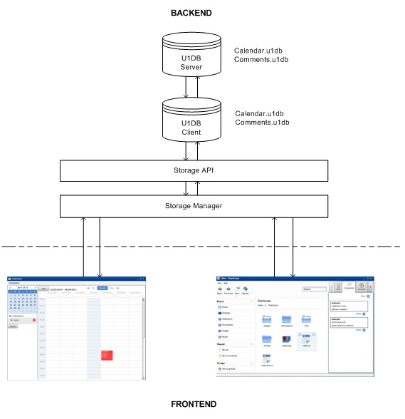

U1DB is a database API to sync JSON documents that was created by Canonical. It lets applications store documents and synchronize them between machines and devices. U1DB is designed to work anywhere, acting as a storage backup for native platform data. This means it can be implemented on any platform, from different languages, providing backup and sync services between platforms.  

The U1DB API contains three sections: document storage/retrieval, querying and synchronization. A short description of their operation is given below.  

### Storage/recovering documents

U1DB stores documents, basically any information that can be expressed in JSON.  

**created_doc_from_json(**_json,doc\_id=None_**)**

Creates a document from JSON data.

Optionally the doc id can be specified. This id must not exist in the database. If the database specifies a maximum document size and the document exceeds this size, a DocumentTooBig exception is triggered.  

    <table border="0" cellpadding="0" cellspacing="0" style="border-collapse:collapse;">
        <tr>
            <td style="background-color:#C0C0C0">Parameters:</td>
            <td>
                <ul>
                    <li><b>json</b> – JSON data</li>
                    <li><b>doc-id</b> – Optional document id</li>
                </ul>
            </td>
        </tr>
        <tr>
            <td style="background-color:#C0C0C0">Return:</td>
            <td style="padding-left:30px">Document</td>
        </tr>
    </table>

  

**put_doc(**_doc_**)**

Updates documents. If the database specifies a maximum document size and the document exceeds this size, a DocumentTooBig exception is triggered.

    <table border="0" cellpadding="0" cellspacing="0" style="border-collapse:collapse;">
        <tr>
            <td style="background-color:#C0C0C0">Parameters:</td>
            <td style="padding-left:30px"><b>doc</b> – Document with new contents</td>
        </tr>
        <tr>
            <td style="background-color:#C0C0C0">Return:</td>
            <td style="padding-left:30px">new_doc_rev - New revision id for the document. The document object will also be updated</td>
        </tr>
    </table>

  

**set_json(**_json_**)**

Updates document's JSON data.

    <table border="0" cellpadding="0" cellspacing="0" style="border-collapse:collapse;">
        <tr>
            <td style="background-color:#C0C0C0">Parameters:</td>
            <td style="padding-left:30px"><b>json</b> – JSON data</td>
        </tr>
    </table>

  
  
  
**delete_doc(**_doc_**)**

Flags a document as deleted.

    <table border="0" cellpadding="0" cellspacing="0" style="border-collapse:collapse;">
        <tr>
            <td style="background-color:#C0C0C0">Parameters:</td>
            <td style="padding-left:30px"><b>doc</b> – Document to delete</td>
        </tr>
    </table>

  

### Queries

Querying in U1DB is done using indexes. To retrieve certain documents from the database according to specific criteria, first you must create an index and then query this index.

**create_index(**_index\_name,\*index_expressions_**)**

Creates an index that will be used to perform queries in the database. No exceptions are triggered if you try to create an existing index. However, an exception is triggered if you try to create an index that changes the index_expressions of a previously created index.

    <table border="0" cellpadding="0" cellspacing="0" style="border-collapse:collapse;">
        <tr>
            <td style="background-color:#C0C0C0">Parameters:</td>
            <td>
                <ul>
                    <li><b>index_name</b> – Unique index id</li>
                    <li><b>index_expressions</b> – Keys used in future queries</li>
                </ul>
                  
                Examples: “nameKey” o “nameKey.nameSubKey”
            </td>
        </tr>
    </table>

  

**get_from_index(**_index\_name,\*key\_values_**)**

Returns the documents containing the keys specified. The same number of values as keys defined in the index must be specified.

    <table border="0" cellpadding="0" cellspacing="0" style="border-collapse:collapse;">
        <tr>
            <td style="background-color:#C0C0C0">Parameters:</td>
            <td>
                <ul>
                    <li><b>index_name</b> – Name of the index queried</li>
                    <li><b>key_values</b> – Values to search.  if an index has 3 fields, you will get get_from_index(index1,val1,val2,val3)</li>
                </ul>
            </td>
        </tr>
        <tr>
            <td style="background-color:#C0C0C0">Return:</td>
            <td style="padding-left:30px">List of documents</td>
        </tr>
    </table>

  

### Synchronization

U1DB is a syncable database. Any U1DB database can be synced with a U1DB server. Most U1DB installations can be run as server.  

Syncing the server and the client updates both sides so that they contain the same data. Data is saved in local U1DBs, whether online-offline, and then synchronized when online.  

**sync(**_url,creds=None,autocreate=True_**)**

Syncs documents with a remote replica via a URL.

    <table border="0" cellpadding="0" cellspacing="0" style="border-collapse:collapse;">
        <tr>
            <td style="background-color:#C0C0C0">Parameters:</td>
            <td>
                <ul>
                    <li><b>url</b> – URL of the remote replica with which it will be synchronized</li>
                    <li><b>creds</b> – (Optional). Credentials to authorize the operation with the server. For example, use credentials to identify via OAuth: 
                    &nbsp;&nbsp;&nbsp;&nbsp;&nbsp;&nbsp;&nbsp;&nbsp;&nbsp;{  
		    &nbsp;&nbsp;&nbsp;&nbsp;&nbsp;&nbsp;&nbsp;&nbsp;&nbsp;&nbsp;&nbsp;&nbsp;'oauth': {  &nbsp;&nbsp;&nbsp;&nbsp;&nbsp;&nbsp;&nbsp;&nbsp;&nbsp;&nbsp;&nbsp;&nbsp;&nbsp;&nbsp;&nbsp;&nbsp;&nbsp;&nbsp;&nbsp;&nbsp;&nbsp;&nbsp;&nbsp;&nbsp;&nbsp;&nbsp;&nbsp;&nbsp;&nbsp;&nbsp;‘consumer_key’: ..., ‘consumer_secret’: ..., 
&nbsp;&nbsp;&nbsp;&nbsp;&nbsp;&nbsp;&nbsp;&nbsp;&nbsp;&nbsp;&nbsp;&nbsp;&nbsp;&nbsp;&nbsp;&nbsp;&nbsp;&nbsp;&nbsp;&nbsp;&nbsp;&nbsp;&nbsp;&nbsp;&nbsp;&nbsp;&nbsp;&nbsp;&nbsp;&nbsp;‘token_key’: ..., ‘token_secret’: ... 
                    &nbsp;&nbsp;&nbsp;&nbsp;&nbsp;&nbsp;&nbsp;&nbsp;&nbsp;&nbsp;&nbsp;&nbsp;&nbsp;&nbsp;&nbsp;&nbsp;&nbsp;&nbsp;&nbsp;&nbsp;&nbsp;&nbsp;&nbsp;&nbsp;&nbsp;&nbsp;&nbsp;} 
		    &nbsp;&nbsp;&nbsp;&nbsp;&nbsp;&nbsp;&nbsp;&nbsp;&nbsp;&nbsp;&nbsp;&nbsp;}
                    </li>
                    <li><b>autocreate</b> – If the value is True, the database is created if it doesn’t exist. If the value is False, synchronization will not be performed if the database doesn’t exist.</li>
                </ul>
            </td>
        </tr>
        <tr>
            <td style="background-color:#C0C0C0">Return:</td>
            <td style="padding-left:30px">local_gen_before_sync – A local gen key to control synchronization. This is useful with the whats_changed function, if an application needs to know the documents changed during synchronization.</td>
        </tr>
    </table>

  

### Implementation of Oauth into eyeOS calendar

To sync eyeOS Calendar and the comments tool applications, authentication must be done with the server using the OAuth protocol.

The OAuth server provides access to a unique protected resource, the U1DB server.

The eyeOS platform implements the Credentials.py script, which contains the APIs required for communicating with the OAuth server.

The communication dialog is as follows:

**Step 1**:

API getRequestToken() gets the consumer key and consumer secret from the settings (see Annex 1.2). It then makes a call to the OAuth server using the “request_token” URL.

The OAuth server retrieves the consumer key from the database and compares it with the consumer key received. If the keys do not match, it returns an error; otherwise, it performs a new search in the database using the consumer key to get the request token.

The OAuth server responds to the eyeOS call, returning the request token and access verifier to request the access token.

The eyeOS platform stores the request token and the verifier in the session variables so that it does not have to repeat the process in subsequent steps.

**Step 2**:

API getAccesToken(token,verifier) makes a call to the OAuth server through the “access_token” URL.

The OAuth server retrieves the consumer key and request token from the database and compares them with those received from getAccessToken(). If they do not match, it returns an error; otherwise, it performs a new search in the database with the consumer key and request token to get the access token. If no data is obtained or the data obtained has expired, a new access token must be generated and stored in the database, which means that previous tokens will no longer have access. 

The OAuth server responds to the eyeOS call, returning the access token.

**Step 3**:

API protocol(params) calls the OAuth server via the U1DB synchronization API.

The OAuth server retrieves the access token from the database using the consumer and token received. If they do not match, it returns an error; otherwise, it syncs with the U1DB server.

Step 1 only applies where a request token has not been requested during the eyeOS user session.

Authentication implemented in both applications is requested for each resource request. The request process flow is illustrated in the following diagram:

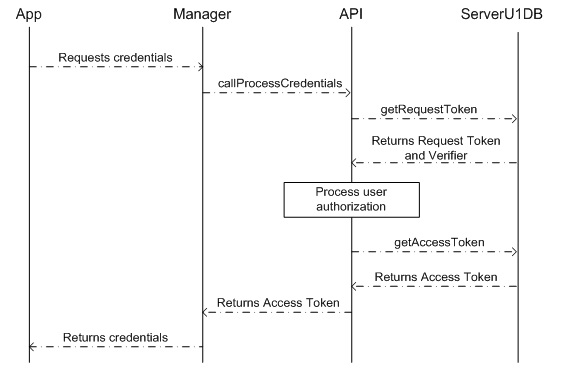

Persistence OAuth Manager and Persistence OAuth API persistence functions are described in more detail, respectively:  

**_Persistence OAuth Manager_**

**callProcessCredentials()**

Gets credentials of the eyeOS consumer.

    <table border="0" cellpadding="0" cellspacing="0" style="border-collapse:collapse;">
        <tr>
            <td style="background-color:#C0C0C0">Script call:</td>
            <td style="padding-left:30px">No parameters</td>
        </tr>
        <tr>
            <td style="background-color:#C0C0C0">Return:</td>
            <td style="padding-left:30px">
            Token object or in the event of error null 
            Example: 
            { 
	    &nbsp;&nbsp;&nbsp;"oauth":{  &nbsp;&nbsp;&nbsp;&nbsp;&nbsp;&nbsp;&nbsp;&nbsp;&nbsp;&nbsp;&nbsp;&nbsp;&nbsp;&nbsp;&nbsp;&nbsp;&nbsp;&nbsp;&nbsp;&nbsp;&nbsp;"token_key":"access1234", 
&nbsp;&nbsp;&nbsp;&nbsp;&nbsp;&nbsp;&nbsp;&nbsp;&nbsp;&nbsp;&nbsp;&nbsp;&nbsp;&nbsp;&nbsp;&nbsp;&nbsp;&nbsp;&nbsp;&nbsp;&nbsp;"token_secret":"access_secret", 
&nbsp;&nbsp;&nbsp;&nbsp;&nbsp;&nbsp;&nbsp;&nbsp;&nbsp;&nbsp;&nbsp;&nbsp;&nbsp;&nbsp;&nbsp;&nbsp;&nbsp;&nbsp;&nbsp;&nbsp;&nbsp;"consumer_key":"key1234", 
&nbsp;&nbsp;&nbsp;&nbsp;&nbsp;&nbsp;&nbsp;&nbsp;&nbsp;&nbsp;&nbsp;&nbsp;&nbsp;&nbsp;&nbsp;&nbsp;&nbsp;&nbsp;&nbsp;&nbsp;&nbsp;"consumer_secret":"secret1234", 
&nbsp;&nbsp;&nbsp;&nbsp;&nbsp;&nbsp;&nbsp;&nbsp;&nbsp;&nbsp;&nbsp;&nbsp;&nbsp;&nbsp;&nbsp;&nbsp;&nbsp;&nbsp;} 
	    }
            </td>
        </tr>
    </table>

  
  
  
**_Persistence OAuth API_**
  
The configuration file of OAuth API is found at “/var/www/eyeos/eyeos/extern/u1db/” and is called “settings.py”. This file must be modified in the following values:

    <table border="0" cellpadding="0" cellspacing="0" style="border-collapse:collapse;">
        <tr>
            <td width="15%">Server</td>
            <td width="45%" style="padding-left:15px">IP address where the Oauth server is active</td>
        </tr>
        <tr>
            <td>Port</td>
            <td style="padding-left:15px">Port where the Oauth server is active</td>
        </tr>
        <tr>
            <td colspan="2">urls</td>
        </tr>
        <tr>
            <td valign="middle">CALLBACK_URL</td>
            <td style="padding-left:15px">Replace IP and port with the values stablished in the previous parameters (server and port)</td>
        </tr>
        <tr>
            <td colspan="2">consumer</td>
        </tr>
        <tr>
            <td valign="middle">key</td>
            <td style="padding-left:15px">Included when mongodb was configured in the Oauth server installation</td>
        </tr>
        <tr>
            <td valign="middle">secret</td>
            <td style="padding-left:15px">Included when mongodb was configured in the Oauth server installation</td>
        </tr>
    </table>

   
  
  
**getRequestToken()** 

Gets the request token of the eyeOS consumer.  

    <table border="0" cellpadding="0" cellspacing="0" style="border-collapse:collapse;">
        <tr>
            <td style="background-color:#C0C0C0">Url:</td>
            <td style="padding-left:30px">
                Use REQUEST_TOKEN_URL of the configuration file.
            </td>
        </tr>
        <tr>
            <td style="background-color:#C0C0C0">Method:</td>
            <td style="padding-left:30px">
                GET
            </td>
        </tr>
        <tr>
            <td style="background-color:#C0C0C0">Signature:</td>
            <td style="padding-left:30px">
                Plaintext
            </td>
        </tr>
        <tr>
            <td style="background-color:#C0C0C0">Parameters:</td>
            <td style="padding-left:30px">No parameters</td>
        </tr>
        <tr>
            <td style="background-color:#C0C0C0">Return:</td>
            <td style="padding-left:30px">
            Key and secret of the request token or, in the event of error, returns an error structure: 
            - error: Error number 
            - description: Error description 
            Example: 
            {“oauth_token” : “token1234”,  “oauth_secret” : “secret1234”}
            {“error” : “401”, “description” : “Authorization required”}
            </td>
        </tr>
    </table>

  
  
**getAccessToken(**_token,verifier_**)** 

Gets the access token of the eyeOS consumer from the request token and verifier received.   

    <table border="0" cellpadding="0" cellspacing="0" style="border-collapse:collapse;">
        <tr>
            <td style="background-color:#C0C0C0">Url:</td>
            <td style="padding-left:30px">
                Use ACCESS_TOKEN_URL of the configuration file.
            </td>
        </tr>
        <tr>
            <td style="background-color:#C0C0C0">Method:</td>
            <td style="padding-left:30px">
                GET
            </td>
        </tr>
        <tr>
            <td style="background-color:#C0C0C0">Signature:</td>
            <td style="padding-left:30px">
                Plaintext
            </td>
        </tr>
        <tr>
            <td style="background-color:#C0C0C0">Parameters:</td>
            <td style="padding-left:30px">
                <b>token</b> – OauthToken object. Includes key and secret values of the request token 
                <b>verifier</b> – Word by which the user is authenticated
            </td>
        </tr>
        <tr>
            <td style="background-color:#C0C0C0">Return:</td>
            <td style="padding-left:30px">
            Key and secret of the access token or, in the event of error, returns an error structure: 
            - error: Error number 
            - description: Error description 
            Example: 
            { 
	    &nbsp;&nbsp;&nbsp;"credentials":{ 
&nbsp;&nbsp;&nbsp;&nbsp;&nbsp;&nbsp;&nbsp;&nbsp;&nbsp;&nbsp;&nbsp;&nbsp;&nbsp;&nbsp;&nbsp;&nbsp;&nbsp;&nbsp;&nbsp;&nbsp;&nbsp;&nbsp;&nbsp;&nbsp;&nbsp;&nbsp;&nbsp;&nbsp;&nbsp;&nbsp;"token_key":"access1234", 
&nbsp;&nbsp;&nbsp;&nbsp;&nbsp;&nbsp;&nbsp;&nbsp;&nbsp;&nbsp;&nbsp;&nbsp;&nbsp;&nbsp;&nbsp;&nbsp;&nbsp;&nbsp;&nbsp;&nbsp;&nbsp;&nbsp;&nbsp;&nbsp;&nbsp;&nbsp;&nbsp;&nbsp;&nbsp;&nbsp;"token_secret":"access_secret", 
&nbsp;&nbsp;&nbsp;&nbsp;&nbsp;&nbsp;&nbsp;&nbsp;&nbsp;&nbsp;&nbsp;&nbsp;&nbsp;&nbsp;&nbsp;&nbsp;&nbsp;&nbsp;&nbsp;&nbsp;&nbsp;&nbsp;&nbsp;&nbsp;&nbsp;&nbsp;&nbsp;&nbsp;&nbsp;&nbsp;"consumer_key":"key1234", 
&nbsp;&nbsp;&nbsp;&nbsp;&nbsp;&nbsp;&nbsp;&nbsp;&nbsp;&nbsp;&nbsp;&nbsp;&nbsp;&nbsp;&nbsp;&nbsp;&nbsp;&nbsp;&nbsp;&nbsp;&nbsp;&nbsp;&nbsp;&nbsp;&nbsp;&nbsp;&nbsp;&nbsp;&nbsp;&nbsp;"consumer_secret":"secret1234", 
&nbsp;&nbsp;&nbsp;&nbsp;&nbsp;&nbsp;&nbsp;&nbsp;&nbsp;&nbsp;&nbsp;&nbsp;&nbsp;&nbsp;&nbsp;&nbsp;&nbsp;&nbsp;&nbsp;&nbsp;&nbsp;&nbsp;&nbsp;&nbsp;&nbsp;&nbsp;&nbsp;}, 
	    &nbsp;&nbsp;&nbsp;"request_token":{"key":"token1111","secret":"secret2222"}, 
	    &nbsp;&nbsp;&nbsp;"verifier":"verifier" 
            } 
            {"error" : "401", "description" : "Authorization required"}
            </td>
        </tr>
    </table>

  
   
  
### Implementation of U1DB into eyeOS calendar

EyeOS storages the user's calendars and events into U1DB synchronized database.

Calendar and event sync processes are performed when eyeOS Calendar is opened. 

Calendars are synced every 20 seconds. If any changes are detected, the calendar list is refreshed and the waiting time is reset. 

Events are synced every 10 seconds. If any changes are detected, the events of the period shown on screen are refreshed and the waiting time is reset. 

Persistence in implemented in eyeOS according to the diagram below: 

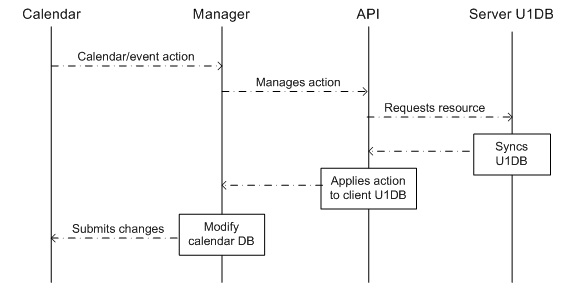

The user performs an action on the calendar, such as adds an event to a specific calendar. The Manager uses the insertEvent function to retrieve the user’s credentials. These values are sent to the API together with the data of the new event. The API is responsible for requesting the resource from the U1DB server using the insertEvent function.  

If everything is correct, the U1DB server updates the server database and subsequently notifies other clients of the change. The API receives confirmation of the change and applies it to the client U1DB database. Once the updates have been made, it notifies the Manager, which modifies the local calendar tables and updates the eyeOS interface. 

The insertEvent functions of the Calendar Manager and the Calendar API, as well as the other actions performed by the calendar. Now are described in more detail, respectively. 

**_Calendar Manager_**

The Calendar Manager API consists of a uniform structure in the script call:  

    <table border="0" cellpadding="0" cellspacing="0" style="border-collapse:collapse;">
        <tr>
            <td style="background-color:#C0C0C0">Parameters:</td>
            <td>
                <ul>
                    <li><b>type</b> – Name of the Python API function</li>
                    <li><b>lista</b> – Parameters of the previous function</li>
                    <li><b>credentials</b> – Credentials for identification during the synchronization process</li>
                </ul>
            </td>
        </tr>
    </table>

The functions are listed and described below.  

**synchronizeCalendars(**_user_**)**

Requests credentials of the eyeOS consumer.

    <table border="0" cellpadding="0" cellspacing="0" style="border-collapse:collapse;">
        <tr>
            <td style="background-color:#C0C0C0">Parameters:</td>
            <td style="padding-left:30px">
                <b>user</b> – Contains the id and name of the eyeOS user
            </td>
        </tr>
        <tr>
            <td style="background-color:#C0C0C0">Script call:</td>
            <td width="60%" style="padding-left:30px">
                Example: 
                { 
                &nbsp;&nbsp;&nbsp;&nbsp;"type":"selectCalendar" , 
                &nbsp;&nbsp;&nbsp;&nbsp;"lista":[{ 
                &nbsp;&nbsp;&nbsp;&nbsp;&nbsp;&nbsp;&nbsp;&nbsp;&nbsp;&nbsp;&nbsp;&nbsp;&nbsp;&nbsp;&nbsp;&nbsp;&nbsp;&nbsp;&nbsp;"type":"calendar", 
                &nbsp;&nbsp;&nbsp;&nbsp;&nbsp;&nbsp;&nbsp;&nbsp;&nbsp;&nbsp;&nbsp;&nbsp;&nbsp;&nbsp;&nbsp;&nbsp;&nbsp;&nbsp;&nbsp;"user_eyeos": "eyeos" 
                &nbsp;&nbsp;&nbsp;&nbsp;&nbsp;&nbsp;&nbsp;&nbsp;&nbsp;&nbsp;&nbsp;&nbsp;&nbsp;&nbsp;&nbsp;}] 
                &nbsp;&nbsp;&nbsp;&nbsp;"credentials":{ 
                &nbsp;&nbsp;&nbsp;&nbsp;&nbsp;&nbsp;&nbsp;&nbsp;&nbsp;&nbsp;&nbsp;&nbsp;&nbsp;&nbsp;&nbsp;&nbsp;&nbsp;&nbsp;&nbsp;”oauth”:{ 
                &nbsp;&nbsp;&nbsp;&nbsp;&nbsp;&nbsp;&nbsp;&nbsp;&nbsp;&nbsp;&nbsp;&nbsp;&nbsp;&nbsp;&nbsp;&nbsp;&nbsp;&nbsp;&nbsp;&nbsp;&nbsp;&nbsp;&nbsp;&nbsp;&nbsp;&nbsp;&nbsp;&nbsp;&nbsp;&nbsp;&nbsp;&nbsp;&nbsp;&nbsp;&nbsp;&nbsp;“consumer_key”:”eyeos”, 
                &nbsp;&nbsp;&nbsp;&nbsp;&nbsp;&nbsp;&nbsp;&nbsp;&nbsp;&nbsp;&nbsp;&nbsp;&nbsp;&nbsp;&nbsp;&nbsp;&nbsp;&nbsp;&nbsp;&nbsp;&nbsp;&nbsp;&nbsp;&nbsp;&nbsp;&nbsp;&nbsp;&nbsp;&nbsp;&nbsp;&nbsp;&nbsp;&nbsp;&nbsp;&nbsp;&nbsp;“consumer_secret”:”eyeosABC”, 
                &nbsp;&nbsp;&nbsp;&nbsp;&nbsp;&nbsp;&nbsp;&nbsp;&nbsp;&nbsp;&nbsp;&nbsp;&nbsp;&nbsp;&nbsp;&nbsp;&nbsp;&nbsp;&nbsp;&nbsp;&nbsp;&nbsp;&nbsp;&nbsp;&nbsp;&nbsp;&nbsp;&nbsp;&nbsp;&nbsp;&nbsp;&nbsp;&nbsp;&nbsp;&nbsp;&nbsp;“token_key”:”eyeostoken”, 
                &nbsp;&nbsp;&nbsp;&nbsp;&nbsp;&nbsp;&nbsp;&nbsp;&nbsp;&nbsp;&nbsp;&nbsp;&nbsp;&nbsp;&nbsp;&nbsp;&nbsp;&nbsp;&nbsp;&nbsp;&nbsp;&nbsp;&nbsp;&nbsp;&nbsp;&nbsp;&nbsp;&nbsp;&nbsp;&nbsp;&nbsp;&nbsp;&nbsp;&nbsp;&nbsp;&nbsp;“token_secret”:”eyeosDEF” 
                &nbsp;&nbsp;&nbsp;&nbsp;&nbsp;&nbsp;&nbsp;&nbsp;&nbsp;&nbsp;&nbsp;&nbsp;&nbsp;&nbsp;&nbsp;&nbsp;&nbsp;&nbsp;&nbsp;&nbsp;&nbsp;&nbsp;&nbsp;&nbsp;&nbsp;&nbsp;&nbsp;&nbsp;&nbsp;&nbsp;&nbsp;&nbsp;&nbsp;} 
                &nbsp;&nbsp;&nbsp;&nbsp;&nbsp;&nbsp;&nbsp;&nbsp;&nbsp;&nbsp;&nbsp;&nbsp;&nbsp;&nbsp;&nbsp;&nbsp;&nbsp;&nbsp;&nbsp;&nbsp;&nbsp;&nbsp;&nbsp;&nbsp;&nbsp;&nbsp;&nbsp;} 
                } 
            </td>
        </tr>
        <tr>
            <td style="background-color:#C0C0C0">Return:</td>
            <td style="padding-left:30px">List of calendars</td>
        </tr>
    </table>

  
  
**insertCalendars(**_user,calendar_**)**

Creates a new calendar.

    <table border="0" cellpadding="0" cellspacing="0" style="border-collapse:collapse;">
        <tr>
            <td style="background-color:#C0C0C0">Parameters:</td>
            <td style="padding-left:30px">
                <ul>
                    <li><b>user</b> – User name</li>
                    <li><b>calendar</b> – An object that contains name, description, and timezone</li>
                </ul>
            </td>
        </tr>
        <tr>
            <td style="background-color:#C0C0C0">Script call:</td>
            <td width="60%" style="padding-left:30px">
                Example: 
                { 
                &nbsp;&nbsp;&nbsp;&nbsp;"type":"insertCalendar" , 
                &nbsp;&nbsp;&nbsp;&nbsp;"lista":[{ 
                &nbsp;&nbsp;&nbsp;&nbsp;&nbsp;&nbsp;&nbsp;&nbsp;&nbsp;&nbsp;&nbsp;&nbsp;&nbsp;&nbsp;&nbsp;&nbsp;&nbsp;&nbsp;&nbsp;"type":"calendar", 
                &nbsp;&nbsp;&nbsp;&nbsp;&nbsp;&nbsp;&nbsp;&nbsp;&nbsp;&nbsp;&nbsp;&nbsp;&nbsp;&nbsp;&nbsp;&nbsp;&nbsp;&nbsp;&nbsp;"user_eyeos": "eyeos" 
                &nbsp;&nbsp;&nbsp;&nbsp;&nbsp;&nbsp;&nbsp;&nbsp;&nbsp;&nbsp;&nbsp;&nbsp;&nbsp;&nbsp;&nbsp;&nbsp;&nbsp;&nbsp;&nbsp;"name": "personal" 
                &nbsp;&nbsp;&nbsp;&nbsp;&nbsp;&nbsp;&nbsp;&nbsp;&nbsp;&nbsp;&nbsp;&nbsp;&nbsp;&nbsp;&nbsp;&nbsp;&nbsp;&nbsp;&nbsp;"status": "NEW" 
                &nbsp;&nbsp;&nbsp;&nbsp;&nbsp;&nbsp;&nbsp;&nbsp;&nbsp;&nbsp;&nbsp;&nbsp;&nbsp;&nbsp;&nbsp;&nbsp;&nbsp;&nbsp;&nbsp;"description": "personal calendar" 
                &nbsp;&nbsp;&nbsp;&nbsp;&nbsp;&nbsp;&nbsp;&nbsp;&nbsp;&nbsp;&nbsp;&nbsp;&nbsp;&nbsp;&nbsp;&nbsp;&nbsp;&nbsp;&nbsp;"timezone": 0 
                &nbsp;&nbsp;&nbsp;&nbsp;&nbsp;&nbsp;&nbsp;&nbsp;&nbsp;&nbsp;&nbsp;&nbsp;&nbsp;&nbsp;&nbsp;}] 
                &nbsp;&nbsp;&nbsp;&nbsp;"credentials":{ 
                &nbsp;&nbsp;&nbsp;&nbsp;&nbsp;&nbsp;&nbsp;&nbsp;&nbsp;&nbsp;&nbsp;&nbsp;&nbsp;&nbsp;&nbsp;&nbsp;&nbsp;&nbsp;&nbsp;”oauth”:{ 
                &nbsp;&nbsp;&nbsp;&nbsp;&nbsp;&nbsp;&nbsp;&nbsp;&nbsp;&nbsp;&nbsp;&nbsp;&nbsp;&nbsp;&nbsp;&nbsp;&nbsp;&nbsp;&nbsp;&nbsp;&nbsp;&nbsp;&nbsp;&nbsp;&nbsp;&nbsp;&nbsp;&nbsp;&nbsp;&nbsp;&nbsp;&nbsp;&nbsp;&nbsp;&nbsp;&nbsp;“consumer_key”:”eyeos”, 
                &nbsp;&nbsp;&nbsp;&nbsp;&nbsp;&nbsp;&nbsp;&nbsp;&nbsp;&nbsp;&nbsp;&nbsp;&nbsp;&nbsp;&nbsp;&nbsp;&nbsp;&nbsp;&nbsp;&nbsp;&nbsp;&nbsp;&nbsp;&nbsp;&nbsp;&nbsp;&nbsp;&nbsp;&nbsp;&nbsp;&nbsp;&nbsp;&nbsp;&nbsp;&nbsp;&nbsp;“consumer_secret”:”eyeosABC”, 
                &nbsp;&nbsp;&nbsp;&nbsp;&nbsp;&nbsp;&nbsp;&nbsp;&nbsp;&nbsp;&nbsp;&nbsp;&nbsp;&nbsp;&nbsp;&nbsp;&nbsp;&nbsp;&nbsp;&nbsp;&nbsp;&nbsp;&nbsp;&nbsp;&nbsp;&nbsp;&nbsp;&nbsp;&nbsp;&nbsp;&nbsp;&nbsp;&nbsp;&nbsp;&nbsp;&nbsp;“token_key”:”eyeostoken”, 
                &nbsp;&nbsp;&nbsp;&nbsp;&nbsp;&nbsp;&nbsp;&nbsp;&nbsp;&nbsp;&nbsp;&nbsp;&nbsp;&nbsp;&nbsp;&nbsp;&nbsp;&nbsp;&nbsp;&nbsp;&nbsp;&nbsp;&nbsp;&nbsp;&nbsp;&nbsp;&nbsp;&nbsp;&nbsp;&nbsp;&nbsp;&nbsp;&nbsp;&nbsp;&nbsp;&nbsp;“token_secret”:”eyeosDEF” 
                &nbsp;&nbsp;&nbsp;&nbsp;&nbsp;&nbsp;&nbsp;&nbsp;&nbsp;&nbsp;&nbsp;&nbsp;&nbsp;&nbsp;&nbsp;&nbsp;&nbsp;&nbsp;&nbsp;&nbsp;&nbsp;&nbsp;&nbsp;&nbsp;&nbsp;&nbsp;&nbsp;&nbsp;&nbsp;&nbsp;&nbsp;&nbsp;&nbsp;} 
                &nbsp;&nbsp;&nbsp;&nbsp;&nbsp;&nbsp;&nbsp;&nbsp;&nbsp;&nbsp;&nbsp;&nbsp;&nbsp;&nbsp;&nbsp;&nbsp;&nbsp;&nbsp;&nbsp;&nbsp;&nbsp;&nbsp;&nbsp;&nbsp;&nbsp;&nbsp;&nbsp;} 
                } 
            </td>
        </tr>
        <tr>
            <td style="background-color:#C0C0C0">Return:</td>
            <td style="padding-left:30px">True or in case of error null</td>
        </tr>
    </table>

  
  
**deleteCalendars(**_user,calendar_**)**

Deletes an existing calendar.

    <table border="0" cellpadding="0" cellspacing="0" style="border-collapse:collapse;">
        <tr>
            <td style="background-color:#C0C0C0">Parameters:</td>
            <td style="padding-left:30px">
                <ul>
                    <li><b>user</b> – User name</li>
                    <li><b>calendar</b> – Calendar name</li>
                </ul>
            </td>
        </tr>
        <tr>
            <td style="background-color:#C0C0C0">Script call:</td>
            <td width="60%" style="padding-left:30px">
                Example: 
                { 
                &nbsp;&nbsp;&nbsp;&nbsp;"type":"deleteCalendar" , 
                &nbsp;&nbsp;&nbsp;&nbsp;"lista":[{ 
                &nbsp;&nbsp;&nbsp;&nbsp;&nbsp;&nbsp;&nbsp;&nbsp;&nbsp;&nbsp;&nbsp;&nbsp;&nbsp;&nbsp;&nbsp;&nbsp;&nbsp;&nbsp;&nbsp;"type":"calendar", 
                &nbsp;&nbsp;&nbsp;&nbsp;&nbsp;&nbsp;&nbsp;&nbsp;&nbsp;&nbsp;&nbsp;&nbsp;&nbsp;&nbsp;&nbsp;&nbsp;&nbsp;&nbsp;&nbsp;"user_eyeos": "eyeos" 
                &nbsp;&nbsp;&nbsp;&nbsp;&nbsp;&nbsp;&nbsp;&nbsp;&nbsp;&nbsp;&nbsp;&nbsp;&nbsp;&nbsp;&nbsp;&nbsp;&nbsp;&nbsp;&nbsp;"name": "personal" 
                &nbsp;&nbsp;&nbsp;&nbsp;&nbsp;&nbsp;&nbsp;&nbsp;&nbsp;&nbsp;&nbsp;&nbsp;&nbsp;&nbsp;&nbsp;}] 
                &nbsp;&nbsp;&nbsp;&nbsp;"credentials":{ 
                &nbsp;&nbsp;&nbsp;&nbsp;&nbsp;&nbsp;&nbsp;&nbsp;&nbsp;&nbsp;&nbsp;&nbsp;&nbsp;&nbsp;&nbsp;&nbsp;&nbsp;&nbsp;&nbsp;”oauth”:{ 
                &nbsp;&nbsp;&nbsp;&nbsp;&nbsp;&nbsp;&nbsp;&nbsp;&nbsp;&nbsp;&nbsp;&nbsp;&nbsp;&nbsp;&nbsp;&nbsp;&nbsp;&nbsp;&nbsp;&nbsp;&nbsp;&nbsp;&nbsp;&nbsp;&nbsp;&nbsp;&nbsp;&nbsp;&nbsp;&nbsp;&nbsp;&nbsp;&nbsp;&nbsp;&nbsp;&nbsp;“consumer_key”:”eyeos”, 
                &nbsp;&nbsp;&nbsp;&nbsp;&nbsp;&nbsp;&nbsp;&nbsp;&nbsp;&nbsp;&nbsp;&nbsp;&nbsp;&nbsp;&nbsp;&nbsp;&nbsp;&nbsp;&nbsp;&nbsp;&nbsp;&nbsp;&nbsp;&nbsp;&nbsp;&nbsp;&nbsp;&nbsp;&nbsp;&nbsp;&nbsp;&nbsp;&nbsp;&nbsp;&nbsp;&nbsp;“consumer_secret”:”eyeosABC”, 
                &nbsp;&nbsp;&nbsp;&nbsp;&nbsp;&nbsp;&nbsp;&nbsp;&nbsp;&nbsp;&nbsp;&nbsp;&nbsp;&nbsp;&nbsp;&nbsp;&nbsp;&nbsp;&nbsp;&nbsp;&nbsp;&nbsp;&nbsp;&nbsp;&nbsp;&nbsp;&nbsp;&nbsp;&nbsp;&nbsp;&nbsp;&nbsp;&nbsp;&nbsp;&nbsp;&nbsp;“token_key”:”eyeostoken”, 
                &nbsp;&nbsp;&nbsp;&nbsp;&nbsp;&nbsp;&nbsp;&nbsp;&nbsp;&nbsp;&nbsp;&nbsp;&nbsp;&nbsp;&nbsp;&nbsp;&nbsp;&nbsp;&nbsp;&nbsp;&nbsp;&nbsp;&nbsp;&nbsp;&nbsp;&nbsp;&nbsp;&nbsp;&nbsp;&nbsp;&nbsp;&nbsp;&nbsp;&nbsp;&nbsp;&nbsp;“token_secret”:”eyeosDEF” 
                &nbsp;&nbsp;&nbsp;&nbsp;&nbsp;&nbsp;&nbsp;&nbsp;&nbsp;&nbsp;&nbsp;&nbsp;&nbsp;&nbsp;&nbsp;&nbsp;&nbsp;&nbsp;&nbsp;&nbsp;&nbsp;&nbsp;&nbsp;&nbsp;&nbsp;&nbsp;&nbsp;&nbsp;&nbsp;&nbsp;&nbsp;&nbsp;&nbsp;} 
                &nbsp;&nbsp;&nbsp;&nbsp;&nbsp;&nbsp;&nbsp;&nbsp;&nbsp;&nbsp;&nbsp;&nbsp;&nbsp;&nbsp;&nbsp;&nbsp;&nbsp;&nbsp;&nbsp;&nbsp;&nbsp;&nbsp;&nbsp;&nbsp;&nbsp;&nbsp;&nbsp;} 
                } 
            </td>
        </tr>
        <tr>
            <td style="background-color:#C0C0C0">Return:</td>
            <td style="padding-left:30px">True or in the event of error null</td>
        </tr>
    </table>

  
  
**synchronizeCalendar(**_calendarId,user_**)**

Synchronizes all the events of the specified calendar of the user connected to the eyeOS platform.

    <table border="0" cellpadding="0" cellspacing="0" style="border-collapse:collapse;">
        <tr>
            <td style="background-color:#C0C0C0">Parameters:</td>
            <td style="padding-left:30px">
                <ul>
                    <li><b>calendarId</b> – Id of the eyeOS calendar</li>
                    <li><b>user</b> – User name</li>
                </ul>
            </td>
        </tr>
        <tr>
            <td style="background-color:#C0C0C0">Script call:</td>
            <td width="60%" style="padding-left:30px">
                Example: 
                { 
                &nbsp;&nbsp;&nbsp;&nbsp;"type":"selectEvent" , 
                &nbsp;&nbsp;&nbsp;&nbsp;"lista":[{ 
                &nbsp;&nbsp;&nbsp;&nbsp;&nbsp;&nbsp;&nbsp;&nbsp;&nbsp;&nbsp;&nbsp;&nbsp;&nbsp;&nbsp;&nbsp;&nbsp;&nbsp;&nbsp;&nbsp;"type":"event", 
                &nbsp;&nbsp;&nbsp;&nbsp;&nbsp;&nbsp;&nbsp;&nbsp;&nbsp;&nbsp;&nbsp;&nbsp;&nbsp;&nbsp;&nbsp;&nbsp;&nbsp;&nbsp;&nbsp;"user_eyeos": "eyeos" 
                &nbsp;&nbsp;&nbsp;&nbsp;&nbsp;&nbsp;&nbsp;&nbsp;&nbsp;&nbsp;&nbsp;&nbsp;&nbsp;&nbsp;&nbsp;&nbsp;&nbsp;&nbsp;&nbsp;"name": "personal" 
                &nbsp;&nbsp;&nbsp;&nbsp;&nbsp;&nbsp;&nbsp;&nbsp;&nbsp;&nbsp;&nbsp;&nbsp;&nbsp;&nbsp;&nbsp;}] 
                &nbsp;&nbsp;&nbsp;&nbsp;"credentials":{ 
                &nbsp;&nbsp;&nbsp;&nbsp;&nbsp;&nbsp;&nbsp;&nbsp;&nbsp;&nbsp;&nbsp;&nbsp;&nbsp;&nbsp;&nbsp;&nbsp;&nbsp;&nbsp;&nbsp;”oauth”:{ 
                &nbsp;&nbsp;&nbsp;&nbsp;&nbsp;&nbsp;&nbsp;&nbsp;&nbsp;&nbsp;&nbsp;&nbsp;&nbsp;&nbsp;&nbsp;&nbsp;&nbsp;&nbsp;&nbsp;&nbsp;&nbsp;&nbsp;&nbsp;&nbsp;&nbsp;&nbsp;&nbsp;&nbsp;&nbsp;&nbsp;&nbsp;&nbsp;&nbsp;&nbsp;&nbsp;&nbsp;“consumer_key”:”eyeos”, 
                &nbsp;&nbsp;&nbsp;&nbsp;&nbsp;&nbsp;&nbsp;&nbsp;&nbsp;&nbsp;&nbsp;&nbsp;&nbsp;&nbsp;&nbsp;&nbsp;&nbsp;&nbsp;&nbsp;&nbsp;&nbsp;&nbsp;&nbsp;&nbsp;&nbsp;&nbsp;&nbsp;&nbsp;&nbsp;&nbsp;&nbsp;&nbsp;&nbsp;&nbsp;&nbsp;&nbsp;“consumer_secret”:”eyeosABC”, 
                &nbsp;&nbsp;&nbsp;&nbsp;&nbsp;&nbsp;&nbsp;&nbsp;&nbsp;&nbsp;&nbsp;&nbsp;&nbsp;&nbsp;&nbsp;&nbsp;&nbsp;&nbsp;&nbsp;&nbsp;&nbsp;&nbsp;&nbsp;&nbsp;&nbsp;&nbsp;&nbsp;&nbsp;&nbsp;&nbsp;&nbsp;&nbsp;&nbsp;&nbsp;&nbsp;&nbsp;“token_key”:”eyeostoken”, 
                &nbsp;&nbsp;&nbsp;&nbsp;&nbsp;&nbsp;&nbsp;&nbsp;&nbsp;&nbsp;&nbsp;&nbsp;&nbsp;&nbsp;&nbsp;&nbsp;&nbsp;&nbsp;&nbsp;&nbsp;&nbsp;&nbsp;&nbsp;&nbsp;&nbsp;&nbsp;&nbsp;&nbsp;&nbsp;&nbsp;&nbsp;&nbsp;&nbsp;&nbsp;&nbsp;&nbsp;“token_secret”:”eyeosDEF” 
                &nbsp;&nbsp;&nbsp;&nbsp;&nbsp;&nbsp;&nbsp;&nbsp;&nbsp;&nbsp;&nbsp;&nbsp;&nbsp;&nbsp;&nbsp;&nbsp;&nbsp;&nbsp;&nbsp;&nbsp;&nbsp;&nbsp;&nbsp;&nbsp;&nbsp;&nbsp;&nbsp;&nbsp;&nbsp;&nbsp;&nbsp;&nbsp;&nbsp;} 
                &nbsp;&nbsp;&nbsp;&nbsp;&nbsp;&nbsp;&nbsp;&nbsp;&nbsp;&nbsp;&nbsp;&nbsp;&nbsp;&nbsp;&nbsp;&nbsp;&nbsp;&nbsp;&nbsp;&nbsp;&nbsp;&nbsp;&nbsp;&nbsp;&nbsp;&nbsp;&nbsp;} 
                } 
            </td>
        </tr>
        <tr>
            <td style="background-color:#C0C0C0">Return:</td>
            <td style="padding-left:30px">List of events</td>
        </tr>
    </table>

  
  
**createEvent(**_event_**)**

Creates a new event

    <table border="0" cellpadding="0" cellspacing="0" style="border-collapse:collapse;">
        <tr>
            <td style="background-color:#C0C0C0">Parameters:</td>
            <td style="padding-left:30px">
                <b>event</b> – Contains the U1DB structure of the event
            </td>
        </tr>
        <tr>
            <td style="background-color:#C0C0C0">Script call:</td>
            <td width="60%" style="padding-left:30px">
                Example: 
                { 
                &nbsp;&nbsp;&nbsp;&nbsp;"type":"insertEvent" , 
                &nbsp;&nbsp;&nbsp;&nbsp;"lista":[{ 
                &nbsp;&nbsp;&nbsp;&nbsp;&nbsp;&nbsp;&nbsp;&nbsp;&nbsp;&nbsp;&nbsp;&nbsp;&nbsp;&nbsp;&nbsp;&nbsp;&nbsp;&nbsp;&nbsp;"type":"event", 
                &nbsp;&nbsp;&nbsp;&nbsp;&nbsp;&nbsp;&nbsp;&nbsp;&nbsp;&nbsp;&nbsp;&nbsp;&nbsp;&nbsp;&nbsp;&nbsp;&nbsp;&nbsp;&nbsp;"user_eyeos": "eyeos" 
                &nbsp;&nbsp;&nbsp;&nbsp;&nbsp;&nbsp;&nbsp;&nbsp;&nbsp;&nbsp;&nbsp;&nbsp;&nbsp;&nbsp;&nbsp;&nbsp;&nbsp;&nbsp;&nbsp;"calendar": "personal" 
                &nbsp;&nbsp;&nbsp;&nbsp;&nbsp;&nbsp;&nbsp;&nbsp;&nbsp;&nbsp;&nbsp;&nbsp;&nbsp;&nbsp;&nbsp;&nbsp;&nbsp;&nbsp;&nbsp;"status": "NEW" 
                &nbsp;&nbsp;&nbsp;&nbsp;&nbsp;&nbsp;&nbsp;&nbsp;&nbsp;&nbsp;&nbsp;&nbsp;&nbsp;&nbsp;&nbsp;&nbsp;&nbsp;&nbsp;&nbsp;"isallday": "0" 
                &nbsp;&nbsp;&nbsp;&nbsp;&nbsp;&nbsp;&nbsp;&nbsp;&nbsp;&nbsp;&nbsp;&nbsp;&nbsp;&nbsp;&nbsp;&nbsp;&nbsp;&nbsp;&nbsp;"timestart": "201419160000" 
                &nbsp;&nbsp;&nbsp;&nbsp;&nbsp;&nbsp;&nbsp;&nbsp;&nbsp;&nbsp;&nbsp;&nbsp;&nbsp;&nbsp;&nbsp;&nbsp;&nbsp;&nbsp;&nbsp;"timeend": "201419170000" 
                &nbsp;&nbsp;&nbsp;&nbsp;&nbsp;&nbsp;&nbsp;&nbsp;&nbsp;&nbsp;&nbsp;&nbsp;&nbsp;&nbsp;&nbsp;&nbsp;&nbsp;&nbsp;&nbsp;"repetition": "None" 
                &nbsp;&nbsp;&nbsp;&nbsp;&nbsp;&nbsp;&nbsp;&nbsp;&nbsp;&nbsp;&nbsp;&nbsp;&nbsp;&nbsp;&nbsp;&nbsp;&nbsp;&nbsp;&nbsp;"finaltype": "1" 
                &nbsp;&nbsp;&nbsp;&nbsp;&nbsp;&nbsp;&nbsp;&nbsp;&nbsp;&nbsp;&nbsp;&nbsp;&nbsp;&nbsp;&nbsp;&nbsp;&nbsp;&nbsp;&nbsp;"finalvalue": "0" 
                &nbsp;&nbsp;&nbsp;&nbsp;&nbsp;&nbsp;&nbsp;&nbsp;&nbsp;&nbsp;&nbsp;&nbsp;&nbsp;&nbsp;&nbsp;&nbsp;&nbsp;&nbsp;&nbsp;"subject": "Visita Médico" 
                &nbsp;&nbsp;&nbsp;&nbsp;&nbsp;&nbsp;&nbsp;&nbsp;&nbsp;&nbsp;&nbsp;&nbsp;&nbsp;&nbsp;&nbsp;&nbsp;&nbsp;&nbsp;&nbsp;"location": "Barcelona" 
                &nbsp;&nbsp;&nbsp;&nbsp;&nbsp;&nbsp;&nbsp;&nbsp;&nbsp;&nbsp;&nbsp;&nbsp;&nbsp;&nbsp;&nbsp;&nbsp;&nbsp;&nbsp;&nbsp;"description": "Llevar justificante" 
                &nbsp;&nbsp;&nbsp;&nbsp;&nbsp;&nbsp;&nbsp;&nbsp;&nbsp;&nbsp;&nbsp;&nbsp;&nbsp;&nbsp;&nbsp;}] 
                &nbsp;&nbsp;&nbsp;&nbsp;"credentials":{ 
                &nbsp;&nbsp;&nbsp;&nbsp;&nbsp;&nbsp;&nbsp;&nbsp;&nbsp;&nbsp;&nbsp;&nbsp;&nbsp;&nbsp;&nbsp;&nbsp;&nbsp;&nbsp;&nbsp;”oauth”:{ 
                &nbsp;&nbsp;&nbsp;&nbsp;&nbsp;&nbsp;&nbsp;&nbsp;&nbsp;&nbsp;&nbsp;&nbsp;&nbsp;&nbsp;&nbsp;&nbsp;&nbsp;&nbsp;&nbsp;&nbsp;&nbsp;&nbsp;&nbsp;&nbsp;&nbsp;&nbsp;&nbsp;&nbsp;&nbsp;&nbsp;&nbsp;&nbsp;&nbsp;&nbsp;&nbsp;&nbsp;“consumer_key”:”eyeos”, 
                &nbsp;&nbsp;&nbsp;&nbsp;&nbsp;&nbsp;&nbsp;&nbsp;&nbsp;&nbsp;&nbsp;&nbsp;&nbsp;&nbsp;&nbsp;&nbsp;&nbsp;&nbsp;&nbsp;&nbsp;&nbsp;&nbsp;&nbsp;&nbsp;&nbsp;&nbsp;&nbsp;&nbsp;&nbsp;&nbsp;&nbsp;&nbsp;&nbsp;&nbsp;&nbsp;&nbsp;“consumer_secret”:”eyeosABC”, 
                &nbsp;&nbsp;&nbsp;&nbsp;&nbsp;&nbsp;&nbsp;&nbsp;&nbsp;&nbsp;&nbsp;&nbsp;&nbsp;&nbsp;&nbsp;&nbsp;&nbsp;&nbsp;&nbsp;&nbsp;&nbsp;&nbsp;&nbsp;&nbsp;&nbsp;&nbsp;&nbsp;&nbsp;&nbsp;&nbsp;&nbsp;&nbsp;&nbsp;&nbsp;&nbsp;&nbsp;“token_key”:”eyeostoken”, 
                &nbsp;&nbsp;&nbsp;&nbsp;&nbsp;&nbsp;&nbsp;&nbsp;&nbsp;&nbsp;&nbsp;&nbsp;&nbsp;&nbsp;&nbsp;&nbsp;&nbsp;&nbsp;&nbsp;&nbsp;&nbsp;&nbsp;&nbsp;&nbsp;&nbsp;&nbsp;&nbsp;&nbsp;&nbsp;&nbsp;&nbsp;&nbsp;&nbsp;&nbsp;&nbsp;&nbsp;“token_secret”:”eyeosDEF” 
                &nbsp;&nbsp;&nbsp;&nbsp;&nbsp;&nbsp;&nbsp;&nbsp;&nbsp;&nbsp;&nbsp;&nbsp;&nbsp;&nbsp;&nbsp;&nbsp;&nbsp;&nbsp;&nbsp;&nbsp;&nbsp;&nbsp;&nbsp;&nbsp;&nbsp;&nbsp;&nbsp;&nbsp;&nbsp;&nbsp;&nbsp;&nbsp;&nbsp;} 
                &nbsp;&nbsp;&nbsp;&nbsp;&nbsp;&nbsp;&nbsp;&nbsp;&nbsp;&nbsp;&nbsp;&nbsp;&nbsp;&nbsp;&nbsp;&nbsp;&nbsp;&nbsp;&nbsp;&nbsp;&nbsp;&nbsp;&nbsp;&nbsp;&nbsp;&nbsp;&nbsp;} 
                } 
            </td>
        </tr>
        <tr>
            <td style="background-color:#C0C0C0">Return:</td>
            <td style="padding-left:30px">True or in the event of error null</td>
        </tr>
    </table>

  
  
**deleteEvent(**_event_**)**

Deletes an existing event.

    <table border="0" cellpadding="0" cellspacing="0" style="border-collapse:collapse;">
        <tr>
            <td style="background-color:#C0C0C0">Parameters:</td>
            <td style="padding-left:30px">
                <b>event</b> – Contains the U1DB structure of the event
            </td>
        </tr>
        <tr>
            <td style="background-color:#C0C0C0">Script call:</td>
            <td width="60%" style="padding-left:30px">
                Example: 
                { 
                &nbsp;&nbsp;&nbsp;&nbsp;"type":"deleteEvent" , 
                &nbsp;&nbsp;&nbsp;&nbsp;"lista":[{ 
                &nbsp;&nbsp;&nbsp;&nbsp;&nbsp;&nbsp;&nbsp;&nbsp;&nbsp;&nbsp;&nbsp;&nbsp;&nbsp;&nbsp;&nbsp;&nbsp;&nbsp;&nbsp;&nbsp;"type":"event", 
                &nbsp;&nbsp;&nbsp;&nbsp;&nbsp;&nbsp;&nbsp;&nbsp;&nbsp;&nbsp;&nbsp;&nbsp;&nbsp;&nbsp;&nbsp;&nbsp;&nbsp;&nbsp;&nbsp;"user_eyeos": "eyeos" 
                &nbsp;&nbsp;&nbsp;&nbsp;&nbsp;&nbsp;&nbsp;&nbsp;&nbsp;&nbsp;&nbsp;&nbsp;&nbsp;&nbsp;&nbsp;&nbsp;&nbsp;&nbsp;&nbsp;"calendar": "personal" 
                &nbsp;&nbsp;&nbsp;&nbsp;&nbsp;&nbsp;&nbsp;&nbsp;&nbsp;&nbsp;&nbsp;&nbsp;&nbsp;&nbsp;&nbsp;&nbsp;&nbsp;&nbsp;&nbsp;"status": "DELETED" 
                &nbsp;&nbsp;&nbsp;&nbsp;&nbsp;&nbsp;&nbsp;&nbsp;&nbsp;&nbsp;&nbsp;&nbsp;&nbsp;&nbsp;&nbsp;&nbsp;&nbsp;&nbsp;&nbsp;"isallday": "0" 
                &nbsp;&nbsp;&nbsp;&nbsp;&nbsp;&nbsp;&nbsp;&nbsp;&nbsp;&nbsp;&nbsp;&nbsp;&nbsp;&nbsp;&nbsp;&nbsp;&nbsp;&nbsp;&nbsp;"timestart": "201419160000" 
                &nbsp;&nbsp;&nbsp;&nbsp;&nbsp;&nbsp;&nbsp;&nbsp;&nbsp;&nbsp;&nbsp;&nbsp;&nbsp;&nbsp;&nbsp;&nbsp;&nbsp;&nbsp;&nbsp;"timeend": "201419170000" 
                &nbsp;&nbsp;&nbsp;&nbsp;&nbsp;&nbsp;&nbsp;&nbsp;&nbsp;&nbsp;&nbsp;&nbsp;&nbsp;&nbsp;&nbsp;&nbsp;&nbsp;&nbsp;&nbsp;"repetition": "None" 
                &nbsp;&nbsp;&nbsp;&nbsp;&nbsp;&nbsp;&nbsp;&nbsp;&nbsp;&nbsp;&nbsp;&nbsp;&nbsp;&nbsp;&nbsp;&nbsp;&nbsp;&nbsp;&nbsp;"finaltype": "1" 
                &nbsp;&nbsp;&nbsp;&nbsp;&nbsp;&nbsp;&nbsp;&nbsp;&nbsp;&nbsp;&nbsp;&nbsp;&nbsp;&nbsp;&nbsp;&nbsp;&nbsp;&nbsp;&nbsp;"finalvalue": "0" 
                &nbsp;&nbsp;&nbsp;&nbsp;&nbsp;&nbsp;&nbsp;&nbsp;&nbsp;&nbsp;&nbsp;&nbsp;&nbsp;&nbsp;&nbsp;&nbsp;&nbsp;&nbsp;&nbsp;"subject": "Visita Médico" 
                &nbsp;&nbsp;&nbsp;&nbsp;&nbsp;&nbsp;&nbsp;&nbsp;&nbsp;&nbsp;&nbsp;&nbsp;&nbsp;&nbsp;&nbsp;&nbsp;&nbsp;&nbsp;&nbsp;"location": "Barcelona" 
                &nbsp;&nbsp;&nbsp;&nbsp;&nbsp;&nbsp;&nbsp;&nbsp;&nbsp;&nbsp;&nbsp;&nbsp;&nbsp;&nbsp;&nbsp;&nbsp;&nbsp;&nbsp;&nbsp;"description": "Llevar justificante" 
                &nbsp;&nbsp;&nbsp;&nbsp;&nbsp;&nbsp;&nbsp;&nbsp;&nbsp;&nbsp;&nbsp;&nbsp;&nbsp;&nbsp;&nbsp;}] 
                &nbsp;&nbsp;&nbsp;&nbsp;"credentials":{ 
                &nbsp;&nbsp;&nbsp;&nbsp;&nbsp;&nbsp;&nbsp;&nbsp;&nbsp;&nbsp;&nbsp;&nbsp;&nbsp;&nbsp;&nbsp;&nbsp;&nbsp;&nbsp;&nbsp;”oauth”:{ 
                &nbsp;&nbsp;&nbsp;&nbsp;&nbsp;&nbsp;&nbsp;&nbsp;&nbsp;&nbsp;&nbsp;&nbsp;&nbsp;&nbsp;&nbsp;&nbsp;&nbsp;&nbsp;&nbsp;&nbsp;&nbsp;&nbsp;&nbsp;&nbsp;&nbsp;&nbsp;&nbsp;&nbsp;&nbsp;&nbsp;&nbsp;&nbsp;&nbsp;&nbsp;&nbsp;&nbsp;“consumer_key”:”eyeos”, 
                &nbsp;&nbsp;&nbsp;&nbsp;&nbsp;&nbsp;&nbsp;&nbsp;&nbsp;&nbsp;&nbsp;&nbsp;&nbsp;&nbsp;&nbsp;&nbsp;&nbsp;&nbsp;&nbsp;&nbsp;&nbsp;&nbsp;&nbsp;&nbsp;&nbsp;&nbsp;&nbsp;&nbsp;&nbsp;&nbsp;&nbsp;&nbsp;&nbsp;&nbsp;&nbsp;&nbsp;“consumer_secret”:”eyeosABC”, 
                &nbsp;&nbsp;&nbsp;&nbsp;&nbsp;&nbsp;&nbsp;&nbsp;&nbsp;&nbsp;&nbsp;&nbsp;&nbsp;&nbsp;&nbsp;&nbsp;&nbsp;&nbsp;&nbsp;&nbsp;&nbsp;&nbsp;&nbsp;&nbsp;&nbsp;&nbsp;&nbsp;&nbsp;&nbsp;&nbsp;&nbsp;&nbsp;&nbsp;&nbsp;&nbsp;&nbsp;“token_key”:”eyeostoken”, 
                &nbsp;&nbsp;&nbsp;&nbsp;&nbsp;&nbsp;&nbsp;&nbsp;&nbsp;&nbsp;&nbsp;&nbsp;&nbsp;&nbsp;&nbsp;&nbsp;&nbsp;&nbsp;&nbsp;&nbsp;&nbsp;&nbsp;&nbsp;&nbsp;&nbsp;&nbsp;&nbsp;&nbsp;&nbsp;&nbsp;&nbsp;&nbsp;&nbsp;&nbsp;&nbsp;&nbsp;“token_secret”:”eyeosDEF” 
                &nbsp;&nbsp;&nbsp;&nbsp;&nbsp;&nbsp;&nbsp;&nbsp;&nbsp;&nbsp;&nbsp;&nbsp;&nbsp;&nbsp;&nbsp;&nbsp;&nbsp;&nbsp;&nbsp;&nbsp;&nbsp;&nbsp;&nbsp;&nbsp;&nbsp;&nbsp;&nbsp;&nbsp;&nbsp;&nbsp;&nbsp;&nbsp;&nbsp;} 
                &nbsp;&nbsp;&nbsp;&nbsp;&nbsp;&nbsp;&nbsp;&nbsp;&nbsp;&nbsp;&nbsp;&nbsp;&nbsp;&nbsp;&nbsp;&nbsp;&nbsp;&nbsp;&nbsp;&nbsp;&nbsp;&nbsp;&nbsp;&nbsp;&nbsp;&nbsp;&nbsp;} 
                } 
            </td>
        </tr>
        <tr>
            <td style="background-color:#C0C0C0">Return:</td>
            <td style="padding-left:30px">True or in the event of error null</td>
        </tr>
    </table>

  
  
**updateEvent(**_event_**)**

Updates an existing event.

    <table border="0" cellpadding="0" cellspacing="0" style="border-collapse:collapse;">
        <tr>
            <td style="background-color:#C0C0C0">Parameters:</td>
            <td style="padding-left:30px">
                <b>event</b> – Contains the U1DB structure of the event
            </td>
        </tr>
        <tr>
            <td style="background-color:#C0C0C0">Script call:</td>
            <td width="60%" style="padding-left:30px">
                Example: 
                { 
                &nbsp;&nbsp;&nbsp;&nbsp;"type":"updateEvent" , 
                &nbsp;&nbsp;&nbsp;&nbsp;"lista":[{ 
                &nbsp;&nbsp;&nbsp;&nbsp;&nbsp;&nbsp;&nbsp;&nbsp;&nbsp;&nbsp;&nbsp;&nbsp;&nbsp;&nbsp;&nbsp;&nbsp;&nbsp;&nbsp;&nbsp;"type":"event", 
                &nbsp;&nbsp;&nbsp;&nbsp;&nbsp;&nbsp;&nbsp;&nbsp;&nbsp;&nbsp;&nbsp;&nbsp;&nbsp;&nbsp;&nbsp;&nbsp;&nbsp;&nbsp;&nbsp;"user_eyeos": "eyeos" 
                &nbsp;&nbsp;&nbsp;&nbsp;&nbsp;&nbsp;&nbsp;&nbsp;&nbsp;&nbsp;&nbsp;&nbsp;&nbsp;&nbsp;&nbsp;&nbsp;&nbsp;&nbsp;&nbsp;"calendar": "personal" 
                &nbsp;&nbsp;&nbsp;&nbsp;&nbsp;&nbsp;&nbsp;&nbsp;&nbsp;&nbsp;&nbsp;&nbsp;&nbsp;&nbsp;&nbsp;&nbsp;&nbsp;&nbsp;&nbsp;"status": "CHANGED" 
                &nbsp;&nbsp;&nbsp;&nbsp;&nbsp;&nbsp;&nbsp;&nbsp;&nbsp;&nbsp;&nbsp;&nbsp;&nbsp;&nbsp;&nbsp;&nbsp;&nbsp;&nbsp;&nbsp;"isallday": "0" 
                &nbsp;&nbsp;&nbsp;&nbsp;&nbsp;&nbsp;&nbsp;&nbsp;&nbsp;&nbsp;&nbsp;&nbsp;&nbsp;&nbsp;&nbsp;&nbsp;&nbsp;&nbsp;&nbsp;"timestart": "201419160000" 
                &nbsp;&nbsp;&nbsp;&nbsp;&nbsp;&nbsp;&nbsp;&nbsp;&nbsp;&nbsp;&nbsp;&nbsp;&nbsp;&nbsp;&nbsp;&nbsp;&nbsp;&nbsp;&nbsp;"timeend": "201419170000" 
                &nbsp;&nbsp;&nbsp;&nbsp;&nbsp;&nbsp;&nbsp;&nbsp;&nbsp;&nbsp;&nbsp;&nbsp;&nbsp;&nbsp;&nbsp;&nbsp;&nbsp;&nbsp;&nbsp;"repetition": "None" 
                &nbsp;&nbsp;&nbsp;&nbsp;&nbsp;&nbsp;&nbsp;&nbsp;&nbsp;&nbsp;&nbsp;&nbsp;&nbsp;&nbsp;&nbsp;&nbsp;&nbsp;&nbsp;&nbsp;"finaltype": "1" 
                &nbsp;&nbsp;&nbsp;&nbsp;&nbsp;&nbsp;&nbsp;&nbsp;&nbsp;&nbsp;&nbsp;&nbsp;&nbsp;&nbsp;&nbsp;&nbsp;&nbsp;&nbsp;&nbsp;"finalvalue": "0" 
                &nbsp;&nbsp;&nbsp;&nbsp;&nbsp;&nbsp;&nbsp;&nbsp;&nbsp;&nbsp;&nbsp;&nbsp;&nbsp;&nbsp;&nbsp;&nbsp;&nbsp;&nbsp;&nbsp;"subject": "Visita Médico" 
                &nbsp;&nbsp;&nbsp;&nbsp;&nbsp;&nbsp;&nbsp;&nbsp;&nbsp;&nbsp;&nbsp;&nbsp;&nbsp;&nbsp;&nbsp;&nbsp;&nbsp;&nbsp;&nbsp;"location": "Barcelona" 
                &nbsp;&nbsp;&nbsp;&nbsp;&nbsp;&nbsp;&nbsp;&nbsp;&nbsp;&nbsp;&nbsp;&nbsp;&nbsp;&nbsp;&nbsp;&nbsp;&nbsp;&nbsp;&nbsp;"description": "Llevar justificante" 
                &nbsp;&nbsp;&nbsp;&nbsp;&nbsp;&nbsp;&nbsp;&nbsp;&nbsp;&nbsp;&nbsp;&nbsp;&nbsp;&nbsp;&nbsp;}] 
                &nbsp;&nbsp;&nbsp;&nbsp;"credentials":{ 
                &nbsp;&nbsp;&nbsp;&nbsp;&nbsp;&nbsp;&nbsp;&nbsp;&nbsp;&nbsp;&nbsp;&nbsp;&nbsp;&nbsp;&nbsp;&nbsp;&nbsp;&nbsp;&nbsp;”oauth”:{ 
                &nbsp;&nbsp;&nbsp;&nbsp;&nbsp;&nbsp;&nbsp;&nbsp;&nbsp;&nbsp;&nbsp;&nbsp;&nbsp;&nbsp;&nbsp;&nbsp;&nbsp;&nbsp;&nbsp;&nbsp;&nbsp;&nbsp;&nbsp;&nbsp;&nbsp;&nbsp;&nbsp;&nbsp;&nbsp;&nbsp;&nbsp;&nbsp;&nbsp;&nbsp;&nbsp;&nbsp;“consumer_key”:”eyeos”, 
                &nbsp;&nbsp;&nbsp;&nbsp;&nbsp;&nbsp;&nbsp;&nbsp;&nbsp;&nbsp;&nbsp;&nbsp;&nbsp;&nbsp;&nbsp;&nbsp;&nbsp;&nbsp;&nbsp;&nbsp;&nbsp;&nbsp;&nbsp;&nbsp;&nbsp;&nbsp;&nbsp;&nbsp;&nbsp;&nbsp;&nbsp;&nbsp;&nbsp;&nbsp;&nbsp;&nbsp;“consumer_secret”:”eyeosABC”, 
                &nbsp;&nbsp;&nbsp;&nbsp;&nbsp;&nbsp;&nbsp;&nbsp;&nbsp;&nbsp;&nbsp;&nbsp;&nbsp;&nbsp;&nbsp;&nbsp;&nbsp;&nbsp;&nbsp;&nbsp;&nbsp;&nbsp;&nbsp;&nbsp;&nbsp;&nbsp;&nbsp;&nbsp;&nbsp;&nbsp;&nbsp;&nbsp;&nbsp;&nbsp;&nbsp;&nbsp;“token_key”:”eyeostoken”, 
                &nbsp;&nbsp;&nbsp;&nbsp;&nbsp;&nbsp;&nbsp;&nbsp;&nbsp;&nbsp;&nbsp;&nbsp;&nbsp;&nbsp;&nbsp;&nbsp;&nbsp;&nbsp;&nbsp;&nbsp;&nbsp;&nbsp;&nbsp;&nbsp;&nbsp;&nbsp;&nbsp;&nbsp;&nbsp;&nbsp;&nbsp;&nbsp;&nbsp;&nbsp;&nbsp;&nbsp;“token_secret”:”eyeosDEF” 
                &nbsp;&nbsp;&nbsp;&nbsp;&nbsp;&nbsp;&nbsp;&nbsp;&nbsp;&nbsp;&nbsp;&nbsp;&nbsp;&nbsp;&nbsp;&nbsp;&nbsp;&nbsp;&nbsp;&nbsp;&nbsp;&nbsp;&nbsp;&nbsp;&nbsp;&nbsp;&nbsp;&nbsp;&nbsp;&nbsp;&nbsp;&nbsp;&nbsp;} 
                &nbsp;&nbsp;&nbsp;&nbsp;&nbsp;&nbsp;&nbsp;&nbsp;&nbsp;&nbsp;&nbsp;&nbsp;&nbsp;&nbsp;&nbsp;&nbsp;&nbsp;&nbsp;&nbsp;&nbsp;&nbsp;&nbsp;&nbsp;&nbsp;&nbsp;&nbsp;&nbsp;} 
                } 
            </td>
        </tr>
        <tr>
            <td style="background-color:#C0C0C0">Return:</td>
            <td style="padding-left:30px">True or in the event of error null</td>
        </tr>
    </table>

  
  
  
**_Calendar API_**

To display the calendars correctly in the eyeOS platform, the structure of the calendars and the events, as well as their indexes, must be respected: 

  - calendar: type and user_eyeos.  
  - events: type, user_eyeos and calendar.

The functions are listed and described below.  

**selectCalendar(**_data_**)**

Get all calendars of the user.

    <table border="0" cellpadding="0" cellspacing="0" style="border-collapse:collapse;">
        <tr>
            <td style="background-color:#C0C0C0">Parameters:</td>
            <td style="padding-left:30px"><b>data</b> – Contains the type and the user. 
                Example: {“type”:”calendar”,”user_eyeos”:”eyeos”}
            </td>
        </tr>
        <tr>
            <td style="background-color:#C0C0C0">Return:</td>
            <td style="padding-left:30px">Vector with all the calendars, in JSON format 
                Example: 
                [{ 
		&nbsp;&nbsp;&nbsp;“type”:”calendar”, 
		&nbsp;&nbsp;&nbsp;”user_eyeos”:”eyeos”, 
		&nbsp;&nbsp;&nbsp;”name”:”personal”, 
		&nbsp;&nbsp;&nbsp;”description”:”personal calendar”, 
		&nbsp;&nbsp;&nbsp;”timezone”: 0, 
		&nbsp;&nbsp;&nbsp;”status”:”NEW” 
		}]
            </td>
        </tr>
    </table>

  
  
**insertCalendar(**_lista_**)**

Inserts the new calendar generated by the user in eyeOS.

    <table border="0" cellpadding="0" cellspacing="0" style="border-collapse:collapse;">
        <tr>
            <td style="background-color:#C0C0C0">Parameters:</td>
            <td style="padding-left:30px"><b>lista</b> – Contains a vector of the calendars to be inserted. 
                Example: 
                [{ 
		&nbsp;&nbsp;&nbsp;“type”:”calendar”, 
		&nbsp;&nbsp;&nbsp;”user_eyeos”:”eyeos”, 
		&nbsp;&nbsp;&nbsp;”name”:”personal”, 
		&nbsp;&nbsp;&nbsp;”description”:”personal calendar”, 
		&nbsp;&nbsp;&nbsp;”timezone”:0, 
		&nbsp;&nbsp;&nbsp;”status”:”NEW” 
		}]
            </td>
        </tr>
        <tr>
            <td style="background-color:#C0C0C0">Return:</td>
            <td style="padding-left:30px">'true' or exception in the event of error</td>
        </tr>
    </table>

  
  
**deleteCalendar(**_lista_**)**

Identifies the status of the calendar to be deleted (STATUS=”DELETED”) of a specific eyeOS user.

    <table border="0" cellpadding="0" cellspacing="0" style="border-collapse:collapse;">
        <tr>
            <td style="background-color:#C0C0C0">Parameters:</td>
            <td style="padding-left:30px"><b>lista</b> – Contains a vector of the calendars to be deleted. 
                Example: 
                [{ 
		&nbsp;&nbsp;&nbsp;“type”:”calendar”, 
		&nbsp;&nbsp;&nbsp;”user_eyeos”:”eyeos”, 
		&nbsp;&nbsp;&nbsp;”name”:”personal” 
		}]
            </td>
        </tr>
        <tr>
            <td style="background-color:#C0C0C0">Return:</td>
            <td style="padding-left:30px">'true' or exception in the event of error</td>
        </tr>
    </table>

  
  
**selectEvent(**_type,user,calendarId_**)**

Gets all the events of the calendar belonging to the specified user.  

    <table border="0" cellpadding="0" cellspacing="0" style="border-collapse:collapse;">
        <tr>
            <td style="background-color:#C0C0C0">Parameters:</td>
            <td>
                <ul>
                    <li><b>type</b> – “event” fixed flag</li>
                    <li><b>user</b> – eyeOS user</li>
                    <li><b>calendarId</b> – Calendar name</li>
                </ul>
            </td>
        </tr>
        <tr>
            <td style="background-color:#C0C0C0">Return:</td>
            <td style="padding-left:30px">
                Vector with all the calendar events, in JSON format 
                Example: 
                [{ 
		&nbsp;&nbsp;&nbsp;“type”:”event”, 
		&nbsp;&nbsp;&nbsp;”user_eyeos”:”eyeos”, 
		&nbsp;&nbsp;&nbsp;”calendar”:”personal”, 
		&nbsp;&nbsp;&nbsp;”status”:”NEW”, 
		&nbsp;&nbsp;&nbsp;“isallday”: “0”, 
		&nbsp;&nbsp;&nbsp;“timestart”: “201419160000”, 
		&nbsp;&nbsp;&nbsp;“timeend”:”201419170000”, 
		&nbsp;&nbsp;&nbsp;“repetition”: “None”, 
		&nbsp;&nbsp;&nbsp;“finaltype”: “1”, 
		&nbsp;&nbsp;&nbsp;“finalvalue”: “0”, 
		&nbsp;&nbsp;&nbsp;“subject”: “Visita Médico”, 
		&nbsp;&nbsp;&nbsp;“location”: “Barcelona”, 
		&nbsp;&nbsp;&nbsp;“description”: “Llevar justificante” 
		}]
            </td>
        </tr>
    </table>

  
  
**insertEvent(**_lista_**)**

Inserts a new event in the calendar of the specified user. 

    <table border="0" cellpadding="0" cellspacing="0" style="border-collapse:collapse;">
        <tr>
            <td style="background-color:#C0C0C0">Parameters:</td>
            <td style="padding-left:30px">
                <b>lista</b> – Contains a vector of the events to be inserted. 
                Example: 
                [{ 
		&nbsp;&nbsp;&nbsp;“type”:”event”, 
		&nbsp;&nbsp;&nbsp;”user_eyeos”:”eyeos”, 
		&nbsp;&nbsp;&nbsp;”calendar”:”personal”, 
		&nbsp;&nbsp;&nbsp;”status”:”NEW”, 
		&nbsp;&nbsp;&nbsp;“isallday”: “0”, 
		&nbsp;&nbsp;&nbsp;“timestart”: “201419160000”, 
		&nbsp;&nbsp;&nbsp;“timeend”:”201419170000”, 
		&nbsp;&nbsp;&nbsp;“repetition”: “None”, 
		&nbsp;&nbsp;&nbsp;“finaltype”: “1”, 
		&nbsp;&nbsp;&nbsp;“finalvalue”: “0”, 
		&nbsp;&nbsp;&nbsp;“subject”: “Visita Médico”, 
		&nbsp;&nbsp;&nbsp;“location”: “Barcelona”, 
		&nbsp;&nbsp;&nbsp;“description”: “Llevar justificante” 
		}]
            </td>
        </tr>
        <tr>
            <td style="background-color:#C0C0C0">Return:</td>
            <td style="padding-left:30px">'true' or exception in the event of error</td>
        </tr>
    </table>

  
   
**deleteEvent(**_lista_**)**

Identifies the status of the event of a calendar to be deleted for a specific eyeOS user. 

    <table border="0" cellpadding="0" cellspacing="0" style="border-collapse:collapse;">
        <tr>
            <td style="background-color:#C0C0C0">Parameters:</td>
            <td style="padding-left:30px">
                <b>lista</b> – Contains an array with the events identified as deleted. 
                Example: 
                [{ 
		&nbsp;&nbsp;&nbsp;“type”:”event”, 
		&nbsp;&nbsp;&nbsp;”user_eyeos”:”eyeos”, 
		&nbsp;&nbsp;&nbsp;”calendar”:”personal”, 
		&nbsp;&nbsp;&nbsp;”status”:DELETED, 
		&nbsp;&nbsp;&nbsp;“isallday”: “0”, 
		&nbsp;&nbsp;&nbsp;“timestart”: “201419160000”, 
		&nbsp;&nbsp;&nbsp;“timeend”:”201419170000”, 
		&nbsp;&nbsp;&nbsp;“repetition”: “None”, 
		&nbsp;&nbsp;&nbsp;“finaltype”: “1”, 
		&nbsp;&nbsp;&nbsp;“finalvalue”: “0”, 
		&nbsp;&nbsp;&nbsp;“subject”: “Visita Médico”, 
		&nbsp;&nbsp;&nbsp;“location”: “Barcelona”, 
		&nbsp;&nbsp;&nbsp;“description”: “Llevar justificante” 
		}]
            </td>
        </tr>
        <tr>
            <td style="background-color:#C0C0C0">Return:</td>
            <td style="padding-left:30px">'true' or exception in the event of error</td>
        </tr>
    </table>

  
  
**updateEvent(**_lista_**)**

Changes the data of an event in the existing calendar of a specific eyeOS user.

    <table border="0" cellpadding="0" cellspacing="0" style="border-collapse:collapse;">
        <tr>
            <td style="background-color:#C0C0C0">Parameters:</td>
            <td style="padding-left:30px">
                <b>lista</b> – Contains a vector of the events to be updated. 
                Example: 
                [{ 
		&nbsp;&nbsp;&nbsp;“type”:”event”, 
		&nbsp;&nbsp;&nbsp;”user_eyeos”:”eyeos”, 
		&nbsp;&nbsp;&nbsp;”calendar”:”personal”, 
		&nbsp;&nbsp;&nbsp;”status”:CHANGED, 
		&nbsp;&nbsp;&nbsp;“isallday”: “0”, 
		&nbsp;&nbsp;&nbsp;“timestart”: “201419160000”, 
		&nbsp;&nbsp;&nbsp;“timeend”:”201419170000”, 
		&nbsp;&nbsp;&nbsp;“repetition”: “None”, 
		&nbsp;&nbsp;&nbsp;“finaltype”: “1”, 
		&nbsp;&nbsp;&nbsp;“finalvalue”: “0”, 
		&nbsp;&nbsp;&nbsp;“subject”: “Examen”, 
		&nbsp;&nbsp;&nbsp;“location”: “Tarragona”, 
		&nbsp;&nbsp;&nbsp;“description”: “Llevar libro” 
		}]
            </td>
        </tr>
        <tr>
            <td style="background-color:#C0C0C0">Return:</td>
            <td style="padding-left:30px">'true' or exception in the event of error</td>
        </tr>
    </table>

  
  
   
## Collaborative tool between eyeOS and StackSync

The comments tool is only valid in the user’s Personal Cloud because it is a collaboration resource between StackSync and eyeOS. 

The user accesses the comments tool when they select a Personal Cloud file or directory in the file manager and then clicks the “Comments” tab in the right toolbar (social bar).  

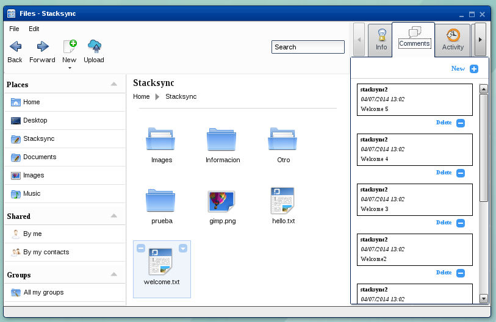

The comments tool lists all comments inserted for a specific element, both those from the element’s owner and from other users who have been given privileges to access the element.  

The data given in a list comment is:  

- name of the user who made the comment 
- creation date/time 
- text entered

Example:  

    <table border="0" cellpadding="0" cellspacing="0" style="border-collapse:collapse;">
        <tr>
            <td style="background-color:#C0C0C0" width="15%">User</td>
            <td width="45%" style="padding-left:15px"><b>stacksync2</b></td>
        </tr>
        <tr>
            <td style="background-color:#C0C0C0">Date / time</td>
            <td style="padding-left:15px">04/07/2014 13:02</td>
        </tr>
        <tr>
            <td style="background-color:#C0C0C0">Text</td>
            <td style="padding-left:15px">Welcome 3</td>
        </tr>
    </table>

  
Other actions that can be performed include insert new comments with the “New” option or delete existing comments with the “Delete” option. The delete option is restricted; only comments made by the user in question can be deleted. Users cannot delete comments made by others. 

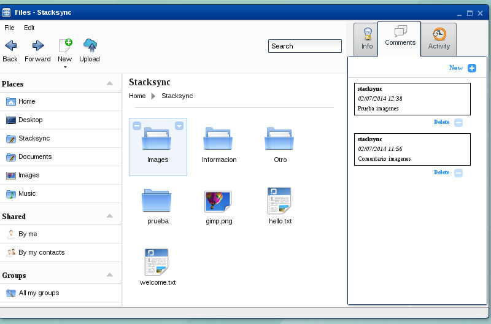

The comments list is not refreshed, as there is no background process that enables new comments to be displayed automatically.

Persistence is implemented in the eyeOS comments tool according to the diagram below:

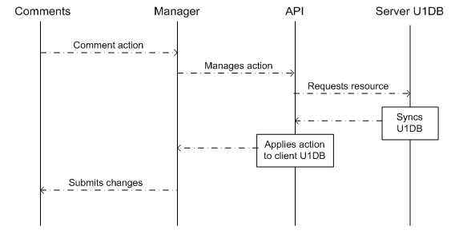

The user performs an action, such as inserts a new comment in the list. The Manager using the createComment function retrieves the user’s credentials. These values are sent to the API together with the data of the new comment. The API is responsible for requesting the resource from the U1DB server using the createComment function. 

If everything is correct, the U1DB server updates the server database and subsequently notifies other clients of the change. The API receives confirmation of the change and applies it to the client U1DB database. Once the updates have been made, it notifies the Manager, which will update the eyeOS interface. 

The createComment functions of the Comment Manager and the Comment API, as well as the other actions performed by the comments tool. Now are described in more detail, respectively:  

**_Comment Manager_**

The Comment Manager API consists of a uniform structure in the script call:  

    <table border="0" cellpadding="0" cellspacing="0" style="border-collapse:collapse;">
        <tr>
            <td style="background-color:#C0C0C0">Parameters:</td>
            <td>
                <ul>
                    <li><b>type</b> – Name of the Python API function</li>
                    <li><b>lista</b> – Parameters of the previous function</li>
                    <li><b>credentials</b> – Credentials for identification during the synchronization process</li>
                </ul>
            </td>
        </tr>
    </table>

The functions are listed and described below.  

**getComments(**_id_**)**

Gets all the comments of a StackSync element.

    <table border="0" cellpadding="0" cellspacing="0" style="border-collapse:collapse;">
        <tr>
            <td style="background-color:#C0C0C0">Parameters:</td>
            <td style="padding-left:30px">
                <b>id</b> – Id of the StackSync element
            </td>
        </tr>
        <tr>
            <td style="background-color:#C0C0C0">Script call:</td>
            <td style="padding-left:30px">
                Example: 
                { 
                &nbsp;&nbsp;&nbsp;&nbsp;"type":"get" , 
                &nbsp;&nbsp;&nbsp;&nbsp;"metadata":[{ 
                &nbsp;&nbsp;&nbsp;&nbsp;&nbsp;&nbsp;&nbsp;&nbsp;&nbsp;&nbsp;&nbsp;&nbsp;&nbsp;&nbsp;&nbsp;&nbsp;&nbsp;&nbsp;&nbsp;"id":"124578", 
                &nbsp;&nbsp;&nbsp;&nbsp;&nbsp;&nbsp;&nbsp;&nbsp;&nbsp;&nbsp;&nbsp;&nbsp;&nbsp;&nbsp;&nbsp;}] 
                &nbsp;&nbsp;&nbsp;&nbsp;"credentials":{ 
                &nbsp;&nbsp;&nbsp;&nbsp;&nbsp;&nbsp;&nbsp;&nbsp;&nbsp;&nbsp;&nbsp;&nbsp;&nbsp;&nbsp;&nbsp;&nbsp;&nbsp;&nbsp;&nbsp;”oauth”:{ 
                &nbsp;&nbsp;&nbsp;&nbsp;&nbsp;&nbsp;&nbsp;&nbsp;&nbsp;&nbsp;&nbsp;&nbsp;&nbsp;&nbsp;&nbsp;&nbsp;&nbsp;&nbsp;&nbsp;&nbsp;&nbsp;&nbsp;&nbsp;&nbsp;&nbsp;&nbsp;&nbsp;&nbsp;&nbsp;&nbsp;&nbsp;&nbsp;&nbsp;&nbsp;&nbsp;&nbsp;“consumer_key”:”eyeos”, 
                &nbsp;&nbsp;&nbsp;&nbsp;&nbsp;&nbsp;&nbsp;&nbsp;&nbsp;&nbsp;&nbsp;&nbsp;&nbsp;&nbsp;&nbsp;&nbsp;&nbsp;&nbsp;&nbsp;&nbsp;&nbsp;&nbsp;&nbsp;&nbsp;&nbsp;&nbsp;&nbsp;&nbsp;&nbsp;&nbsp;&nbsp;&nbsp;&nbsp;&nbsp;&nbsp;&nbsp;“consumer_secret”:”eyeosABC”, 
                &nbsp;&nbsp;&nbsp;&nbsp;&nbsp;&nbsp;&nbsp;&nbsp;&nbsp;&nbsp;&nbsp;&nbsp;&nbsp;&nbsp;&nbsp;&nbsp;&nbsp;&nbsp;&nbsp;&nbsp;&nbsp;&nbsp;&nbsp;&nbsp;&nbsp;&nbsp;&nbsp;&nbsp;&nbsp;&nbsp;&nbsp;&nbsp;&nbsp;&nbsp;&nbsp;&nbsp;“token_key”:”eyeostoken”, 
                &nbsp;&nbsp;&nbsp;&nbsp;&nbsp;&nbsp;&nbsp;&nbsp;&nbsp;&nbsp;&nbsp;&nbsp;&nbsp;&nbsp;&nbsp;&nbsp;&nbsp;&nbsp;&nbsp;&nbsp;&nbsp;&nbsp;&nbsp;&nbsp;&nbsp;&nbsp;&nbsp;&nbsp;&nbsp;&nbsp;&nbsp;&nbsp;&nbsp;&nbsp;&nbsp;&nbsp;“token_secret”:”eyeosDEF” 
                &nbsp;&nbsp;&nbsp;&nbsp;&nbsp;&nbsp;&nbsp;&nbsp;&nbsp;&nbsp;&nbsp;&nbsp;&nbsp;&nbsp;&nbsp;&nbsp;&nbsp;&nbsp;&nbsp;&nbsp;&nbsp;&nbsp;&nbsp;&nbsp;&nbsp;&nbsp;&nbsp;&nbsp;&nbsp;&nbsp;&nbsp;&nbsp;&nbsp;} 
                &nbsp;&nbsp;&nbsp;&nbsp;&nbsp;&nbsp;&nbsp;&nbsp;&nbsp;&nbsp;&nbsp;&nbsp;&nbsp;&nbsp;&nbsp;&nbsp;&nbsp;&nbsp;&nbsp;&nbsp;&nbsp;&nbsp;&nbsp;&nbsp;&nbsp;&nbsp;&nbsp;} 
                } 
            </td>
        </tr>
        <tr>
            <td style="background-color:#C0C0C0">Return:</td>
            <td style="padding-left:30px">
                Array containing all comments, in JSON format or, in the event of error, returns an error structure: 
                - error: Error number 
                Example: 
                [{ 
		&nbsp;&nbsp;&nbsp;“id”:”1245789”, 
		&nbsp;&nbsp;&nbsp;”user”:”eyeos”, 
		&nbsp;&nbsp;&nbsp;”time_created”:”20140702124055”, 
		&nbsp;&nbsp;&nbsp;”status”:”NEW”, 
		&nbsp;&nbsp;&nbsp;”text”: ”Comment 1”
		}] 
                [{“error”:-1,”description”:”Error getComments”}]
            </td>
        </tr>
    </table>

  
  
**createComment(**_id,user,text_**)**

Links a new comment to a specific StackSync element.

    <table border="0" cellpadding="0" cellspacing="0" style="border-collapse:collapse;">
        <tr>
            <td style="background-color:#C0C0C0">Parameters:</td>
            <td style="padding-left:30px">
                <b>id</b> – Id of the StackSync element 
                <b>user</b> – Name of the user inserting a comment 
                <b>text</b> – Text of the comment
            </td>
        </tr>
        <tr>
            <td style="background-color:#C0C0C0">Script call:</td>
            <td style="padding-left:30px">
                Example: 
                { 
                &nbsp;&nbsp;&nbsp;&nbsp;"type":"create" , 
                &nbsp;&nbsp;&nbsp;&nbsp;"metadata":[{ 
                &nbsp;&nbsp;&nbsp;&nbsp;&nbsp;&nbsp;&nbsp;&nbsp;&nbsp;&nbsp;&nbsp;&nbsp;&nbsp;&nbsp;&nbsp;&nbsp;&nbsp;&nbsp;&nbsp;"id":"124578", 
                &nbsp;&nbsp;&nbsp;&nbsp;&nbsp;&nbsp;&nbsp;&nbsp;&nbsp;&nbsp;&nbsp;&nbsp;&nbsp;&nbsp;&nbsp;&nbsp;&nbsp;&nbsp;&nbsp;"user":"eyeos", 
                &nbsp;&nbsp;&nbsp;&nbsp;&nbsp;&nbsp;&nbsp;&nbsp;&nbsp;&nbsp;&nbsp;&nbsp;&nbsp;&nbsp;&nbsp;&nbsp;&nbsp;&nbsp;&nbsp;"text":"Comment 1",                 
                &nbsp;&nbsp;&nbsp;&nbsp;&nbsp;&nbsp;&nbsp;&nbsp;&nbsp;&nbsp;&nbsp;&nbsp;&nbsp;&nbsp;&nbsp;}] 
                &nbsp;&nbsp;&nbsp;&nbsp;"credentials":{ 
                &nbsp;&nbsp;&nbsp;&nbsp;&nbsp;&nbsp;&nbsp;&nbsp;&nbsp;&nbsp;&nbsp;&nbsp;&nbsp;&nbsp;&nbsp;&nbsp;&nbsp;&nbsp;&nbsp;”oauth”:{ 
                &nbsp;&nbsp;&nbsp;&nbsp;&nbsp;&nbsp;&nbsp;&nbsp;&nbsp;&nbsp;&nbsp;&nbsp;&nbsp;&nbsp;&nbsp;&nbsp;&nbsp;&nbsp;&nbsp;&nbsp;&nbsp;&nbsp;&nbsp;&nbsp;&nbsp;&nbsp;&nbsp;&nbsp;&nbsp;&nbsp;&nbsp;&nbsp;&nbsp;&nbsp;&nbsp;&nbsp;“consumer_key”:”eyeos”, 
                &nbsp;&nbsp;&nbsp;&nbsp;&nbsp;&nbsp;&nbsp;&nbsp;&nbsp;&nbsp;&nbsp;&nbsp;&nbsp;&nbsp;&nbsp;&nbsp;&nbsp;&nbsp;&nbsp;&nbsp;&nbsp;&nbsp;&nbsp;&nbsp;&nbsp;&nbsp;&nbsp;&nbsp;&nbsp;&nbsp;&nbsp;&nbsp;&nbsp;&nbsp;&nbsp;&nbsp;“consumer_secret”:”eyeosABC”, 
                &nbsp;&nbsp;&nbsp;&nbsp;&nbsp;&nbsp;&nbsp;&nbsp;&nbsp;&nbsp;&nbsp;&nbsp;&nbsp;&nbsp;&nbsp;&nbsp;&nbsp;&nbsp;&nbsp;&nbsp;&nbsp;&nbsp;&nbsp;&nbsp;&nbsp;&nbsp;&nbsp;&nbsp;&nbsp;&nbsp;&nbsp;&nbsp;&nbsp;&nbsp;&nbsp;&nbsp;“token_key”:”eyeostoken”, 
                &nbsp;&nbsp;&nbsp;&nbsp;&nbsp;&nbsp;&nbsp;&nbsp;&nbsp;&nbsp;&nbsp;&nbsp;&nbsp;&nbsp;&nbsp;&nbsp;&nbsp;&nbsp;&nbsp;&nbsp;&nbsp;&nbsp;&nbsp;&nbsp;&nbsp;&nbsp;&nbsp;&nbsp;&nbsp;&nbsp;&nbsp;&nbsp;&nbsp;&nbsp;&nbsp;&nbsp;“token_secret”:”eyeosDEF” 
                &nbsp;&nbsp;&nbsp;&nbsp;&nbsp;&nbsp;&nbsp;&nbsp;&nbsp;&nbsp;&nbsp;&nbsp;&nbsp;&nbsp;&nbsp;&nbsp;&nbsp;&nbsp;&nbsp;&nbsp;&nbsp;&nbsp;&nbsp;&nbsp;&nbsp;&nbsp;&nbsp;&nbsp;&nbsp;&nbsp;&nbsp;&nbsp;&nbsp;} 
                &nbsp;&nbsp;&nbsp;&nbsp;&nbsp;&nbsp;&nbsp;&nbsp;&nbsp;&nbsp;&nbsp;&nbsp;&nbsp;&nbsp;&nbsp;&nbsp;&nbsp;&nbsp;&nbsp;&nbsp;&nbsp;&nbsp;&nbsp;&nbsp;&nbsp;&nbsp;&nbsp;} 
                } 
            </td>
        </tr>
        <tr>
            <td style="background-color:#C0C0C0">Return:</td>
            <td style="padding-left:30px">
                Metadata of the comment, in JSON format or, in the event of error, returns an error structure: 
                - error: Error number 
                - description: Error description 
                Example: 
                [{ 
		&nbsp;&nbsp;&nbsp;“id”:”1245789”, 
		&nbsp;&nbsp;&nbsp;”user”:”eyeos”, 
		&nbsp;&nbsp;&nbsp;”time_created”:”20140702124944”, 
		&nbsp;&nbsp;&nbsp;”status”:”NEW”, 
		&nbsp;&nbsp;&nbsp;”text”: ”Comment 1”
		}] 
                {“error”:-1,”description”:”Error create comment”}
            </td>
        </tr>
    </table>

  
  
**deleteComments(**_id,user,time_created_**)**

Deletes a comment of a specific StackSync element.

    <table border="0" cellpadding="0" cellspacing="0" style="border-collapse:collapse;">
        <tr>
            <td style="background-color:#C0C0C0">Parameters:</td>
            <td style="padding-left:30px">
                <b>id</b> – Id of the StackSync element 
                <b>user</b> – Name of the user inserting a comment 
                <b>time_created</b> – Date and time when the comment was created. YYYYmmddHHMMSS format
            </td>
        </tr>
        <tr>
            <td style="background-color:#C0C0C0">Script call:</td>
            <td style="padding-left:30px">
                Example: 
                { 
                &nbsp;&nbsp;&nbsp;&nbsp;"type":"delete" , 
                &nbsp;&nbsp;&nbsp;&nbsp;"metadata":[{ 
                &nbsp;&nbsp;&nbsp;&nbsp;&nbsp;&nbsp;&nbsp;&nbsp;&nbsp;&nbsp;&nbsp;&nbsp;&nbsp;&nbsp;&nbsp;&nbsp;&nbsp;&nbsp;&nbsp;"id":"124578", 
                &nbsp;&nbsp;&nbsp;&nbsp;&nbsp;&nbsp;&nbsp;&nbsp;&nbsp;&nbsp;&nbsp;&nbsp;&nbsp;&nbsp;&nbsp;&nbsp;&nbsp;&nbsp;&nbsp;"user":"eyeos", 
                &nbsp;&nbsp;&nbsp;&nbsp;&nbsp;&nbsp;&nbsp;&nbsp;&nbsp;&nbsp;&nbsp;&nbsp;&nbsp;&nbsp;&nbsp;&nbsp;&nbsp;&nbsp;&nbsp;"time_created":"20140702124944",                 
                &nbsp;&nbsp;&nbsp;&nbsp;&nbsp;&nbsp;&nbsp;&nbsp;&nbsp;&nbsp;&nbsp;&nbsp;&nbsp;&nbsp;&nbsp;}] 
                &nbsp;&nbsp;&nbsp;&nbsp;"credentials":{ 
                &nbsp;&nbsp;&nbsp;&nbsp;&nbsp;&nbsp;&nbsp;&nbsp;&nbsp;&nbsp;&nbsp;&nbsp;&nbsp;&nbsp;&nbsp;&nbsp;&nbsp;&nbsp;&nbsp;”oauth”:{ 
                &nbsp;&nbsp;&nbsp;&nbsp;&nbsp;&nbsp;&nbsp;&nbsp;&nbsp;&nbsp;&nbsp;&nbsp;&nbsp;&nbsp;&nbsp;&nbsp;&nbsp;&nbsp;&nbsp;&nbsp;&nbsp;&nbsp;&nbsp;&nbsp;&nbsp;&nbsp;&nbsp;&nbsp;&nbsp;&nbsp;&nbsp;&nbsp;&nbsp;&nbsp;&nbsp;&nbsp;“consumer_key”:”eyeos”, 
                &nbsp;&nbsp;&nbsp;&nbsp;&nbsp;&nbsp;&nbsp;&nbsp;&nbsp;&nbsp;&nbsp;&nbsp;&nbsp;&nbsp;&nbsp;&nbsp;&nbsp;&nbsp;&nbsp;&nbsp;&nbsp;&nbsp;&nbsp;&nbsp;&nbsp;&nbsp;&nbsp;&nbsp;&nbsp;&nbsp;&nbsp;&nbsp;&nbsp;&nbsp;&nbsp;&nbsp;“consumer_secret”:”eyeosABC”, 
                &nbsp;&nbsp;&nbsp;&nbsp;&nbsp;&nbsp;&nbsp;&nbsp;&nbsp;&nbsp;&nbsp;&nbsp;&nbsp;&nbsp;&nbsp;&nbsp;&nbsp;&nbsp;&nbsp;&nbsp;&nbsp;&nbsp;&nbsp;&nbsp;&nbsp;&nbsp;&nbsp;&nbsp;&nbsp;&nbsp;&nbsp;&nbsp;&nbsp;&nbsp;&nbsp;&nbsp;“token_key”:”eyeostoken”, 
                &nbsp;&nbsp;&nbsp;&nbsp;&nbsp;&nbsp;&nbsp;&nbsp;&nbsp;&nbsp;&nbsp;&nbsp;&nbsp;&nbsp;&nbsp;&nbsp;&nbsp;&nbsp;&nbsp;&nbsp;&nbsp;&nbsp;&nbsp;&nbsp;&nbsp;&nbsp;&nbsp;&nbsp;&nbsp;&nbsp;&nbsp;&nbsp;&nbsp;&nbsp;&nbsp;&nbsp;“token_secret”:”eyeosDEF” 
                &nbsp;&nbsp;&nbsp;&nbsp;&nbsp;&nbsp;&nbsp;&nbsp;&nbsp;&nbsp;&nbsp;&nbsp;&nbsp;&nbsp;&nbsp;&nbsp;&nbsp;&nbsp;&nbsp;&nbsp;&nbsp;&nbsp;&nbsp;&nbsp;&nbsp;&nbsp;&nbsp;&nbsp;&nbsp;&nbsp;&nbsp;&nbsp;&nbsp;} 
                &nbsp;&nbsp;&nbsp;&nbsp;&nbsp;&nbsp;&nbsp;&nbsp;&nbsp;&nbsp;&nbsp;&nbsp;&nbsp;&nbsp;&nbsp;&nbsp;&nbsp;&nbsp;&nbsp;&nbsp;&nbsp;&nbsp;&nbsp;&nbsp;&nbsp;&nbsp;&nbsp;} 
                } 
            </td>
        </tr>
        <tr>
            <td style="background-color:#C0C0C0">Return:</td>
            <td style="padding-left:30px">
                Result structure: 
                - status:  'OK' if correct or 'KO' in the event of error 
                - error: Error number. Only exists in the event of error 
                Example: 
                {“status”: “OK”} 
                { 
                 &nbsp;&nbsp;&nbsp;&nbsp;&nbsp;&nbsp;&nbsp;“status”: “KO”, 
                 &nbsp;&nbsp;&nbsp;&nbsp;&nbsp;&nbsp;&nbsp;“error”: -1 
                }
            </td>
        </tr>
    </table>

  
  
  
**_Comment API_**

**getComments(**_id_**)**

Gets all comments of a specific StackSync element.

    <table border="0" cellpadding="0" cellspacing="0" style="border-collapse:collapse;">
        <tr>
            <td style="background-color:#C0C0C0">Parameters:</td>
            <td style="padding-left:30px"><b>id</b> – Id of the StackSync element</td>
        </tr>
        <tr>
            <td style="background-color:#C0C0C0">Return:</td>
            <td style="padding-left:30px">Vector containing all comments, in JSON format or, in the event of error, returns an error structure: 
                - error: Error number 
                - description: Error description 
                Example: 
                [{ 
		&nbsp;&nbsp;&nbsp;“id”:”1245789”, 
		&nbsp;&nbsp;&nbsp;”user”:”eyeos”, 
		&nbsp;&nbsp;&nbsp;”time_created”:”20140702124944”, 
		&nbsp;&nbsp;&nbsp;”status”:”NEW”, 
		&nbsp;&nbsp;&nbsp;”text”: ”Comment 1”
		}] 
                [{“error”:-1,”description”:”Error getComments”}]
            </td>
        </tr>
    </table>

  
  
**createComment(**_id,user,text,time_created_**)**

Links a new comment to a specific StackSync element.

    <table border="0" cellpadding="0" cellspacing="0" style="border-collapse:collapse;">
        <tr>
            <td style="background-color:#C0C0C0">Parameters:</td>
            <td style="padding-left:30px">
                <b>id</b> – Id of the StackSync element 
                <b>user</b> – Name of the user inserting a comment 
                <b>text</b> – Text of the comment 
                <b>time_created</b> – Date and time when the comment was created. YYYYmmddHHMMSS format (Optional)                
            </td>
        </tr>
        <tr>
            <td style="background-color:#C0C0C0">Return:</td>
            <td style="padding-left:30px">Metadata of the comment, in JSON format or, in the event of error, returns an error structure: 
                - error: Error number 
                - description: Error description 
                Example: 
                [{ 
		&nbsp;&nbsp;&nbsp;“id”:”1245789”, 
		&nbsp;&nbsp;&nbsp;”user”:”eyeos”, 
		&nbsp;&nbsp;&nbsp;”time_created”:”20140702124055”, 
		&nbsp;&nbsp;&nbsp;”status”:”NEW”, 
		&nbsp;&nbsp;&nbsp;”text”: ”Comment 1”
		}] 
                {“error”:-1,”description”:”Error create comment”}
            </td>
        </tr>
    </table>

  
  
**deleteComment(**_id,user,time_created_**)**

Deletes a comment from a specific StackSync element.

    <table border="0" cellpadding="0" cellspacing="0" style="border-collapse:collapse;">
        <tr>
            <td style="background-color:#C0C0C0">Parameters:</td>
            <td style="padding-left:30px">
                <b>id</b> – Id of the StackSync element 
                <b>user</b> – Name of the user inserting a comment 
                <b>time_created</b> – Date and time when the comment was created. YYYYmmddHHMMSS format (Optional)                
            </td>
        </tr>
        <tr>
            <td style="background-color:#C0C0C0">Return:</td>
            <td style="padding-left:30px">Result structure: 
                - status:  'OK' if correct or 'KO' in the event of error 
                - error: Error number. Only exists in the event of error 
                Example: 
                {“status”: “OK”} 
                { 
                 &nbsp;&nbsp;&nbsp;&nbsp;&nbsp;&nbsp;&nbsp;“status”: “KO”, 
                 &nbsp;&nbsp;&nbsp;&nbsp;&nbsp;&nbsp;&nbsp;“error”: -1 
                }

            </td>
        </tr>
    </table>

  

## Implementation of StackSync API into eyeOS

Within the eyeOS Personal Web Desktop, one of the key features of the platform is file management. eyeOS includes a web file manager developed in JavaScript, HTML and CSS that enables users to manage all their files directly from their browser, but with an experience similar to a file manager of any desktop operating system, such as Microsoft Windows™ or GNU/Linux.

By integrating Personal Cloud services in the eyeOS platform, users can use eyeOS’ web file manager and all its features with their Personal Cloud files. For example, users can display online their documents saved in their Personal Cloud, create directories, move files, share documents, etc.  

Users access the files in their Personal Cloud using the StackSync directory. To get the file and directory structure of Personal Cloud, a call is made to StackSync’s API. This call returns metadata with all the structural information of the files and directories, which eyeOS uses to generate a local replica.  

The files and directories are created without content. When the user selects an element and performs an operation on it, i.e. opens, moves or copies it, the element's contents are downloaded. By doing this, the system is not overloaded unnecessarily by retrieving information that the user will not use at that moment. If the content of a file or directory has already been retrieved and there are no changes, it will not be updated.  

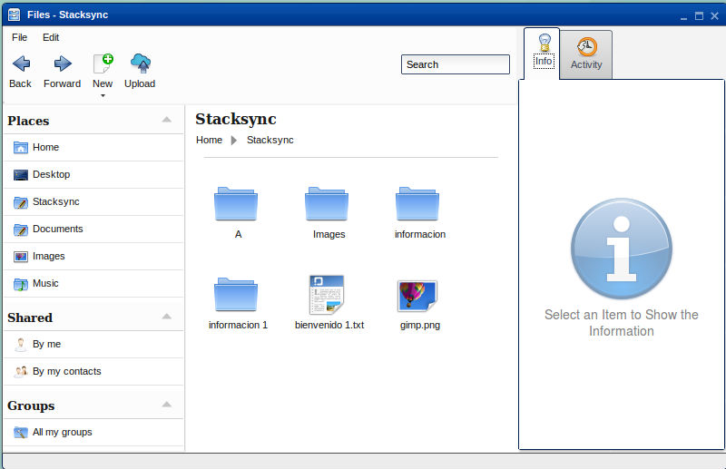

The file manager can retrieve previous versions of a file. It shows a list of all the available versions of the file, letting the user retrieve the contents of the desired version.   

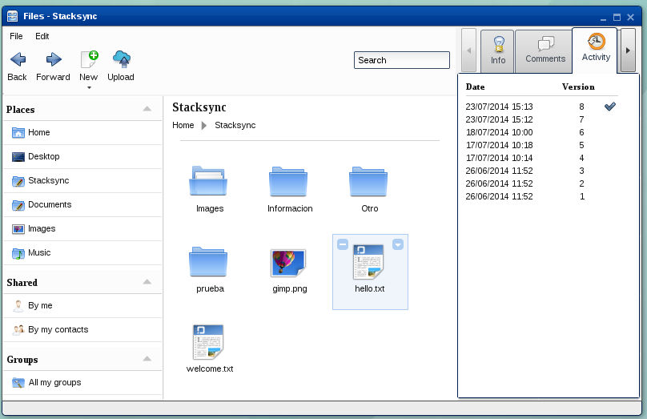

If the user makes changes to a previous version, when those changes are saved, a new version is created in Personal Cloud.

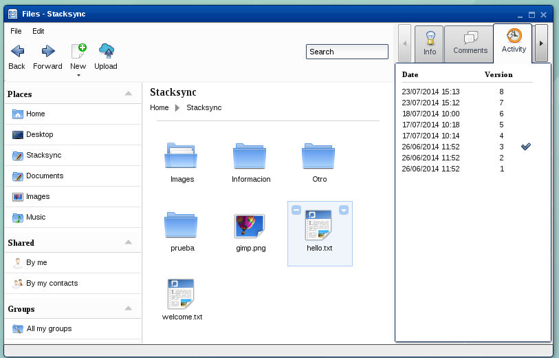

The contents of the current directory are synced with the Personal Cloud directory in a background process, which sends queries every 10 seconds to check whether there are any changes. If there are any changes, the current structure is updated.  

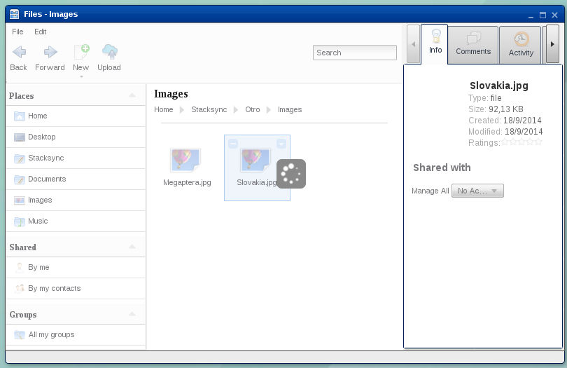  
  
  
###Authentication

The eyeOS platform uses OAuth authentication in order to interact with the user’s protected data stored in Personal Cloud. OAuth is an authorization protocol that enables the user (resource owner) to authorize eyeOS to access the resources on their behalf without giving eyeOS their authentication credentials i.e. user name and password. 

  
When the eyeOS user accesses the file manager for the first time, a newly developed plugin is used to get a security token with which the keys required for interacting with user data stored in Personal Cloud can be obtained.  The Access Token and Token Secret keys are stored in the ‘token’ table of the relational database management system (RDBMS) based on MySQL. These keys are linked with the user who has logged into the platform, meaning the system can determine the access token for a given user who attempts to use the service at any stage.

The communication dialog is as follows:

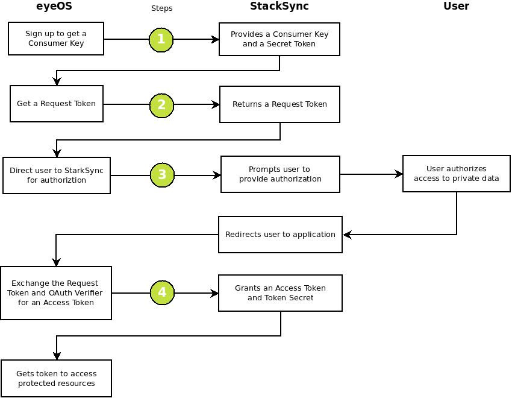

**Step 1**:

Request from StackSync the consumer key and secret token that identifies eyeOS as the CloudSpaces resource consumer.This communication is done via email.

**Step 2**:

Get the request token and provide StackSync with the redirect URL to eyeOS once the user grants authorization.
StackSync responds to the previous request by giving a valid request token and an authorization URL.

**Step 3**:

Redirect the user to the authorization URL where the user grants eyeOS access to their private space.
Once StackSync verifies the user, it redirects the user to the eyeOS URL provided in the previous step.

**Step 4**:

Get the access token and token secret from StackSync, with which eyeOS will identify itself when accessing the user’s private space in CloudSpaces.

Authentication is implemented in eyeOS according to the diagram below:

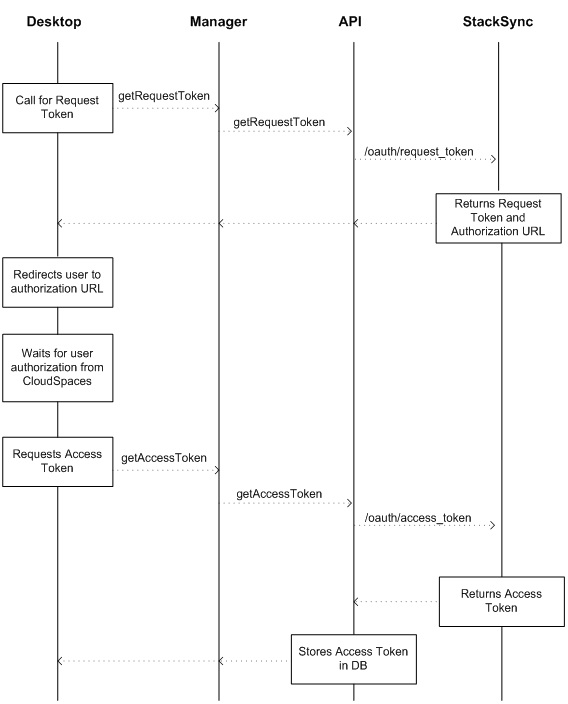

The OAuth Manager and OAuth API functions now are described, respectively:

**_OAuth Manager_**

**getRequestToken()**

Gets the request token of the eyeOS consumer.

    <table border="0" cellpadding="0" cellspacing="0" style="border-collapse:collapse;">
        <tr>
            <td style="background-color:#C0C0C0">Script call:</td>
            <td style="padding-left:30px">
                No parameters
            </td>
        </tr>
        <tr>
            <td style="background-color:#C0C0C0">Return:</td>
            <td style="padding-left:30px">
            Object token or in case of error null 
            Example: 
            { 
            &nbsp;"key": "token1234", 
            &nbsp;"secret": "secret1234" 
            }
            </td>
        </tr>
    </table>

  

**getAccessToken(**_token_**)**

Get the access token of eyeOS consumer from the request token.

    <table border="0" cellpadding="0" cellspacing="0" style="border-collapse:collapse;">
        <tr>
            <td style="background-color:#C0C0C0">Parameters:</td>
            <td style="padding-left:30px">
                <b>token</b> – Contains the request token and user authorization
            </td>
        </tr>
        <tr>
            <td style="background-color:#C0C0C0">Script call:</td>
            <td style="padding-left:30px">
                Example: 
                { 
                &nbsp;"token":{ 
                &nbsp;&nbsp;&nbsp;&nbsp;&nbsp;&nbsp;&nbsp;&nbsp;&nbsp;&nbsp;&nbsp;&nbsp;&nbsp;&nbsp;&nbsp;&nbsp;&nbsp;&nbsp;&nbsp;"key":"token1234", 
                &nbsp;&nbsp;&nbsp;&nbsp;&nbsp;&nbsp;&nbsp;&nbsp;&nbsp;&nbsp;&nbsp;&nbsp;&nbsp;&nbsp;&nbsp;&nbsp;&nbsp;&nbsp;&nbsp;"secret":"secret1234", 
                &nbsp;&nbsp;&nbsp;&nbsp;&nbsp;&nbsp;&nbsp;&nbsp;&nbsp;&nbsp;&nbsp;&nbsp;&nbsp;&nbsp;&nbsp;&nbsp;&nbsp;}, 
                &nbsp;"verifier":"userVerifier" 
                }
            </td>
        </tr>
        <tr>
            <td style="background-color:#C0C0C0">Return:</td>
            <td style="padding-left:30px">
            Token object or in the event of error, null 
            Example: 
            { 
            &nbsp;"key": "access1234", 
            &nbsp;"secret": "access1234" 
            }
            </td>
        </tr>
    </table>

  
  
  
**_OAuth API_**

The configuration file of the OAuth API is found at “/var/www/eyeos/eyeos/extern/u1db/” and is called “settings.py”.

**getRequestToken(**_oauth_**)**

Gets the request token of the eyeOS consumer.

    <table border="0" cellpadding="0" cellspacing="0" style="border-collapse:collapse;">
        <tr>
            <td style="background-color:#C0C0C0">Url:</td>
            <td style="padding-left:30px">
                Use REQUEST_TOKEN_URL of the configuration file.
            </td>
        </tr>
        <tr>
            <td style="background-color:#C0C0C0">Method:</td>
            <td style="padding-left:30px">
                GET
            </td>
        </tr>
        <tr>
            <td style="background-color:#C0C0C0">Signature:</td>
            <td style="padding-left:30px">
                Plaintext
            </td>
        </tr>
        <tr>
            <td style="background-color:#C0C0C0">Parameters:</td>
            <td style="padding-left:30px">
                <b>oauth</b> – OauthRequest object. Contains the values of the consumer key, consumer secret and CALLBACK_URL of the configuration file
            </td>
        </tr>
        <tr>
            <td style="background-color:#C0C0C0">Return:</td>
            <td style="padding-left:30px">
            Key and secret of the request token or, in the event of error, returns an error structure: 
            - error: Error number 
            - description: Error description 
            Example: 
            {"oauth_token":"token1234","oauth_token_secret":"secret1234"} 
            {"error":401, "description": "Authorization required."}
            </td>
        </tr>
    </table>

**getAccessToken(**_oauth_**)**

Gets the access token of the eyeOS consumer from the request token stored.

    <table border="0" cellpadding="0" cellspacing="0" style="border-collapse:collapse;">
        <tr>
            <td style="background-color:#C0C0C0">Url:</td>
            <td style="padding-left:30px">
                Use ACCESS_TOKEN_URL of the configuration file.
            </td>
        </tr>
        <tr>
            <td style="background-color:#C0C0C0">Method:</td>
            <td style="padding-left:30px">
                GET
            </td>
        </tr>
        <tr>
            <td style="background-color:#C0C0C0">Signature:</td>
            <td style="padding-left:30px">
                Plaintext
            </td>
        </tr>
        <tr>
            <td style="background-color:#C0C0C0">Parameters:</td>
            <td style="padding-left:30px">
                <b>oauth</b> – OauthRequest object. Includes the values of consumer key and consumer secret of the configuration file. And also the request token and verifier received from StackSync.
            </td>
        </tr>
        <tr>
            <td style="background-color:#C0C0C0">Return:</td>
            <td style="padding-left:30px">
            Key and secret of the access token or, in the event of error, returns an error structure: 
            - error: Error number 
            - description: Error description 
            Example: 
            {"oauth_token":"token1234","oauth_token_secret":"secret1234"} 
            {"error":401, "description": "Authorization required."}
            </td>
        </tr>
    </table>

  

If the user has not previously granted eyeOS access to their CloudSpaces private space, when they access the file manager, the authentication process is initiated, as shown in the following screens:  

+ The user is asked if they want to grant eyeOS access to their protected data.

    

+ If the user selects “No”, the eyeOS file structure is shown without the StackSync directory, which contains the user’s protected data in CloudSpaces.

    

+ If the user selects “Yes” in the first screen of the process, communication is established with StackSync to get the access token.

    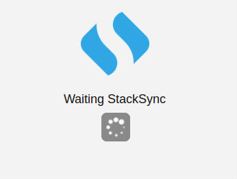

+ A new browser window is pops up in which the user is redirected to the authorization URL received from StackSync. Here the user authorizes eyeOS to access their private space.

    

+ Once access has been authorized, StackSync redirects the user to the URL provided by eyeOS on requesting the request token. This page notifies the user that the process has been completed successfully and that they can return to the eyeOS desktop.

    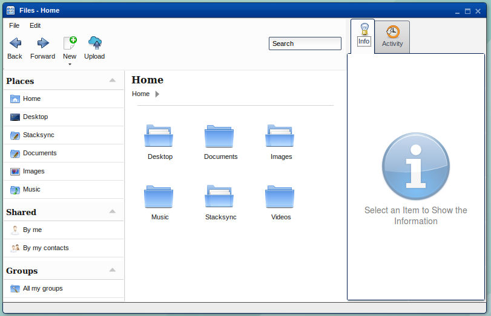

+ The access token for the current eyeOS user is saved. From this moment, the user can access their protected data from the StackSync directory without having to authenticate again.

    

During the authentication process, various exceptions may be triggered, which interrupt the process to get the access token. These errors are described below:

+ Communication error. This may occur on sending or receiving data from StackSync.

    

+ Timeout exceeded for receiving the user’s authorization to access their private space. eyeOS establishes a timeout of 1 minute. The process to request the request token can be restarted or interrupted.

    

+ Access denied as an invalid access token was sent to StackSync. The access token does not expire and is stored permanently in eyeOS. This error occurs when the users deletes the access token from the StackSync portal.

    

### Storage

To integrate the Personal Cloud storage service within eyeOS, the Storage Manager and the Storage API have been created. The Storage API communicates with the StackSync API v2, which manages all the requests made from the file manager.   

Storage is implemented in eyeOS according to the diagram below:  

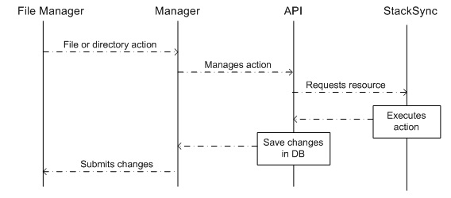

The user performs an action in the file manager, such as opening a directory. The Storage Manager using the getMetadata function retrieves the user’s access token and id for the directory in StackSync. These values are sent to the API, which is responsible for requesting the resource from StackSync using the getMetadata function. The file structure of the directory is retrieved and stored in the database, and the Manager is notified of the new structure, which will update the eyeOS interface.  

The getMetadata functions of the Storage Manager and the Storage API, as well as the other actions performed by the file manager. Now are described in more detail, respectively:  

**_Storage Manager_**

**getMetadata(**_token,id,path,user_**)**

Gets metadata for the current element. Generates its file structure and/or directories in eyeOS.

    <table border="0" cellpadding="0" cellspacing="0" style="border-collapse:collapse;">
        <tr>
            <td style="background-color:#C0C0C0">Parameters:</td>
            <td style="padding-left:30px">
                <b>token</b> – Includes key and secret of the access token 
                <b>id</b> – Id number of the element in StackSync 
                <b>path</b> – eyeOS path 
                <b>user</b> – eyeOS user identifier               
            </td>
        </tr>
        <tr>
            <td style="background-color:#C0C0C0">Script call:</td>
            <td style="padding-left:30px">
                Example: 
                { 
                &nbsp;"token":{ 
                &nbsp;&nbsp;&nbsp;&nbsp;&nbsp;&nbsp;&nbsp;&nbsp;&nbsp;&nbsp;&nbsp;&nbsp;&nbsp;&nbsp;&nbsp;&nbsp;&nbsp;&nbsp;&nbsp;"key":"token1234", 
                &nbsp;&nbsp;&nbsp;&nbsp;&nbsp;&nbsp;&nbsp;&nbsp;&nbsp;&nbsp;&nbsp;&nbsp;&nbsp;&nbsp;&nbsp;&nbsp;&nbsp;&nbsp;&nbsp;"secret":"secret1234", 
                &nbsp;&nbsp;&nbsp;&nbsp;&nbsp;&nbsp;&nbsp;&nbsp;&nbsp;&nbsp;&nbsp;&nbsp;&nbsp;&nbsp;&nbsp;&nbsp;&nbsp;}, 
                &nbsp;"metadata":{ 
                &nbsp;&nbsp;&nbsp;&nbsp;&nbsp;&nbsp;&nbsp;&nbsp;&nbsp;&nbsp;&nbsp;&nbsp;&nbsp;&nbsp;&nbsp;&nbsp;&nbsp;&nbsp;&nbsp;&nbsp;&nbsp;&nbsp;&nbsp;&nbsp;&nbsp;&nbsp;"type":"get",  
                &nbsp;&nbsp;&nbsp;&nbsp;&nbsp;&nbsp;&nbsp;&nbsp;&nbsp;&nbsp;&nbsp;&nbsp;&nbsp;&nbsp;&nbsp;&nbsp;&nbsp;&nbsp;&nbsp;&nbsp;&nbsp;&nbsp;&nbsp;&nbsp;&nbsp;&nbsp;"file":false, 
                &nbsp;&nbsp;&nbsp;&nbsp;&nbsp;&nbsp;&nbsp;&nbsp;&nbsp;&nbsp;&nbsp;&nbsp;&nbsp;&nbsp;&nbsp;&nbsp;&nbsp;&nbsp;&nbsp;&nbsp;&nbsp;&nbsp;&nbsp;&nbsp;&nbsp;&nbsp;"id":155241412, 
                &nbsp;&nbsp;&nbsp;&nbsp;&nbsp;&nbsp;&nbsp;&nbsp;&nbsp;&nbsp;&nbsp;&nbsp;&nbsp;&nbsp;&nbsp;&nbsp;&nbsp;&nbsp;&nbsp;&nbsp;&nbsp;&nbsp;&nbsp;&nbsp;&nbsp;&nbsp;"contents":true 
                &nbsp;&nbsp;&nbsp;&nbsp;&nbsp;&nbsp;&nbsp;&nbsp;&nbsp;&nbsp;&nbsp;&nbsp;&nbsp;&nbsp;&nbsp;&nbsp;&nbsp;&nbsp;&nbsp;&nbsp;&nbsp;&nbsp;&nbsp;&nbsp;&nbsp;} 
                }
            </td>
        </tr>
        <tr>
            <td style="background-color:#C0C0C0">Return:</td>
            <td style="padding-left:30px">
            Metadatas or, in the event of error, returns an error structure: 
            - error: Error number 
            Example: 
            {"filename":"clients", 
            &nbsp;&nbsp;"id":155241412, 
            &nbsp;&nbsp;"status":"NEW", 
            &nbsp;&nbsp;"version":1, 
            &nbsp;&nbsp;"parent_id":"null", 
            &nbsp;&nbsp;"user":"eyeos", 
            &nbsp;&nbsp;“modified_at”: "2013-03-08 10:36:41.997", 
            &nbsp;&nbsp;"is_root":false,             
            &nbsp;&nbsp;"is_folder":true, 
            &nbsp;&nbsp;"contents":[{ 
            &nbsp;&nbsp;&nbsp;&nbsp;&nbsp;&nbsp;&nbsp;&nbsp;&nbsp;&nbsp;&nbsp;&nbsp;&nbsp;&nbsp;&nbsp;&nbsp;&nbsp;&nbsp;&nbsp;&nbsp;&nbsp;&nbsp;&nbsp;&nbsp;"filename":"Client1.pdf", 
            &nbsp;&nbsp;&nbsp;&nbsp;&nbsp;&nbsp;&nbsp;&nbsp;&nbsp;&nbsp;&nbsp;&nbsp;&nbsp;&nbsp;&nbsp;&nbsp;&nbsp;&nbsp;&nbsp;&nbsp;&nbsp;&nbsp;&nbsp;&nbsp;"id":32565632156, 
            &nbsp;&nbsp;&nbsp;&nbsp;&nbsp;&nbsp;&nbsp;&nbsp;&nbsp;&nbsp;&nbsp;&nbsp;&nbsp;&nbsp;&nbsp;&nbsp;&nbsp;&nbsp;&nbsp;&nbsp;&nbsp;&nbsp;&nbsp;&nbsp;"size":775412, 
            &nbsp;&nbsp;&nbsp;&nbsp;&nbsp;&nbsp;&nbsp;&nbsp;&nbsp;&nbsp;&nbsp;&nbsp;&nbsp;&nbsp;&nbsp;&nbsp;&nbsp;&nbsp;&nbsp;&nbsp;&nbsp;&nbsp;&nbsp;&nbsp;"mimetype":"application/pdf", 
            &nbsp;&nbsp;&nbsp;&nbsp;&nbsp;&nbsp;&nbsp;&nbsp;&nbsp;&nbsp;&nbsp;&nbsp;&nbsp;&nbsp;&nbsp;&nbsp;&nbsp;&nbsp;&nbsp;&nbsp;&nbsp;&nbsp;&nbsp;&nbsp;"status":"NEW", 
            &nbsp;&nbsp;&nbsp;&nbsp;&nbsp;&nbsp;&nbsp;&nbsp;&nbsp;&nbsp;&nbsp;&nbsp;&nbsp;&nbsp;&nbsp;&nbsp;&nbsp;&nbsp;&nbsp;&nbsp;&nbsp;&nbsp;&nbsp;&nbsp;"version":1, 
            &nbsp;&nbsp;&nbsp;&nbsp;&nbsp;&nbsp;&nbsp;&nbsp;&nbsp;&nbsp;&nbsp;&nbsp;&nbsp;&nbsp;&nbsp;&nbsp;&nbsp;&nbsp;&nbsp;&nbsp;&nbsp;&nbsp;&nbsp;&nbsp;"parent_id":155241412, 
            &nbsp;&nbsp;&nbsp;&nbsp;&nbsp;&nbsp;&nbsp;&nbsp;&nbsp;&nbsp;&nbsp;&nbsp;&nbsp;&nbsp;&nbsp;&nbsp;&nbsp;&nbsp;&nbsp;&nbsp;&nbsp;&nbsp;&nbsp;&nbsp;"user":"eyeos", 
            &nbsp;&nbsp;&nbsp;&nbsp;&nbsp;&nbsp;&nbsp;&nbsp;&nbsp;&nbsp;&nbsp;&nbsp;&nbsp;&nbsp;&nbsp;&nbsp;&nbsp;&nbsp;&nbsp;&nbsp;&nbsp;&nbsp;&nbsp;&nbsp;"modified_at":"2013-03-08 10:36:41.997", 
            &nbsp;&nbsp;&nbsp;&nbsp;&nbsp;&nbsp;&nbsp;&nbsp;&nbsp;&nbsp;&nbsp;&nbsp;&nbsp;&nbsp;&nbsp;&nbsp;&nbsp;&nbsp;&nbsp;&nbsp;&nbsp;&nbsp;&nbsp;&nbsp;"is_root":false, 
            &nbsp;&nbsp;&nbsp;&nbsp;&nbsp;&nbsp;&nbsp;&nbsp;&nbsp;&nbsp;&nbsp;&nbsp;&nbsp;&nbsp;&nbsp;&nbsp;&nbsp;&nbsp;&nbsp;&nbsp;&nbsp;&nbsp;&nbsp;&nbsp;"is_folder":false, 
            &nbsp;&nbsp;&nbsp;&nbsp;&nbsp;&nbsp;&nbsp;&nbsp;&nbsp;&nbsp;&nbsp;&nbsp;&nbsp;&nbsp;&nbsp;&nbsp;&nbsp;&nbsp;&nbsp;&nbsp;&nbsp;}]", 
            }
            {"error":401}
            </td>
        </tr>
    </table>

  
  
**getSkel(**_token,file,id,metadatas,path,pathAbsolute,pathEyeos_**)**

Recursively gets metadata depending on the current element. This function is used in the copy and move action in eyeOS.

    <table border="0" cellpadding="0" cellspacing="0" style="border-collapse:collapse;">
        <tr>
            <td style="background-color:#C0C0C0">Parameters:</td>
            <td style="padding-left:30px">
                <b>token</b> – Includes key and secret of the access token 
                <b>file</b> – True, if it is a file or False, if it is a directory                 
                <b>id</b> – Id number of the element in StackSync 
                <b>metadatas</b> – Accumulative vector of metadata                 
                <b>path</b> – Relative path of the current element 
                <b>pathAbsolute</b> – eyeOS path 
		<b>pathEyeos</b> – eyeOS path, only used when the destination of the action is outside Personal Cloud                
            </td>
        </tr>
        <tr>
            <td style="background-color:#C0C0C0">Script call:</td>
            <td style="padding-left:30px">
                Example: 
                { 
                &nbsp;"token":{ 
                &nbsp;&nbsp;&nbsp;&nbsp;&nbsp;&nbsp;&nbsp;&nbsp;&nbsp;&nbsp;&nbsp;&nbsp;&nbsp;&nbsp;&nbsp;&nbsp;&nbsp;&nbsp;&nbsp;"key":"token1234", 
                &nbsp;&nbsp;&nbsp;&nbsp;&nbsp;&nbsp;&nbsp;&nbsp;&nbsp;&nbsp;&nbsp;&nbsp;&nbsp;&nbsp;&nbsp;&nbsp;&nbsp;&nbsp;&nbsp;"secret":"secret1234", 
                &nbsp;&nbsp;&nbsp;&nbsp;&nbsp;&nbsp;&nbsp;&nbsp;&nbsp;&nbsp;&nbsp;&nbsp;&nbsp;&nbsp;&nbsp;&nbsp;&nbsp;}, 
                &nbsp;"metadata":{ 
                &nbsp;&nbsp;&nbsp;&nbsp;&nbsp;&nbsp;&nbsp;&nbsp;&nbsp;&nbsp;&nbsp;&nbsp;&nbsp;&nbsp;&nbsp;&nbsp;&nbsp;&nbsp;&nbsp;&nbsp;&nbsp;&nbsp;&nbsp;&nbsp;&nbsp;&nbsp;"type":"get",  
                &nbsp;&nbsp;&nbsp;&nbsp;&nbsp;&nbsp;&nbsp;&nbsp;&nbsp;&nbsp;&nbsp;&nbsp;&nbsp;&nbsp;&nbsp;&nbsp;&nbsp;&nbsp;&nbsp;&nbsp;&nbsp;&nbsp;&nbsp;&nbsp;&nbsp;&nbsp;"file":false, 
                &nbsp;&nbsp;&nbsp;&nbsp;&nbsp;&nbsp;&nbsp;&nbsp;&nbsp;&nbsp;&nbsp;&nbsp;&nbsp;&nbsp;&nbsp;&nbsp;&nbsp;&nbsp;&nbsp;&nbsp;&nbsp;&nbsp;&nbsp;&nbsp;&nbsp;&nbsp;"id":155241412, 
                &nbsp;&nbsp;&nbsp;&nbsp;&nbsp;&nbsp;&nbsp;&nbsp;&nbsp;&nbsp;&nbsp;&nbsp;&nbsp;&nbsp;&nbsp;&nbsp;&nbsp;&nbsp;&nbsp;&nbsp;&nbsp;&nbsp;&nbsp;&nbsp;&nbsp;&nbsp;"contents":true 
                &nbsp;&nbsp;&nbsp;&nbsp;&nbsp;&nbsp;&nbsp;&nbsp;&nbsp;&nbsp;&nbsp;&nbsp;&nbsp;&nbsp;&nbsp;&nbsp;&nbsp;&nbsp;&nbsp;&nbsp;&nbsp;&nbsp;&nbsp;&nbsp;&nbsp;} 
                }
            </td>
        </tr>
        <tr>
            <td style="background-color:#C0C0C0">Return:</td>
            <td style="padding-left:30px">
            Vector of metadata or, in the event of error, returns an error structure: 
            - error: Error number 
            Example: 
            [{"filename":"Client1.pdf", 
            &nbsp;&nbsp;"id":32565632156, 
            &nbsp;&nbsp;"size":775412,             
            &nbsp;&nbsp;"mimetype":"application/pdf", 
            &nbsp;&nbsp;"status":"NEW", 
            &nbsp;&nbsp;"version":1, 
            &nbsp;&nbsp;"parent_id":155241412, 
            &nbsp;&nbsp;"user":"eyeos", 
            &nbsp;&nbsp;"modified_at": "2013-03-08 10:36:41.997", 
            &nbsp;&nbsp;"is_root":false,             
            &nbsp;&nbsp;"is_folder":false}, 
            &nbsp;{"filename":"clients", 
            &nbsp;&nbsp;"id":155241412, 
            &nbsp;&nbsp;"status":"NEW", 
            &nbsp;&nbsp;"version":1, 
            &nbsp;&nbsp;"parent_id":"null", 
            &nbsp;&nbsp;"user":"eyeos", 
            &nbsp;&nbsp;“modified_at”: "2013-03-08 10:36:41.997", 
            &nbsp;&nbsp;"is_root":false, 
            &nbsp;&nbsp;"is_folder":true}] 
            {"error":401}
            </td>
        </tr>
    </table>

  
  
**createMetadata(**_token,user,file,name,parent\_id,path,pathAbsolute_**)**

Creates a new file or directory.

    <table border="0" cellpadding="0" cellspacing="0" style="border-collapse:collapse;">
        <tr>
            <td style="background-color:#C0C0C0">Parameters:</td>
            <td style="padding-left:30px">
                <b>token</b> – Includes key and secret of the access token 
                <b>user</b> – eyeOS user identifier 
                <b>file</b> – True, if it is a file or False, if it is a directory 
                <b>name</b> – Name of the element 
                <b>parent_id</b> – Id of the destination directory 
                <b>path</b> – Relative path of the current element 
                <b>pathAbsolute</b> – Absolute path. Required when the element is a file
            </td>
        </tr>
        <tr>
            <td style="background-color:#C0C0C0">Script call:</td>
            <td style="padding-left:30px">
                Example: 
                { 
                &nbsp;"token":{ 
                &nbsp;&nbsp;&nbsp;&nbsp;&nbsp;&nbsp;&nbsp;&nbsp;&nbsp;&nbsp;&nbsp;&nbsp;&nbsp;&nbsp;&nbsp;&nbsp;&nbsp;&nbsp;&nbsp;"key":"token1234", 
                &nbsp;&nbsp;&nbsp;&nbsp;&nbsp;&nbsp;&nbsp;&nbsp;&nbsp;&nbsp;&nbsp;&nbsp;&nbsp;&nbsp;&nbsp;&nbsp;&nbsp;&nbsp;&nbsp;"secret":"secret1234", 
                &nbsp;&nbsp;&nbsp;&nbsp;&nbsp;&nbsp;&nbsp;&nbsp;&nbsp;&nbsp;&nbsp;&nbsp;&nbsp;&nbsp;&nbsp;&nbsp;&nbsp;}, 
                &nbsp;"metadata":{ 
                &nbsp;&nbsp;&nbsp;&nbsp;&nbsp;&nbsp;&nbsp;&nbsp;&nbsp;&nbsp;&nbsp;&nbsp;&nbsp;&nbsp;&nbsp;&nbsp;&nbsp;&nbsp;&nbsp;&nbsp;&nbsp;&nbsp;&nbsp;&nbsp;&nbsp;&nbsp;"type":"create",  
                &nbsp;&nbsp;&nbsp;&nbsp;&nbsp;&nbsp;&nbsp;&nbsp;&nbsp;&nbsp;&nbsp;&nbsp;&nbsp;&nbsp;&nbsp;&nbsp;&nbsp;&nbsp;&nbsp;&nbsp;&nbsp;&nbsp;&nbsp;&nbsp;&nbsp;&nbsp;"file":true, 
                &nbsp;&nbsp;&nbsp;&nbsp;&nbsp;&nbsp;&nbsp;&nbsp;&nbsp;&nbsp;&nbsp;&nbsp;&nbsp;&nbsp;&nbsp;&nbsp;&nbsp;&nbsp;&nbsp;&nbsp;&nbsp;&nbsp;&nbsp;&nbsp;&nbsp;&nbsp;"filename":"Client.pdf", 
                &nbsp;&nbsp;&nbsp;&nbsp;&nbsp;&nbsp;&nbsp;&nbsp;&nbsp;&nbsp;&nbsp;&nbsp;&nbsp;&nbsp;&nbsp;&nbsp;&nbsp;&nbsp;&nbsp;&nbsp;&nbsp;&nbsp;&nbsp;&nbsp;&nbsp;&nbsp;"parent_id":254885, 
                &nbsp;&nbsp;&nbsp;&nbsp;&nbsp;&nbsp;&nbsp;&nbsp;&nbsp;&nbsp;&nbsp;&nbsp;&nbsp;&nbsp;&nbsp;&nbsp;&nbsp;&nbsp;&nbsp;&nbsp;&nbsp;&nbsp;&nbsp;&nbsp;&nbsp;&nbsp;"path":"/home/eyeos/Documents/Client.pdf"                 
                &nbsp;&nbsp;&nbsp;&nbsp;&nbsp;&nbsp;&nbsp;&nbsp;&nbsp;&nbsp;&nbsp;&nbsp;&nbsp;&nbsp;&nbsp;&nbsp;&nbsp;&nbsp;&nbsp;&nbsp;&nbsp;&nbsp;&nbsp;&nbsp;&nbsp;} 
                }
            </td>
        </tr>
        <tr>
            <td style="background-color:#C0C0C0">Return:</td>
            <td style="padding-left:30px">
            Metadata or, in the event of error, returns an error structure: 
            - error: Error number 
            Example: 
            {"filename":"Client.pdf", 
            &nbsp;&nbsp;"id":32565632111, 
            &nbsp;&nbsp;"size":775412,             
            &nbsp;&nbsp;"mimetype":"application/pdf", 
            &nbsp;&nbsp;"status":"NEW", 
            &nbsp;&nbsp;"version":1, 
            &nbsp;&nbsp;"parent_id":254885, 
            &nbsp;&nbsp;"user":"eyeos", 
            &nbsp;&nbsp;“modified_at”: "2013-03-08 10:36:41.997", 
            &nbsp;&nbsp;"is_root":false,             
            &nbsp;&nbsp;"is_folder":false} 
            {"error":401}
            </td>
        </tr>
    </table>

  
  
**downloadMetadata(**_token,id,path,user,isTmp=false_**)**

Downloads the content of a file.

    <table border="0" cellpadding="0" cellspacing="0" style="border-collapse:collapse;">
        <tr>
            <td style="background-color:#C0C0C0">Parameters:</td>
            <td style="padding-left:30px">
                <b>token</b> – Includes key and secret of the access token 
                <b>id</b> – Id number of the file in Stacksync 
                <b>path</b> – Absolute path 
		<b>user</b> – eyeOS user identifier 
		<b>isTmp</b> – When False, updates the file versions table. When True, no update is performed
            </td>
        </tr>
        <tr>
            <td style="background-color:#C0C0C0">Script call:</td>
            <td style="padding-left:30px">
                Example: 
                { 
                &nbsp;"token":{ 
                &nbsp;&nbsp;&nbsp;&nbsp;&nbsp;&nbsp;&nbsp;&nbsp;&nbsp;&nbsp;&nbsp;&nbsp;&nbsp;&nbsp;&nbsp;&nbsp;&nbsp;&nbsp;&nbsp;"key":"token1234", 
                &nbsp;&nbsp;&nbsp;&nbsp;&nbsp;&nbsp;&nbsp;&nbsp;&nbsp;&nbsp;&nbsp;&nbsp;&nbsp;&nbsp;&nbsp;&nbsp;&nbsp;&nbsp;&nbsp;"secret":"secret1234", 
                &nbsp;&nbsp;&nbsp;&nbsp;&nbsp;&nbsp;&nbsp;&nbsp;&nbsp;&nbsp;&nbsp;&nbsp;&nbsp;&nbsp;&nbsp;&nbsp;&nbsp;}, 
                &nbsp;"metadata":{ 
                &nbsp;&nbsp;&nbsp;&nbsp;&nbsp;&nbsp;&nbsp;&nbsp;&nbsp;&nbsp;&nbsp;&nbsp;&nbsp;&nbsp;&nbsp;&nbsp;&nbsp;&nbsp;&nbsp;&nbsp;&nbsp;&nbsp;&nbsp;&nbsp;&nbsp;&nbsp;"type":"download",  
                &nbsp;&nbsp;&nbsp;&nbsp;&nbsp;&nbsp;&nbsp;&nbsp;&nbsp;&nbsp;&nbsp;&nbsp;&nbsp;&nbsp;&nbsp;&nbsp;&nbsp;&nbsp;&nbsp;&nbsp;&nbsp;&nbsp;&nbsp;&nbsp;&nbsp;&nbsp;"id":32565632111, 
                &nbsp;&nbsp;&nbsp;&nbsp;&nbsp;&nbsp;&nbsp;&nbsp;&nbsp;&nbsp;&nbsp;&nbsp;&nbsp;&nbsp;&nbsp;&nbsp;&nbsp;&nbsp;&nbsp;&nbsp;&nbsp;&nbsp;&nbsp;&nbsp;&nbsp;&nbsp;"path":"/home/eyeos/Documents/Client.pdf"                 
                &nbsp;&nbsp;&nbsp;&nbsp;&nbsp;&nbsp;&nbsp;&nbsp;&nbsp;&nbsp;&nbsp;&nbsp;&nbsp;&nbsp;&nbsp;&nbsp;&nbsp;&nbsp;&nbsp;&nbsp;&nbsp;&nbsp;&nbsp;&nbsp;&nbsp;} 
                }
            </td>
        </tr>
        <tr>
            <td style="background-color:#C0C0C0">Return:</td>
            <td style="padding-left:30px">
            Result structure: 
            - status: 'OK' if correct or 'KO' in the event of error 
            - error: Error number. Only exists in the event of error 
            Example: 
            {"status":"OK"} 
            {"status":"KO","error":-1}
            </td>
        </tr>
    </table>

  
  
**deleteMetadata(**_token,file,id,user,path_**)**

Deletes an existing file or directory.

    <table border="0" cellpadding="0" cellspacing="0" style="border-collapse:collapse;">
        <tr>
            <td style="background-color:#C0C0C0">Parameters:</td>
            <td style="padding-left:30px">
                <b>token</b> – Includes key and secret of the access token 
                <b>file</b> – True, if it is a file or False, if it is a directory 
                <b>id</b> – Id number of the element in Stacksync 
                <b>user</b> – eyeOS useridentifier 
                <b>user</b> – Absolute path
            </td>
        </tr>
        <tr>
            <td style="background-color:#C0C0C0">Script call:</td>
            <td style="padding-left:30px">
                Example: 
                { 
                &nbsp;"token":{ 
                &nbsp;&nbsp;&nbsp;&nbsp;&nbsp;&nbsp;&nbsp;&nbsp;&nbsp;&nbsp;&nbsp;&nbsp;&nbsp;&nbsp;&nbsp;&nbsp;&nbsp;&nbsp;&nbsp;"key":"token1234", 
                &nbsp;&nbsp;&nbsp;&nbsp;&nbsp;&nbsp;&nbsp;&nbsp;&nbsp;&nbsp;&nbsp;&nbsp;&nbsp;&nbsp;&nbsp;&nbsp;&nbsp;&nbsp;&nbsp;"secret":"secret1234", 
                &nbsp;&nbsp;&nbsp;&nbsp;&nbsp;&nbsp;&nbsp;&nbsp;&nbsp;&nbsp;&nbsp;&nbsp;&nbsp;&nbsp;&nbsp;&nbsp;&nbsp;}, 
                &nbsp;"metadata":{ 
                &nbsp;&nbsp;&nbsp;&nbsp;&nbsp;&nbsp;&nbsp;&nbsp;&nbsp;&nbsp;&nbsp;&nbsp;&nbsp;&nbsp;&nbsp;&nbsp;&nbsp;&nbsp;&nbsp;&nbsp;&nbsp;&nbsp;&nbsp;&nbsp;&nbsp;&nbsp;"type":"delete",  
                &nbsp;&nbsp;&nbsp;&nbsp;&nbsp;&nbsp;&nbsp;&nbsp;&nbsp;&nbsp;&nbsp;&nbsp;&nbsp;&nbsp;&nbsp;&nbsp;&nbsp;&nbsp;&nbsp;&nbsp;&nbsp;&nbsp;&nbsp;&nbsp;&nbsp;&nbsp;"file":true, 
                &nbsp;&nbsp;&nbsp;&nbsp;&nbsp;&nbsp;&nbsp;&nbsp;&nbsp;&nbsp;&nbsp;&nbsp;&nbsp;&nbsp;&nbsp;&nbsp;&nbsp;&nbsp;&nbsp;&nbsp;&nbsp;&nbsp;&nbsp;&nbsp;&nbsp;&nbsp;"id":32565632111                 
                &nbsp;&nbsp;&nbsp;&nbsp;&nbsp;&nbsp;&nbsp;&nbsp;&nbsp;&nbsp;&nbsp;&nbsp;&nbsp;&nbsp;&nbsp;&nbsp;&nbsp;&nbsp;&nbsp;&nbsp;&nbsp;&nbsp;&nbsp;&nbsp;&nbsp;} 
                }
            </td>
        </tr>
        <tr>
            <td style="background-color:#C0C0C0">Return:</td>
            <td style="padding-left:30px">
            Result structure: 
            - status: 'OK' if correct or 'KO' in the event of error 
            - error: Error number. Only exists in the event of error 
            Example: 
            {"status":"OK"} 
            {"status":"KO","error":-1}
            </td>
        </tr>
    </table>

  
  
**renameMetadata(**_token,file,id,name,path,user,parent_**)**

Renames a file or directory.

    <table border="0" cellpadding="0" cellspacing="0" style="border-collapse:collapse;">
        <tr>
            <td style="background-color:#C0C0C0">Parameters:</td>
            <td style="padding-left:30px">
                <b>token</b> – Includes key and secret of the access token 
                <b>file</b> – True, if it is a file or False, if it is a directory 
                <b>id</b> – Id number of the element in Stacksync 
                <b>name</b> – New name of the element 
                <b>path</b> – Relative path of the current element 
                <b>user</b> – eyeOS user identifier 
                <b>parent</b> – Id of the destination directory (Optional)
            </td>
        </tr>
        <tr>
            <td style="background-color:#C0C0C0">Script call:</td>
            <td style="padding-left:30px">
                Example: 
                { 
                &nbsp;"token":{ 
                &nbsp;&nbsp;&nbsp;&nbsp;&nbsp;&nbsp;&nbsp;&nbsp;&nbsp;&nbsp;&nbsp;&nbsp;&nbsp;&nbsp;&nbsp;&nbsp;&nbsp;&nbsp;&nbsp;"key":"token1234", 
                &nbsp;&nbsp;&nbsp;&nbsp;&nbsp;&nbsp;&nbsp;&nbsp;&nbsp;&nbsp;&nbsp;&nbsp;&nbsp;&nbsp;&nbsp;&nbsp;&nbsp;&nbsp;&nbsp;"secret":"secret1234", 
                &nbsp;&nbsp;&nbsp;&nbsp;&nbsp;&nbsp;&nbsp;&nbsp;&nbsp;&nbsp;&nbsp;&nbsp;&nbsp;&nbsp;&nbsp;&nbsp;&nbsp;}, 
                &nbsp;"metadata":{ 
                &nbsp;&nbsp;&nbsp;&nbsp;&nbsp;&nbsp;&nbsp;&nbsp;&nbsp;&nbsp;&nbsp;&nbsp;&nbsp;&nbsp;&nbsp;&nbsp;&nbsp;&nbsp;&nbsp;&nbsp;&nbsp;&nbsp;&nbsp;&nbsp;&nbsp;&nbsp;"type":"update",  
                &nbsp;&nbsp;&nbsp;&nbsp;&nbsp;&nbsp;&nbsp;&nbsp;&nbsp;&nbsp;&nbsp;&nbsp;&nbsp;&nbsp;&nbsp;&nbsp;&nbsp;&nbsp;&nbsp;&nbsp;&nbsp;&nbsp;&nbsp;&nbsp;&nbsp;&nbsp;"file":true, 
                &nbsp;&nbsp;&nbsp;&nbsp;&nbsp;&nbsp;&nbsp;&nbsp;&nbsp;&nbsp;&nbsp;&nbsp;&nbsp;&nbsp;&nbsp;&nbsp;&nbsp;&nbsp;&nbsp;&nbsp;&nbsp;&nbsp;&nbsp;&nbsp;&nbsp;&nbsp;"id":32565632156, 
                &nbsp;&nbsp;&nbsp;&nbsp;&nbsp;&nbsp;&nbsp;&nbsp;&nbsp;&nbsp;&nbsp;&nbsp;&nbsp;&nbsp;&nbsp;&nbsp;&nbsp;&nbsp;&nbsp;&nbsp;&nbsp;&nbsp;&nbsp;&nbsp;&nbsp;&nbsp;"filename":"Client2.pdf", 
                &nbsp;&nbsp;&nbsp;&nbsp;&nbsp;&nbsp;&nbsp;&nbsp;&nbsp;&nbsp;&nbsp;&nbsp;&nbsp;&nbsp;&nbsp;&nbsp;&nbsp;&nbsp;&nbsp;&nbsp;&nbsp;&nbsp;&nbsp;&nbsp;&nbsp;&nbsp;"parent_id":155241412              
                &nbsp;&nbsp;&nbsp;&nbsp;&nbsp;&nbsp;&nbsp;&nbsp;&nbsp;&nbsp;&nbsp;&nbsp;&nbsp;&nbsp;&nbsp;&nbsp;&nbsp;&nbsp;&nbsp;&nbsp;&nbsp;&nbsp;&nbsp;&nbsp;&nbsp;} 
                }
            </td>
        </tr>
        <tr>
            <td style="background-color:#C0C0C0">Return:</td>
            <td style="padding-left:30px">
            Result structure: 
            - status: 'OK' if correct or 'KO' in the event of error 
            - error: Error number. Only exists in the event of error 
            Example: 
            {"status":"OK"} 
            {"status":"KO","error":-1}
            </td>
        </tr>
    </table>

  
  
**moveMetadata(**_token,file,id,pathOrig,pathDest,user,parent,filenameOld,filenameNew_**)**

Moves a file or directory.

    <table border="0" cellpadding="0" cellspacing="0" style="border-collapse:collapse;">
        <tr>
            <td style="background-color:#C0C0C0">Parameters:</td>
            <td style="padding-left:30px">
                <b>token</b> – Includes key and secret of the access token 
                <b>file</b> – True, if it is a file or False, if it is a directory 
                <b>id</b> – Id number of the element in Stacksync 
                <b>pathOrig</b> – eyeOS source path 
                <b>pathDest</b> – eyeOS destination path 
                <b>user</b> – eyeOS user identifier 
                <b>parent</b> – Id of the destination directory 
                <b>filenameOld</b> – Name of the element of the source path                 
                <b>filenameNew</b> – Name of the element of the destination path if different from the source path (Optional)
            </td>
        </tr>
        <tr>
            <td style="background-color:#C0C0C0">Script call:</td>
            <td style="padding-left:30px">
                Example: 
                { 
                &nbsp;"token":{ 
                &nbsp;&nbsp;&nbsp;&nbsp;&nbsp;&nbsp;&nbsp;&nbsp;&nbsp;&nbsp;&nbsp;&nbsp;&nbsp;&nbsp;&nbsp;&nbsp;&nbsp;&nbsp;&nbsp;"key":"token1234", 
                &nbsp;&nbsp;&nbsp;&nbsp;&nbsp;&nbsp;&nbsp;&nbsp;&nbsp;&nbsp;&nbsp;&nbsp;&nbsp;&nbsp;&nbsp;&nbsp;&nbsp;&nbsp;&nbsp;"secret":"secret1234", 
                &nbsp;&nbsp;&nbsp;&nbsp;&nbsp;&nbsp;&nbsp;&nbsp;&nbsp;&nbsp;&nbsp;&nbsp;&nbsp;&nbsp;&nbsp;&nbsp;&nbsp;}, 
                &nbsp;"metadata":{ 
                &nbsp;&nbsp;&nbsp;&nbsp;&nbsp;&nbsp;&nbsp;&nbsp;&nbsp;&nbsp;&nbsp;&nbsp;&nbsp;&nbsp;&nbsp;&nbsp;&nbsp;&nbsp;&nbsp;&nbsp;&nbsp;&nbsp;&nbsp;&nbsp;&nbsp;&nbsp;"type":"update",  
                &nbsp;&nbsp;&nbsp;&nbsp;&nbsp;&nbsp;&nbsp;&nbsp;&nbsp;&nbsp;&nbsp;&nbsp;&nbsp;&nbsp;&nbsp;&nbsp;&nbsp;&nbsp;&nbsp;&nbsp;&nbsp;&nbsp;&nbsp;&nbsp;&nbsp;&nbsp;"file":true, 
                &nbsp;&nbsp;&nbsp;&nbsp;&nbsp;&nbsp;&nbsp;&nbsp;&nbsp;&nbsp;&nbsp;&nbsp;&nbsp;&nbsp;&nbsp;&nbsp;&nbsp;&nbsp;&nbsp;&nbsp;&nbsp;&nbsp;&nbsp;&nbsp;&nbsp;&nbsp;"id":32565632156, 
                &nbsp;&nbsp;&nbsp;&nbsp;&nbsp;&nbsp;&nbsp;&nbsp;&nbsp;&nbsp;&nbsp;&nbsp;&nbsp;&nbsp;&nbsp;&nbsp;&nbsp;&nbsp;&nbsp;&nbsp;&nbsp;&nbsp;&nbsp;&nbsp;&nbsp;&nbsp;"filename":"Client2.pdf", 
                &nbsp;&nbsp;&nbsp;&nbsp;&nbsp;&nbsp;&nbsp;&nbsp;&nbsp;&nbsp;&nbsp;&nbsp;&nbsp;&nbsp;&nbsp;&nbsp;&nbsp;&nbsp;&nbsp;&nbsp;&nbsp;&nbsp;&nbsp;&nbsp;&nbsp;&nbsp;"parent_id":0              
                &nbsp;&nbsp;&nbsp;&nbsp;&nbsp;&nbsp;&nbsp;&nbsp;&nbsp;&nbsp;&nbsp;&nbsp;&nbsp;&nbsp;&nbsp;&nbsp;&nbsp;&nbsp;&nbsp;&nbsp;&nbsp;&nbsp;&nbsp;&nbsp;&nbsp;} 
                }
            </td>
        </tr>
        <tr>
            <td style="background-color:#C0C0C0">Return:</td>
            <td style="padding-left:30px">
            Result structure: 
            - status: 'OK' if correct case or 'KO' in the event of error 
            - error: Error number. Only exists in the event of error 
            Example: 
            {"status":"OK"} 
            {"status":"KO","error":-1}
            </td>
        </tr>
    </table>

  
  
**listVersions(**_token,id,user_**)**

Gets a list of versions for a specific file.

    <table border="0" cellpadding="0" cellspacing="0" style="border-collapse:collapse;">
        <tr>
            <td style="background-color:#C0C0C0">Parameters:</td>
            <td style="padding-left:30px">
                <b>token</b> – Includes key and secret of the access token 
                <b>id</b> – Id number of the file in Stacksync 
                <b>user</b> – eyeOS user identifier
            </td>
        </tr>
        <tr>
            <td style="background-color:#C0C0C0">Script call:</td>
            <td style="padding-left:30px">
                Example: 
                { 
                &nbsp;"token":{ 
                &nbsp;&nbsp;&nbsp;&nbsp;&nbsp;&nbsp;&nbsp;&nbsp;&nbsp;&nbsp;&nbsp;&nbsp;&nbsp;&nbsp;&nbsp;&nbsp;&nbsp;&nbsp;&nbsp;"key":"token1234", 
                &nbsp;&nbsp;&nbsp;&nbsp;&nbsp;&nbsp;&nbsp;&nbsp;&nbsp;&nbsp;&nbsp;&nbsp;&nbsp;&nbsp;&nbsp;&nbsp;&nbsp;&nbsp;&nbsp;"secret":"secret1234", 
                &nbsp;&nbsp;&nbsp;&nbsp;&nbsp;&nbsp;&nbsp;&nbsp;&nbsp;&nbsp;&nbsp;&nbsp;&nbsp;&nbsp;&nbsp;&nbsp;&nbsp;}, 
                &nbsp;"metadata":{ 
                &nbsp;&nbsp;&nbsp;&nbsp;&nbsp;&nbsp;&nbsp;&nbsp;&nbsp;&nbsp;&nbsp;&nbsp;&nbsp;&nbsp;&nbsp;&nbsp;&nbsp;&nbsp;&nbsp;&nbsp;&nbsp;&nbsp;&nbsp;&nbsp;&nbsp;&nbsp;"type":"listVersions",  
                &nbsp;&nbsp;&nbsp;&nbsp;&nbsp;&nbsp;&nbsp;&nbsp;&nbsp;&nbsp;&nbsp;&nbsp;&nbsp;&nbsp;&nbsp;&nbsp;&nbsp;&nbsp;&nbsp;&nbsp;&nbsp;&nbsp;&nbsp;&nbsp;&nbsp;&nbsp;"id":32565632156, 
                &nbsp;&nbsp;&nbsp;&nbsp;&nbsp;&nbsp;&nbsp;&nbsp;&nbsp;&nbsp;&nbsp;&nbsp;&nbsp;&nbsp;&nbsp;&nbsp;&nbsp;&nbsp;&nbsp;&nbsp;&nbsp;&nbsp;&nbsp;&nbsp;&nbsp;} 
                }
            </td>
        </tr>
        <tr>
            <td style="background-color:#C0C0C0">Return:</td>
            <td style="padding-left:30px">
            Result structure: 
            - status: 'OK' if correct case or 'KO' in the event of error 
            - error: Error number. Only exists in the event of error 
            Example: 
            {"status":"OK"} 
            {"status":"KO","error":-1}
            </td>
        </tr>
    </table>

  
  
**getFileVersionData(**_token,id,version,path,user_**)**

Downloads the contents of a specific version of an existing file.

    <table border="0" cellpadding="0" cellspacing="0" style="border-collapse:collapse;">
        <tr>
            <td style="background-color:#C0C0C0">Parameters:</td>
            <td style="padding-left:30px">
                <b>token</b> – Includes key and secret of the access token 
                <b>id</b> – Id number of the file in Stacksync 
                <b>version</b> – Version to be downloaded 
                <b>path</b> – Absolute path 
                <b>user</b> – eyeOS user identifier
            </td>
        </tr>
        <tr>
            <td style="background-color:#C0C0C0">Script call:</td>
            <td style="padding-left:30px">
                Example: 
                { 
                &nbsp;"token":{ 
                &nbsp;&nbsp;&nbsp;&nbsp;&nbsp;&nbsp;&nbsp;&nbsp;&nbsp;&nbsp;&nbsp;&nbsp;&nbsp;&nbsp;&nbsp;&nbsp;&nbsp;&nbsp;&nbsp;"key":"token1234", 
                &nbsp;&nbsp;&nbsp;&nbsp;&nbsp;&nbsp;&nbsp;&nbsp;&nbsp;&nbsp;&nbsp;&nbsp;&nbsp;&nbsp;&nbsp;&nbsp;&nbsp;&nbsp;&nbsp;"secret":"secret1234", 
                &nbsp;&nbsp;&nbsp;&nbsp;&nbsp;&nbsp;&nbsp;&nbsp;&nbsp;&nbsp;&nbsp;&nbsp;&nbsp;&nbsp;&nbsp;&nbsp;&nbsp;}, 
                &nbsp;"metadata":{ 
                &nbsp;&nbsp;&nbsp;&nbsp;&nbsp;&nbsp;&nbsp;&nbsp;&nbsp;&nbsp;&nbsp;&nbsp;&nbsp;&nbsp;&nbsp;&nbsp;&nbsp;&nbsp;&nbsp;&nbsp;&nbsp;&nbsp;&nbsp;&nbsp;&nbsp;&nbsp;"type":"getFileVersion",  
                &nbsp;&nbsp;&nbsp;&nbsp;&nbsp;&nbsp;&nbsp;&nbsp;&nbsp;&nbsp;&nbsp;&nbsp;&nbsp;&nbsp;&nbsp;&nbsp;&nbsp;&nbsp;&nbsp;&nbsp;&nbsp;&nbsp;&nbsp;&nbsp;&nbsp;&nbsp;"id":32565632156, 
                &nbsp;&nbsp;&nbsp;&nbsp;&nbsp;&nbsp;&nbsp;&nbsp;&nbsp;&nbsp;&nbsp;&nbsp;&nbsp;&nbsp;&nbsp;&nbsp;&nbsp;&nbsp;&nbsp;&nbsp;&nbsp;&nbsp;&nbsp;&nbsp;&nbsp;&nbsp;"version":2, 
                &nbsp;&nbsp;&nbsp;&nbsp;&nbsp;&nbsp;&nbsp;&nbsp;&nbsp;&nbsp;&nbsp;&nbsp;&nbsp;&nbsp;&nbsp;&nbsp;&nbsp;&nbsp;&nbsp;&nbsp;&nbsp;&nbsp;&nbsp;&nbsp;&nbsp;&nbsp;"path":"\/documents\/clients\/Winter2012.jpg", 
                &nbsp;&nbsp;&nbsp;&nbsp;&nbsp;&nbsp;&nbsp;&nbsp;&nbsp;&nbsp;&nbsp;&nbsp;&nbsp;&nbsp;&nbsp;&nbsp;&nbsp;&nbsp;&nbsp;&nbsp;&nbsp;&nbsp;&nbsp;&nbsp;&nbsp;} 
                }
            </td>
        </tr>
        <tr>
            <td style="background-color:#C0C0C0">Return:</td>
            <td style="padding-left:30px">
            Result structure: 
            - status: 'OK' if correct case or 'KO' in the event of error 
            - error: Error number. Only exists in the event of error 
            Example: 
            {"status":"OK"} 
            {"status":"KO","error":-1}
            </td>
        </tr>
    </table>

  
  
  
**_Storage API_**

The configuration file of Storage API is found at“/var/www/eyeos/eyeos/extern/u1db/” and is called “settings.py”.

The “Stacksync” key components of the configuration file are:

| urls |   |
|:----------------------|-----------------------------------------------------------------|
| *REQUEST_TOKEN_URL* |  StakcSync API where the request token is requested |
| *ACCES_TOKEN_URL* |  StackSync API to request the access token |
| *CALLBACK_URL* |  Redirect to eyeOS once the user grants access to their private space |
| *RESOURCE_URL* |  StackSync API to access the user's protected resources |
| **Consumer** |   |
| *KEY* |  Provided by StackSync to identify eyeOS |
| *SECRET* |  Provided by StackSync to identify eyeOS |

**getMetadata(**_oauth,file,id,contents_**)**

Gets metadata of a directory and/or files.

    <table border="0" cellpadding="0" cellspacing="0" style="border-collapse:collapse;">
        <tr>
            <td style="background-color:#C0C0C0">Url:</td>
            <td style="padding-left:30px">
                Use RESOURCE_URL of the configuration file.
            </td>
        </tr>
        <tr>
            <td style="background-color:#C0C0C0">Method:</td>
            <td style="padding-left:30px">
                GET
            </td>
        </tr>
        <tr>
            <td style="background-color:#C0C0C0">Signature:</td>
            <td style="padding-left:30px">
                HMAC-SHA1
            </td>
        </tr>
        <tr>
            <td style="background-color:#C0C0C0">Parameters:</td>
            <td style="padding-left:30px">
                <b>oauth</b> – OauthRequest object. Includes the values of the consumer key and secret of the configuration file. And also the access token 
                <b>file</b> – True, if it is a file or False, if it is a directory 
                <b>id</b> – Id number of the element (directory or file) 
                <b>contents</b> – True, lists dependent metadata of the element identified by 'id', or none, the list is not activated. This is used when 'id' is a directory. (Optional)
            </td>
        </tr>
        <tr>
            <td style="background-color:#C0C0C0">Return:</td>
            <td style="padding-left:30px">
            Metadata of the element/s or, in the event of error, returns an error structure: 
            - error: Error number 
            - description: Error description 
            Example: 
            {"filename":"clients", 
            &nbsp;"id":9873615, 
            &nbsp;"status":"NEW", 
            &nbsp;"version":1, 
            &nbsp;"parent_id":”null”, 
            &nbsp;"user":"eyeos", 
            &nbsp;"modified_at":"2013-03-08 10:36:41.997", 
            &nbsp;“is_root”: false, 
            &nbsp;"is_folder":true, 
            &nbsp;"contents":[{ 
            &nbsp;&nbsp;&nbsp;&nbsp;&nbsp;&nbsp;&nbsp;&nbsp;&nbsp;&nbsp;&nbsp;&nbsp;&nbsp;&nbsp;&nbsp;&nbsp;&nbsp;&nbsp;&nbsp;&nbsp;&nbsp;&nbsp;&nbsp;&nbsp;&nbsp;&nbsp;"filename":"Client1.pdf", 
            &nbsp;&nbsp;&nbsp;&nbsp;&nbsp;&nbsp;&nbsp;&nbsp;&nbsp;&nbsp;&nbsp;&nbsp;&nbsp;&nbsp;&nbsp;&nbsp;&nbsp;&nbsp;&nbsp;&nbsp;&nbsp;&nbsp;&nbsp;&nbsp;&nbsp;&nbsp;"id":32565632156, 
            &nbsp;&nbsp;&nbsp;&nbsp;&nbsp;&nbsp;&nbsp;&nbsp;&nbsp;&nbsp;&nbsp;&nbsp;&nbsp;&nbsp;&nbsp;&nbsp;&nbsp;&nbsp;&nbsp;&nbsp;&nbsp;&nbsp;&nbsp;&nbsp;&nbsp;&nbsp;"size":775412, 
            &nbsp;&nbsp;&nbsp;&nbsp;&nbsp;&nbsp;&nbsp;&nbsp;&nbsp;&nbsp;&nbsp;&nbsp;&nbsp;&nbsp;&nbsp;&nbsp;&nbsp;&nbsp;&nbsp;&nbsp;&nbsp;&nbsp;&nbsp;&nbsp;&nbsp;&nbsp;"mimetype":"application/pdf", 
            &nbsp;&nbsp;&nbsp;&nbsp;&nbsp;&nbsp;&nbsp;&nbsp;&nbsp;&nbsp;&nbsp;&nbsp;&nbsp;&nbsp;&nbsp;&nbsp;&nbsp;&nbsp;&nbsp;&nbsp;&nbsp;&nbsp;&nbsp;&nbsp;&nbsp;&nbsp;"status":"NEW", 
            &nbsp;&nbsp;&nbsp;&nbsp;&nbsp;&nbsp;&nbsp;&nbsp;&nbsp;&nbsp;&nbsp;&nbsp;&nbsp;&nbsp;&nbsp;&nbsp;&nbsp;&nbsp;&nbsp;&nbsp;&nbsp;&nbsp;&nbsp;&nbsp;&nbsp;&nbsp;"version":1, 
            &nbsp;&nbsp;&nbsp;&nbsp;&nbsp;&nbsp;&nbsp;&nbsp;&nbsp;&nbsp;&nbsp;&nbsp;&nbsp;&nbsp;&nbsp;&nbsp;&nbsp;&nbsp;&nbsp;&nbsp;&nbsp;&nbsp;&nbsp;&nbsp;&nbsp;&nbsp;"parent_id":-348534824681, 
            &nbsp;&nbsp;&nbsp;&nbsp;&nbsp;&nbsp;&nbsp;&nbsp;&nbsp;&nbsp;&nbsp;&nbsp;&nbsp;&nbsp;&nbsp;&nbsp;&nbsp;&nbsp;&nbsp;&nbsp;&nbsp;&nbsp;&nbsp;&nbsp;&nbsp;&nbsp;"user":"eyeos", 
            &nbsp;&nbsp;&nbsp;&nbsp;&nbsp;&nbsp;&nbsp;&nbsp;&nbsp;&nbsp;&nbsp;&nbsp;&nbsp;&nbsp;&nbsp;&nbsp;&nbsp;&nbsp;&nbsp;&nbsp;&nbsp;&nbsp;&nbsp;&nbsp;&nbsp;&nbsp;"modified_at":"2013-03-08 10:36:41.997", 
            &nbsp;&nbsp;&nbsp;&nbsp;&nbsp;&nbsp;&nbsp;&nbsp;&nbsp;&nbsp;&nbsp;&nbsp;&nbsp;&nbsp;&nbsp;&nbsp;&nbsp;&nbsp;&nbsp;&nbsp;&nbsp;&nbsp;&nbsp;&nbsp;&nbsp;&nbsp;"is_root":false, 
            &nbsp;&nbsp;&nbsp;&nbsp;&nbsp;&nbsp;&nbsp;&nbsp;&nbsp;&nbsp;&nbsp;&nbsp;&nbsp;&nbsp;&nbsp;&nbsp;&nbsp;&nbsp;&nbsp;&nbsp;&nbsp;&nbsp;&nbsp;&nbsp;&nbsp;&nbsp;"is_folder":false 
            &nbsp;&nbsp;&nbsp;&nbsp;&nbsp;&nbsp;&nbsp;&nbsp;&nbsp;&nbsp;&nbsp;&nbsp;&nbsp;&nbsp;&nbsp;&nbsp;&nbsp;&nbsp;&nbsp;&nbsp;&nbsp;&nbsp;&nbsp;}] 
            } 
            {"error":403, "description": "Forbidden ."}
            </td>
        </tr>
    </table>

  
  
**updateMetadata(**_oauth,file,id,name,parent_**)**

Updates metadata of the element for rename and move actions.

    <table border="0" cellpadding="0" cellspacing="0" style="border-collapse:collapse;">
        <tr>
            <td style="background-color:#C0C0C0">Url:</td>
            <td style="padding-left:30px">
                Use RESOURCE_URL of the configuration file.
            </td>
        </tr>
        <tr>
            <td style="background-color:#C0C0C0">Method:</td>
            <td style="padding-left:30px">
                PUT
            </td>
        </tr>
        <tr>
            <td style="background-color:#C0C0C0">Signature:</td>
            <td style="padding-left:30px">
                HMAC-SHA1
            </td>
        </tr>
        <tr>
            <td style="background-color:#C0C0C0">Parameters:</td>
            <td style="padding-left:30px">
                <b>oauth</b> – OauthRequest object. Includes the values of consumer key and secret of the configuration file. And also the access token 
                <b>file</b> – True, if it is a file or False, of it is a directory 
                <b>id</b> – Id number of the element (directory or file) 
                <b>name</b> – Name of the element 
                <b>parent</b> – Id of the destination directory (Optional)               
            </td>
        </tr>
        <tr>
            <td style="background-color:#C0C0C0">Return:</td>
            <td style="padding-left:30px">
            Metadata of the element or, in the event of error, returns an error structure: 
            - error: Error number 
            - description: Error description 
            Example: 
            {"status": "CHANGED", 
            &nbsp;"is_folder": false, 
            &nbsp;"user": "eyeos", 
            &nbsp;"modified_at": "2013-03-08 10:36:41.997", 
            &nbsp;"id": 32565632156,  
            &nbsp;"size": 775412, 
            &nbsp;"mimetype": "application/pdf", 
            &nbsp;"filename": "Client1.pdf", 
            &nbsp;"parent_id": 789456, 
            &nbsp;“is_root”: false, 
            &nbsp;"version": 3} 
            {"error":403, "description": "Forbidden ."}
            </td>
        </tr>
    </table>

  
   
**createMetadata(**_oauth,file,name,parent,path_**)**

Creates a new element (file or directory)

    <table border="0" cellpadding="0" cellspacing="0" style="border-collapse:collapse;">
        <tr>
            <td style="background-color:#C0C0C0">Url:</td>
            <td style="padding-left:30px">
                Use RESOURCE_URL of the configuration file.
            </td>
        </tr>
        <tr>
            <td style="background-color:#C0C0C0">Method:</td>
            <td style="padding-left:30px">
                POST
            </td>
        </tr>
        <tr>
            <td style="background-color:#C0C0C0">Signature:</td>
            <td style="padding-left:30px">
                HMAC-SHA1
            </td>
        </tr>
        <tr>
            <td style="background-color:#C0C0C0">Parameters:</td>
            <td style="padding-left:30px">
                <b>oauth</b> – OAuthRequest object. Includes the values of the consumer key and secret of the configuration file. And also the access token. 
                <b>file</b> – True, if it is a file or False, if it is a directory 
                <b>name</b> – Name of the element 
                <b>parent</b> – Id of the destination directory (Optional) 
                <b>path</b> – Absolute path of the file(Optional)
            </td>
        </tr>
        <tr>
            <td style="background-color:#C0C0C0">Return:</td>
            <td style="padding-left:30px">
            Metadata of the element or, in the event of error, returns an error structure: 
            - error: Error number 
            - description: Error description 
            Example: 
            {"status": "NEW", 
            &nbsp;"is_folder": false, 
            &nbsp;"user": "eyeos", 
            &nbsp;"modified_at": "2013-03-08 10:36:41.997", 
            &nbsp;"id": 32565632155,  
            &nbsp;"size": 775412, 
            &nbsp;"mimetype": "application/pdf", 
            &nbsp;"filename": "Client.pdf", 
            &nbsp;"parent_id": 789456, 
            &nbsp;“is_root”: false, 
            &nbsp;"version": 1} 
            {"error":403, "description": "Forbidden ."}
            </td>
        </tr>
    </table>

  
  
**uploadFile(**_oauth,id,path_**)**

Uploads the content of an existing file.

    <table border="0" cellpadding="0" cellspacing="0" style="border-collapse:collapse;">
        <tr>
            <td style="background-color:#C0C0C0">Url:</td>
            <td style="padding-left:30px">
                Use RESOURCE_URL of the configuration file.
            </td>
        </tr>
        <tr>
            <td style="background-color:#C0C0C0">Method:</td>
            <td style="padding-left:30px">
                PUT
            </td>
        </tr>
        <tr>
            <td style="background-color:#C0C0C0">Signature:</td>
            <td style="padding-left:30px">
                HMAC-SHA1
            </td>
        </tr>
        <tr>
            <td style="background-color:#C0C0C0">Parameters:</td>
            <td style="padding-left:30px">
                <b>oauth</b> – OauthRequest object. Includes the values of consumer key and secret of the configuration file. And also the access token 
                <b>id</b> – Id number of file 
                <b>path</b> – Absolute path of the file (Optional)
            </td>
        </tr>
        <tr>
            <td style="background-color:#C0C0C0">Return:</td>
            <td style="padding-left:30px">
            True or, in the event of error, returns an error structure: 
            - error: Error number 
            - description: Error description 
            Example: 
            {"error":403, "description": "Forbidden ."}
            </td>
        </tr>
    </table>

  
  
**downloadFile(**_oauth,id,path_**)**

Downloads the content of an existing file.

    <table border="0" cellpadding="0" cellspacing="0" style="border-collapse:collapse;">
        <tr>
            <td style="background-color:#C0C0C0">Url:</td>
            <td style="padding-left:30px">
                Use RESOURCE_URL of the configuration file.
            </td>
        </tr>
        <tr>
            <td style="background-color:#C0C0C0">Method:</td>
            <td style="padding-left:30px">
                GET
            </td>
        </tr>
        <tr>
            <td style="background-color:#C0C0C0">Signature:</td>
            <td style="padding-left:30px">
                HMAC-SHA1
            </td>
        </tr>
        <tr>
            <td style="background-color:#C0C0C0">Parameters:</td>
            <td style="padding-left:30px">
                <b>oauth</b> – OauthRequest object. Includes the values of the consumer key and secret of the configuration file. And also the access token 
                <b>id</b> – Id number of the file 
                <b>path</b> – Absolute path of the file (Optional)
            </td>
        </tr>
        <tr>
            <td style="background-color:#C0C0C0">Return:</td>
            <td style="padding-left:30px">
            True or, in the event of error, returns an error structure: 
            - error: Error number 
            - description: Error description 
            Example: 
            {"error":403, "description": "Forbidden ."}
            </td>
        </tr>
    </table>

  
  
**deleteMetadata(**_oauth,file,id_**)**

Deletes an element (file or directory)

    <table border="0" cellpadding="0" cellspacing="0" style="border-collapse:collapse;">
        <tr>
            <td style="background-color:#C0C0C0">Url:</td>
            <td style="padding-left:30px">
                Use RESOURCE_URL of the configuration file.
            </td>
        </tr>
        <tr>
            <td style="background-color:#C0C0C0">Method:</td>
            <td style="padding-left:30px">
                DELETE
            </td>
        </tr>
        <tr>
            <td style="background-color:#C0C0C0">Signature:</td>
            <td style="padding-left:30px">
                HMAC-SHA1
            </td>
        </tr>
        <tr>
            <td style="background-color:#C0C0C0">Parameters:</td>
            <td style="padding-left:30px">
                <b>oauth</b> – OauthRequest object. Includes the values of the consumer key and secret of the configuration file. And also the access token. 
                <b>file</b> – True, if it is a file or False, if it is a directory 
                <b>Id</b> – Id number of the element (directory or file)
            </td>
        </tr>
        <tr>
            <td style="background-color:#C0C0C0">Return:</td>
            <td style="padding-left:30px">
            Metadata of the element or, in the event of error, returns an error structure: 
            - error: Error number 
            - description: Error description 
            Example: 
            {"status": "DELETED", 
            &nbsp;"is_folder": false, 
            &nbsp;"user": "eyeos", 
            &nbsp;"modified_at": "2013-03-08 10:36:41.997", 
            &nbsp;"id": 32565632156,  
            &nbsp;"size": 775412, 
            &nbsp;"mimetype": "application/pdf", 
            &nbsp;"filename": "Client1.pdf", 
            &nbsp;"parent_id": 789456, 
            &nbsp;“is_root”: false, 
            &nbsp;"version": 3} 
            {"error":403, "description": "Forbidden ."}
            </td>
        </tr>
    </table>

  
  
**getFileVersions(**_oauth,id_**)**

Gets the version list for a specific file.

    <table border="0" cellpadding="0" cellspacing="0" style="border-collapse:collapse;">
        <tr>
            <td style="background-color:#C0C0C0">Url:</td>
            <td style="padding-left:30px">
                Use RESOURCE_URL of the configuration file.
            </td>
        </tr>
        <tr>
            <td style="background-color:#C0C0C0">Method:</td>
            <td style="padding-left:30px">
                GET
            </td>
        </tr>
        <tr>
            <td style="background-color:#C0C0C0">Signature:</td>
            <td style="padding-left:30px">
                HMAC-SHA1
            </td>
        </tr>
        <tr>
            <td style="background-color:#C0C0C0">Parameters:</td>
            <td style="padding-left:30px">
                <b>oauth</b> – OauthRequest object. Includes the values of consumer key and secret of the configuration file. And also the access token. 
                <b>Id</b> – Id number of the file
            </td>
        </tr>
        <tr>
            <td style="background-color:#C0C0C0">Return:</td>
            <td style="padding-left:30px">
            Metadata or, in the event of error, returns an error structure: 
            - error: Error number 
            - description: Error description 
            Example: 
            {"status": "CHANGED", 
            &nbsp;"is_folder": false, 
            &nbsp;"chunks": [], 
            &nbsp;"id": "155",             
            &nbsp;"mimetype": "text/plain", 
            &nbsp;"versions": [ 
&nbsp;&nbsp;&nbsp;&nbsp;&nbsp;&nbsp;&nbsp;&nbsp;&nbsp;&nbsp;&nbsp;&nbsp;&nbsp;&nbsp;&nbsp;&nbsp;&nbsp;&nbsp;&nbsp;&nbsp;&nbsp;&nbsp;&nbsp;&nbsp;&nbsp;&nbsp;{"status":"CHANGED", 
&nbsp;&nbsp;&nbsp;&nbsp;&nbsp;&nbsp;&nbsp;&nbsp;&nbsp;&nbsp;&nbsp;&nbsp;&nbsp;&nbsp;&nbsp;&nbsp;&nbsp;&nbsp;&nbsp;&nbsp;&nbsp;&nbsp;&nbsp;&nbsp;&nbsp;&nbsp;"is_folder": false, 
&nbsp;&nbsp;&nbsp;&nbsp;&nbsp;&nbsp;&nbsp;&nbsp;&nbsp;&nbsp;&nbsp;&nbsp;&nbsp;&nbsp;&nbsp;&nbsp;&nbsp;&nbsp;&nbsp;&nbsp;&nbsp;&nbsp;&nbsp;&nbsp;&nbsp;&nbsp;"chunks": [], 
&nbsp;&nbsp;&nbsp;&nbsp;&nbsp;&nbsp;&nbsp;&nbsp;&nbsp;&nbsp;&nbsp;&nbsp;&nbsp;&nbsp;&nbsp;&nbsp;&nbsp;&nbsp;&nbsp;&nbsp;&nbsp;&nbsp;&nbsp;&nbsp;&nbsp;&nbsp;"id": "155", 
&nbsp;&nbsp;&nbsp;&nbsp;&nbsp;&nbsp;&nbsp;&nbsp;&nbsp;&nbsp;&nbsp;&nbsp;&nbsp;&nbsp;&nbsp;&nbsp;&nbsp;&nbsp;&nbsp;&nbsp;&nbsp;&nbsp;&nbsp;&nbsp;&nbsp;&nbsp;"size": 61, 
&nbsp;&nbsp;&nbsp;&nbsp;&nbsp;&nbsp;&nbsp;&nbsp;&nbsp;&nbsp;&nbsp;&nbsp;&nbsp;&nbsp;&nbsp;&nbsp;&nbsp;&nbsp;&nbsp;&nbsp;&nbsp;&nbsp;&nbsp;&nbsp;&nbsp;&nbsp;"mimetype": "text/plain", 
&nbsp;&nbsp;&nbsp;&nbsp;&nbsp;&nbsp;&nbsp;&nbsp;&nbsp;&nbsp;&nbsp;&nbsp;&nbsp;&nbsp;&nbsp;&nbsp;&nbsp;&nbsp;&nbsp;&nbsp;&nbsp;&nbsp;&nbsp;&nbsp;&nbsp;&nbsp;"checksum": 2499810342, 
&nbsp;&nbsp;&nbsp;&nbsp;&nbsp;&nbsp;&nbsp;&nbsp;&nbsp;&nbsp;&nbsp;&nbsp;&nbsp;&nbsp;&nbsp;&nbsp;&nbsp;&nbsp;&nbsp;&nbsp;&nbsp;&nbsp;&nbsp;&nbsp;&nbsp;&nbsp;"modified_at": "2014-06-20 10:11:11.031", 
&nbsp;&nbsp;&nbsp;&nbsp;&nbsp;&nbsp;&nbsp;&nbsp;&nbsp;&nbsp;&nbsp;&nbsp;&nbsp;&nbsp;&nbsp;&nbsp;&nbsp;&nbsp;&nbsp;&nbsp;&nbsp;&nbsp;&nbsp;&nbsp;&nbsp;&nbsp;"filename":"welcome.txt", 
&nbsp;&nbsp;&nbsp;&nbsp;&nbsp;&nbsp;&nbsp;&nbsp;&nbsp;&nbsp;&nbsp;&nbsp;&nbsp;&nbsp;&nbsp;&nbsp;&nbsp;&nbsp;&nbsp;&nbsp;&nbsp;&nbsp;&nbsp;&nbsp;&nbsp;&nbsp;"parent_id":"null", 
&nbsp;&nbsp;&nbsp;&nbsp;&nbsp;&nbsp;&nbsp;&nbsp;&nbsp;&nbsp;&nbsp;&nbsp;&nbsp;&nbsp;&nbsp;&nbsp;&nbsp;&nbsp;&nbsp;&nbsp;&nbsp;&nbsp;&nbsp;&nbsp;&nbsp;&nbsp;"version":"2"}, 
&nbsp;&nbsp;&nbsp;&nbsp;&nbsp;&nbsp;&nbsp;&nbsp;&nbsp;&nbsp;&nbsp;&nbsp;&nbsp;&nbsp;&nbsp;&nbsp;&nbsp;&nbsp;&nbsp;&nbsp;&nbsp;&nbsp;&nbsp;&nbsp;&nbsp;&nbsp;{"status":"NEW", 
&nbsp;&nbsp;&nbsp;&nbsp;&nbsp;&nbsp;&nbsp;&nbsp;&nbsp;&nbsp;&nbsp;&nbsp;&nbsp;&nbsp;&nbsp;&nbsp;&nbsp;&nbsp;&nbsp;&nbsp;&nbsp;&nbsp;&nbsp;&nbsp;&nbsp;&nbsp;"is_folder": false, 
&nbsp;&nbsp;&nbsp;&nbsp;&nbsp;&nbsp;&nbsp;&nbsp;&nbsp;&nbsp;&nbsp;&nbsp;&nbsp;&nbsp;&nbsp;&nbsp;&nbsp;&nbsp;&nbsp;&nbsp;&nbsp;&nbsp;&nbsp;&nbsp;&nbsp;&nbsp;"chunks": [], 
&nbsp;&nbsp;&nbsp;&nbsp;&nbsp;&nbsp;&nbsp;&nbsp;&nbsp;&nbsp;&nbsp;&nbsp;&nbsp;&nbsp;&nbsp;&nbsp;&nbsp;&nbsp;&nbsp;&nbsp;&nbsp;&nbsp;&nbsp;&nbsp;&nbsp;&nbsp;"id": "155", 
&nbsp;&nbsp;&nbsp;&nbsp;&nbsp;&nbsp;&nbsp;&nbsp;&nbsp;&nbsp;&nbsp;&nbsp;&nbsp;&nbsp;&nbsp;&nbsp;&nbsp;&nbsp;&nbsp;&nbsp;&nbsp;&nbsp;&nbsp;&nbsp;&nbsp;&nbsp;"size": 59, 
&nbsp;&nbsp;&nbsp;&nbsp;&nbsp;&nbsp;&nbsp;&nbsp;&nbsp;&nbsp;&nbsp;&nbsp;&nbsp;&nbsp;&nbsp;&nbsp;&nbsp;&nbsp;&nbsp;&nbsp;&nbsp;&nbsp;&nbsp;&nbsp;&nbsp;&nbsp;"mimetype": "text/plain", 
&nbsp;&nbsp;&nbsp;&nbsp;&nbsp;&nbsp;&nbsp;&nbsp;&nbsp;&nbsp;&nbsp;&nbsp;&nbsp;&nbsp;&nbsp;&nbsp;&nbsp;&nbsp;&nbsp;&nbsp;&nbsp;&nbsp;&nbsp;&nbsp;&nbsp;&nbsp;"checksum": 2499810342, 
&nbsp;&nbsp;&nbsp;&nbsp;&nbsp;&nbsp;&nbsp;&nbsp;&nbsp;&nbsp;&nbsp;&nbsp;&nbsp;&nbsp;&nbsp;&nbsp;&nbsp;&nbsp;&nbsp;&nbsp;&nbsp;&nbsp;&nbsp;&nbsp;&nbsp;&nbsp;"modified_at": "2014-06-20 10:11:11.031", 
&nbsp;&nbsp;&nbsp;&nbsp;&nbsp;&nbsp;&nbsp;&nbsp;&nbsp;&nbsp;&nbsp;&nbsp;&nbsp;&nbsp;&nbsp;&nbsp;&nbsp;&nbsp;&nbsp;&nbsp;&nbsp;&nbsp;&nbsp;&nbsp;&nbsp;&nbsp;"filename":"welcome.txt", 
&nbsp;&nbsp;&nbsp;&nbsp;&nbsp;&nbsp;&nbsp;&nbsp;&nbsp;&nbsp;&nbsp;&nbsp;&nbsp;&nbsp;&nbsp;&nbsp;&nbsp;&nbsp;&nbsp;&nbsp;&nbsp;&nbsp;&nbsp;&nbsp;&nbsp;&nbsp;"parent_id":"null", 
&nbsp;&nbsp;&nbsp;&nbsp;&nbsp;&nbsp;&nbsp;&nbsp;&nbsp;&nbsp;&nbsp;&nbsp;&nbsp;&nbsp;&nbsp;&nbsp;&nbsp;&nbsp;&nbsp;&nbsp;&nbsp;&nbsp;&nbsp;&nbsp;&nbsp;&nbsp;"version":"1"}], 
            &nbsp;"checksum": 2499810342, 
            &nbsp;"modified_at": "2014-06-20 10:11:11.031", 
            &nbsp;"filename": "welcome.txt", 
            &nbsp;"parent_id": "null", 
            &nbsp;"version":2} 
            {"error":403, "description": "Forbidden ."}
            </td>
        </tr>
    </table>

  
  
**getFileVersionData(**_oauth,id,version,path_**)**

Downloads the contents of a specific version of an existing file.

    <table border="0" cellpadding="0" cellspacing="0" style="border-collapse:collapse;">
        <tr>
            <td style="background-color:#C0C0C0">Url:</td>
            <td style="padding-left:30px">
                Use RESOURCE_URL of the configuration file.
            </td>
        </tr>
        <tr>
            <td style="background-color:#C0C0C0">Method:</td>
            <td style="padding-left:30px">
                GET
            </td>
        </tr>
        <tr>
            <td style="background-color:#C0C0C0">Signature:</td>
            <td style="padding-left:30px">
                HMAC-SHA1
            </td>
        </tr>
        <tr>
            <td style="background-color:#C0C0C0">Parameters:</td>
            <td style="padding-left:30px">
                <b>oauth</b> – OauthRequest object. Includes the values of consumer key and secret of the configuration file. And also the access token. 
                <b>id</b> – Id number of the file 
                <b>version</b> – Version to be downloaded 
                <b>path</b> – Absolute path of the file
            </td>
        </tr>
        <tr>
            <td style="background-color:#C0C0C0">Return:</td>
            <td style="padding-left:30px">
            True or, in the event of error, returns an error structure: 
            - error: Error number 
            - description: Error description 
            Example: 
            {"error":403, "description": "Forbidden ."}
            </td>
        </tr>
    </table>

  
  
  
## Implementation of Share API into eyeOS

To share folders and their contents among users of the same or different Personal Clouds, the Share tool is implemented in the file manager.  

The user can access the tool by selecting a Personal Cloud directory and then clicking the “Activity” tab in the right toolbar (social bar).  

This tab lists all users that can access and manage the active directory. Furthermore it indicates who is the owner of the directory.  

Where the directory is not shared, only the directory owner is displayed.   

If the user wants to share or add more users to the sharing list, they must right click on the directory to open a contextual menu and then select the “Share” option. When they select this option, a form appears in which they need to enter the email addresses of the people with whom they want to share the directory. Once the form has been completed, the data is sent to StackSync. If the operation is done successfully, the form closes. When the user accesses the “Activity” tab of the directory again, they will see the new users added to the list.  

  

The list of users sharing the directory is not refreshed, as there is no background process that enables new users to be displayed automatically.  

Directory sharing is implemented in eyeOS according to the diagram below:

The user performs an action in the file manager, such as lists the users who have access to the directory. The Manager using the getListUsersShare function retrieves the user’s access token and the id of the directory in StackSync. These values are sent to the API, which is responsible for requesting the resource from StackSync using the getListUsersShare function. It receives the list of users and then it notifies the Manager, which will update the eyeOS interface.  

The getListUsersShare of the Share Manager and the Share API, as well as the other actions performed by the Share tool. Now are described in more detail, respectively:

**_Share Manager_**

**getListUsersShare(**_token,id_**)**

Gets all users with access to a StackSync directory.

    <table border="0" cellpadding="0" cellspacing="0" style="border-collapse:collapse;">
        <tr>
            <td style="background-color:#C0C0C0">Parameters:</td>
            <td style="padding-left:30px">
                <b>token</b> – Includes key and secret of the access token 
                <b>id</b> – Id of the StackSync element
            </td>
        </tr>
        <tr>
            <td style="background-color:#C0C0C0">Script call:</td>
            <td style="padding-left:30px">
                Example: 
                { 
                &nbsp;&nbsp;&nbsp;&nbsp;"token":{ 
                &nbsp;&nbsp;&nbsp;&nbsp;&nbsp;&nbsp;&nbsp;&nbsp;&nbsp;&nbsp;&nbsp;&nbsp;&nbsp;&nbsp;&nbsp;&nbsp;&nbsp;&nbsp;&nbsp;&nbsp;&nbsp;"key":"token1234", 
                &nbsp;&nbsp;&nbsp;&nbsp;&nbsp;&nbsp;&nbsp;&nbsp;&nbsp;&nbsp;&nbsp;&nbsp;&nbsp;&nbsp;&nbsp;&nbsp;&nbsp;&nbsp;&nbsp;&nbsp;&nbsp;"secret":"secret1234", 
                &nbsp;&nbsp;&nbsp;&nbsp;&nbsp;&nbsp;&nbsp;&nbsp;&nbsp;&nbsp;&nbsp;&nbsp;&nbsp;&nbsp;&nbsp;&nbsp;&nbsp;&nbsp;} 
                &nbsp;&nbsp;&nbsp;&nbsp;"metadata":{ 
                &nbsp;&nbsp;&nbsp;&nbsp;&nbsp;&nbsp;&nbsp;&nbsp;&nbsp;&nbsp;&nbsp;&nbsp;&nbsp;&nbsp;&nbsp;&nbsp;&nbsp;&nbsp;&nbsp;&nbsp;&nbsp;&nbsp;&nbsp;&nbsp;&nbsp;&nbsp;&nbsp;&nbsp;"type":"listUsersShare", 
                &nbsp;&nbsp;&nbsp;&nbsp;&nbsp;&nbsp;&nbsp;&nbsp;&nbsp;&nbsp;&nbsp;&nbsp;&nbsp;&nbsp;&nbsp;&nbsp;&nbsp;&nbsp;&nbsp;&nbsp;&nbsp;&nbsp;&nbsp;&nbsp;&nbsp;&nbsp;&nbsp;&nbsp;"id":32565632156, 
                &nbsp;&nbsp;&nbsp;&nbsp;&nbsp;&nbsp;&nbsp;&nbsp;&nbsp;&nbsp;&nbsp;&nbsp;&nbsp;&nbsp;&nbsp;&nbsp;&nbsp;&nbsp;&nbsp;&nbsp;&nbsp;&nbsp;&nbsp;&nbsp;} 
                } 
            </td>
        </tr>
        <tr>
            <td style="background-color:#C0C0C0">Return:</td>
            <td style="padding-left:30px">
                List of users or, in the event of error, returns an error structure: 
                - error: Error number 
                - description: Error description 
                Example: 
                [ 
		&nbsp;&nbsp;&nbsp;{“name”:”tester1”, 
		&nbsp;&nbsp;&nbsp;”email”:”tester1@test.com”, 
		&nbsp;&nbsp;&nbsp;”modified_at”:”2014-04-11 10:02:33.432”, 
		&nbsp;&nbsp;&nbsp;”is_owner”:true}, 
		&nbsp;&nbsp;&nbsp;{“name”:”tester2”, 
		&nbsp;&nbsp;&nbsp;”email”:”tester2@test.com”, 
		&nbsp;&nbsp;&nbsp;”modified_at”:”2014-05-30 19:39:21.044”, 
		&nbsp;&nbsp;&nbsp;”is_owner”:false}, 
		&nbsp;&nbsp;&nbsp;{“name”:”tester3”, 
		&nbsp;&nbsp;&nbsp;”email”:”tester3@test.com”, 
		&nbsp;&nbsp;&nbsp;”modified_at”:”2014-06-06 15:42:41.852”, 
		&nbsp;&nbsp;&nbsp;”is_owner”:false}, 
		] 
                {“error”:401,”description”:”Error list members”}
            </td>
        </tr>
    </table>

  
  
  
**shareFolder(**_token,id,list_**)**

Shares a directory with another user.

    <table border="0" cellpadding="0" cellspacing="0" style="border-collapse:collapse;">
        <tr>
            <td style="background-color:#C0C0C0">Parameters:</td>
            <td style="padding-left:30px">
                <b>token</b> – Includes key and secret of the access token 
                <b>id</b> – Id of the StackSync element 
                <b>list</b> – Users’ email addresses
            </td>
        </tr>
        <tr>
            <td style="background-color:#C0C0C0">Script call:</td>
            <td style="padding-left:30px">
                Example: 
                { 
                &nbsp;&nbsp;&nbsp;&nbsp;"token":{ 
                &nbsp;&nbsp;&nbsp;&nbsp;&nbsp;&nbsp;&nbsp;&nbsp;&nbsp;&nbsp;&nbsp;&nbsp;&nbsp;&nbsp;&nbsp;&nbsp;&nbsp;&nbsp;&nbsp;&nbsp;&nbsp;"key":"token1234", 
                &nbsp;&nbsp;&nbsp;&nbsp;&nbsp;&nbsp;&nbsp;&nbsp;&nbsp;&nbsp;&nbsp;&nbsp;&nbsp;&nbsp;&nbsp;&nbsp;&nbsp;&nbsp;&nbsp;&nbsp;&nbsp;"secret":"secret1234", 
                &nbsp;&nbsp;&nbsp;&nbsp;&nbsp;&nbsp;&nbsp;&nbsp;&nbsp;&nbsp;&nbsp;&nbsp;&nbsp;&nbsp;&nbsp;&nbsp;&nbsp;&nbsp;} 
                &nbsp;&nbsp;&nbsp;&nbsp;"metadata":{ 
                &nbsp;&nbsp;&nbsp;&nbsp;&nbsp;&nbsp;&nbsp;&nbsp;&nbsp;&nbsp;&nbsp;&nbsp;&nbsp;&nbsp;&nbsp;&nbsp;&nbsp;&nbsp;&nbsp;&nbsp;&nbsp;&nbsp;&nbsp;&nbsp;&nbsp;&nbsp;&nbsp;&nbsp;"type":"shareFolder", 
                &nbsp;&nbsp;&nbsp;&nbsp;&nbsp;&nbsp;&nbsp;&nbsp;&nbsp;&nbsp;&nbsp;&nbsp;&nbsp;&nbsp;&nbsp;&nbsp;&nbsp;&nbsp;&nbsp;&nbsp;&nbsp;&nbsp;&nbsp;&nbsp;&nbsp;&nbsp;&nbsp;&nbsp;"id":32565632156, 
                &nbsp;&nbsp;&nbsp;&nbsp;&nbsp;&nbsp;&nbsp;&nbsp;&nbsp;&nbsp;&nbsp;&nbsp;&nbsp;&nbsp;&nbsp;&nbsp;&nbsp;&nbsp;&nbsp;&nbsp;&nbsp;&nbsp;&nbsp;&nbsp;&nbsp;&nbsp;&nbsp;&nbsp;"list":[ 
                &nbsp;&nbsp;&nbsp;&nbsp;&nbsp;&nbsp;&nbsp;&nbsp;&nbsp;&nbsp;&nbsp;&nbsp;&nbsp;&nbsp;&nbsp;&nbsp;&nbsp;&nbsp;&nbsp;&nbsp;&nbsp;&nbsp;&nbsp;&nbsp;&nbsp;&nbsp;&nbsp;&nbsp;&nbsp;&nbsp;&nbsp;&nbsp;&nbsp;&nbsp;&nbsp;&nbsp;&nbsp;&nbsp;&nbsp;&nbsp;"tester1@test.com", 
                &nbsp;&nbsp;&nbsp;&nbsp;&nbsp;&nbsp;&nbsp;&nbsp;&nbsp;&nbsp;&nbsp;&nbsp;&nbsp;&nbsp;&nbsp;&nbsp;&nbsp;&nbsp;&nbsp;&nbsp;&nbsp;&nbsp;&nbsp;&nbsp;&nbsp;&nbsp;&nbsp;&nbsp;&nbsp;&nbsp;&nbsp;&nbsp;&nbsp;&nbsp;&nbsp;&nbsp;&nbsp;&nbsp;&nbsp;&nbsp;"tester2@test.com", 
                &nbsp;&nbsp;&nbsp;&nbsp;&nbsp;&nbsp;&nbsp;&nbsp;&nbsp;&nbsp;&nbsp;&nbsp;&nbsp;&nbsp;&nbsp;&nbsp;&nbsp;&nbsp;&nbsp;&nbsp;&nbsp;&nbsp;&nbsp;&nbsp;&nbsp;&nbsp;&nbsp;&nbsp;&nbsp;&nbsp;&nbsp;&nbsp;&nbsp;&nbsp;&nbsp;&nbsp;&nbsp;&nbsp;&nbsp;&nbsp;"tester3@test.com" 
                &nbsp;&nbsp;&nbsp;&nbsp;&nbsp;&nbsp;&nbsp;&nbsp;&nbsp;&nbsp;&nbsp;&nbsp;&nbsp;&nbsp;&nbsp;&nbsp;&nbsp;&nbsp;&nbsp;&nbsp;&nbsp;&nbsp;&nbsp;&nbsp;&nbsp;&nbsp;&nbsp;&nbsp;&nbsp;&nbsp;&nbsp;&nbsp;&nbsp;&nbsp;&nbsp;&nbsp;&nbsp;] 
                &nbsp;&nbsp;&nbsp;&nbsp;&nbsp;&nbsp;&nbsp;&nbsp;&nbsp;&nbsp;&nbsp;&nbsp;&nbsp;&nbsp;&nbsp;&nbsp;&nbsp;&nbsp;&nbsp;&nbsp;&nbsp;&nbsp;&nbsp;&nbsp;} 
                } 
            </td>
        </tr>
        <tr>
            <td style="background-color:#C0C0C0">Return:</td>
            <td style="padding-left:30px">
                Result structure: 
                - status: ‘OK’ if correct or ‘KO’ in the event of error 
                - error: Error number. Only exists in the event of error 
                Example: 
                {“status”:”OK” } 
		{“status”:”KO”, “error”: -1}
            </td>
        </tr>
    </table>

  
  
  
**_Share API_**

The configuration file of Share API is found at “/var/www/eyeos/eyeos/extern/u1db/” and is called “settings.py”.

**getListUsersShare(**_oauth,id_**)** 

Gets all users with access to a StackSync directory.  

    <table border="0" cellpadding="0" cellspacing="0" style="border-collapse:collapse;">
        <tr>
            <td style="background-color:#C0C0C0">Url:</td>
            <td style="padding-left:30px">
                Use RESOURCE_URL of the configuration file.
            </td>
        </tr>
        <tr>
            <td style="background-color:#C0C0C0">Method:</td>
            <td style="padding-left:30px">
                GET
            </td>
        </tr>
        <tr>
            <td style="background-color:#C0C0C0">Signature:</td>
            <td style="padding-left:30px">
                HMAC-SHA1
            </td>
        </tr>
        <tr>
            <td style="background-color:#C0C0C0">Parameters:</td>
            <td style="padding-left:30px">
		<ul>
		   <li><b>oauth</b> – OauthRequest object. Includes the values of the consumer key and secret of the configuration file. And also the access token</li>
		   <li><b>id</b> – Id of the StackSync element</li>
		</ul>
	    </td>
        </tr>
        <tr>
            <td style="background-color:#C0C0C0">Return:</td>
            <td style="padding-left:30px">
            List of users or, in the event of error, returns an error structure: 
            - error: Error number 
            - description: Error description 
            Example: 
            [ 
	    &nbsp;&nbsp;&nbsp;{“name”:”tester1”, 
	    &nbsp;&nbsp;&nbsp;”email”:”tester1@test.com”, 
	    &nbsp;&nbsp;&nbsp;”modified_at”:”2014-04-11 10:02:33.432”, 
	    &nbsp;&nbsp;&nbsp;”is_owner”:true}, 
	    &nbsp;&nbsp;&nbsp;{“name”:”tester2”, 
	    &nbsp;&nbsp;&nbsp;”email”:”tester2@test.com”, 
	    &nbsp;&nbsp;&nbsp;”modified_at”:”2014-05-30 19:39:21.044”, 
	    &nbsp;&nbsp;&nbsp;”is_owner”:false}, 
	    &nbsp;&nbsp;&nbsp;{“name”:”tester3”, 
	    &nbsp;&nbsp;&nbsp;”email”:”tester3@test.com”, 
	    &nbsp;&nbsp;&nbsp;”modified_at”:”2014-06-06 15:42:41.852”, 
	    &nbsp;&nbsp;&nbsp;”is_owner”:false}, 
	    ] 
            {“error”:401,”description”:”Error list members”}
            </td>
        </tr>
    </table>

  
  
   
**shareFolder(**_oauth,id,list_**)** 

Shares a directory with another user.

    <table border="0" cellpadding="0" cellspacing="0" style="border-collapse:collapse;">
        <tr>
            <td style="background-color:#C0C0C0">Url:</td>
            <td style="padding-left:30px">
                Use RESOURCE_URL of the configuration file.
            </td>
        </tr>
        <tr>
            <td style="background-color:#C0C0C0">Method:</td>
            <td style="padding-left:30px">
                POST
            </td>
        </tr>
        <tr>
            <td style="background-color:#C0C0C0">Signature:</td>
            <td style="padding-left:30px">
                HMAC-SHA1
            </td>
        </tr>
        <tr>
            <td style="background-color:#C0C0C0">Parameters:</td>
            <td style="padding-left:30px">
		<ul>
		   <li><b>oauth</b> – OauthRequest object. Includes the values of the consumer key and secret of the configuration file. And also the access token</li>
		   <li><b>id</b> – Id of the StackSync element</li>
		   <li><b>list</b> – List of users</li>
		</ul>
	    </td>
        </tr>
        <tr>
            <td style="background-color:#C0C0C0">Return:</td>
            <td style="padding-left:30px">
            True or, in the event of error, returns an error structure: 
            - error: Error number 
            - description: Error description 
            Example: 
            {"error":403, "description": "Forbidden ."}
            </td>
        </tr>
    </table>

  
   
